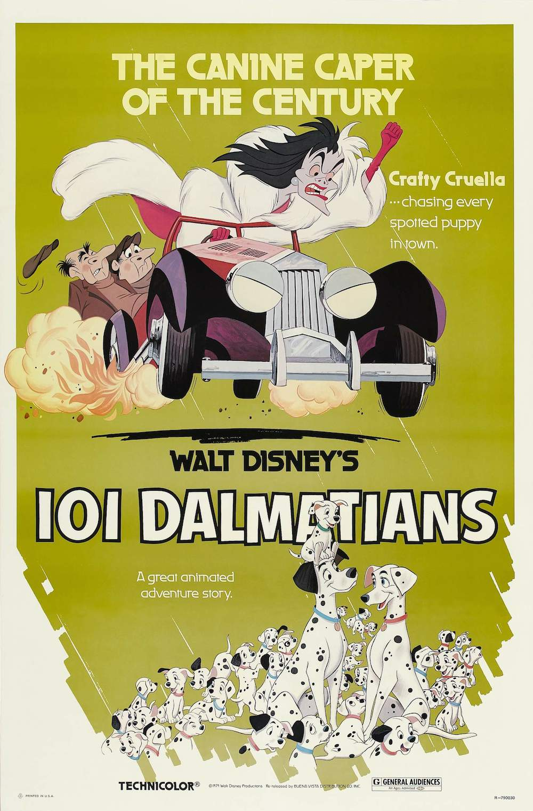
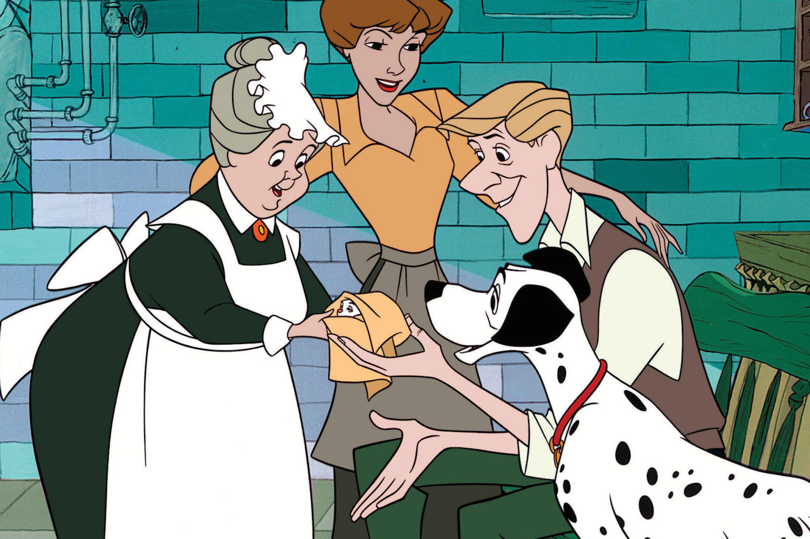
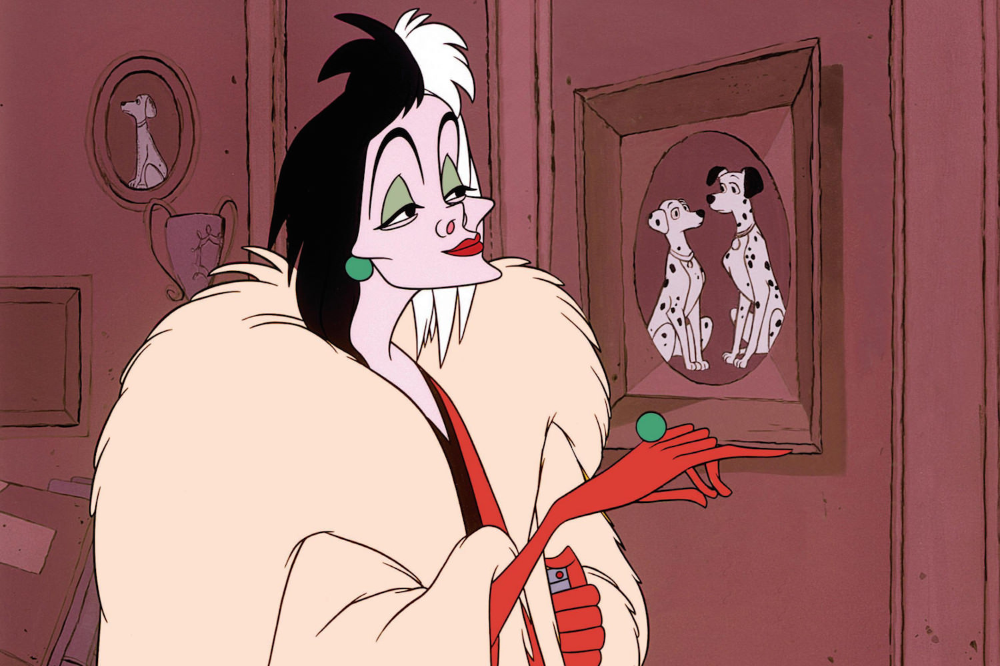

+++
type = "post"
titre = "<em>Les 101 Dalmatiens</em>, Clyde Geronimi, Hamilton Luske et Wolfgang Reitherman"
title = "Les 101 Dalmatiens, Clyde Geronimi, Hamilton Luske et Wolfgang Reitherman"
url = "/101-dalmatiens-geronimi-luske-reitherman"
date = "2014-03-24T17:34:31"
Lastmod = "2014-03-23T17:41:01"
cover = "les-101-dalmatiens-disney.jpg"
categorie = [ "À voir" ]
tag = [ "Animation", "Animaux", "Aventure", "Famille", "Humour" ]
createur = [ "Clyde Geronimi", "Hamilton Luske", "Walt Disney", "Wolfgang Reitherman" ]
annee = [ "1961" ]
weight = 1961
saga = [ "Classiques d'animation Disney" ]
pays = [ "États-Unis" ]
original = "One Hundred and One Dalmatians"

+++

Après l’impressionnant échec commercial de <a href="http://voiretmanger.fr/belle-bois-dormant-geronimi/" title="La Belle au bois dormant, Clyde Geronimi"><em>La Belle au bois dormant</em></a> qui a fait perdre aux studios Disney six millions de dollars, un record à l’époque, Walt Disney a envisagé, pendant un moment, d’arrêter les longs-métrages trop coûteux pour se concentrer sur les parcs d’attractions — le premier a ouvert en 1955 — et les courts-métrages qui passent à la télévision et rapportent beaucoup plus d’argent. Le créateur du studio se ravise et annonce au contraire son intention de sortir un film tous les deux ans. 1961, deux ans après le précédent, <em>Les 101 Dalmatiens</em> change totalement de registre et abandonne les contes pleins de princesses et de fées au profit d’une histoire contemporaine beaucoup plus proche du public. Clyde Geronimi, Hamilton Luske et Wolfgang Reitherman se retrouvent pour adapter une histoire publiée dans les années 1950, mais comme pour <a href="http://voiretmanger.fr/belle-clochard-geronimi-jackson-luske/" title="La Belle et le Clochard, Clyde Geronimi, Wilfred Jackson et Hamilton Luske"><em>La Belle et le Clochard</em></a>, les scénaristes l’adaptent à leur sauce. Le résultat est un long-métrage beaucoup moins ambitieux que les précédents, mais c’est aussi un film parfaitement maîtrisé, inquiétant et amusant, mais surtout divertissant. Pas un chef d’œuvre donc, mais un dessin animé très réussi.

Pour la première fois, les studios Disney adoptent un cadre vraiment contemporain avec <em>Les 101 Dalmatiens</em>. <em>La Belle et le Clochard</em> avait déjà rapproché les dessins animés du studio des spectateurs, mais il restait ancré dans un passé proche, certes, mais un passé quand même. Cette fois, on est vraiment dans le Londres des années 1960, même si les animateurs n’ont pas pu s’empêcher de glisser, ici ou là, des éléments rétro, à l’image des véhicules. Qu’importe, on est dans un cadre contemporain et familier et s’il ne fallait retenir qu’une raison, ce serait sûrement la présence de la télévision. Le boîtier trône à plusieurs reprises au milieu du salon, une première pour le studio qui en profite par ailleurs en y diffusant bon nombre de courts-métrages. À l’époque, Walt Disney produisait même de la publicité, si bien que la présence, dans le film, d’une publicité à la télévision n’est sans doute pas anodine. À cette présence visuelle de la modernité répond aussi un style moins empesé qu’avant. Après des années à perfectionner le même style, les studios se lâchent avec <em>Les 101 Dalmatiens</em>, après déjà une tentative très différente dans <em>La Belle au bois dormant</em>. Ici, le trait se fait moins précis qu’avant, surtout pour les décors qui sont parfois simplement esquissés. Les personnages également ne cherchent pas absolument le réalisme comme c’était souvent le cas, mais il s’agit au contraire plutôt de personnages de <em>cartoon</em>, parfois à la limite de la caricature — c’est le cas tout particulièrement du méchant du film. Le rendu est très différent de tout ce qu’avait produit Disney jusque-là, et c’est une piste vraiment bien trouvée, qui offre au long-métrage une touche plus légère qu’auparavant.

L’autre nouveauté majeure de ce dix-septième <a href="http://voiretmanger.fr/saga/classiques-danimation-disney/">classique Disney</a>, c’est le point de vue. Avec <a href="http://voiretmanger.fr/dumbo-sharpsteen/" title="Dumbo, Ben Sharpsteen"><em>Dumbo</em></a>, <a href="http://voiretmanger.fr/bambi-hand/" title="Bambi, David Hand"><em>Bambi</em></a> et plus récemment <em>La Belle et le Clochard</em>, le studio Disney a déjà prix l’habitude de ne mettre en scène que des animaux dans ses longs-métrages, mais le point de départ restait toujours humain. Dans le cas de <em>Dumbo</em> par exemple, le cirque reste dirigé par des hommes et le personnage principal ne parle pas. Dans <em>Les 101 Dalmatiens</em>, les êtres humains n’ont évidemment pas disparu, mais ils sont tous des personnages secondaires et les chiens sont les personnages principaux. Ils sont également les narrateurs du récit et Clyde Geronimi, Hamilton Luske et Wolfgang Reitherman ont d’ailleurs excellente l’idée d’ouvrir leur film sur un quiproquo. Alors que la caméra s’avance vers la garçonnière des deux héros, on pense que c’est l’homme au piano qui raconte l’histoire, alors qu’il s’agit en fait de Pongo, le Dalmatien au premier plan. Une bonne idée qui donne le ton : l’histoire d’amour racontée ici est d’abord celle de deux chiens, avant d’être celle de deux humains. <em>Les 101 Dalmatiens</em> ne revient pas sur cette promesse et tout au long de son récit, les chiens sont toujours mis en avant, ils sont le moteur de l’action et les humains restent au second plan. On peut noter malgré tout la belle réussite de la méchante, à nouveau : Cruella Denfer est à la fois ridicule et vraiment dangereuse et les animateurs s’en sont donnés à cœur joie pour en faire une vraie caricature, surtout vers la fin. On commence à noter, peut-être pour la première fois dans l’histoire du studio, ce goût pour des personnages impressionnants et ridicules à la fois, une idée que l’on retrouve encore dans la production actuelle.

Contrairement à d’autres films du studio, <em>Les 101 Dalmatiens</em> n’a pas marqué l’histoire du cinéma d’une pierre blanche, mais ce film aux ambitions modestes reste, encore aujourd’hui, un excellent divertissement. Le studio trouve son public avec cette réalisation légère et divertissante qui tranche avec le sérieux des productions précédentes. Une bouffée d’air frais sans doute qui ne sera pas de trop pour le studio.

<h3>Vous voulez m&rsquo;aider ?</h3>
<ul>
<li><a href="http://www.amazon.fr/gp/product/B008B8EA4A/ref=as_li_ss_tl?ie=UTF8&#038;tag=leblogdenic07-21&#038;linkCode=as2&#038;camp=1642&#038;creative=19458&#038;creativeASIN=B008B8EA4A">Acheter le film en Blu-Ray sur Amazon</a></li>
<li><a href="http://www.amazon.fr/gp/product/B008B8EA7C/ref=as_li_ss_tl?ie=UTF8&#038;tag=leblogdenic07-21&#038;linkCode=as2&#038;camp=1642&#038;creative=19458&#038;creativeASIN=B008B8EA7C">Acheter le film en DVD sur Amazon</a></li>
<li><a href="https://itunes.apple.com/fr/movie/les-101-dalmatiens/id551342188">Acheter ou louer le film sur l&rsquo;iTunes Store</a></li>
</ul>

