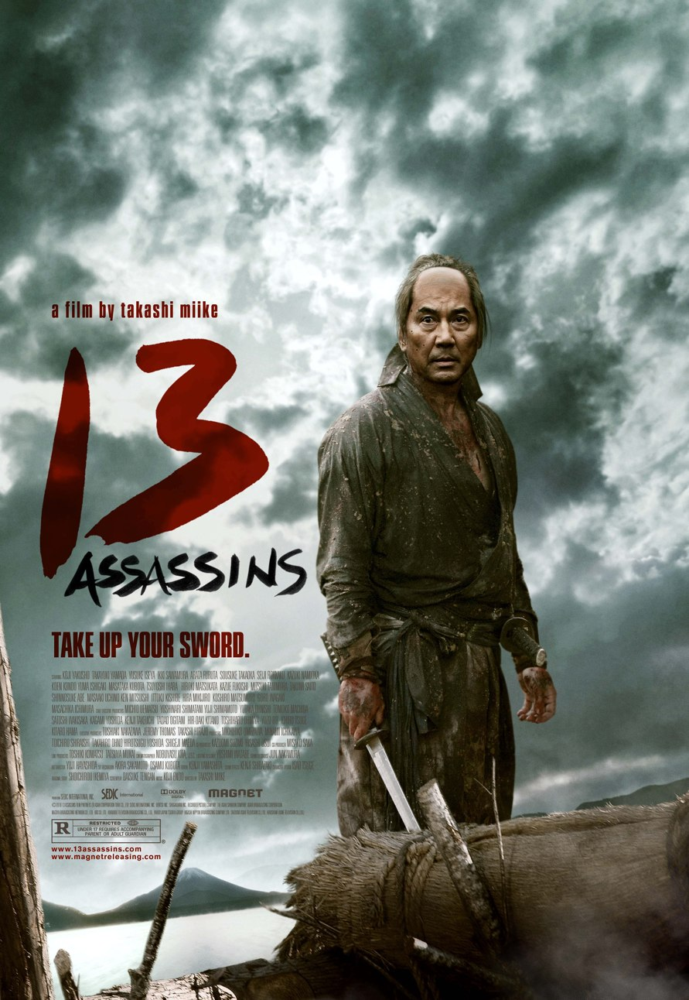
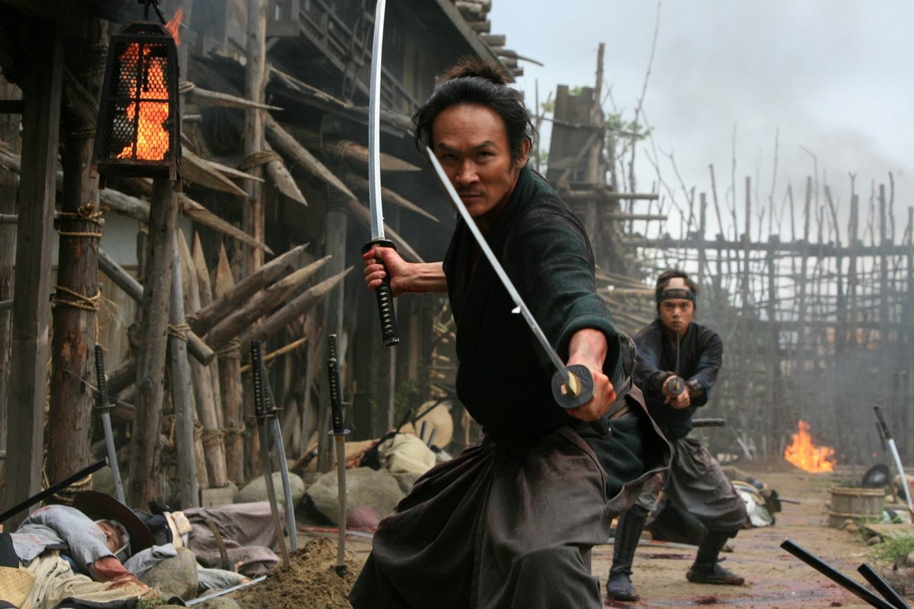
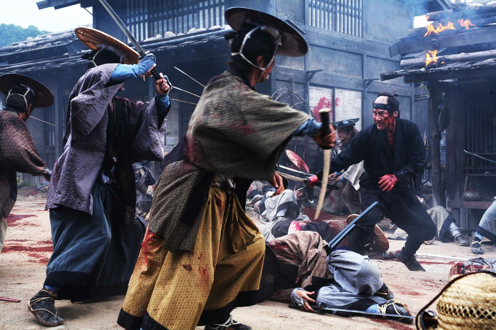
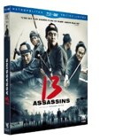

+++
type = "post"
titre = "13 Assassins, Takashi Miike"
title = "13 Assassins, Takashi Miike"
url = "/13-assassins-miike"
date = "2012-04-15T09:49:52"
Lastmod = "2012-04-15T09:57:53"
cover = "miike-13-assassins.jpg"
categorie = [ "À voir" ]
tag = [ "Action", "Histoire", "Mort", "Politique", "Violence", "Vite oublié" ]
createur = [ "Takashi Miike" ]
annee = [ "2012" ]
weight = 2012

+++

<em>13 Assassins</em> n&rsquo;a pas eu les honneurs d&rsquo;une sortie au cinéma en France, mais le dernier long-métrage du prolixe Takashi Miike est disponible dans le commerce. Le cinéaste japonais gère plusieurs projets chaque année à un rythme effréné et <em>13 Assassins</em> n&rsquo;est qu&rsquo;un film de plus dans une bien longue filmographie. Au programme, un film de sabre marqué par une violence soutenue. À réserver aux amateurs du genre…

Son nom l&rsquo;indique bien, <em>13 Assassins</em> raconte l&rsquo;histoire d&rsquo;un meurtre réalisé par treize assassins. Il faut bien ça pour tuer le demi-frère du Shogun : dans le Japon du XIXe siècle, les samouraïs font la loi sous le contrôle du Shogun. Naritsugu est un seigneur violent et sanguinaire qui n&rsquo;hésite pas à tuer à tout va. Ses liens avec le Shogun doivent toutefois lui permettre de prendre à son tour le pouvoir, avec des conséquences désastreuses pour le pays. Un peu psychopathe sur les bord, l&rsquo;homme déclare plusieurs fois qu&rsquo;il espère bien remettre la Guerre civile au goût du jour… C&rsquo;est pour mettre un terme aux horreurs perpétrées par cet homme que le conseiller du Shogun fait appel à un samouraï pour assassiner Naritsugu. Ce dernier est toujours extrêmement bien protégé et il faudra pas moins de treize samouraïs extrêmement puissants pour venir à bout de son armée de plusieurs centaines d&rsquo;hommes…

<em>13 Assassins</em> commencent par une assez longue présentation des enjeux politiques. Le film débute ainsi avec des discussions feutrées qui restent dans un premier temps assez obscures. On comprend vite que Naritsugu s&rsquo;est fait beaucoup d&rsquo;ennemis par son comportement extrêmement violent, souvent sadique même. La première scène filmée par Takashi Miike est ainsi un suicide réalisé selon la méthode traditionnelle <em>hara-kiri</em>. Plus tard, l&rsquo;homme à abattre tue sans sourciller le reste de la famille. Bref, il faut mettre un terme à ses agissements et la bande d&rsquo;assassins se constitue peu à peu. D&rsquo;abord assez lent, <em>13 Assassins</em> accélèrent progressivement alors que les hommes se regroupent et échafaudent un plan. L&rsquo;assassinat doit se faire dans un petit bourg, dans les montagnes. Les assassins commencent par acheter le lieu et le préparent pour la bataille : c&rsquo;est qu&rsquo;ils doivent affronter des centaines d&rsquo;hommes, rien que ça. La fin du film est marquée par une longue scène d&rsquo;affrontements violents. Les hommes tombent comme des mouches dans un carnage sanglant, jusqu&rsquo;à l&rsquo;affrontement final. On n&rsquo;en dira pas trop, mais <em>13 Assassins</em> est un film de genre qui laisse peu de place au suspense.

Très simple, le scénario de <em>13 Assassins</em> n&rsquo;est pas vraiment le point fort du film de Takashi Miike. Peu importe, le plaisir est ici dans la variation autour d&rsquo;un genre et en l&rsquo;occurrence dans les combats au sabre. Le film commence pourtant de manière assez calme, par des discussions plutôt que des duels et il faut attendre un bon moment pour obtenir un combat. Techniquement efficace, ce combat montre aussi que le cinéaste n&rsquo;est pas dans l&rsquo;esthétisation comme ont pu l&rsquo;être certains films récents. Takashi Miike préfère la violence à l&rsquo;état brut, les têtes qui volent et le sang qui coule. <em>13 Assassins</em> réserve d&rsquo;ailleurs une bonne dose de violence à la fin. Le rythme s&rsquo;accélère brutalement et ce champ de bataille de taille réduite se remplit vite de cadavres. Le film dit des choses intéressantes sur le code de l&rsquo;honneur des samouraïs et sur leur relation avec la mort, une relation que l&rsquo;on a du mal à comprendre tant elle diffère de la nôtre. Malheureusement, <em>13 Assassins</em> oublie vite ces questions fascinantes pour offrir de l&rsquo;action brutale et bien peu réaliste. On s&rsquo;amuse au début des différents pièges mis en place par les assassins, mais le nombre d&rsquo;ennemis est tel que l&rsquo;on s&rsquo;ennuie vite à les voir tous tomber les uns après les autres, dans l&rsquo;indifférence générale.

Ayant signé plus de 70 œuvres en une vingtaine d&rsquo;années, soit plus de trois par an en moyenne, Takashi Miike n&rsquo;est nécessairement pas un réalisateur perfectionniste. <em>13 Assassins</em> n&rsquo;impressionnent pas particulièrement sur la forme, même si le décor de la bataille finale est bien fichu. La caméra est en revanche un peu trop vive dans les scènes d&rsquo;action, ce qui les rend difficiles à suivre. Les acteurs ne proposent pas un jeu très naturel et l&rsquo;ensemble sonne souvent faux et plus comme du théâtre que du cinéma. Il faut dire que les personnages, très manichéens, n&rsquo;aident pas à rendre l&rsquo;ensemble intéressant au-delà de la curiosité.

<em>13 Assassins</em> n&rsquo;est pas un mauvais film et les amateurs du genre devraient y trouver leur compte. Ce long-métrage de Takashi Miike est un petit film mal équilibré, mais qui reste assez plaisant à suivre si l&rsquo;on accepte les incohérences de son scénario et la violence de certaines images. À réserver toutefois aux plus curieux ou aux fans du sabre japonais.

13 Assassins <em> est sorti en DVD et Blu-Ray le 20 mars 2012. Distribué par la <a href="http://www.metrofilms.com/home.html">Metropolitan Filmexport</a>.</em>

<em>Découvrez d’autres films sur Cinetrafic dans la catégorie <a href="http://www.cinetrafic.fr/film-2010">Film 2010</a> ainsi que celle consacrée au <a href="http://www.cinetrafic.fr/film-d-action">Film d&rsquo;action</a>.</em>

<h3>Vous voulez m&rsquo;aider ?<a href="#footnote_0_6214" id="identifier_0_6214" class="footnote-link footnote-identifier-link" title="&Agrave; propos de la publicit&eacute;&hellip;">1</a></h3>
<ul>
<li><a href="http://www.amazon.fr/gp/product/B006MNQT8Q/ref=as_li_ss_tl?ie=UTF8&amp;tag=leblogdenic07-21&amp;linkCode=as2&amp;camp=1642&amp;creative=19458&amp;creativeASIN=B006MNQT8Q">Acheter le film en Blu-Ray sur Amazon</a></li>
<li><a href="http://www.amazon.fr/gp/product/B006MNQTN6/ref=as_li_ss_tl?ie=UTF8&amp;tag=leblogdenic07-21&amp;linkCode=as2&amp;camp=1642&amp;creative=19458&amp;creativeASIN=B006MNQTN6">Acheter le film en DVD sur Amazon</a></li>
<li><a href="http://itunes.apple.com/fr/movie/13-assassins/id503494904">Acheter ou louer le film sur l&rsquo;iTunes Store</a></li>
</ul>

<ol class="footnotes"><li id="footnote_0_6214" class="footnote"><a href="/a-propos/publicite/">À propos de la publicité…</a> [<a href="#identifier_0_6214" class="footnote-link footnote-back-link">&#8617;</a>]</li></ol>
