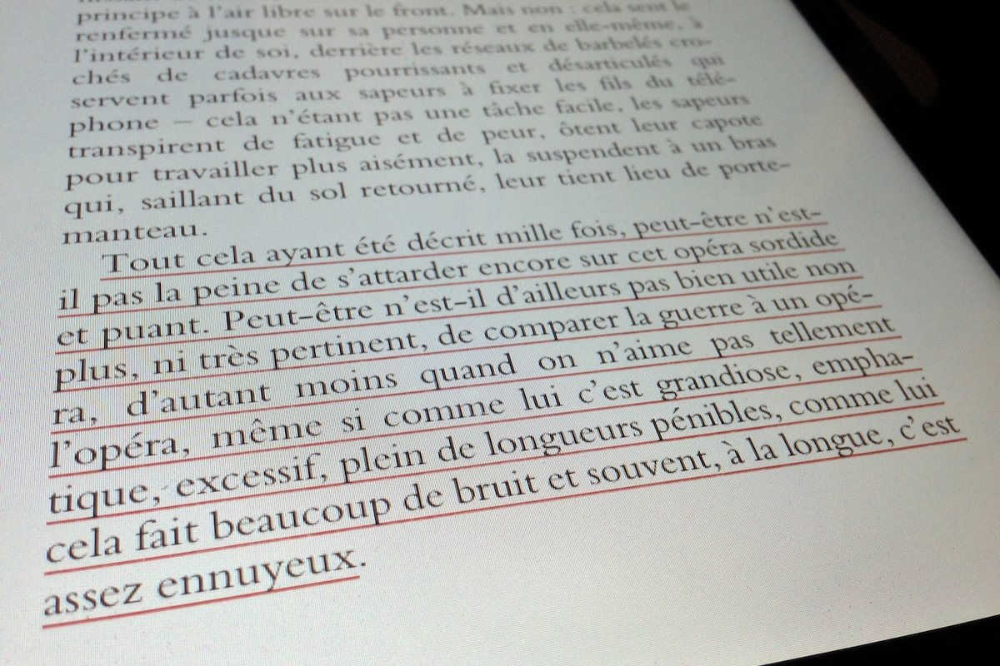
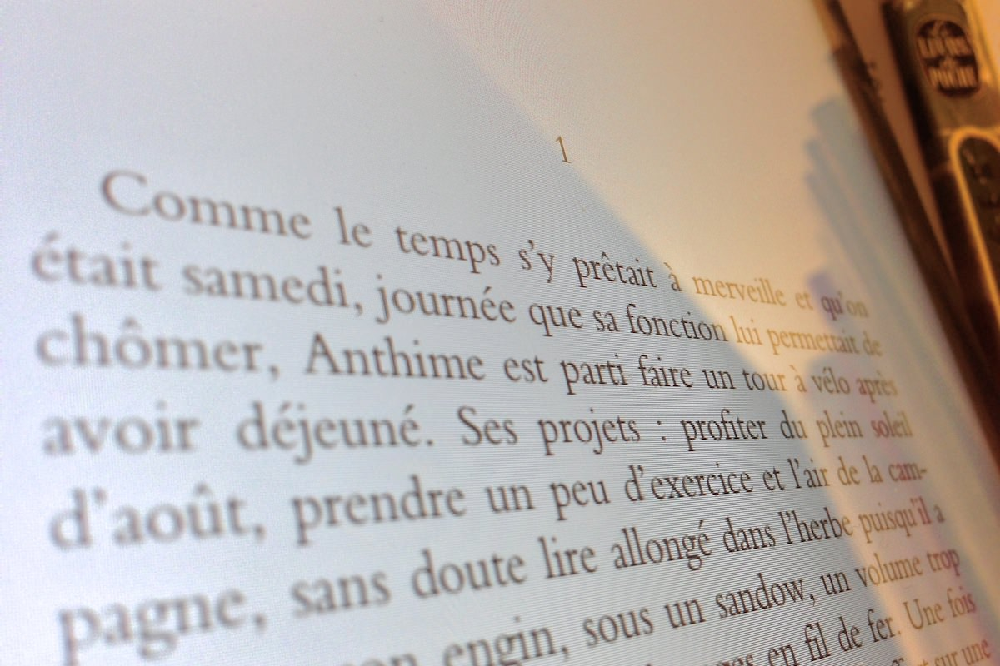

+++
titre = "<em>14</em>, Jean Echenoz"
title = "14, Jean Echenoz"
url = "/14-echenoz"
date = "2013-01-08T23:04:11"
Lastmod = "2013-12-10T21:58:40"
cover = "echenoz-14.jpg"
categorie = [ "À lire" ]
tag = [ "Guerre", "Histoire", "Mort", "Roman", "Société" ]
createur = [ "Jean Echenoz" ]
annee = [ "2012" ]
weight = 2012
pays = [ "France" ]

+++

<blockquote class="pull-quote">
Tout cela ayant été décrit mille fois, peut-être n’est-il pas la peine de s’attarder encore sur cet opéra sordide et puant. Peut-être n’est-il d’ailleurs pas bien utile non plus, ni très pertinent, de comparer la guerre à un opéra, d’autant moins quand on n’aime pas tellement l’opéra, même si comme lui c’est grandiose, emphatique, excessif, plein de longueurs pénibles, comme lui cela fait beaucoup de bruit et souvent, à la longue, c’est assez ennuyeux.<cite class="author"> — Jean Echenoz, 14, chapitre 10</cite>

</blockquote>

Comment écrire sur la Première Guerre mondiale et ses atrocités sans tomber dans la redite inutile ? La question ne survient explicitement qu’au dixième chapitre, elle est pourtant au cœur de <em>14</em>. Jean Echenoz ne s’est pas contenté de poser la question en l’air, il s’attache aussi à y apporter une réponse et son dernier roman est en quelque sorte la réponse. Par sa brièveté — 123 pages annoncées — et par sa densité, l’écrivain parvient à concentrer le cœur de la guerre tout en racontant tout le conflit, du premier appel du tocsin à ses derniers instants. Un pari ambitieux pour un résultat pour le moins impressionnant : <em>14</em> est un roman époustouflant qui absorbe le lecteur et l’emporte au cœur de terribles évènements, aux côtés de quelques hommes embarqués bien malgré eux dans le cauchemar…

Pour raconter sa vision de la guerre, Jean Echenoz choisit judicieusement le ras du sol, voire le sous-sol quand les soldats s’enterrent dans les tranchées. <em>14</em> suit le destin d’une poignée de soldats, tous des jeunes de la région nantaise. Anthime, Padioleau, Bossis, Arcenel et Charles se connaissent tous et ils partent tous ensemble vers la guerre le cœur léger, joyeux même. Une joie qui s’avère assez intrigante et même désespérante pour le lecteur qui connaît la suite et sait très bien que la suite de la guerre ne devrait guère leur sourire. Ce n’est qu’atteignant le sixième chapitre que le doute commence à s’instiller dans les esprits des personnages : « <em>L’affaire de quinze jours, donc, avait estimé Charles trois mois plus tôt sous le soleil d’août.</em> » Peu à peu, Jean Echenoz les fait entrer dans le doute, puis dans la certitude que cette fichue guerre durera plus longtemps que leurs propres vies. C’est que l’écrivain lui-même en sait plus que ses personnages bien sûr et il ne manque pas de le faire savoir : « <em>Plus tard viendront la chasse et les bombardements, l’interdiction de survol de certaines zones à l’adversaire, l’attaque des ballons dirigeables et captifs lorsque les choses en arriveront, très bientôt, à s’aggraver sans mesure.</em> » (chapitre 7). Cela ressemble un peu à des apartés aux lecteurs, mais c’est plus profond, comme si le romancier se désolait de ne pouvoir leur faire comprendre que cette guerre se terminera mal, très mal. 

<em>14</em> est un roman très dur sur cette première guerre d’un nouveau genre et sa brièveté n’empêche pas les détails sur la vie infernale dans les tranchées. Jean Echenoz parvient très bien à rendre cette vie difficile, les dangers permanents des tranchés, les rats et les poux, les attaques inutiles, les bombardements permanents, les essais au gaz ou encore les conseils de discipline impitoyables pour tous ceux qui pourraient flancher. Si le roman a cinq personnages, l’un sort du lot et fait figure de héros : Anthime, comptable d’une vingtaine d’années quand le roman commence et qui aime Blanche. Cette dernière est fiancée avec Charles, mais elle aime aussi beaucoup Anthime et elle semble dès le départ hésiter entre les deux. Par la suite, <em>14</em> alterne entre les scènes de guerre, sur le front, et les scènes à l’arrière, avec Blanche qui hésite toujours entre ses deux amours et espère qu’au moins l’un des deux reviendra vivant. Par cette alternance, Jean Echenoz apporte une épaisseur à ses personnages, épaisseur assez surprenante quand on en juge à celle de son roman. La finesse de <em>14</em> n’empêche pas l’installation de vrais personnages, ce qui rend leurs aventures sur le front d’autant plus touchantes, voire tristes. Au-delà, le romancier a bien su rendre la stupidité de cette guerre qui semble avoir été faite sur un coup de tête. Il n’adopte jamais le point de vue de l’état-major, on en restera toujours au niveau du soldat, mais on retrouve quelques idées connues sur le conflit et quelques images fortes. L’exécution d’un déserteur rappelle un peu la scène équivalente des <a href="http://voiretmanger.fr/2011/05/29/sentiers-gloire-kubrick/" title="Les Sentiers de la Gloire, Stanley Kubrick - À voir et à manger"><em>Sentiers de la Gloire</em></a>, tandis que Jean Echenoz sait pointer du doigt ce qui fait mal, en particulier sur la mauvaise préparation des troupes et des commandants. « <em>Il s’est produit qu’un soir, après quinze jours de marche, l’ordre a été donné de noircir les gamelles pour en affaiblir la visibilité.</em> » (chapitre 6)

Dès les premières lignes du roman, l’écriture de Jean Echenoz frappe par sa concision, sa précision et sa puissance. Le romancier a manifestement fait sien l’adage qui veut que la perfection ne s’obtienne que lorsqu’il n’y a plus rien à retirer. Les mots sont parfaitement choisis, les phrases construites pour aller à l’essentiel tout en disant beaucoup en peu de mots. Le lecteur n’a d’ailleurs d’autre choix que de tout lire, seule une lecture attentive pouvant éviter de perdre les informations essentielles qui seront simplement glissées au détour d’une phrase. Le récit peut avancer brutalement dans <em>14</em>, surtout quand l’écrivain juge qu’il n’y a pas lieu de s’étendre plus longuement, mais l’écriture peut aussi s’interrompre sur une longue description, comme l’inventaire complet du sac des soldats (chapitre 6). Jean Echenoz n’a pas son pareil pour rendre le quotidien des soldats et l’emploi du régulier du pronom &laquo;&nbsp;on&nbsp;&raquo; joue beaucoup dans cette impression de vivre aux côtés des soldats. Ce style minimaliste se fait parfois poétique, mais jamais dans l’exubérance, toujours dans la retenue. C’est en tout cas une écriture très agréable à lire et le plaisir de la lecture est indéniable dans <em>14</em>.

« <em>On connaît la suite</em> » : ainsi commence le quinzième et dernier chapitre de <em>14</em>, un chapitre qui s’attache surtout au personnage d’Anthime et beaucoup moins à la guerre. Jean Echenoz a raconté l’histoire de ses personnages, la fin de la guerre proprement dite l’intéresse moins, d’autant que le lecteur la connaît déjà très certainement. Elle est là, peut-être, la réponse à cette question : on peut écrire sur la Première Guerre mondiale, à condition de s’intéresser à l’humain qui l’a vécue. Son dernier roman offre en tout cas une plongée époustouflante au cœur du conflit et <em>14</em> mérite tout à fait d&rsquo;être lu, même si vous connaissez déjà l&rsquo;évènement par cœur…

<h3>Vous voulez m&rsquo;aider ?<a href="#footnote_0_8292" id="identifier_0_8292" class="footnote-link footnote-identifier-link" title="&Agrave; propos de la publicit&eacute;&hellip;">1</a></h3>
<ul>
<li><a href="http://www.amazon.fr/gp/product/2707322571/ref=as_li_ss_tl?ie=UTF8&#038;tag=leblogdenic07-21&#038;linkCode=as2&#038;camp=1642&#038;creative=19458&#038;creativeASIN=2707322571">Acheter le livre sur Amazon</a> (<a href="http://www.amazon.fr/gp/product/B009ERA6BI/ref=as_li_ss_tl?ie=UTF8&#038;tag=leblogdenic07-21&#038;linkCode=as2&#038;camp=1642&#038;creative=19458&#038;creativeASIN=B009ERA6BI">format Kindle</a>)</li>
<li><a href="https://itunes.apple.com/fr/book/14/id564148927?mt=11">Acheter le livre sur l&rsquo;iBookstore</a></li>
</ul>

<ol class="footnotes"><li id="footnote_0_8292" class="footnote"><a href="http://voiretmanger.fr/soutien/">À propos de la publicité…</a> [<a href="#identifier_0_8292" class="footnote-link footnote-back-link">&#8617;</a>]</li></ol>
