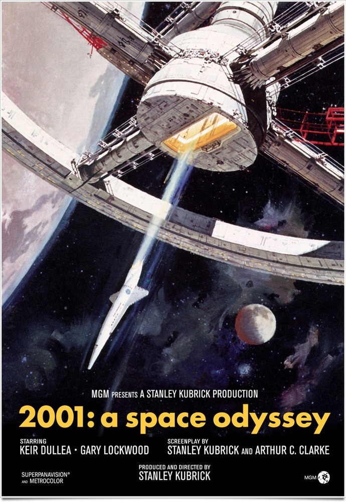
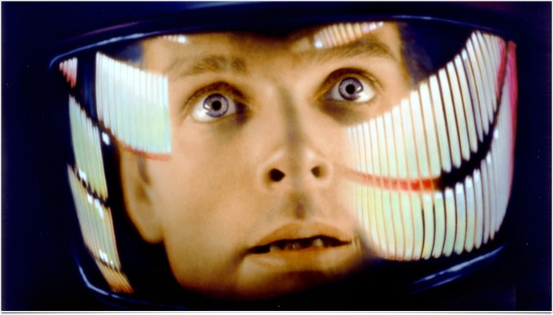
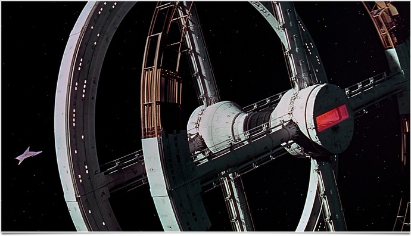
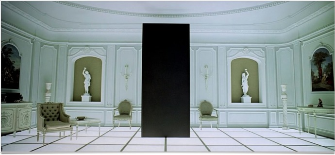

+++
titre = "<em>2001 : l&rsquo;odyssée de l&rsquo;espace</em>, Stanley Kubrick"
title = "2001 : l'odyssée de l'espace, Stanley Kubrick"
url = "/2001-odyssee-espace-kubrick"
date = "2011-08-07T18:41:17"
Lastmod = "2014-02-05T14:14:18"
cover = "2001-space-odyssey-kubrick.jpg"
categorie = [ "À voir" ]
tag = [ "Chef-d'œuvre", "Philosophie", "Science-Fiction", "Société" ]
createur = [ "Stanley Kubrick" ]
acteur = [ "Gary Lockwood", "Keir Dullea" ]
annee = [ "1968" ]
weight = 1968
pays = [ "États-Unis" ]
original = "2001 : a space odyssey"

+++

Pour son huitième film, Stanley Kubrick s&rsquo;oriente vers un autre genre. Pour la première et la dernière fois dans son œuvre, le cinéaste tourne un film de science-fiction… au moins sur le papier. Comme toujours, rien n&rsquo;est simple chez Stanley Kubrick et <em>2001 : l&rsquo;odyssée de l&rsquo;espace</em> n&rsquo;est un film de science-fiction qu&rsquo;en apparence. Derrière les planètes les vaisseaux spatiaux, un tout autre film fait son apparition. Extrêmement ambitieux, métaphysique, incompréhensible… <em>2001 : l&rsquo;odyssée de l&rsquo;espace</em> ne laisse pas indifférent. Le résultat est complexe, mais pas incompréhensible : un film magistral à voir et revoir.

<em>2001 : l&rsquo;odyssée de l&rsquo;espace</em> ne raconte pas une histoire facile à suivre d&rsquo;un bout à l&rsquo;autre. Le film est découpé en quatre parties plus ou moins longues. Les deux parties centrales sont clairement réunies, la troisième étant dans la continuité de la seconde. L&rsquo;ouverture et le final sont aussi liés à l&rsquo;ensemble, mais les liens sont plus ténus. Stanley Kubrick ouvre son film sur un paysage désertique, sans doute en Afrique. Un carton indique que l&rsquo;on se situe à l&rsquo;aube de l&rsquo;humanité et quand des singes apparaissent à l&rsquo;écran, on comprend que l&rsquo;on a affaire à nos lointains ancêtres. Après quelques scènes illustrant la vie quotidienne de ces bêtes, le monolithe apparaît pour la première fois et le film nous fait comprendre qu&rsquo;il permet aux singes de découvrir l&rsquo;outil. Debout sur leurs pattes, ces singes deviennent des hommes et… le film passe brusquement en 2001. Dans ce futur (à la sortie du film, en 1968), les hommes ont domestiqué l&rsquo;espace proche : une navette spatiale tourne autour de la Terre et sert de relai aux missions vers la Lune et au-delà. On suit d&rsquo;ailleurs un scientifique en mission sur la Lune. Un mystérieux monolithe a été découvert sur la surface lunaire et personne ne sait ce qu&rsquo;il signifie. Le monolithe émet simplement un signal vers Jupiter, ce qui conduit le film à la troisième partie : une mission vers cette planète. À bord du vaisseau, cinq humains dont trois congelés et HAL-9000, un ordinateur doté de l&rsquo;intelligence artificielle. Un jour, cet ordinateur signale un problème inexistant et les deux hommes à bord doutent de son intérêt. L&rsquo;ordinateur décide de prendre les devants et de neutraliser les humains. La quatrième partie suit la troisième, mais elle dévie tellement qu&rsquo;elle semble vraiment indépendante. Le survivant du vaisseau arrive sur Jupiter, remarque un autre monolithe et en s&rsquo;approchant, il tombe dans une autre dimension qui l&rsquo;amène… dans une pièce meublée comme au XVIIIe siècle.

On le voit, <em>2001 : l&rsquo;odyssée de l&rsquo;espace</em> n&rsquo;est pas un film simple à résumer et il nécessite une grande concentration d&rsquo;un bout à l&rsquo;autre pour ne pas perdre le fil. C&rsquo;est d&rsquo;autant plus vrai que Stanley Kubrick réalise ici son film le plus lent et le plus expérimental, mais sa réputation de film impossible à comprendre n&rsquo;est pas totalement justifiée pour autant. Le premier carton qui indique que l&rsquo;on assiste à l&rsquo;aube de l&rsquo;humanité est essentiel, il donne une clé de lecture à l&rsquo;ensemble. La première partie montre ainsi comment les singes sont devenus des hommes, grâce au monolithe. Le film prend le soin de montrer ces singes avant et après la découverte du bloc noir : avant, ils se contentent de grogner et montrer leurs gros bras pour déloger un autre groupe de singes d&rsquo;une mare. Le monolithe leur permet de découvrir l&rsquo;outil, moment clé dans l&rsquo;évolution. L&rsquo;os de l&rsquo;animal qu&rsquo;ils viennent de manger peut leur permettre de casser autre chose… ou de taper sur un autre singe. Cette découverte stupéfiante leur donne de la force : ils délogent d&rsquo;autres singes à coups d&rsquo;os et… se tiennent debout. Ce passage est typique chez Kubrick : la naissance de la société s&rsquo;accompagne de violence, violence qui est gratuite qui plus est (les singes continuent de frapper celui qui est déjà à terre).

Quelques millions d&rsquo;années plus tard, en 2001, l&rsquo;homme a non seulement maîtrisé sa planète, mais il commence aussi à maîtriser l&rsquo;espace qui l&rsquo;entoure. Il fait une nouvelle rencontre avec le monolithe, cette fois sur la Lune : c&rsquo;est une nouvelle étape dans son développement. Cette étape franchie, le monolithe pousse l&rsquo;homme vers une nouvelle destination, vers Jupiter. Au cours du voyage, l&rsquo;homme se fait avoir par sa propre création : un ordinateur intelligent qui décide de se passer de l&rsquo;homme. Cette étape sonne comme une épreuve : l&rsquo;homme serait-il allé trop loin ? C&rsquo;est alors que cette explication déraille : <em>2001 : l&rsquo;odyssée de l&rsquo;espace</em> devient alors beaucoup plus difficile à comprendre. Où arrive l&rsquo;astronaute ? Est-ce le paradis ? On ne sait pas trop au juste, mais on le voit se voir vieillir prématurément, avant de finir sur cette image célèbre du fœtus qui descend sur la terre. Les pistes ne manquent pas sur cette fin, chacun y va de son explication, mais peu importe : <em>2001 : l&rsquo;odyssée de l&rsquo;espace</em> est un film qui n&rsquo;appelle pas de réponses.

Stanley Kubrick s&rsquo;est inspiré des écrits d&rsquo;Arthur C. Clarke pour écrire le scénario de <em>2001 : l&rsquo;odyssée de l&rsquo;espace</em>. Mieux, le romancier a travaillé avec le cinéaste pour l&rsquo;écriture de son film. Cette origine classe d&rsquo;emblée le film dans la science-fiction, tendance scientifique. Fidèle à son habitude, Stanley Kubrick s&rsquo;est entouré des meilleurs spécialistes de l&rsquo;époque et a tout lu pour proposer un film le plus réaliste possible. Un an avant les premiers pas de l&rsquo;homme sur la Lune, les connaissances sur l&rsquo;espace étaient plus limitées et <em>2001 : l&rsquo;odyssée de l&rsquo;espace</em> est pourtant un des films les plus réalistes jamais tournés. Aujourd&rsquo;hui encore, le film surprend par sa modernité, même si on sait désormais faire mieux que des maquettes sur fond noir. Reste que l&rsquo;espace proposé par Kubrick est réaliste et ce essentiellement pour deux raisons. Le cinéaste n&rsquo;oublie jamais l&rsquo;absence de gravité et propose des solutions originales à ce problème : la station spatiale est une grande roue qui tourne sur elle-même pour la recréer ; le sol des navettes et recouvert de scratch pour que les pieds s&rsquo;accrochent  ; le vaisseau spatial vers Jupiter est lui aussi constitué d&rsquo;une roue. Autre force du film : l&rsquo;espace est par nature silencieux, celui de <em>2001 : l&rsquo;odyssée de l&rsquo;espace</em> l&rsquo;est aussi. Tous les films de science-fiction font entendre d&rsquo;énormes explosions et les bruits de moteur, ce qui n&rsquo;a aucun sens dans l&rsquo;espace (pas d&rsquo;air, pas de son). Stanley Kubrick fait le pari d&rsquo;un silence assourdissant rempli uniquement de la respiration du personnage et même si le film est plus lent et vide ainsi, il gagne en réalisme et en force : les sorties dans l&rsquo;espace sont des plus stressantes, sans le côté rassurant d&rsquo;un environnement bruyant.

Autant d&rsquo;aspects qui portent le film vers la science-fiction avec une vision étonnamment réaliste, mais ce serait oublier l&rsquo;ouverture et la fermeture de <em>2001 : l&rsquo;odyssée de l&rsquo;espace</em>. Kubrick s&rsquo;amuse alors à troubler son jeu, surtout dans la dernière partie où il ne laisse à son spectateur quasiment plus de questions, sans aucune réponse, ou aucune de vraiment convaincante. Que signifie la présence de ce fœtus à la fin du film ? Une réincarnation ? Un nouveau départ pour l&rsquo;humanité ? On comprend que le film est métaphysique et il répond à des questions sur le sens même de l&rsquo;homme, à la manière de ce qu&rsquo;a fait récemment Terrence Malick avec son <em><a href="http://voiretmanger.fr/2011/05/17/tree-of-life-malick/">Tree of Life</a></em>. Il pose néanmoins beaucoup plus de questions qu&rsquo;il n&rsquo;offre de réponses. On pourra discuter longuement sur les explications possibles, ces dernières importent finalement peu : <em>2001 : l&rsquo;odyssée de l&rsquo;espace</em> n&rsquo;est pas un film à expliquer, c&rsquo;est un film qui peut conserver une part de mystère et c&rsquo;est précisément pour ça qu&rsquo;il reste dans les mémoires.

Tous les films de Stanley Kubrick, ou presque, ont inventé quelque chose au cinéma, découvert de nouvelles techniques, mis au point de nouveaux procédés… <em>2001 : l&rsquo;odyssée de l&rsquo;espace</em> est peut-être celui qui a le plus apporté au cinéma, en particulier au cinéma de science-fiction. Quand on le regarde aujourd&rsquo;hui, on est frappé des constantes évocations qu&rsquo;il soulève : tel passage fait penser à un film, tel autre à un autre film… À tel point que certaines scènes de <em>2001 : l&rsquo;odyssée de l&rsquo;espace</em>, les plans dans l&rsquo;espace en particulier, sont d&rsquo;ailleurs devenues des lieux-communs en science-fiction. Il fallait tout inventer à l&rsquo;époque et Stanley Kubrick et son équipe ont fait face à d&rsquo;innombrables problèmes techniques. Le film a coûté très cher pour l&rsquo;époque et les effets spéciaux abondent. Tous ne sont pas réussis, mais le film a bien vieilli, mieux que les premiers <em>Star Wars</em> par certains aspects. Le pari de la sobriété s&rsquo;avère payant, on retrouve ici certaines inspirations derrière les produits Apple par exemple, tandis que les contrôles des vaisseaux basés essentiellement sur des écrans plutôt que sur de gros boutons carrés sont bien vus. Stanley Kubrick systématise avec ce film ses habitudes, multipliant les cadrages symétriques, jouant sur les formes géométriques (les ronds, le carré du monolithe, l&rsquo;alliance des deux avec HAL-9000)…

Ce film mérite à lui tout seul une leçon complète de cinéma, mais on se contentera d&rsquo;ajouter un mot sur la musique. Toujours essentielle chez Kubrick, elle est devenue culte dans le cas de <em>2001 : l&rsquo;odyssée de l&rsquo;espace</em>. L&rsquo;ouverture d&rsquo;<em>Ainsi parlait Zarathoustra</em> est désormais lié pour toujours à ce film. L&rsquo;utilisation de la valse pour les scènes de l&rsquo;espace, la musique moderne et stressante pour les apparitions du monolithe… Les choix musicaux de Stanley Kubrick forgent le film autant que ce que l&rsquo;on voit à l&rsquo;écran, à tel point que <em>2001 : l&rsquo;odyssée de l&rsquo;espace</em> commence d&rsquo;ailleurs sans image, simplement avec de la musique. Une entrée en matière qui s&rsquo;avère finalement extrêmement forte, même si on ne sait pas exactement ce qu&rsquo;elle signifie.

La première fois que j&rsquo;ai vu <em>2001 : l&rsquo;odyssée de l&rsquo;espace</em>, c&rsquo;était il y a dix ans. En 2001, le film était ressorti en salles et j&rsquo;avais eu l&rsquo;occasion de le découvrir alors, dans les meilleures conditions possible. Cette séance constitue indéniablement une des plus fortes expériences de cinéma que j&rsquo;ai vécues, une de celles qui ont contribué à mon amour du septième art. Autant dire que ce film possède un statut à part et qu&rsquo;écrire dessus n&rsquo;était pas le plus simple. J&rsquo;en ai déjà trop fait, et il y aurait encore tellement à dire et à écrire : je préfère m&rsquo;arrêter là, non sans recommander une nouvelle fois <em>2001 : l&rsquo;odyssée de l&rsquo;espace</em>.

Stanley Kubrick a réalisé un grand nombre de films intéressants et mémorables, mais celui-ci a vraiment une place à part. Film avant-gardiste, mal compris à l&rsquo;époque et encore aujourd&rsquo;hui, <em>2001 : l&rsquo;odyssée de l&rsquo;espace</em> est un film qui n&rsquo;est pourtant pas totalement opaque et incompréhensible. Pour peu que l&rsquo;on se donne la peine d&rsquo;accepter la lenteur du film, on peut découvrir une œuvre singulière, belle et fascinante autant qu&rsquo;inquiétante. Un grand moment de cinéma.

<h3>Vous voulez m&rsquo;aider ?<a href="#footnote_0_5010" id="identifier_0_5010" class="footnote-link footnote-identifier-link" title="&Agrave; propos de la publicit&eacute;&hellip;">1</a></h3>
<ul>
<li><a href="http://www.amazon.fr/gp/product/B000XIABYE/ref=as_li_ss_tl?ie=UTF8&#038;tag=leblogdenic07-21&#038;linkCode=as2&#038;camp=1642&#038;creative=19458&#038;creativeASIN=B000XIABYE">Acheter le film en Blu-Ray sur Amazon</a></li>
<li><a href="http://www.amazon.fr/gp/product/B00005NDRT/ref=as_li_ss_tl?ie=UTF8&#038;tag=leblogdenic07-21&#038;linkCode=as2&#038;camp=1642&#038;creative=19458&#038;creativeASIN=B00005NDRT">Acheter le film en DVD sur Amazon</a></li>
<li><a href="http://itunes.apple.com/fr/movie/2001-lodyssee-de-lespace/id373964565">Acheter ou louer le film sur l&rsquo;iTunes Store</a></li>
</ul>

<ol class="footnotes"><li id="footnote_0_5010" class="footnote"><a href="http://voiretmanger.fr/a-propos/publicite/">À propos de la publicité…</a> [<a href="#identifier_0_5010" class="footnote-link footnote-back-link">&#8617;</a>]</li></ol>
