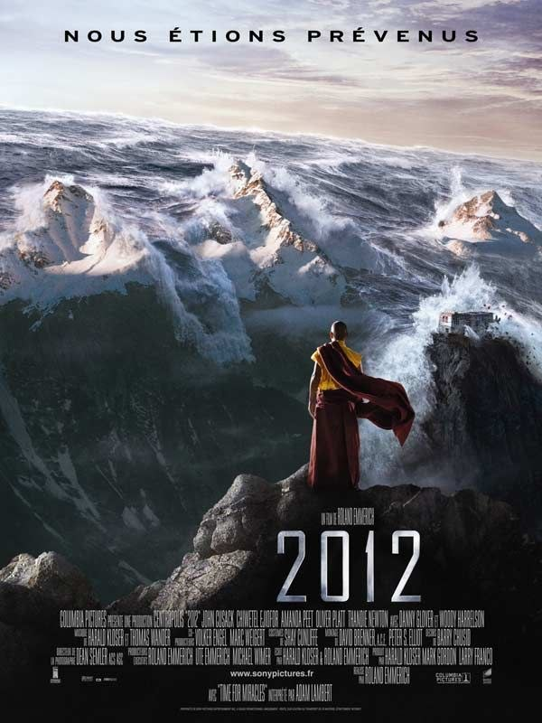
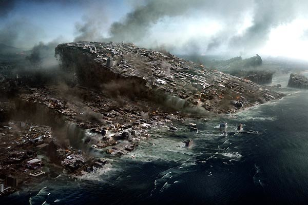
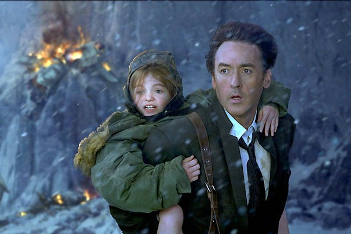
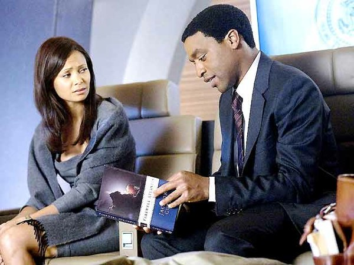

+++
type = "post"
titre = "<em>2012</em>, Roland Emmerich"
title = "2012, Roland Emmerich"
url = "/2012-emmerich"
date = "2009-11-14T00:48:12"
Lastmod = "2014-06-13T12:42:44"
cover = "2012-roland-emmerich1.jpg"
categorie = [ "À voir" ]
tag = [ "Apocalypse", "Blockbuster", "Vite oublié" ]
createur = [ "Roland Emmerich" ]
acteur = [ "Chiwetel Ejiofor", "John Cusak", "Oliver Platt", "Woody Harrelson" ]
annee = [ "2009" ]
weight = 2009
pays = [ "États-Unis" ]

+++

Les Mayas l&rsquo;avaient prédit, notre belle planète bleue disparaîtra d&rsquo;elle-même le 12/12/12. Avant l&rsquo;Apocalypse proprement dite, le brillant réalisateur d&rsquo;<a href="/independence-day-emmerich/" title="Independence Day, Roland Emmerich"><em>Independence Day</em></a>, <em>Le jour d&rsquo;après</em> ou encore la merveille <em>10 000</em><a href="#footnote_0_2074" id="identifier_0_2074" class="footnote-link footnote-identifier-link" title="J&rsquo;ai tenu approximativement 5 minutes. Non vraiment, j&rsquo;allais m&rsquo;&eacute;touffer, il me fallait quitter les yeux de l&rsquo;&eacute;cran">1</a> en a profité pour faire du blé avec parce que, quand même, quitte à tous crever, autant le faire avec un max de pognon. Au passage, le réalisateur prend un malin plaisir à détruire tout ce qu&rsquo;il peut, pour un film assez spectaculaire, mais malheureusement entaché de la traditionnelle morale bien pensante.

<h2>Attention, ça va spoiler grave !</h2>

Le principe du film est, il faut le dire, assez jouissif. Pour d&rsquo;obscures raisons que les scientifiques semblent comprendre (et c&rsquo;est bien ce qui importe), la terre se réchauffe tellement que les plaques terrestres bougent n&rsquo;importe comment, créant un cataclysme tel que l&rsquo;humanité tout entière doit périr. Seule une poignée d&rsquo;hommes pourra survivre grâce à d&rsquo;énormes barges capables de flotter des jours durant en attendant que l&rsquo;eau veuille bien reprendre sa place naturelle.

L&rsquo;idée du film est donc de détruire à peu près tout, pour le simple plaisir de détruire. Nul réalisme ici, on survit très bien à l&rsquo;explosion du petit volcan de Yellowstone (je ne sais pas si vous en avez entendu parler), de même que les failles béantes sur le magma en fusion n&rsquo;ont jamais empêché un homme de s&rsquo;en extirper ou un avion de décoller par dessus. Par contre, une barge chargée de dizaines de milliers de personnes avec l&rsquo;oxygène, les vivres et l&rsquo;essence pour tenir un mois peut très bien frapper de plein fouet l&rsquo;Himalaya et s&rsquo;en sortir bien mieux que le Titanic. Oui parce que l&rsquo;eau monte à 8000 mètres d&rsquo;altitude comme ça, chez Emmerich, mais attention, pas en Afrique.

Bon, la fin est connue, les Américains gagnent, l&rsquo;humanité est sauvée. Enfin, pas que les Américains, certes, puisque cette fois la morale dégoulinante veut que le monde entier unisse ses efforts dans un élan confraternel qui donne les larmes aux yeux. Hop, oubliés les conflits d&rsquo;intérêts, les Russes, les Chinois, les Américains comme un seul homme travaillent à la conception de ces arches. Néanmoins, blockbuster oblige, on suit d&rsquo;abord les Américains, et on pleure quand même plus la perte d&rsquo;un Américain que celle d&rsquo;un Russe véreux (mais sympa quand même, voyez, il se sacrifie pour la survie de ses enfants&#8230;).

Dommage que le film ne soit pas nihilisto-post-apocalyptique, genre tous les hommes disparaissent sauf trois gus dans un bunker, et comment ils font après. Non là, c&rsquo;est propre, c&rsquo;est net, tout le monde meurt, sauf les gens qui comptent, c&rsquo;est-à-dire ceux qui ont les moyens de se payer une survie (ça vaut 1 milliard de dollars, pour ceux qui seraient intéressés). Une belle idée de scénario, pour le coup réaliste, nonobstant. On ne peut pas, non plus, trop en demander à Hollywood : faire disparaître la Maison-Blanche sous un porte-avion nommé Kennedy, je crois que c&rsquo;est déjà énorme.

C&rsquo;est assez fascinant, en tout cas, de voir porter sur les écrans une adaptation au premier degré du Déluge. Non parce qu&rsquo;il ne s&rsquo;agit bien que de ça, la montée des eaux, des arches (le terme est utilisé dans le film) pour sauver les espèces, et le retour à la normale. D&rsquo;ailleurs, les références religieuses ne manquent pas (cf la destruction de la chapelle Sixtine, d&rsquo;ailleurs déplacée sous la coupole de la basilique&#8230; y sont trop forts à Hollywood), même si le message religieux (punition divine) n&rsquo;apparaît pas explicitement. C&rsquo;est intéressant de constater que pour une fois, ce n’est pas l&rsquo;homme qui a tout pété, mais une sorte de force de la nature contre laquelle on ne peut rien.

Bon sinon on suit la sempiternelle famille, évidemment divisée et malheureuse au début, évidemment réunie et heureuse à la fin. Je me demande pourquoi Hollywood se sent systématiquement obligé de nous rabâcher les clichés sur la famille modèle, le papa et la maman, le frère et la sœur. Franchement, on pourrait pas avoir un truc un peu original des fois, je ne sais pas un couple homosexuel et un enfant adopté ? Le film semble d&rsquo;ailleurs avoir comme mission de collecter tous les clichés du blockbuster, un peu comme un écho à la sauvegarde de l&rsquo;espèce, comme si on avait peur de perdre ces clichés&#8230;

<em>Oui, il conclut à la fin du film&#8230;</em>

Bref, <em>2012</em> n&rsquo;est pas un film désagréable à regarder, surtout sur les grands écrans avec le son et l&rsquo;image qui vont bien. On apprécie le côté &laquo;&nbsp;c&rsquo;est la nature, on n&rsquo;y peut rien&nbsp;&raquo;, le côté &laquo;&nbsp;je casse tout, <em>just for fun</em>&laquo;&nbsp;, mais dommage que le film verse dans le politiquement correct à outrance (genre, le président américain est noir&#8230; et franchement, y avait besoin que le seul français du film roule en DS, surtout quand le film est censé se passer en 2012 ? Vraiment&#8230; pourquoi pas le béret et la baguette aussi !).

Bon, en même temps, c&rsquo;est Roland Emmerich qu&rsquo;il y a marqué en bas de l&rsquo;affiche. S&rsquo;il savait faire autre chose que du bourrin spectaculaire, je pense qu&rsquo;on le saurait, depuis le temps. Le tout est de savoir à quoi s&rsquo;attendre, et on passe alors un bon moment. Sinon, les 2h40 du film doivent sembler bien longues&#8230;

Et pour le film post-apocalyptique, il ne reste plus squ&rsquo;à attendre l&rsquo;adaptation du génialissime <a href="/2009/03/08/la-route-cormac-mccarthy/" title="La route, Cormac McCarthy"><em>The road</em></a> de Cormac McCarthy&#8230;

<h3>Vous voulez m&rsquo;aider ?<a href="#footnote_1_2074" id="identifier_1_2074" class="footnote-link footnote-identifier-link" title="&Agrave; propos de la publicit&eacute;&hellip;">2</a></h3>
<ul>
<li><a href="http://www.amazon.fr/gp/product/B003AM95OM/ref=as_li_ss_tl?ie=UTF8&tag=leblogdenic07-21&linkCode=as2&camp=1642&creative=19458&creativeASIN=B003AM95OM">Acheter le film en Blu-Ray sur Amazon</a></li>
<li><a href="http://www.amazon.fr/gp/product/B002X79OYG/ref=as_li_ss_tl?ie=UTF8&tag=leblogdenic07-21&linkCode=as2&camp=1642&creative=19458&creativeASIN=B002X79OYG">Acheter le film en DVD sur Amazon</a></li>
<li><a href="https://itunes.apple.com/fr/movie/2012/id365591361">Acheter ou louer le film sur l&rsquo;iTunes Store</a></li>
</ul>

<ol class="footnotes"><li id="footnote_0_2074" class="footnote">J&rsquo;ai tenu approximativement 5 minutes. Non vraiment, j&rsquo;allais m&rsquo;étouffer, il me fallait quitter les yeux de l&rsquo;écran [<a href="#identifier_0_2074" class="footnote-link footnote-back-link">&#8617;</a>]</li><li id="footnote_1_2074" class="footnote"><a href="/soutien/">À propos de la publicité…</a> [<a href="#identifier_1_2074" class="footnote-link footnote-back-link">&#8617;</a>]</li></ol>
