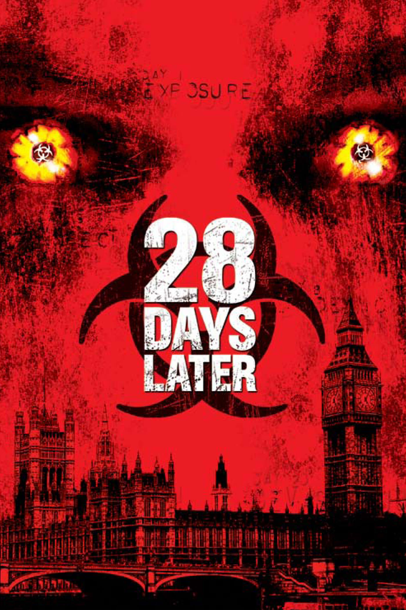
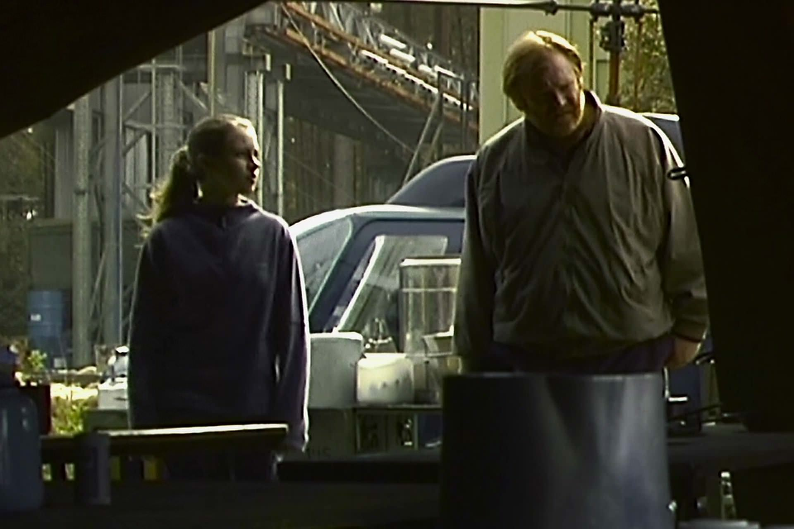

+++
titre = "<em>28 jours plus tard</em>, Danny Boyle"
title = "28 jours plus tard, Danny Boyle"
url = "/28-jours-plus-tard-boyle"
date = "2014-12-07T10:09:13"
Lastmod = "2014-12-07T00:20:44"
cover = "28-jours-plus-tard-cillian-murphy.jpeg"
categorie = [ "À voir" ]
tag = [ "Apocalypse", "Dystopie", "Gore", "Horreur", "Maladie", "Mort", "Société", "Zombie" ]
createur = [ "Danny Boyle" ]
acteur = [ "Christopher Eccleston", "Cillian Murphy", "Naomie Harris" ]
annee = [ "2003" ]
weight = 2003
pays = [ "Grande-Bretagne" ]
original = "28 Days Later"

+++

Tourné avec trois fois rien, <em>28 jours plus tard</em> a connu un immense succès à sa sortie et le film est même devenu culte pour les amateurs du genre. Pour son cinquième long-métrage, Danny Boyle change de genre et se lance dans l&rsquo;horreur, avec une situation qui rappelle fortement les films de George Romero, même s&rsquo;il ne s&rsquo;agit pas vraiment de zombies. Une infection déclenchée par accident se répand comme une trainée de poudre dans tout Londres, puis dans la Grande-Bretagne, décimant tout sur son passage. En vingt-huit jours seulement, le pays est vidé et la majorité des êtres qui vivent encore sont infectés et se nourrissent des derniers êtres humains. <em>28 jours plus tard</em> est un film nerveux, très efficace pour montrer à quel point la situation est désespérée. Dans l&rsquo;ensemble, c&rsquo;est un long-métrage réussi, même si certains choix techniques ne l&rsquo;aident pas toujours.

L&rsquo;efficacité, c&rsquo;est le maître-mot du réalisateur : <em>28 jours plus tard</em> ne s&rsquo;embarrasse pas avec une longue introduction et le film se contente de nous montrer comment la contamination commence, sans prendre la peine d&rsquo;expliquer quoi que ce soit. On sait ainsi que des activités libèrent des primates de laboratoire sans savoir que les animaux avaient une sorte de rage étudiée par des scientifiques. Cette maladie étant transmissible à l&rsquo;homme, ils enclenchent un processus terrible… dont on ne saura rien, du moins pas immédiatement. Malin, Danny Boyle ne montre rien de la progression du virus et reprend 28 jours plus tard, quand la contamination est générale. Le film suit les pas de Jim, hospitalisé juste avant le début de la contamination et resté dans un coma pendant tout ce temps. Quand il émerge enfin, c&rsquo;est pour découvrir un Londres totalement vide : ces plans de la capitale britannique sans voiture, ni personne sont assez impressionnants. Il finit par apprendre ce qui est passé quand il retrouve deux autres survivants et tout le film développe ensuite sa lutte pour survivre. Dans un premier temps, <em>28 jours plus tard</em> est très mobile, puisque l&rsquo;on suit les protagonistes dans les rues de Londres, puis en voiture vers un camp militaire censé rester en place. Cette fuite est marquée par une idée plutôt originale de Danny Boyle : ses créatures, qui ne sont pas tout à fait des zombies (elles peuvent mourir assez facilement) savent aussi courir. On est loin de la lenteur traditionnelle des mort-vivants, et cette différence change tout : les personnages doivent courir très vite et ne peuvent pas compter sur la lenteur de leurs adversaires. Le stress monte ainsi très nettement quand il faut changer une roue au milieu d&rsquo;un tunnel, alors que les contaminés accourent en masse… Cette idée ajoute beaucoup de dynamisme au film et il faut reconnaître que <em>28 jours plus tard</em> est d&rsquo;une efficacité redoutable. Ce qui compense le choix de Danny Boyle d&rsquo;avoir filmé en caméra numérique : officiellement, l&rsquo;idée était de renforcer le côté réaliste en ajoutant du grain et en offrant une image de piètre qualité, ce film post-apocalyptique devait être encore plus fort. En fait, le budget très limité (8 millions de dollars seulement) justifie probablement ce choix… qui est un peu gênant aujourd&rsquo;hui. À l&rsquo;heure de la haute-définition, l&rsquo;image très dégradée est pénible et certaines scènes sont même plus difficiles à comprendre à cause de cette qualité en retrait. Quand Danny Boyle repasse sur des caméras professionnelles à la fin du film, on respire à nouveau et on se met à regretter que tout le long-métrage n&rsquo;ait pas été filmé ainsi.

Même s&rsquo;il est techniquement en retrait, <em>28 jours plus tard</em> n&rsquo;a pas démérité son statut de film culte. Danny Boyle a effectivement su renouveler le genre avec ce long-métrage inspiré par les classiques de l&rsquo;horreur et des zombies, mais dans une version beaucoup plus nerveuse. Dans le rôle principal, Cillian Murphy est parfait et la bande-originale est parfaitement adaptée, avec l&rsquo;excellent choix d&rsquo;un morceau de Godspeed You! Black Emperor pour illustrer la découverte du Londres dévasté. Une douzaine d&rsquo;années après sa sortie, <em>28 jours plus tard</em> reste toujours aussi fort et mérite ainsi d&rsquo;être (re)vu, à condition d&rsquo;aimer les zombies et les séquences un peu gores…

<h3>Vous voulez <a href="http://voiretmanger.fr/soutien/">m&rsquo;aider</a> ?</h3>
<ul>
<li><a href="http://www.amazon.fr/gp/product/B004818OW8/ref=as_li_ss_tl?ie=UTF8&amp;tag=leblogdenic07-21&amp;linkCode=as2&amp;camp=1642&amp;creative=19458&amp;creativeASIN=B004818OW8">Acheter le film en Blu-ray sur Amazon</a></li>
<li><a href="http://www.amazon.fr/gp/product/B0002B5DCC/ref=as_li_ss_tl?ie=UTF8&amp;tag=leblogdenic07-21&amp;linkCode=as2&amp;camp=1642&amp;creative=19458&amp;creativeASIN=B0002B5DCC">Acheter le film en DVD sur Amazon</a></li>
<li><a href="https://itunes.apple.com/fr/movie/28-jours-plus-tard/id569220589">Acheter ou louer le film sur l&rsquo;iTunes Store</a></li>
</ul>

