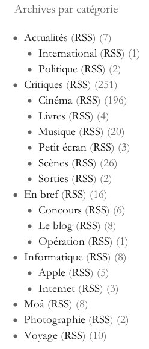
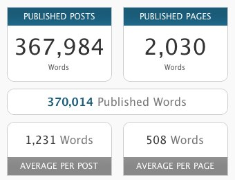

+++
titre = "300 articles et 370 000 mots plus tard"
title = "300 articles et 370 000 mots plus tard"
url = "/300-articles-370000-mots-plus-tard"
date = "2010-11-22T00:53:57"
Lastmod = "2010-11-22T01:03:09"
cover = "bible.jpg"
categorie = [ "Le blog" ]
tag = [ "Écriture", "Moâ", "Statistiques" ]

+++

deux-centième</a>, alors pourquoi consacrer un article au n°300 ? La satisfaction d&rsquo;avoir fait tout ce chemin, évidemment<a href="#footnote_0_4261" id="identifier_0_4261" class="footnote-link footnote-identifier-link" title="Oui, ce qui suit est un article &eacute;gocentrique. Sachez-le, j&rsquo;y parle de moi et je n&rsquo;h&eacute;site pas &agrave; m&rsquo;auto-f&eacute;liciter sur mon travail. Eh oui, j&rsquo;ose tout.">1</a>.

Jamais je n&rsquo;aurais imaginé arriver à un tel volume quand j&rsquo;ai lancé le blog sur un coup de tête à l&rsquo;été 2008. C&rsquo;était sur WordPress.com à l&rsquo;époque et je ne savais pas vraiment ce que je voulais en faire, de ce blog. j&rsquo;écrivais déjà depuis quelque temps des avis sur les films que je voyais, avis publiés sur les quelques forums que je fréquentais alors. Peu à peu, l&rsquo;idée est donc venue de mettre ces critiques dans le blog, histoire d&rsquo;en faire profiter tout le monde. Mais au début, j&rsquo;ai aussi mis <a href="http://voiretmanger.fr/2008/07/17/essai-photographique-a-lens/">quelques</a> <a href="http://voiretmanger.fr/2008/07/28/toulouse-by-night/">images</a>, un peu <a href="http://voiretmanger.fr/2008/07/30/finalement-la-ratp-cest-pas-si-mal/">raconté</a> ma vie… Le slogan du blog, inchangé depuis le premier jour, veut bien dire quelle est l&rsquo;intention : un espace d&rsquo;écriture personnelle totalement libre. Et si les critiques de film sont devenues prépondérantes, je ne m&rsquo;interdis rien, même des <a href="http://voiretmanger.fr/2008/10/11/a-qui-profite-la-crise/">sujets</a> <a href="http://voiretmanger.fr/2008/10/07/sauvons-les-ses/">politiques</a>, c&rsquo;est dire.

En deux ans et quelques mois, j&rsquo;ai donc publié 300 articles, dont 250 critiques, dont un peu moins de 200 sont des critiques de films. Je suis le premier étonné par ces chiffres qui montrent que l&rsquo;écriture pour le blog me plait toujours autant, et même toujours plus. Le centième article date de juin 2009, soit quasiment un an après la naissance du blog, alors que le 200 date de mars 2010. Avec cet article n°300 publié en novembre 2010, l&rsquo;accélération est nette, même si elle est essentiellement liée aux très bons chiffres de l&rsquo;été : 25 articles en août, pas loin d&rsquo;un par jour !

Mais ce qui m&rsquo;effraie le plus à dire vrai, ce ne sont pas tant les 300 articles, que le nombre de mots stockés désormais dans la base de données. 370 000 mots en tout et pour tout, de quoi remplir une <a href="http://agards-bible-timeline.com/q10_bible-facts.html">demi-Bible</a>… Bien que le contenu n&rsquo;en soit évidemment pas à la hauteur, voilà quand même de quoi donner le vertige.

On peut indéniablement remercier Internet et sa liberté. Imaginez seulement que cette masse de mots ait dû être imprimée… qui aurait accepté d&rsquo;imprimer de telles quantités ? Les journaux papier réduisent toujours plus la taille de leurs articles alors qu&rsquo;un blog offre toutes les possibilités, même les plus folles (1200 mots en moyenne par articles, imaginez donc…), quitte à n&rsquo;être lu par personne. Merci d&rsquo;ailleurs, cher lecteur, pour ta fidélité, ton indulgence et ton courage.

Et à la prochaine centaine ! 😉

<em>Image couverture : <a href="http://commons.wikimedia.org/wiki/File:Bible_paper.jpg">Wikimedia</a></em>

<ol class="footnotes"><li id="footnote_0_4261" class="footnote">Oui, ce qui suit est un article égocentrique. Sachez-le, j&rsquo;y parle de moi et je n&rsquo;hésite pas à m&rsquo;auto-féliciter sur mon travail. Eh oui, j&rsquo;ose tout. [<a href="#identifier_0_4261" class="footnote-link footnote-back-link">&#8617;</a>]</li></ol>
