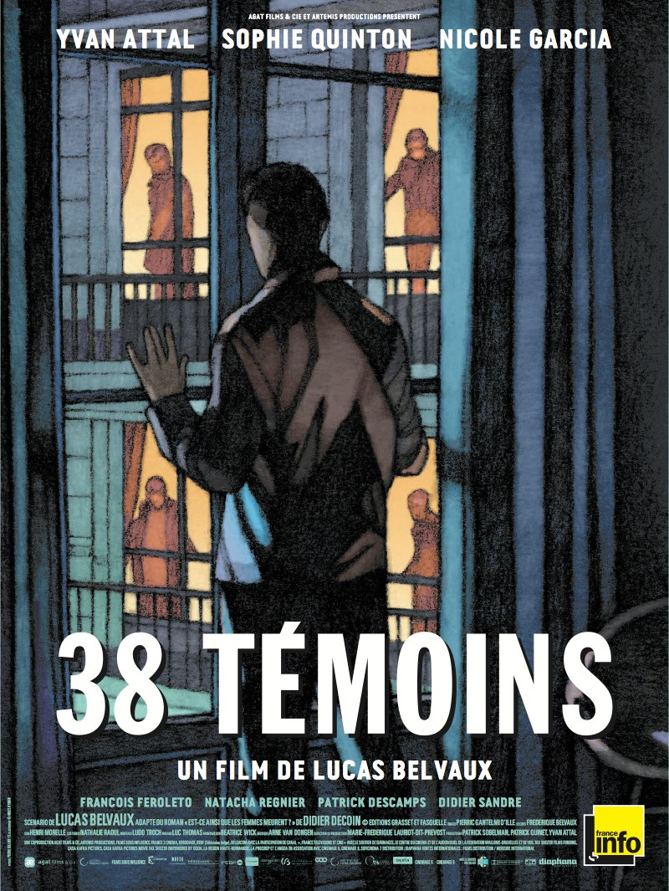
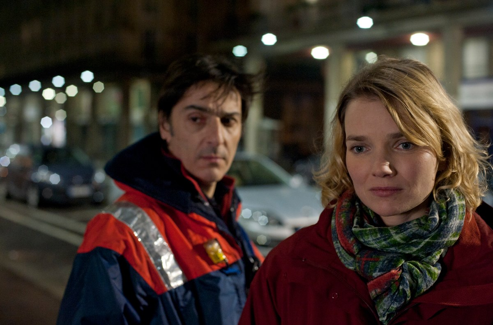
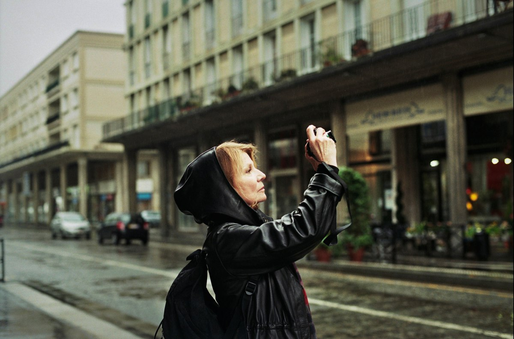
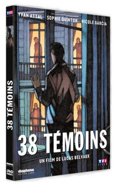

+++
type = "post"
titre = "38 témoins, Lucas Belvaux"
title = "38 témoins, Lucas Belvaux"
url = "/38-temoins-belvaux"
date = "2012-06-16T19:54:20"
Lastmod = "2013-04-09T13:52:47"
cover = "38-temoins-yvan-attal-belvaux.jpg"
categorie = [ "À voir" ]
tag = [ "Amour", "Drame", "Enquête", "Société", "Vite oublié" ]
createur = [ "Lucas Belvaux" ]
acteur = [ "Nicole Garcia", "Sophie Quinton", "Yvan Attal" ]
annee = [ "2012" ]
weight = 2012
pays = [ "France" ]

+++

Un meurtre, trente-huit témoins, pas un seul intervient, ne serait-ce qu&rsquo;en appelant la police. Lucas Belvaux construit son film autour de cette idée, autour de la lâcheté moderne qui fait que personne ne bouge, alors qu&rsquo;une vie pouvait être sauvée. Le sujet de <em>38 témoins</em> est original et passionnant, le résultat l&rsquo;est un peu moins en revanche. Le dernier long-métrage de Lucas Belvaux aurait gagné à être moins bavard, c&rsquo;est dans les silences qu&rsquo;il est le meilleur.

Un fait divers malheureusement banal, un meurtre une nuit, en plein centre-ville du Havre. Une femme est poignardée dans la rue, à plusieurs reprises, et les cris terribles qu&rsquo;elle a poussés auraient pu réveiller un mort. Sauf que les habitants dans les immeubles tout autour n&rsquo;ont pas bougé, personne n&rsquo;a appelé la police après le premier coup et le premier cri, alors que la victime pouvait encore être sauvée. Le lendemain, quand la police frappe à la porte des trente-huit témoins potentiels, ils disent tous n&rsquo;avoir rien entendu, rien vu. C&rsquo;est un mensonge bien sûr, leurs visages angoissés en disent long sur leur culpabilité, mais ils se sentent tous beaucoup trop mal, au point de cacher la vérité. Jusqu&rsquo;au jour où l&rsquo;un d&rsquo;entre eux, Pierre, n&rsquo;en peut plus de vivre avec ce mensonge et se rend dans un commissariat pour dire la vérité. Une vérité qui fait vite l&rsquo;effet d&rsquo;une bombe et qui détruit le quartier, mais aussi son couple…

<em>38 témoins</em> évoque un meurtre et l&rsquo;enquête policière qui suit occupe l&rsquo;essentiel de l&rsquo;histoire, certes, mais il ne s&rsquo;agit pas d&rsquo;un film policier pour autant. L&rsquo;identité du meurtrier n&rsquo;a aucune importance pour Lucas Belvaux et il n&rsquo;en sera pour ainsi dire jamais question. Même l&rsquo;enquête ne concerne pas vraiment ce point dans le long-métrage, mais plutôt la réaction du voisinage. Ou en l&rsquo;occurrence, l&rsquo;absence de réaction, avec une question lancinante : comment faire quand près de quarante témoins ne réagissent pas en entendant, voire en voyant un meurtre ? S&rsquo;agit-il encore d&rsquo;une non-assistance à personne en danger ? Faut-il les juger tous ensemble ? Ne s&rsquo;agit-il pas là du comportement habituel de notre société ? <em>38 témoins</em> place peu d&rsquo;espoir en l&rsquo;être humain et Lucas Belvaux considère ses personnages comme des lâches, la responsabilité de la société n&rsquo;entre ainsi jamais en jeu. Reste une question passionnante, d&rsquo;autant qu&rsquo;elle implique non seulement les témoins qui se sentent souvent coupables, mais aussi la réaction de la société et des médias en particulier. Le film se garde bien de donner des réponses toutefois, ce qui est une solution peut-être un peu facile, mais aussi très sage.

Au-delà de cette question de société, Lucas Belvaux s&rsquo;intéresse plus particulièrement à un couple. <em>38 témoins</em> se penche sur le cas de l&rsquo;un des témoins, le plus intéressant puisque c&rsquo;est le premier qui finit par avouer pour les trente-sept autres. Quand le film commence, Pierre dit à Louise, sa fiancée, qu&rsquo;il est rentré après les faits et qu&rsquo;il n&rsquo;a rien entendu. L&rsquo;acteur suffit à faire comprendre que c&rsquo;est un mensonge et on découvre vite qu&rsquo;il était non seulement présent, mais qu&rsquo;il a en plus tout entendu et même vu une partie de la scène. Plus tard, rongé par la culpabilité, il finit par avouer auprès de Louise, mais c&rsquo;est déjà trop tard. Pierre ne se supporte plus, il n&rsquo;accepte pas d&rsquo;avoir pu assister sans réagir à un meurtre et il entre vite dans une phase de dépression. Louise quant à elle n&rsquo;était vraiment pas présente au moment des faits, mais la jeune femme souffre tout autant de l&rsquo;évènement. Elle ne comprend pas immédiatement qu&rsquo;il se trame quelque chose, mais quand c&rsquo;est le cas, elle met tout en œuvre pour sauver son couple. Cet aspect de <em>38 témoins</em> n&rsquo;est pas le plus réussi, la faute incontestablement à un jeu d&rsquo;acteurs trop caricatural, mais aussi à des dialogues trop empruntés qui nuisent à la crédibilité des sentiments que l&rsquo;on devrait ressentir. Lucas Belvaux semble trop dégouté par son personnage principal, à tel point qu&rsquo;il en vient à le rendre trop noir, trop dépressif, alors même que Pierre est censé jouer la comédie.

Les dialogues sont sans doute le point faible de <em>38 témoins</em>. Le film commence pourtant très bien, avec une remarquable séquence d&rsquo;introduction dans le port du Havre et avec un porte-conteneur au large. L&rsquo;image est particulièrement soignée, la photographie très travaillée est réussie et la musique accompagne particulièrement bien les images. Lucas Belvaux signe ici quelques minutes d&rsquo;un film à ambiance très convaincant, mais ce premier contact réussi se dégrade vite. Les dialogues manquent de crédibilité et ils consistent trop souvent en trop longues tirades. Les personnages sont eux aussi artificiels, mais la direction des acteurs est aussi en cause. Nonobstant Nicole Garcia impeccable, les autres acteurs en font tous trop — Yvan Attal pourtant si bon par ailleurs — ou pas assez — Sophie Quinton qui ne change pas vraiment d&rsquo;attitude du début à la fin. Reste une image toujours travaillée et convaincante et une bande originale elle aussi très réussie, mais cela ne suffit pas à sauver le film. <em>38 témoins</em> aurait gagné à rester sur l&rsquo;ambiance des premiers plans et à se faire moins bavard et surtout moins explicite.

Lucas Belvaux tenait un sujet en or pour <em>38 témoins</em>, mais il semble que son aversion pour ses personnages l&rsquo;empêche de le transformer en bon film. En l&rsquo;état, ce long-métrage mérite d&rsquo;être vu pour son ambiance et ses très beaux plans de la ville du Havre, mais il ne restera pas longtemps dans les mémoires.

38 témoins <em>sortira en DVD et Blu-Ray le 18 juillet 2012</em>

<h3>Vous voulez m&rsquo;aider ?<a href="#footnote_0_6793" id="identifier_0_6793" class="footnote-link footnote-identifier-link" title="&Agrave; propos de la publicit&eacute;&hellip;">1</a></h3>
<ul>
<li><a href="http://www.amazon.fr/gp/product/B007RC640Y/ref=as_li_ss_tl?ie=UTF8&amp;tag=leblogdenic07-21&amp;linkCode=as2&amp;camp=1642&amp;creative=19458&amp;creativeASIN=B007RC640Y">Acheter le film en Blu-Ray sur Amazon</a></li>
<li><a href="http://www.amazon.fr/gp/product/B007RC6440/ref=as_li_ss_tl?ie=UTF8&amp;tag=leblogdenic07-21&amp;linkCode=as2&amp;camp=1642&amp;creative=19458&amp;creativeASIN=B007RC6440">Acheter le film en DVD sur Amazon</a></li>
<li><a href="https://itunes.apple.com/fr/movie/38-temoins/id536074849">Acheter ou louer le film sur l&rsquo;iTunes Store</a></li>
</ul>

<ol class="footnotes"><li id="footnote_0_6793" class="footnote"><a href="/soutien/">À propos de la publicité…</a> [<a href="#identifier_0_6793" class="footnote-link footnote-back-link">&#8617;</a>]</li></ol>
