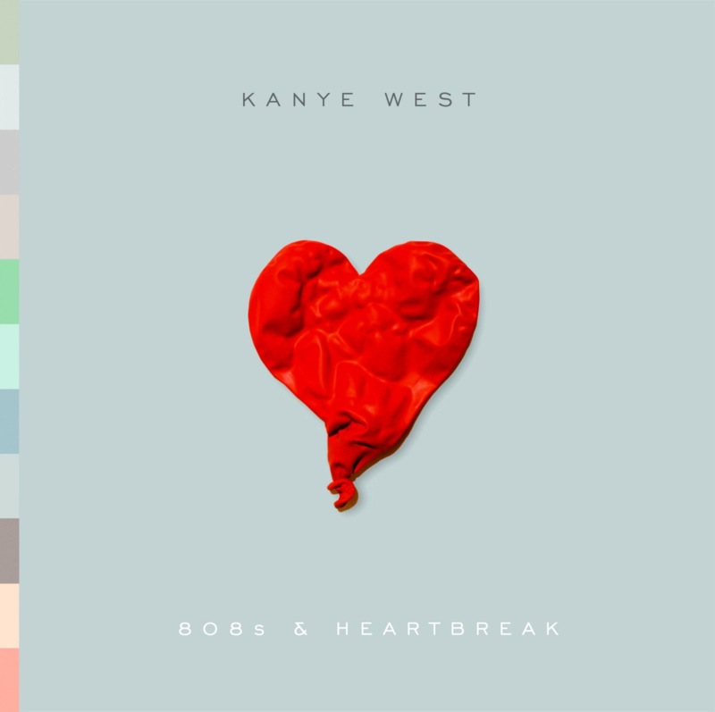

+++
titre = "808s &#038; Heartbreak, Kanye West : coup de cœur du moment"
title = "808s &#038; Heartbreak, Kanye West : coup de cœur du moment"
url = "/808s-heartbreak-kanye-west-coup-de-coeur-du-moment"
date = "2008-12-25T18:48:23"
Lastmod = "2012-02-11T11:45:18"
cover = "kanye-west.jpg"
categorie = [ "Musique" ]
tag = [ "Rap" ]
createur = [ "Kanye West" ]
annee = [ "2008" ]
weight = 2008
pays = [ "États-Unis" ]

+++

Dans ma découverte du joyeux monde du rap, le véritable coup de cœur du moment, sans mauvais jeu de mots, le dernier album de Kanye West, <em>808s &amp; Heartbreak</em>. Je ne connaissais l&rsquo;artiste que de nom jusqu&rsquo;à très récemment, comme étant un talentueux producteur de rap. J&rsquo;avais aussi entendu parler de cet album, principalement sur un mode négatif de la part de fans apparemment déçus par un changement artistique. Quand Last.fm a fini par me le conseiller, j&rsquo;ai décidé d&rsquo;y porter une oreille curieuse et je n&rsquo;ai pas été déçu.

Le titre se fait déclaration sur le fond et la forme. Le 808 renvoie, en effet, à une <a href="http://en.wikipedia.org/wiki/Roland_TR-808">machine à rythme</a> créée dans les années 1980 et qui est devenue populaire récemment. Le son qui en sortait n&rsquo;étant pas très réaliste, la boite à rythmes n&rsquo;a pas convaincu à son époque, mais plait aujourd&rsquo;hui pour une ambiance très <em>eighties</em>, si à la mode. Le deuxième élément du titre indique, on pouvait s&rsquo;y attendre, le programme de l&rsquo;album et annonce en même temps la couleur, plutôt noire et bienvenue, <em>a priori</em>, dans un univers trop souvent marqué par les clichés à base de grosses voitures et montres en or.

Dès les premières écoutes, ce qui saute aux oreilles, c&rsquo;est d&rsquo;abord une ambiance. La conjonction de cette fameuse boite à rythmes, et surtout de l&rsquo;Auto-Tune qui est supposé améliorer la voix de l&rsquo;artiste, apporte une ambiance très typique et étonnante. Aux premiers abords, j&rsquo;ai cru entendre un de ces horribles boys-bands japonais avec leurs sempiternels chœurs, la faute à l&rsquo;Auto-Tune qui, manifestement, métallise un peu les voix et leur donne un effet un peu &laquo;&nbsp;toc&nbsp;&raquo;. La première fois, cela fait un peu &laquo;&nbsp;cheap&nbsp;&raquo; (vous savez, façon Star Ac<a href="#footnote_0_1036" id="identifier_0_1036" class="footnote-link footnote-identifier-link" title="Les Inrocks &eacute;voquent un chant fa&ccedil;on Phil Collins, c&rsquo;est pas idiot&hellip;">1</a>), mais on oublie très vite cet effet qui offre à l&rsquo;album, donnant à la voix de Kanye West un timbre particulier. Ne connaissant pas sa voix au naturel, je n&rsquo;ai pas été déçu comme une grande partie des fans qui apparemment n&rsquo;apprécient pas. Sur ce point, je conserve mon avis habituel : un artiste fait bien ce qu&rsquo;il veut et tant que ça n&rsquo;est pas lié par une inculture profonde, je n&rsquo;ai rien contre. La machine à rythmes est en effet très présente, pour mon plus grand bonheur. Mon intérêt pour Peter Gabriel vient, notamment, de la présence de la batterie et de son rôle essentiel dans la musique (ah, sur <em>The Rhythm of the Heat</em>, cette fin !). Étonnamment, je retrouve cet aspect dans <em>808s &amp; Heartbreak</em>. Bon, la comparaison s&rsquo;arrête vite bien sûr, mais en tout cas cet aspect m&rsquo;a immédiatement plu et fait accrocher aux différents titres.

L&rsquo;album est plutôt sombre, le thème général de la rupture et de la perte s&rsquo;imposant de bout en bout. L&rsquo;album a été écrit après une rupture et la mort de la mère de l&rsquo;artiste, ce qui explique cette ambiance et ce thème revendiqués par ailleurs pendant toute la période de promotion. Les paroles ne m&rsquo;intéressent pas particulièrement, mais dès le titre initial, intitulé &laquo;&nbsp;Say You Will&nbsp;&raquo;, le ton, sombre et amer, est donné. Cet album ne vous remontera pas le moral, mais je suis d&rsquo;avis que les sujets tristes donnent souvent les meilleures choses.

Si l&rsquo;on classe Kanye West dans la mouvance rap ou hip-hop, ce classement ne tient pas longtemps avec cet album tant il s&rsquo;éloigne des archétypes du genre. Difficile, de fait, de parler encore de rap. En fait, il est difficile de définir génériquement cet album, ce qui ne peut que me plaire aussi. Mélange des genres, l&rsquo;album passe du rap (ou hip-hop, je n&rsquo;ai jamais su faire la différence) à la pop, en passant par des sonorités électroniques ou new wave. 

Aveu de faiblesse passionnant, <em>808s &amp; Heartbreak</em> se révèle au fil des écoutes comme un excellent album. Découvert récemment, j&rsquo;approuve totalement le choix des <em>Inrockuptibles</em> de le placer dans le top 50 des albums de l&rsquo;année 2008, en sixième position. Dans <a href="http://www.lesinrocks.com/index.php?id=59&amp;tx_critic[notule]=209686&amp;cHash=bc3378faf4">leur critique</a>, ils en font un disque fondateur, un tournant majeur du genre avec un album appelé à devenir un classique. Je ne sais pas s&rsquo;ils ont raison, mais je le souhaite sincèrement à ce disque qui mérite d&rsquo;être entendu et diffusé ! Et de mon côté, j&rsquo;ai trois disques (ses trois premiers) à découvrir&#8230;

 

Et sur ce, je vous souhaite un joyeux Noël !

<h3>Vous voulez m&rsquo;aider ?<a href="#footnote_1_1036" id="identifier_1_1036" class="footnote-link footnote-identifier-link" title="&Agrave; propos de la publicit&eacute;&hellip;">2</a></h3>
<ul>
<li><a href="http://www.amazon.fr/gp/product/B001FBIPFA/ref=as_li_ss_tl?ie=UTF8&#038;tag=leblogdenic07-21&#038;linkCode=as2&#038;camp=1642&#038;creative=19458&#038;creativeASIN=B001FBIPFA">Acheter l&rsquo;album en CD sur Amazon</a> (<a href="http://www.amazon.fr/gp/product/B0047QYJFU/ref=as_li_ss_tl?ie=UTF8&#038;tag=leblogdenic07-21&#038;linkCode=as2&#038;camp=1642&#038;creative=19458&#038;creativeASIN=B0047QYJFU">téléchargement MP3</a>)</li>
</ul>

<ol class="footnotes"><li id="footnote_0_1036" class="footnote">Les Inrocks évoquent un chant façon Phil Collins, c&rsquo;est pas idiot&#8230; [<a href="#identifier_0_1036" class="footnote-link footnote-back-link">&#8617;</a>]</li><li id="footnote_1_1036" class="footnote"><a href="http://voiretmanger.fr/a-propos/publicite/">À propos de la publicité…</a> [<a href="#identifier_1_1036" class="footnote-link footnote-back-link">&#8617;</a>]</li></ol>
