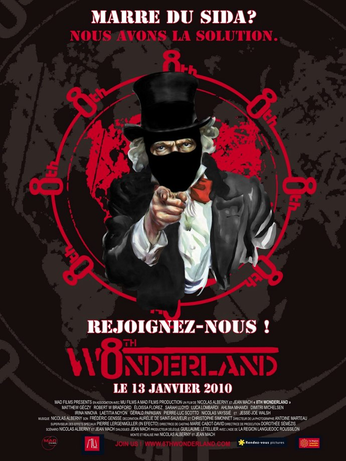

+++
type = "post"
titre = "8th Wonderland, Nicolas Alberny et Jean Mach"
title = "8th Wonderland, Nicolas Alberny et Jean Mach"
url = "/8th-wonderland-alberny-mach"
date = "2010-05-16T00:01:46"
Lastmod = "2012-08-09T09:42:25"
cover = "8th-wonderland-alberny-mach.jpg"
categorie = [ "À voir" ]
tag = [ "Geek", "Internet", "Politique", "Science-Fiction", "Utopie" ]
createur = [ "Jean Mach", "Nicolas Alberny" ]
annee = [ "2010" ]
weight = 2010
pays = [ "France" ]

+++

Sorti dans une poignée de salles en France, <em>8th Wonderland</em> fait pourtant le buzz sur Internet depuis quelques jours. Et pour cause, voilà un film qui se déroule autant voire plus sur Internet que dans la vie réelle. Un film aussi geek que fauché, qui n&rsquo;a pas les moyens de son ambition artistique, mais qui reste un film sympathique à voir, surtout si vous avez été geek dans une autre vie.

Une nation virtuelle crée par des citoyens du monde entier rassemblés sur un même site, voilà sans doute une idée un peu folle. Mais soyons francs : quel Internaute ne serait-ce que légèrement geek n&rsquo;y a jamais pensé ? Les discussions sur Internet, que ce soit sur les forums ou les chats<a href="#footnote_0_3350" id="identifier_0_3350" class="footnote-link footnote-identifier-link" title="Aaaah la bonne vieille &eacute;poque des chats IRC&hellip; &Ccedil;a c&rsquo;&eacute;tait quelque chose&hellip; #nostalgie #moidemontemps">1</a>, ont ceci de fascinants qu&rsquo;elles rassemblent effectivement des gens d&rsquo;horizons très différents, de cultures diamétralement opposées, des quatre coins de la planète. Réunis par une passion commune, pas forcément liée à l&rsquo;informatique d&rsquo;ailleurs, les participants peuvent refaire le monde en toute simplicité. Tout paraît si simple sur un forum et tout un chacun peut occuper une place importante (les fameux modérateurs omnipotents qui terrorisent les nioubes) et ainsi prendre sa revanche sur la vie réelle, bien plus terne et morne en comparaison. Que celui, donc, qui n&rsquo;a jamais rêvé un jour d&rsquo;un monde où les geeks et le virtuel prendraient leur revanche sur le monde réel me jette la première pierre !

<em>8th Wonderland</em>, c&rsquo;est exactement cela. L&rsquo;utopie d&rsquo;un pays virtuel composé d&rsquo;Internautes par ailleurs citoyens du monde lassés par les mensonges et trahisons des politiques. Une poignée d&rsquo;individus qui veut changer les choses et se donne les moyens de le faire à travers une organisation financée par tous les citoyens de ce huitième pays merveilleux. Un pays démocratique où une motion est votée chaque semaine, une motion qui se transforme en action concrète dans le monde réel. Au départ gentillettes — clouer sur tous les murs des édifices religieux du Vatican un distributeur de préservatifs par exemple —, ces actions se durcissent au fil du film et alors que l&rsquo;emballement médiatique survient, allant jusqu&rsquo;à l&rsquo;attentat terroriste et l&rsquo;assassinat. C&rsquo;est bien le problème d&rsquo;un groupe fondé uniquement sur le vote de tous, sans aucun contrôle d&rsquo;un groupe, il peut venir à faire n&rsquo;importe quoi, quitte même à inoculer le virus du SIDA à des innocents. La fin justifie-t-elle les moyens ?, demande notamment <em>8th Wonderland</em>.

<em>8th Wonderland</em> fait preuve d&rsquo;une naïveté déconcertante, à tel point que l&rsquo;on se demande si les réalisateurs n&rsquo;ont pas réalisé un film sarcastique qui dénoncerait en fait la naïveté de ces Internautes. À aucun moment, néanmoins, cette idée n&rsquo;est validée par le film qui contraint à rester à un premier degré parfois surprenant. Qu&rsquo;une communauté d&rsquo;Internautes puisse impunément tuer un président en activité et créer une crise diplomatique au plus haut niveau impunément, sans que les dirigeants du monde fassent tout en leur pouvoir pour les arrêter laisse pantois. C&rsquo;est d&rsquo;autant plus gênant que l&rsquo;argument de l&rsquo;anonymat sur l&rsquo;Internet est éculé depuis déjà fort longtemps, et que des geeks devraient quand même le savoir. Comment croire que cette communauté rassemblant manifestement des millions d&rsquo;utilisateurs qui discutent par vidéo à plusieurs dizaines à la fois pourrait tenir sur une poignée de serveurs situés au Portugal et qui plus est sans surveillance ? C&rsquo;est techniquement naïf et dommage pour un film qui devrait être irréprochable sur ce plan : étant dans l&rsquo;utopie, on aurait pu imaginer bien plus fort, comme un site hébergé sur tous les ordinateurs de la planète, un site complètement décentralisé et donc inattaquable, par exemple. L&rsquo;idée du pays virtuel est intéressante puisqu&rsquo;elle désarçonne totalement un monde construit sur l&rsquo;opposition entre États, ce qui est impossible dans <em>8th Wonderland</em>, comme c&rsquo;est aussi le cas depuis le 11 septembre avec le terrorisme, d&rsquo;ailleurs. Dommage dès lors de la gâcher avec ce retour tellement trop simple à la réalité.

Le scénario est, de toute manière, un point noir pour un film complètement fauché. Nicolas Alberny et Jean Mach n&rsquo;ont manifestement eu qu&rsquo;un budget ridicule et ont été contraints de faire des coupes partout. Si cela se ressent dans la réalisation, c&rsquo;est surtout gênant pour le scénario et les dialogues qui sonnent aussi vrais qu&rsquo;une pièce de théâtre écrite par des collégiens. Les acteurs sont tous débutants (voire non professionnels) et cela se sent. D&rsquo;ailleurs, quand <em>8th Wonderland</em> fait appel à des guest-star (Nikos Aliagas ou Julien Lepers par exemple), le niveau change et on regrette qu&rsquo;un présentateur de journal télévisé français n&rsquo;ait pas pris la place de l&rsquo;actrice qui officie dans le film. Au-delà des acteurs, les faibles moyens limitent le potentiel de <em>8th Wonderland</em> et brident sérieusement ses ambitions. Le film est en effet ambitieux, ne voulant reposer quasiment que sur des images télévisées ou sur des discussions sur Internet. D&rsquo;emblée, on nous présente les journaux de chaînes des quatre coins du monde et ce sera un principe moteur du film, chaque élément important étant analysé selon les différents points de vue. On entend parler une bonne dizaine de langues, l&rsquo;ensemble a un côté cosmopolite assez plaisant et plutôt réussi, mais qui révèle encore mieux le manque de moyens du film. Ceci étant, passées les premières minutes et nonobstant les dialogues déplorables, <em>8th Wonderland</em> a un côté bricolé sympathique qui m&rsquo;a plu. Comme si une communauté de geek faisait un film, sans doute.

En sortant de la salle, le premier adjectif qui m&rsquo;est venu à l&rsquo;esprit pour qualifier <em>8th Wonderland</em> est &laquo;&nbsp;mignon&nbsp;&raquo;. Imaginer qu&rsquo;une bande de geeks puisse durablement modifier le monde tel qu&rsquo;on le connaît aujourd&rsquo;hui et viabiliser le concept de pays virtuel après avoir attaqué les huit premières puissances du monde impunément est très mignon. Vraiment, on n&rsquo;a pas envie d&rsquo;attaquer un tel film, surtout quand, comme moi, on a de lourds passifs geeks… Geek ou pas geek, on déplore quand même la pauvreté du scénario, en particulier des dialogues, mais pas seulement. L&rsquo;idéologie du film est tout de même bien pauvre et souvent démagogique. En bref, <em>8th Wonderland</em>, c&rsquo;est mignon tout plein et très geek. J&rsquo;ai bien peur que seuls ceux qui sont/ont été un peu geeks apprécieront…

La <a href="http://nivrae.fr/2010/05/13/critique-cinema-8th-wonderland/">ciné-geekette</a> ne pouvait qu&rsquo;apprécier <em>8th Wonderland</em>… Par contre, <a href="http://www.toujoursraison.com/2010/05/8th-wonderland.html">Rob Gordon</a> et <a href="http://www.critikat.com/8th-Wonderland.html">Benoit de Critikat</a> ne sont pas/plus du tout geeks, preuve en est faite ! Ceci étant et plus sérieusement, une fois passée l&rsquo;émotion du geek qui sommeille toujours en moi, force est de reconnaître que ces deux derniers ont raison sur toute la ligne…

<h3>Vous voulez m&rsquo;aider ?<a href="#footnote_1_3350" id="identifier_1_3350" class="footnote-link footnote-identifier-link" title="&Agrave; propos de la publicit&eacute;&hellip;">2</a></h3>
<ul>
<li><a href="http://www.amazon.fr/gp/product/B005LY3VGU/ref=as_li_ss_tl?ie=UTF8&tag=leblogdenic07-21&linkCode=as2&camp=1642&creative=19458&creativeASIN=B005LY3VGU">Acheter le film en Blu-Ray sur Amazon</a></li>
<li><a href="http://www.amazon.fr/gp/product/B005LY3W0K/ref=as_li_ss_tl?ie=UTF8&tag=leblogdenic07-21&linkCode=as2&camp=1642&creative=19458&creativeASIN=B005LY3W0K">Acheter le film en DVD sur Amazon</a></li>
<li><a href="http://itunes.apple.com/fr/movie/8th-wonderland/id471773220">Acheter ou louer le film sur l&rsquo;iTunes Store</a></li>
</ul>

<ol class="footnotes"><li id="footnote_0_3350" class="footnote">Aaaah la bonne vieille époque des chats IRC… Ça c&rsquo;était quelque chose&#8230; #nostalgie #moidemontemps [<a href="#identifier_0_3350" class="footnote-link footnote-back-link">&#8617;</a>]</li><li id="footnote_1_3350" class="footnote"><a href="/soutien/">À propos de la publicité…</a> [<a href="#identifier_1_3350" class="footnote-link footnote-back-link">&#8617;</a>]</li></ol>
