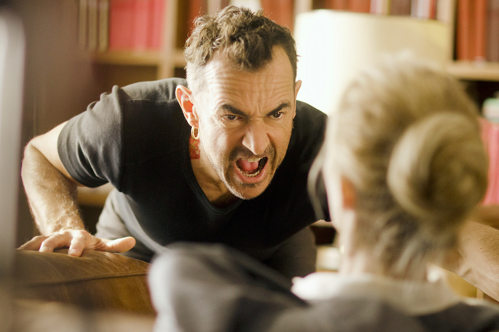

+++
titre = "<em>9 mois ferme</em>, Albert Dupontel"
title = "9 mois ferme, Albert Dupontel"
url = "/9-mois-ferme-dupontel"
date = "2013-10-23T22:08:48"
Lastmod = "2013-10-23T22:15:02"
cover = "9-mois-ferme-albert-dupontel-sandrine-kiberlain.jpg"
categorie = [ "À voir" ]
tag = [ "Amour", "Comédie", "Humour noir", "Justice", "Société" ]
createur = [ "Albert Dupontel" ]
acteur = [ "Albert Dupontel", "Nicolas Marié", "Philippe Uchan", "Sandrine Kiberlain" ]
annee = [ "2013" ]
weight = 2013
pays = [ "France" ]

+++

Albert Dupontel est un acteur à part dans le cinéma français, mais aussi un réalisateur toujours plus intéressant. Il le prouve encore avec son cinquième long-métrage, <em>9 mois ferme</em>, une hilarante comédie qui ressemble sur le papier à tout ce que le cinéma français peut faire de pire, mais qui s’avère finalement une belle réussite. Le cinéaste joue dans son film, mais il prouve surtout qu’il n’est pas un de ces réalisateurs qui ne sont financés qu’en raison de leur notoriété. Un petit film jouissif, à ne pas rater.

L’idée de départ de <em>9 mois ferme</em> est extrêmement simple : Ariane Felder, juge assez stricte qui refuse toute vie familiale qui pourrait compromettre sa carrière, découvre qu’elle est enceinte de six mois. Son déni de grossesse a empêché jusque-là toutes traces, mais la jeune femme ne peut plus le cacher : elle, pour qui avoir un enfant est la pire chose au monde, va devoir gérer un bébé, alors même qu’elle attend une belle promotion. Le pire toutefois, c’est qu’elle ne sait pas qui est le père : un test ADN plus tard et l’horreur s’abat sur elle. Albert Dupontel a imaginé une histoire acadabrantesque à base de fête un peu trop arrosée au palais de justice et de rencontre fortuite avec un délinquant recherché pour avoir violemment assassiné un homme après lui avoir mangé les deux yeux. À partir de cette idée, <em>9 mois ferme</em> déploie une comédie brève (1h22), mais intense. Après le rejet, l’héroïne finit peu à peu par s’habituer à celui avec lequel elle a eu un enfant, mais ce n’est pas l’essentiel. Dans ce récit un peu fou, la fin n’a guère d’importance, beaucoup moins que les multiples péripéties qui précèdent. 

Dès les premières images, Albert Dupontel témoigne d’un sens de la mise en scène assez étonnant. L’acteur pose ses idées par dizaine avec des plans-séquences qui utilisent des éléments du décor en guise de transitions, des plans incroyables qui ajoutent beaucoup de dynamisme aux scènes ou encore un art du montage précis et diablement efficace. <em>9 mois ferme</em> est un plaisir à regarder pour tout cinéphile, même si on oublie vite la technique face à une histoire drôle et très bien racontée. Le cinéaste a imaginé une galerie de personnages qui sont tous très réussis et souvent complètement dingues. On apprécie le rôle que s’est lui-même donné Albert Dupontel, même s’il est dans un registre assez proche de ce pour quoi on le connaît. Côté casting, on est surtout bluffé par une Sandrine Kiberlain impeccable dans son rôle de psychorigide qui s’attendrit doucement. Autour d’eux, une très belle galerie de personnages secondaires et d’apparitions qui font de cette comédie une réussite. <em>9 mois ferme</em> bénéficie des talents de dialoguiste du cinéaste, mais aussi de son sens de l’absurde avec quelques scènes particulièrement réussies. On retiendra longtemps les deux reconstitutions imaginées à un moment, une séquence à mourir de rire et follement inventive. L’ensemble est drôle sans être grossier et le réalisateur, toujours aussi engagé, n’oublie pas son message. Ainsi, il signe une œuvre à la fois très divertissante, parfaite pour se détendre au cinéma, mais aussi une critique acerbe du système de justice français. L’idée originale est née d’un documentaire de Raymond Depardon (<em>10e chambre &#8211; Instants d’audience</em>) et cela se voit : derrière la farce, Albert Dupontel filme un univers qu’il connaît et il le fait avec précision.

<em>9 mois ferme</em> est une très belle réussite. C’est certainement le film le plus accessible du cinéaste : pour une fois, Albert Dupontel ne cède pas à la noirceur et à la violence, comme dans ses précédentes réalisations. Ce n’est pas une faiblesse, bien au contraire : en adoucissant son style, mais sans oublier son message, il réalise un long-métrage très drôle, divertissant, mais pas stupide pour autant. À voir, même si vous n’aimez pas les comédies françaises traditionnelles…

