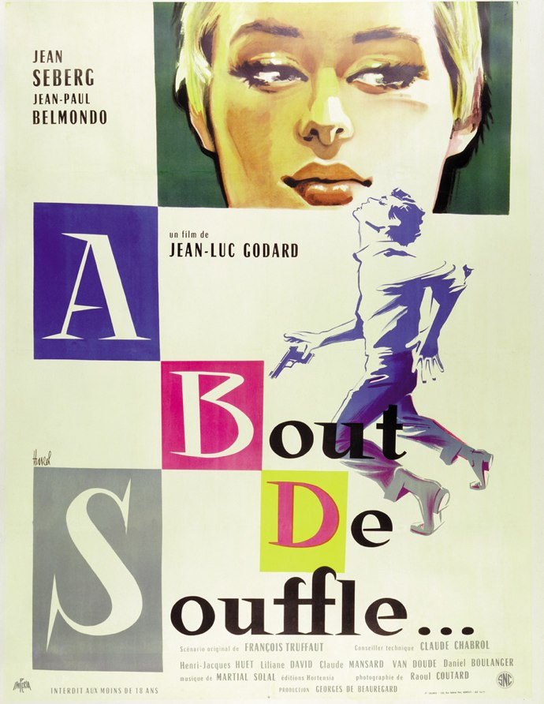
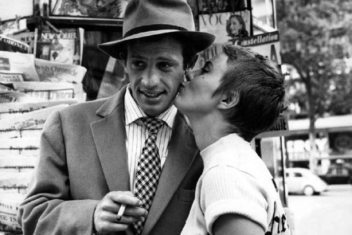

+++
type = "post"
titre = "<em>À Bout de Souffle</em>, Jean-Luc Godard"
title = "À Bout de Souffle, Jean-Luc Godard"
url = "/a-bout-de-souffle-godard"
date = "2010-07-01T00:27:56"
Lastmod = "2014-01-15T18:55:31"
cover = "a-bout-de-souffle-belmondo.jpg"
categorie = [ "À voir" ]
tag = [ "Amour", "Cinéma classique", "Noir et blanc", "Nouvelle-Vague" ]
createur = [ "Jean-Luc Godard" ]
acteur = [ "Jean Seberg", "Michel Belmondo" ]
annee = [ "1960" ]
weight = 1960
pays = [ "France" ]

+++

Comment aborder un classique du cinéma français, un film considéré par tant de cinéphiles et cinéastes comme un chef-d&rsquo;œuvre ? <em>À Bout de Souffle</em>, premier film de Jean-Luc Godard alors passé de la critique cinématographique à la réalisation, fait indéniablement partie du patrimoine cinématographique français et même mondial. Symbole de la Nouvelle-Vague alors émergente, ce film sorti en salles en 1960 fête cette année ses 50 ans. Pour l&rsquo;occasion, on peut le retrouver en salles dans une version restaurée. Pour ma part, ce fut l&rsquo;occasion de découvrir ce mythe.

Une fois n&rsquo;est pas coutume, je crois que la bande-annonce (ci-dessous) est très significative de ce qu&rsquo;est <em>À Bout de Souffle</em>.D&rsquo;une durée record par rapport aux standards actuels (pas moins de 2 minutes), elle égraine des mots pour former une sorte de liste à la Prévert. Le film est censé contenir une galerie de personnages (la jolie fille, le vilain garçon, l&rsquo;américaine, le photographe italien…) et d&rsquo;éléments du quotidien (le révolver, le concerto pour clarinettes, Marseille…). À aucun moment il n&rsquo;est question d&rsquo;une quelconque intrigue, même si plusieurs éléments laissent à penser qu&rsquo;il y aura de l&rsquo;action : une course poursuite, un mort, des coups de feu. Cette bande-annonce, outre son intérêt historique pour nos yeux habitués aux bandes-annonces où la caméra virevolte en permanence au milieu d&rsquo;explosions et/ou de gros seins<a href="#footnote_0_3568" id="identifier_0_3568" class="footnote-link footnote-identifier-link" title="&Agrave; propos de gros seins, il est frappant de constater que le film &eacute;tait interdit en salles aux moins de 18 ans. &Agrave; un moment, on voit effectivement quelques femmes d&eacute;nud&eacute;es. On reste n&eacute;anmoins dans le domaine du charme tr&egrave;s soft et si &Agrave; Bout de Souffle sortait aujourd&rsquo;hui, il n&rsquo;aurait sans aucun doute aucune restriction. Les temps changent&hellip;">1</a> est un manifeste. Le refus d&rsquo;un certain cinéma jugé vieillot et dépassé au profit d&rsquo;un nouveau cinéma, celui que l&rsquo;on nommera &laquo;&nbsp;Nouvelle-Vague&nbsp;&raquo;. C&rsquo;est un cinéma qui s&rsquo;oppose aux codes traditionnels, d&rsquo;abord par la critique par le biais essentiellement des <em>Cahiers du cinéma</em> dans lequel Godard écrivait, puis par la réalisation de films nouveaux. <em>À Bout de Souffle</em> n&rsquo;est sans doute pas le premier dans son genre, mais il est resté comme le premier symbole de ce renouveau.

Parmi les revendications des membres de la Nouvelle-Vague, on trouve une redéfinition du récit. Dans <em>À Bout de Souffle</em>, le récit est toujours présent, mais il devient secondaire. Le héros, Michel Poiccard est un petit voyou, aujourd&rsquo;hui ce serait sans doute un d&rsquo;jeuns des banlieues tel que les JT le décrivent. Il vole des voitures et récupère de l&rsquo;argent là où il peut. Rien de bien méchant jusqu&rsquo;au jour où, après une course-poursuite, il tue un policier. Il est alors recherché par toute la police française. Débarquant à Paris où il veut récupérer de l&rsquo;argent qu&rsquo;on lui doit, il retrouve Patricia, jeune américaine qu&rsquo;il aime bien vu qu&rsquo;ils ont déjà couché ensemble cinq ou six fois. On suit alors les tribulations de ces deux jeunes gens dans tout Paris, tandis que la police les recherche toujours. L&rsquo;histoire est donc indéniablement présente, mais le film semble ne s&rsquo;y intéresser qu&rsquo;à distance, comme si finalement c&rsquo;était secondaire. Quand Patricia apprend la vérité sur Michel, elle ne laisse transparaître aucune émotion et l&rsquo;aide dans ses méfaits avant de le dénoncer à la police avec la même désinvolture. Michel fait aussi un piètre voleur, bien peu crédible : il vole des voitures comme si de rien n&rsquo;était, sans aucun réalisme, ni même simple volonté de &laquo;&nbsp;faire vrai&nbsp;&raquo;. Au-delà du scénario &laquo;&nbsp;criminel&nbsp;&raquo;, Godard s&rsquo;intéresse plus au couple qu&rsquo;il filme, à ses discussions les plus terre-à-terre (lui qui insiste lourdement pour coucher avec elle) comme les plus métaphysiques (sur la mort, ou le néant).

<object classid="clsid:d27cdb6e-ae6d-11cf-96b8-444553540000" width="690" height="570" codebase="http://download.macromedia.com/pub/shockwave/cabs/flash/swflash.cab#version=6,0,40,0"><param name="allowFullScreen" value="true" /><param name="allowScriptAccess" value="always" /><param name="src" value="http://www.dailymotion.com/swf/video/x8ganp_trailer-a-bout-de-souffle-film-goda_shortfilms" /><param name="allowfullscreen" value="true" /><embed type="application/x-shockwave-flash" width="690" height="570" src="http://www.dailymotion.com/swf/video/x8ganp_trailer-a-bout-de-souffle-film-goda_shortfilms" allowscriptaccess="always" allowfullscreen="true"></embed></object>

Cette redéfinition de la place de l&rsquo;intrigue s&rsquo;accompagne de changements dans la manière de filmer. Loin des grands studios de cinéma des débuts et qui prévalent toujours à Hollywood, les penseurs de la Nouvelle-Vague veulent plus de spontanéité, de naturel. Godard choisit donc, pour son premier film, de parier sur l&rsquo;improvisation. Au lieu de leur offrir un scénario bien ficelé et de les guider au centimètre près, il préfère les laisser jouer librement et capter ainsi un jeu supposé plus naturel. L&rsquo;effet n&rsquo;est plus le même aujourd&rsquo;hui, mais <em>À Bout de Souffle</em> a beaucoup impressionné ses contemporains à sa sortie. Cela dit, le fait que tous les dialogues aient été enregistrés après le tournage et ajoutés en post-production nuit au réalisme de l&rsquo;ensemble, je trouve. Si le projet était de proposer un cinéma nouveau, Jean-Luc Godard commence par s&rsquo;inspirer d&rsquo;un genre qui existait déjà, le film noir. La présence explicite d&rsquo;Humphrey Bogart est loin d&rsquo;être un hasard ou un clin d&rsquo;œil inutile. De même, le fameux geste du doigt sur les lèvres de Michel/Belmondo est une référence à la star américaine. En outre, le film est en noir et blanc et plusieurs scènes sont clairement inspirées par ce genre hollywoodien, notamment les courses-poursuites. On peut donc considérer que Godard n&rsquo;est encore qu&rsquo;au premier stade de la réalisation de ses réflexions de critique sur le cinéma. Pour ce premier coup d&rsquo;essai, il s&rsquo;est entouré d&rsquo;amis et notamment Truffaut au scénario ou Chabrol à la technique. <em>À Bout de Souffle</em> n&rsquo;est pas aussi radical que ce que Godard a fait ensuite, et fait toujours. La revendication est par contre bel et bien visible, notamment lorsqu&rsquo;un personnage demande, les <em>Cahiers</em> à la main, à un autre personnage s&rsquo;il est en faveur des jeunes. Ce dernier répond un &laquo;&nbsp;Non&nbsp;&raquo; rageur et symbolise certainement le camp adverse, celui des Classiques contre les Modernes.

Le dernier film de Jean-Luc Godard, <em><a href="http://voiretmanger.fr/2010/06/05/film-socialisme-godard/">Film Socialisme</a></em>, est en effet sorti récemment. La comparaison entre ces deux extrêmes dans sa longue carrière de cinéaste est intéressante. On retrouve bien évidemment la patte Godard à chaque fois, ne serait-ce que dans le montage très haché avec dans <em>À Bout de Souffle</em> des dialogues découpés à la hache, parfois au beau milieu d&rsquo;une phrase. Son premier comme son dernier film sont marqués par le mélange des langues et des cultures : dans <em>Film Socialisme</em>, Godard a poussé encore plus loin cette idée, mais déjà ce premier film est marqué par l&rsquo;entrecroisement de deux cultures, la culture française et l&rsquo;américaine. Cela s&rsquo;entend par la présence de l&rsquo;anglais, mais au-delà c&rsquo;est évidemment la référence au film noir, genre hollywoodien par excellence, qui prend une autre dimension. La différence fondamentale entre les deux films qui ouvre et ferme, jusqu&rsquo;au prochain, la carrière de Jean-Luc Godard, c&rsquo;est la présence d&rsquo;un scénario pour le premier. Je ne démords pas de ce que j&rsquo;avais écrit à propos de <em>Film Socialisme</em> : sans fil conducteur, sans récit, fût-il simple, fût-il malmené par des choix alternatifs de cinéma, tout film est fondamentalement vain. À mon sens, Godard est allé beaucoup trop loin dans le systématisme des principes de la Nouvelle-Vague, d&rsquo;autant que le courant n&rsquo;est plus vraiment porteur depuis plusieurs années.

<em>À Bout de Souffle</em> fait partie de ces quelques films qui ont été analysés et décortiqués sous toutes leurs coutures par des armées de cinéphiles amateurs et professionnels. Autant dire que l&rsquo;on se sent quelque peu impressionné de passer après. Je ne regrette pas d&rsquo;avoir découvert le premier film de Jean-Luc Godard. Encore animé par un récit, il se révèle en effet passionnant par les problématiques qu&rsquo;il soulève sur ce qu&rsquo;est un film. Est-ce raconter une histoire en offrant du rêve ? Est-ce oublier l&rsquo;acteur pour filmer un jeu jugé naturel, car improvisé ? Sont-ce des travellings murement réfléchis, ou est-ce suffisant de poser sa caméra ? Jean-Luc Godard et tous les autres membres de la Nouvelle-Vague ont apporté leurs réponses à ces questions.

Première pierre symbolique de cette vague, <em>À Bout de Souffle</em> a étonné à l&rsquo;époque et étonne toujours par sa modernité, notamment dans un ton très libre où le héros peut insulter les spectateurs et où le scénario peut faire preuve d&rsquo;une grande désinvolture par rapport à sa propre histoire. À condition de tolérer les aspects vieillots d&rsquo;un film qui a quand même 50 ans, il est urgent de découvrir <em>À Bout de Souffle</em> si vous ne l&rsquo;aviez encore jamais vus. Et sinon, la copie restaurée est visible dans <a href="http://www.allocine.fr/seance/film-29/">une (petite) poignée de salles françaises</a>…

<h3>Vous voulez m&rsquo;aider ?<a href="#footnote_1_3568" id="identifier_1_3568" class="footnote-link footnote-identifier-link" title="&Agrave; propos de la publicit&eacute;&hellip;">2</a></h3>
<ul>
<li><a href="http://www.amazon.fr/gp/product/B002YEQRPC/ref=as_li_ss_tl?ie=UTF8&tag=leblogdenic07-21&linkCode=as2&camp=1642&creative=19458&creativeASIN=B002YEQRPC">Acheter le film en Blu-Ray sur Amazon</a></li>
<li><a href="http://www.amazon.fr/gp/product/B000MTOUZU/ref=as_li_ss_tl?ie=UTF8&tag=leblogdenic07-21&linkCode=as2&camp=1642&creative=19458&creativeASIN=B000MTOUZU">Acheter le film en DVD sur Amazon</a></li>
<li><a href="https://itunes.apple.com/fr/movie/a-bout-de-souffle/id372359416">Acheter ou louer le film sur l&rsquo;iTunes Store</a></li>
</ul>

<ol class="footnotes"><li id="footnote_0_3568" class="footnote">À propos de gros seins, il est frappant de constater que le film était interdit en salles aux moins de 18 ans. À un moment, on voit effectivement quelques femmes dénudées. On reste néanmoins dans le domaine du charme très soft et si À Bout de Souffle sortait aujourd&rsquo;hui, il n&rsquo;aurait sans aucun doute aucune restriction. Les temps changent… [<a href="#identifier_0_3568" class="footnote-link footnote-back-link">&#8617;</a>]</li><li id="footnote_1_3568" class="footnote"><a href="http://voiretmanger.fr/a-propos/publicite/">À propos de la publicité…</a> [<a href="#identifier_1_3568" class="footnote-link footnote-back-link">&#8617;</a>]</li></ol>
