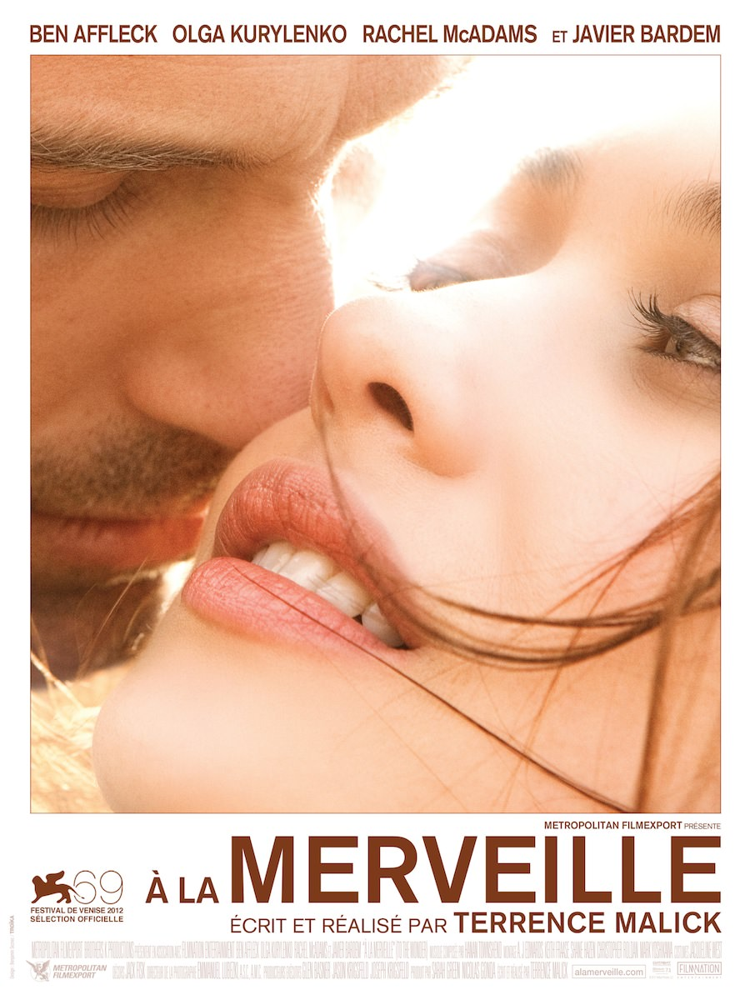
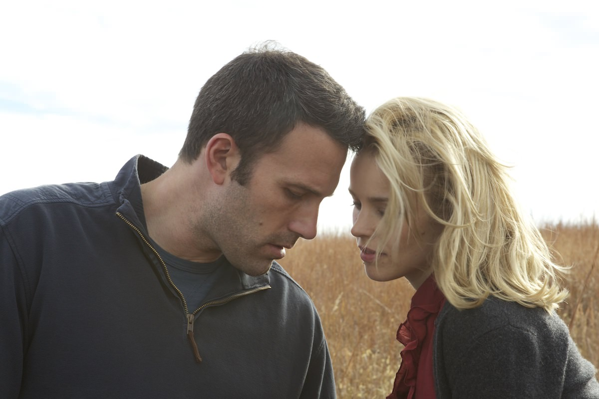
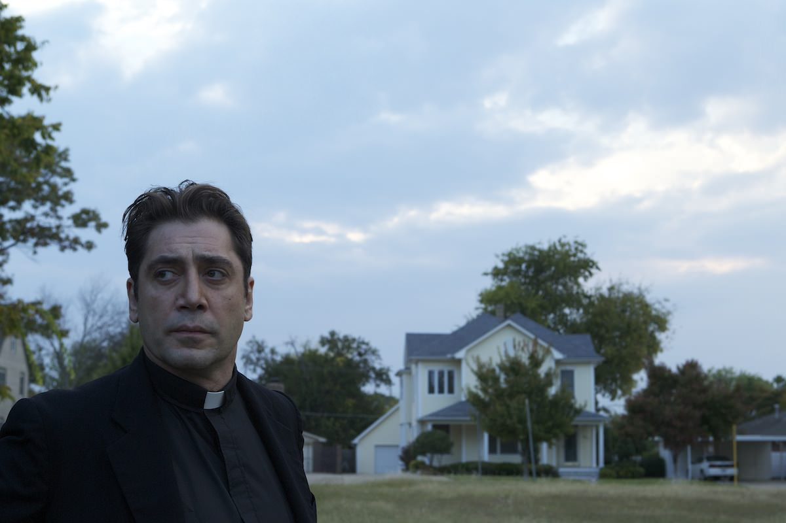

+++
type = "post"
titre = "<em>À la merveille</em>, Terrence Malick"
title = "À la merveille, Terrence Malick"
url = "/a-la-merveille-malick"
date = "2013-03-07T00:24:32"
Lastmod = "2014-01-01T13:18:43"
cover = "terrence-malick-a-la-merveille.jpg"
categorie = [ "À voir" ]
tag = [ "Amour", "Drame", "Expérience", "Nature", "Religion", "Romance", "Société" ]
createur = [ "Terrence Malick" ]
acteur = [ "Ben Affleck", "Javier Bardem", "Olga Kurylenko", "Rachel McAdams" ]
annee = [ "2013" ]
weight = 2013
pays = [ "États-Unis" ]
original = "To The Wonder"

+++

Terrence Malick a-t-il sorti son nouveau film trop rapidement ? Moins de deux ans après <a href="http://voiretmanger.fr/2011/05/17/tree-of-life-malick/" title="The Tree of Life, Terrence Malick – À voir et à manger"><em>The Tree of Life</em></a>, le cinéaste américain jusque-là si rare revient à nouveau sur les écrans avec un nouveau film. <em>À la merveille</em> était sans doute moins attendu que son prédécesseur, il faut dire que les premières images annonçaient un film dans le même esprit, l’effet de surprise en moins. En sortie de salle, on ne sait pas bien qu’en penser : si ce sixième long-métrage n’évite pas les redites, il apparaît plus comme une variation qu’une répétition. Terrence Malick réussit finalement à surprendre, à condition de se laisser à nouveau emporter…

<em>À la merveille</em> ouvre avec des images prises par une caméra de mauvaise qualité. On y voit un jeune couple dans le TGV, ils sont heureux d’être ensemble, tout simplement. On les retrouve ensuite au Mont-Saint-Michel qui a inspiré d’ailleurs le titre du film — <a href="http://fr.wikipedia.org/wiki/Abbaye_du_Mont-Saint-Michel#La_Merveille">la Merveille</a> est le nom de l’un des bâtiments de l’abbaye. Ces premières images cèdent ensuite la place à celles filmées par les caméras de Terrence Malick et la magie opère alors immédiatement. Le style ne sera pas étranger à tous ceux qui ont vu <em>The Tree of Life</em>, mais aussi les autres films du cinéaste, puisque l’on retrouve un peu <a href="http://voiretmanger.fr/2012/02/19/nouveau-monde-malick/" title="Le Nouveau Monde, Terrence Malick - À voir et à manger"><em>Le Nouveau Monde</em></a> également. La nature est comme toujours célébrée par de magnifiques travellings qui parcourent champs et forêts, mais l’homme y a toute sa place ici avec les silhouettes des personnages, souvent en position statique face à la nature. Pour la première fois peut-être, le réalisateur intègre aussi abondamment les créations humaines, avec des plans urbains presque aussi nombreux que ceux de nature et même quelques touches sociales quand <em>À la merveille</em> pose son regard sur des maisons délabrées. L’amateur de Terrence Malick ne sera incontestablement pas perdu et il retrouvera aussi son amour des contre-plongées et des cadres lancés vers le ciel. Que l’on aime ou non son cinéma, il est inutile de nier en revanche que le résultat est magnifique à regarder et on retrouve bien cette sensation de nature magnifiée. Saluons donc au passage le travail sur la photographie d’Emmanuel Lubezki qui est vraiment remarquable et pourrait justifier à lui seul le déplacement. 

Terrence Malick ne s’est jamais contenté de ses belles images pour faire des films et <em>À la merveille</em> ne fait pas exception. Au-delà des magnifiques plans qui se démultiplient pendant près de deux heures, le long-métrage raconte une histoire, ou plutôt deux histoires. Celle de Neil d’abord, un américain trentenaire qui pense avoir trouvé la femme de sa vie avec Marina, jeune femme originaire d’Ukraine. C’est ce couple que l’on découvre au début du film et que l’on suit entre leur appartement parisien et le Mont-Saint-Michel. Marina a une fille de dix ans qui semble apprécier le nouvel ami de sa mère et ils partent tous les trois aux États-Unis, chez Neil. Il suffit à Terrence Malick de quelques plans, d’un regard ou deux, pour signifier que tout bascule alors. Marina ne se sent pas chez elle et la jeune femme est constamment mal à l’aise, tiraillée entre son amour pour Neil et l’envie de quitter cette banlieue normée qu’elle semble incapable de comprendre. La rupture semble inévitable dès que l’on est arrivé aux États-Unis et elle survient finalement dans ce film au scénario beaucoup plus linéaire que dans <em>The Tree of Life</em>. Linéaire, mais on suit quand même en parallèle l’histoire du père Quintana, un prêtre espagnol qui officie dans la ville où vivent Neil et Marina. Lui aussi cherche l’amour, pas celui charnel entre deux êtres, mais l’amour divin : en pleine phase de doute, il aimerait obtenir un signe, quelque chose qui pourrait conforter sa foi. Subtilement, <em>À la merveille</em> entremêle ces deux histoires qui ne sont pas si différentes qu’à première vue. 

Après le mystère de la vie, l’amour. C’est un peu ce que l’on peut ressentir en regardant <em>À la merveille</em>, tant ce film partage des points communs avec son prédécesseur. La ressemblance est parfois si frappante, que l’on pourrait penser que Terrence Malick a exploité des éléments qu’il a tourné pour <em>The Tree of Life</em> : les plans en contre-plongée sous un arbre sont encore présents et ils sont un peu de trop. Par moment, on a le sentiment étrange de regarder une parodie de Terrence Malick, et non un vrai film original du cinéaste, et c’est un peu dommage, même s’il faut à nouveau reconnaître que c’est techniquement extrêmement bien fait. Du précédent, on retrouve aussi l’ambition des questionnements philosophiques, cette fois centrés autour de l’amour. Les deux histoires parallèles et mêlées d’<em>À la merveille</em> sont réunies par ce même problème : qu’est-ce que l’amour ? Le prêtre recherche l’amour de Dieu qu’il pense avoir perdu et qui le met dans une période de doute intense. Neil lui-même essaie de trouver l’amour et il est déçu par sa relation avec Marina, mais ne peut en même temps s’en défaire. Sans trop en dire, sa relation avec la jeune femme évolue dans la dernière partie du long-métrage, si bien que ses intentions ne sont plus aussi claires qu’au départ. L’aime-t-il vraiment, ou se sent-il obligé de l’aimer ? Au fond, qu’est-ce qui pousse un homme et une femme, ou un humain et l’idée de Dieu, à aimer ? Terrence Malick pose les questions et donne quelques réponses par son film composé, encore une fois, d’un grand nombre de narrations. <em>À la merveille</em> multiplie les narrateurs avec quatre voix différentes qui se suivent et se répondent, un autre trait caractéristique de l’œuvre du cinéaste qui va aussi dans le sens de la redite…

S’il est inutile de nier que cette nouvelle réalisation a beaucoup de points communs avec celle qui précède, <em>À la merveille</em> n’est pas une copie parfaite de <em>The Tree of Life</em> et il s’avère même <em>in fine</em> plutôt différent. Certes, on retrouve les mêmes effets de style, ce même montage très bref et saccadé, ces travellings et l’utilisation constante de la steadycam, mais quelque chose de fondamental a changé : l’ambition. Alors que Terrence Malick faisait preuve d’une ambition vraiment folle en s’intéressant au sens de la vie et pas moins dans son précédent film, il est ici finalement beaucoup plus modeste avec son histoire resserrée sur un couple et un prêtre. On peut trouver la différence insignifiante, mais en fait elle change tout. Du fait de son caractère plus intimiste, <em>À la merveille</em> est beaucoup plus touchant que son prédécesseur et le film devrait susciter plus d’émotion dans la salle. S’identifier au personnage de Neil devrait être assez simple, tant son histoire est courante et presque banale, mais ce n’est en aucun cas une critique. En resserrant ainsi son film, Terrence Malick devient plus accessible, plus immédiat peut-être aussi. Bien sûr, il faut toujours accepter son style, ses lenteurs et une forme de maniérisme, mais on peut désormais compter sur un scénario plus proche de nous. Paradoxalement, le choix radical de faire disparaitre tous les dialogues au profit de monologues qui se répondent tout au long du film, mais qui n’échangent jamais en même temps, participe de cette simplicité. <em>À la merveille</em> n’évite pas quelques aphorismes philosophiques un peu faciles, mais l’ensemble paraît sincère et ces monologues s’avèrent vraiment touchants.

Difficile de l’expliquer totalement, mais <em>À la merveille</em> parvient à séduire, alors qu’il semblait <em>a priori</em> se limiter à une redite un peu vaine de <em>The Tree of Life</em>. Terrence Malick est parvenu, contre toute attente, à se renouveler en choisissant une histoire plus intime et plus accessible. Cela n’a l’air de rien, mais cela change tout, à condition toujours d’accepter le style du réalisateur qui va encore plus loin ici en effaçant totalement toute forme de dialogue, et donc de récit traditionnel. Ses détracteurs trouveront encore plus d’arguments pour se moquer, mais <em>À la merveille</em> est capable d’emporter autant, voire plus, que son prédécesseur. Espérons simplement que Terrence Malick saura nous surprendre à nouveau avec son prochain film, déjà en cours de tournage…

<h3>Vous voulez m&rsquo;aider ?<a href="#footnote_0_8755" id="identifier_0_8755" class="footnote-link footnote-identifier-link" title="&Agrave; propos de la publicit&eacute;&hellip;">1</a></h3>
<ul>
<li><a href="http://www.amazon.fr/gp/product/B00BTRQWTG/ref=as_li_ss_tl?ie=UTF8&tag=leblogdenic07-21&linkCode=as2&camp=1642&creative=19458&creativeASIN=B00BTRQWTG">Acheter le film en Blu-Ray sur Amazon</a></li>
<li><a href="http://www.amazon.fr/gp/product/B00B9G1EL8/ref=as_li_ss_tl?ie=UTF8&tag=leblogdenic07-21&linkCode=as2&camp=1642&creative=19458&creativeASIN=B00B9G1EL8">Acheter le film en DVD sur Amazon</a></li>
<li><a href="https://itunes.apple.com/fr/movie/a-la-merveille-vost/id698277851">Acheter ou louer le film sur l&rsquo;iTunes Store</a></li>
</ul>

<ol class="footnotes"><li id="footnote_0_8755" class="footnote"><a href="http://voiretmanger.fr/soutien/">À propos de la publicité…</a> [<a href="#identifier_0_8755" class="footnote-link footnote-back-link">&#8617;</a>]</li></ol>
