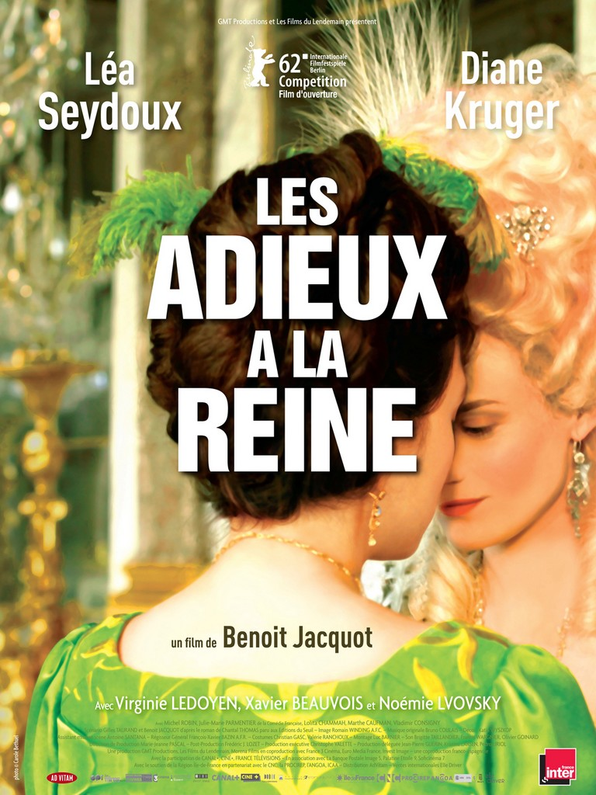
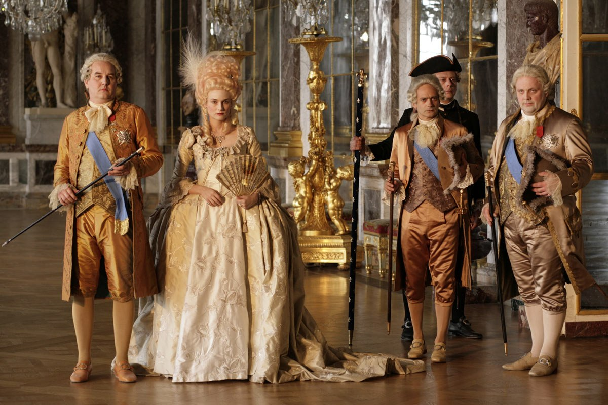
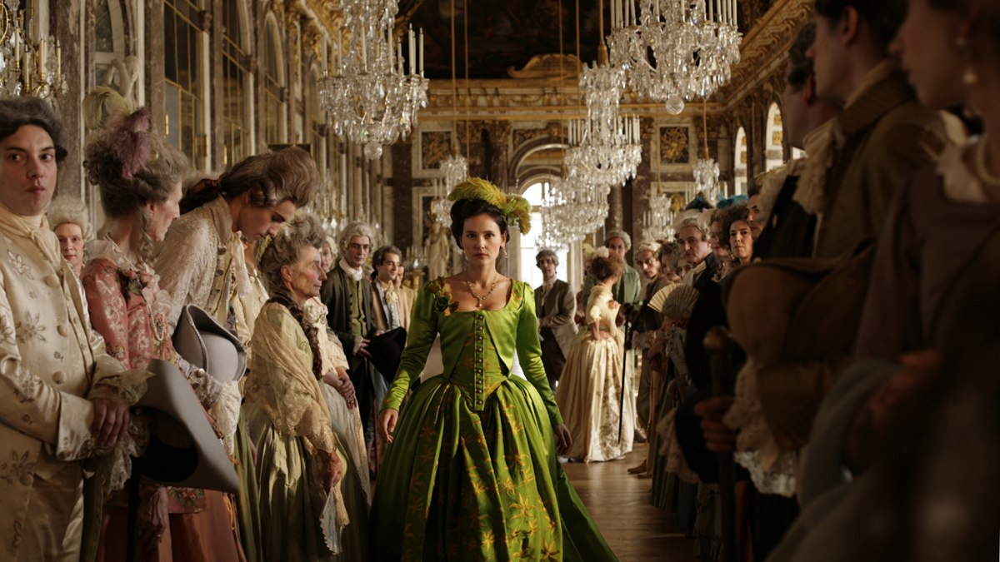

+++
type = "post"
titre = "Les Adieux à la reine, Benoit Jacquot"
title = "Les Adieux à la reine, Benoit Jacquot"
url = "/adieux-reine-jacquot"
date = "2012-04-04T00:19:34"
Lastmod = "2013-03-19T20:17:50"
cover = "adieux-reine-lea-seydoux.jpg"
categorie = [ "À voir" ]
tag = [ "Amour", "Drame", "Histoire", "Politique", "Société" ]
createur = [ "Benoît Jacquot" ]
acteur = [ "Diane Kruger", "Léa Seydoux", "Noémie Lvovsky", "Virginie Ledoyen", "Xavier Beauvois" ]
annee = [ "2012" ]
weight = 2012
pays = [ "France" ]

+++

La fin de la monarchie et de l&rsquo;Ancien Régime. Ce sujet passionnant a déjà motivé de nombreux cinéastes et c&rsquo;est au tour de Benoit Jacquot de poser ses caméras dans un Versailles déclinant avec <em>Les Adieux à la reine</em>. Fidèle à sa réputation, le réalisateur s&rsquo;intéresse d&rsquo;abord aux destins de femmes et il se concentre ainsi sur les trois derniers jours de la lectrice de la reine à Versailles. L&rsquo;épisode crucial de la Révolution française vécu depuis le château royal : tel est le choix de ce film et c&rsquo;est une franche réussite.

Marie-Antoinette est une figure symbolique de la Révolution française qui a fasciné et fascine encore. Devenue injustement célèbre pour sa remarque déplacée concernant le manque de pain en France, elle a fait l&rsquo;objet de nombreux films et <em>Les Adieux à la reine</em> s&rsquo;ajoute à la déjà <a href="http://fr.wikipedia.org/wiki/Marie-Antoinette_d%27Autriche#Filmographie">longue liste</a>. Le film adopte un point de vue très spécifique toutefois puisqu&rsquo;il suit les pas de Sidonie Laborde, une jeune femme qui fait la lecture à la reine. Totalement dévouée à sa maîtresse, elle décide de rester quand la Révolution française éclate et Benoit Jacquot s&rsquo;intéresse aux derniers jours qu&rsquo;elle passe auprès de la reine. Quelques jours pendant lesquels elle évoluera au cœur d&rsquo;une cour qui se délite, dans une période de troubles et de dangers ; quelques jours aussi pour faire ses adieux à la reine…

<em>Les Adieux à la reine</em> s&rsquo;ouvre sur une date : 14 juillet 1789. Tous les spectateurs comprennent immédiatement qu&rsquo;un des évènements les plus importants de l&rsquo;histoire de France est en cours. La prise de la Bastille par le peuple parisien : tout un symbole qui ouvre les hostilités et signe la fin de la monarchie et d&rsquo;une période historique. À Versailles toutefois, on ne se rend compte de rien, les informations circulent beaucoup moins vite et la cour n&rsquo;est pas informée de l&rsquo;évènement avant tard dans la nuit du 14 au 15 juillet. En attendant, l&rsquo;insouciance habituelle règne : la reine réfléchit à une nouvelle robe et on passe le temps dans les couloirs du château ou dans les allées de l&rsquo;immense jardin qui l&rsquo;entoure. Le faste versaillais n&rsquo;est déjà plus qu&rsquo;un souvenir, mais on fait comme si l&rsquo;âge d&rsquo;or de Louis XIV était toujours d&rsquo;actualité. À l&rsquo;extérieur, des hommes et des femmes espèrent obtenir quelque chose de la monarchie et les rats ont envahi les couloirs. Ces signes ne trompent pas, mais il n&rsquo;y a pas pire aveugle que celui qui ne veut pas voir : Benoit Jacquot transmet très bien la frivolité de cette noblesse qui ne veut rien entendre ni céder. Quand la nouvelle atteint enfin les grilles dorées du château, c&rsquo;est la panique générale : <em>Les Adieux à la reine</em> s&rsquo;accélère et l&rsquo;agitation est sensible. Les nobles courent partout à la recherche des serviteurs qui ont pris la fuite et s&rsquo;ils accourent encore pour voir le roi, ils songent aussi à sauver leur peau.

Ce film historique se veut fidèle à la réalité, mais il ne s&rsquo;agit pas d&rsquo;un prétexte à un cours : Benoit Jacquot a l&rsquo;excellente idée de se concentrer sur son personnage principal et sur une période très courte. <em>Les Adieux à la reine</em> offre ainsi un regard de l&rsquo;intérieur sur la Révolution française : on ne sait pas ce qui se passe à Paris, on n&rsquo;a que les échos angoissés des nobles et des serviteurs. Les informations ne sont d&rsquo;abord que rumeurs, bientôt recoupées pour devenir des informations. On vit par les yeux de la liseuse qui bénéficie d&rsquo;une position centrale, parfois même un peu trop avantageuse pour être réaliste. Qu&rsquo;à cela ne tienne, le cinéaste a réussi à maintenir le cap de son film et la réussite de ce dernier tient beaucoup à cette vision subjective. Plus que l&rsquo;histoire de la Révolution française, <em>Les Adieux de la reine</em> est une histoire de femmes. Marie-Antoinette fascine Benoit Jacquot autant que son personnage principal et il en dresse un portrait complexe, entre frivolité et sens politique. Contrairement aux apparences, l&rsquo;amour est au cœur du film : si la reine est si perturbée, ce n&rsquo;est pas tant par crainte des évènements politiques que par son amour fou et contrarié de la duchesse de Polignac. La dernière reine de France voudrait vivre en permanence avec la duchesse, mais cette dernière se fait désirer avant d&rsquo;être renvoyée de la cour pour sa propre protection. Cette décision est terrible pour Marie-Antoinette qui s&rsquo;effondre presque de douleur. Le film de Benoit Jacquot construit une sorte de triangle amoureux avec le personnage de Sidonie : la jeune liseuse admire la reine, mais c&rsquo;est plus que de l&rsquo;admiration, de l&rsquo;amour. L&rsquo;amour reste platonique dans <em>Les Adieux à la reine</em>, il est surtout très fort et assez beau et qu&rsquo;importe alors qu&rsquo;il soit <a href="http://fr.wikipedia.org/wiki/Les_Adieux_à_la_reine_(film)#Critiques">historiquement contestable</a>.

Benoit Jacquot a pris soin de filmer un Versailles réaliste, loin des clichés et donc loin de la vision de Sofia Coppola dans <em>Marie-Antoinette</em>. Les appartements de la reine sont très richement décorés, avec moult dorures, mais c&rsquo;est tout : le reste du château est constitué de couloirs dénudés, sombres et sales où s&rsquo;entassaient les plus grands nobles du pays dans le seul espoir de croiser le roi, de se montrer. <em>Les Adieux à la reine</em> montre bien l&rsquo;envers du décor et rappelle cette vérité qui peut surprendre aujourd&rsquo;hui : les nobles étaient à peine mieux logés que les serviteurs à leur service. La reconstitution est ainsi sobre, mais efficace et le film n&rsquo;en fait pas des tonnes dans le genre film à costumes. Il faut dire que son angle très précis lui permet de se concentrer sur quelques personnages et lieux et d&rsquo;éviter ainsi les gros décors et reconstitutions hollywoodiennes qui seraient certainement mal réalisés ici. <em>Les Adieux à la reine</em> est aussi un film d&rsquo;acteurs, ou plutôt d&rsquo;actrices : Diane Kruger interprète une Marie-Antoinette très réussie, tour à tour femme fragile et redoutable manipulatrice, mais c&rsquo;est surtout Léa Seydoux qui impressionne dans le rôle principal. On apprécie aussi particulièrement la présence de Noémie Lvovsky que l&rsquo;on retrouve avec plaisir après <em><a href="http://voiretmanger.fr/2011/10/02/apollonide-souvenirs-maison-close-bonello/">L&rsquo;Apollonide, souvenirs de la maison close</a></em>.

Benoit Jacquot a trouvé un angle original avec <em>Les Adieux à la reine</em>. En se concentrant sur une proche de Marie-Antoinette et sur les quelques jours qui suivent la prise de la Bastille, son film évite beaucoup de clichés et offre une vision réussie sur cette période trouble de l&rsquo;histoire de France. Au-delà même de la Révolution, <em>Les Adieux à la reine</em> évoque l&rsquo;amour au moins fraternel de trois femmes, une très belle histoire à ne pas rater.

<h3>Vous voulez m&rsquo;aider ?<a href="#footnote_0_6109" id="identifier_0_6109" class="footnote-link footnote-identifier-link" title="&Agrave; propos de la publicit&eacute;&hellip;">1</a></h3>
<ul>
<li><a href="http://www.amazon.fr/gp/product/B008FR3N04/ref=as_li_ss_tl?ie=UTF8&tag=leblogdenic07-21&linkCode=as2&camp=1642&creative=19458&creativeASIN=B008FR3N04">Acheter le film en Blu-Ray sur Amazon</a></li>
<li><a href="http://www.amazon.fr/gp/product/B008FR3MZU/ref=as_li_ss_tl?ie=UTF8&tag=leblogdenic07-21&linkCode=as2&camp=1642&creative=19458&creativeASIN=B008FR3MZU">Acheter le film en DVD sur Amazon</a></li>
<li><a href="https://itunes.apple.com/fr/movie/les-adieux-a-la-reine/id545130037">Acheter ou louer le film sur l&rsquo;iTunes Store</a></li>
</ul>

<ol class="footnotes"><li id="footnote_0_6109" class="footnote"><a href="http://voiretmanger.fr/soutien/">À propos de la publicité…</a> [<a href="#identifier_0_6109" class="footnote-link footnote-back-link">&#8617;</a>]</li></ol>
