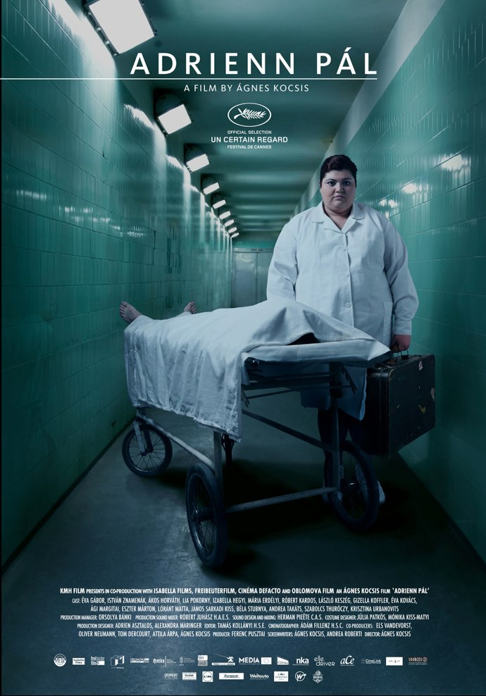
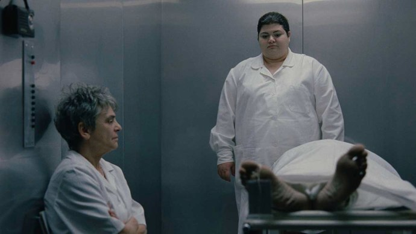

+++
titre = "Adrienn Pàl, Ágnes Kocsis"
title = "Adrienn Pàl, Ágnes Kocsis"
url = "/adrienn-pal-kocsis"
date = "2010-12-23T00:16:33"
Lastmod = "2012-07-13T10:40:31"
cover = "adrienn-pal-kocsis.jpg"
categorie = [ "À voir" ]
tag = [ "Arcs 2010", "Drame", "Festival", "Mémoire", "Mort" ]
createur = [ "Àgnes Kocsis" ]
annee = [ "2012" ]
weight = 2012
pays = [ "France", "Hongrie", "Pays-Bas" ]

+++

Adrienn Pàl est une personne mystérieuse qui n&rsquo;apparaîtra jamais à l&rsquo;écran pendant <em>Adrienn Pàl</em>, le dernier film d&rsquo;Àgnes Kocsis, ou alors seulement sous la forme de photographies. Elle est pourtant au centre des enjeux alors que Piroska, infirmière obèse, décide de partir à sa recherche, des années après l&rsquo;avoir perdue de vue. S&rsquo;ouvre alors un lent et contemplatif, beau et triste à la fois : un regard indéniablement intéressant.

Piroska est infirmière dans le service de soins palliatifs d&rsquo;un grand hôpital hongrois. Elle côtoie donc la mort au quotidien et s&rsquo;est forgé une carapace pour résister à cette situation professionnelle difficile. En fait, elle est devenue assez insensible à tout ce qui l&rsquo;entoure, sauf à tout ce qui peut satisfaire sa gourmandise. Le soir, elle indique combien de morts elle a eus dans la journée, comme si cette seule statistique résumait sa vie. Pendant son service, elle procure aux &laquo;&nbsp;patients&nbsp;&raquo; des soins attentionnés, mais assez froids : il est vrai qu&rsquo;en service palliatif, il ne fait jamais bon s&rsquo;attacher à un patient, puisque les changements sont fréquents. On assiste ainsi plusieurs fois au rituel : le massage cardiaque, le défibrillateur et le médecin qui déclare finalement la mort, le cas échéant. Puis Piroska descend dans l&rsquo;ascenseur qui l&rsquo;amène, en musique, au dernier sous-sol de l&rsquo;hôpital, directement dans la morgue. De nuit, elle fait le tour des lits avant de s&rsquo;asseoir devant de multiples écrans de contrôle qui affichent simplement les battements cardiaques des patients réduits à un simple numéro. Piroska peine à exprimer toute sensibilité, que ce soit avec les familles des malades, avec les malades eux-mêmes ou même avec la personne avec qui elle partage sa vie. Son visage reste figé en permanence, à peine pourra-t-on voir s&rsquo;esquisser un léger sourire de temps à autre. Elle ne pleure pas, mais semble en permanence triste, tout en n&rsquo;éprouvant rien de plus face à ce qui l&rsquo;entoure. Quand son compagnon la quitte, elle reste stoïque, imperturbable et se contente de ranger l&rsquo;appartement différemment. On aurait envie de la secouer, lui dire de se bouger, mais elle persiste dans sa boulimie et son immobilisme. Alors qu&rsquo;elle se met à la recherche d&rsquo;une ancienne amie d&rsquo;enfance perdue de vue depuis la primaire, elle reste toujours aussi insensible et molle. Elle le dit d&rsquo;ailleurs elle-même, elle ne sait pas au juste pourquoi elle cherche cette Adrienn, mais c&rsquo;est sans doute pour donner un peu de sens à sa vie par ailleurs bien vide…

Un film qui se déroule en partie dans le service des soins palliatifs d&rsquo;un hôpital a peu de chances d&rsquo;être très gai et <em>Adrienn Pàl</em> ne fait pas exception à cette généralité. Autant le dire, l&rsquo;ambiance est constamment plombée dans le film d&rsquo;Àgnes Kocsis et l&rsquo;on ne rit jamais. L&rsquo;image est aussi terne que peut l&rsquo;être un temps hongrois d&rsquo;automne et le visage de Piroska, quasiment toujours présent à l&rsquo;image, ne fait rien pour arranger les choses, bien au contraire. La mort est omniprésente dans le film, et pas seulement par les cadavres qui ponctuent régulièrement la vie à l&rsquo;hôpital. C&rsquo;est une morte qui suscite la quête d&rsquo;Adrienn puisque c&rsquo;est l&rsquo;arrivée dans le service d&rsquo;une femme nommée exactement comme l&rsquo;amie de Piroska qui réveille le souvenir de son existence en même temps que le regret de n&rsquo;avoir pas gardé contact. On note d&rsquo;ailleurs que c&rsquo;est la seule fois dans le film que l&rsquo;infirmière se réveille et court vers le lit de cette Adrienn pour vérifier si ce n&rsquo;est pas celle qu&rsquo;elle connaissait. La mort entoure aussi la disparition d&rsquo;Adrienn Pàl, dont la famille a disparu subitement, du jour au lendemain, sans que personne ne semble savoir pourquoi. Une Adrienn meure à l&rsquo;hôpital, une autre aussi est enterrée, mais trop jeune pour être celle qui est cherchée. Pis, plusieurs témoins de l&rsquo;époque semblent avoir oublié jusqu&rsquo;à l&rsquo;existence même de cette fille, comme si elle n&rsquo;avait en fait jamais existé et que Piroska l&rsquo;avait inventée. La mort est partout, mais la vie continue, comme en témoignent les rituels à l&nbsp;&raquo;hôpital, les pâtisseries que mange Piroska devant ses écrans de contrôle, la musique assourdissante qu&rsquo;écoute la dame de l&rsquo;ascenseur ou même les blagues échangées dans la morgue. Mais on a beau faire avec, la mort reste omniprésente et surtout elle est implacable : à un moment, Adrienn veille une malade dans un autre service de l&rsquo;hôpital et exprime sa joie de le faire en faisant simplement remarquer que cette malade avait au moins une chance de s&rsquo;en tirer. Quand on en est au stade des soins palliatifs, l&rsquo;espoir est plus difficile.

<em>Adrienn Pàl</em> n&rsquo;est pas qu&rsquo;un film sur la mort, c&rsquo;est aussi un film sur la mémoire. Les souvenirs de Piroska fournissent le moteur principal, pour ne pas dire unique, du film. Ils sont finalement assez flous : la jeune femme se souvient surtout qu&rsquo;elle avait sa meilleure amie en primaire, qu&rsquo;elle s&rsquo;appelait Adrienn et qu&rsquo;elle est partie sans prévenir un beau jour. Elle ne l&rsquo;a plus jamais revue et n&rsquo;en ressentait pas le besoin nécessairement, mais brusquement son souvenir la hante et elle veut renouer contact, ou au moins savoir ce qu&rsquo;elle est devenue. Commence alors une véritable enquête policière pendant laquelle Piroska appelle ses anciens camarades pour essayer d&rsquo;obtenir des informations et suit des pistes. Une piste la mène dans la campagne hongroise où Adrienn et sa famille ont vécu quelques années avant de repartir aussitôt, une autre la mènerait en Australie si elle la suivait. Au fil des rencontres, Piroska oublie vite pourquoi elle cherche Adrienn et se trouve surtout confrontée à d&rsquo;autres souvenirs bien différents des siens. Àgnes Kocsis montre bien comment la mémoire est toujours fragmentée et orientée : alors que Piroska se souvient d&rsquo;une jeune fille charmante qui était sa meilleure amie, d&rsquo;autres s&rsquo;en rappellent comme d&rsquo;une petite fille mauvaise et qui crachait sur Piroska. Qui a raison et qui a tort ? Le film a le bon sens de ne pas y répondre et de préférer au contraire l&rsquo;incertitude et le flou de la mémoire. C&rsquo;est une très belle illustration de ce qu&rsquo;est la mémoire qui n&rsquo;atteint, certes, pas le niveau de la réflexion proustienne, mais s&rsquo;avère quand même fine et fort intéressante.

À l&rsquo;image de son héroïne, <em>Adrienn Pàl</em> est un film contemplatif et lent. Les plans fixes sont omniprésents : presque uniques dans le film, ils ne mettent que mieux en valeur les quelques travellings d&rsquo;Àgnes Kocsis. Le plus souvent néanmoins, la réalisatrice pose sa caméra et laisse à ses personnages tout le temps d&rsquo;évoluer dans le cadre. Les plans sont composés soigneusement et certains s&rsquo;avèrent magnifiques, avec un rôle important accordé à la géométrie et aux symétries. L&rsquo;ensemble est vraiment élégant et plaisant, pour peu que la lenteur du film n&rsquo;effraie pas. La réussite d&rsquo;<em>Adrienn Pàl</em> provient aussi de son interprète principal. Et pourtant, Lia Pokorny n&rsquo;est pas une actrice professionnelle, elle travaille d&rsquo;ailleurs pour un opérateur téléphonique local : sa performance d&rsquo;actrice est d&rsquo;autant plus impressionnante. Àgnes Kocsis complète l&rsquo;ensemble par un rôle très particulier accordé à la musique. Rare, elle éclate avec force quand elle apparaît, notamment les extraits d&rsquo;opéra écoutés par le compagnon de Piroska alors qu&rsquo;il complète son énorme maquette de train. Si la musique se fait rare, le film n&rsquo;est pas muet : il y a la radio dans l&rsquo;ascenseur, il y a aussi les &laquo;&nbsp;bips&nbsp;&raquo; des écrans de contrôle qui offrent un concert très simple, mais assez impressionnant.

Lent et plutôt sombre, <em>Adrienn Pàl</em> n&rsquo;est pas un film forcément réjouissant. Pourtant, c&rsquo;est loin d&rsquo;être un film sans intérêt : pour peu que l&rsquo;on accepte son rythme assez lent et son ambiance plutôt noire, le film d&rsquo;Àgnes Kocsis se révèle au contraire passionnant. On se laisse porter par cette actrice assez extraordinaire et  on espère comme elle retrouver les traces d&rsquo;Adrienn. Le film est en outre fort intéressant à la fois sur la mémoire et sur la Hongrie. Bref, <em>Adrienn Pàl</em> n&rsquo;est peut-être pas un film très simple d&rsquo;accès, mais qui mérite notre effort.

<em>Sortie en salles le 25 juillet 2012</em>

