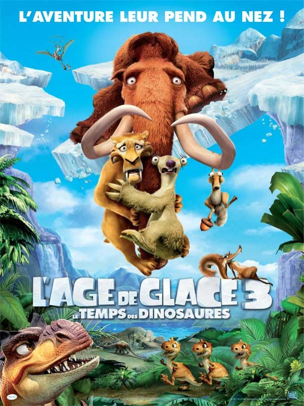
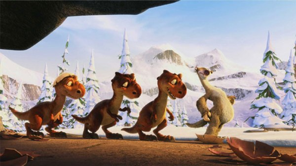

+++
type = "post"
titre = "L&rsquo;Âge de Glace 3 : le temps des dinosaures"
title = "L'Âge de Glace 3 : le temps des dinosaures"
url = "/age-de-glace-3-temps-dinosaures"
date = "2009-07-04T00:48:23"
Lastmod = "2014-12-26T18:33:25"
cover = "age-de-glace-31.jpg"
categorie = [ "À voir" ]
tag = [ "Animation", "Humour" ]
createur = [ "Carlos Saldanha" ]
annee = [ "2009" ]
weight = 2009
saga = [ "L'âge de glace" ]
pays = [ "États-Unis" ]

+++

Le premier <em>Âge de Glace</em>, sorti en 2002, avait surpris par un principe vieux comme le monde (des animaux qui parlent et agissent comme des hommes) troublé par un humour plein de clins d&rsquo;œil compris par les parents qui pouvaient enfin amener leur progéniture sans s&rsquo;ennuyer ferme pendant une heure trente. Deux films après, le constat s&rsquo;impose : cette formule depuis mille fois utilisée, fonctionne encore à plein dans ce troisième opus. <em>L&rsquo;Âge de Glace 3 : le temps des dinausores</em> réussit en gros à éviter la lassitude des séries, surtout quand il s&rsquo;agit de séries de films d&rsquo;animation.

Sur ce point, le film commence plutôt mal et laisse un peu entrevoir le pire. Comme le <a href="http://www.toujoursraison.com/2009/06/lage-de-glace-3-le-temps-des-dinosaures.html">résume</a> très bien Rob Gordon, ce troisième épisode correspond à l&rsquo;âge de la maturité, celui de l&rsquo;âge adulte, celui de la formation d&rsquo;une famille avec la maternité ou paternité, ou celui de l&rsquo;exil. Les mammouths attendent un enfant, et Manny devient un vrai papa poule. Diego ne veut pas de cette vie, se sent seul et veut tout quitter. Sid entre les deux ne sait pas bien que faire, et prise d&rsquo;une crise de maternité aiguë, se met en tête d&rsquo;adopter trois œufs. Le titre ne laisse aucun doute, il s&rsquo;agit bien d&rsquo;œufs de dinosaures et autant dire que la maman biologique ne sera pas contente du tout.

Le film, dans un second temps, se transforme en une sorte de <em>Voyage au centre de la terre</em> revisité, mais très proche de l&rsquo;original : un monde souterrain, insoupçonné depuis la surface, où vivent encore les énormes monstres du passé. L&rsquo;intrigue est on ne peut plus simple, il faut sauver ce malheureux Sid, véritable boulet du film, interprété par un excellent Élie Sémoun en VF. Nos héros vont évidemment tout faire pour sauver le maladroit inconscient, et devinez quoi, ils réussissent.

On peut sentir une certaine lassitude, qui est un peu celle que j&rsquo;ai ressentie sur le moment. Mais finalement, la sauce prend, en tout cas elle a pris pour moi et je dois dire que le bilan du film est plutôt positif. La bonne idée du film est de laisser beaucoup plus de place aux personnages secondaires, d&rsquo;autant plus s&rsquo;ils sont complètement barges. Ainsi, Buck, fouine qui chasse les dinosaures comme Achab chasse Moby Dick<a href="#footnote_0_1594" id="identifier_0_1594" class="footnote-link footnote-identifier-link" title="J&rsquo;aurais aim&eacute; en &ecirc;tre l&rsquo;auteur, mais &ccedil;a vient de T&eacute;l&eacute;rama&hellip;">1</a> est une excellente idée et ses récits sont à chaque fois d&rsquo;excellents moments de n&rsquo;importe quoi.

La plus grande place laissée à Sid par rapport à ses deux compagnons est aussi une bonne chose et permet de laisser libre cours aux bêtises en série de ce personnage drôle et très attachant. Son rôle de mère adoptive pour un trio de dinosaures est bien vu et offre les scènes les plus cocasses du film, surtout quand la mère biologique entre en scène. Et quand le bébé mammouth entre en scène, on prend alors conscience de l&rsquo;énorme gouffre d&rsquo;intérêt qu&rsquo;il y a entre ce bébé tout mignon et sans intérêt, et des dinosaures à qui Sid essaie d&rsquo;enseigner les joies du régime végétarien&#8230; (mais à entendre les réactions de la salle, le bébé mammouth était nécessaire pour obtenir les &laquo;&nbsp;oooh, trop mignon !&nbsp;&raquo;).

Évidemment, le vrai héros de <em>L&rsquo;Âge de Glace 3</em>, sa vraie et seule star, c&rsquo;est Scrat, l&rsquo;écureuil en perpétuelle quête de son gland (ou sa noisette). Au fil des films, il prend toujours plus de place et ici, forme une vraie intrigue secondaire et parallèle. Une intrigue amoureuse, car, nouveauté de cet opus, il y a aussi &laquo;&nbsp;une Scrat&nbsp;&raquo; dont il tombe immédiatement amoureux, mais qui va aussi lui poser moult problèmes tournant autour d&rsquo;un seul problème : elle, ou la noisette ? Épineux problème, on s&rsquo;en doute, qui relance à la fois la quête infinie, tout en évitant, là encore, la redite.

Je ne vais pas m&rsquo;étendre plus avant. Soyons honnêtes, <em>L&rsquo;Âge de glace 3</em> n&rsquo;est nullement le film du siècle, ni même de l&rsquo;année. Mais dans le genre &laquo;&nbsp;animaux qui parlent&nbsp;&raquo;, on ne fait toujours pas mieux et pour un film de vacances (eh oui !), c&rsquo;est parfait. On passe un excellent moment, à rire le plus souvent avec toujours un savant mélange entre comique pour les plus jeunes (souvent des gags de situation) et références ou clins d&rsquo;œil pour les plus âgés.

<strong>À lire aussi</strong> : outre les critiques de <a href="http://www.toujoursraison.com/2009/06/lage-de-glace-3-le-temps-des-dinosaures.html">Rob Gordon</a> ou <em><a href="http://www.telerama.fr/cinema/films/l-age-de-glace-3-le-temps-des-dinosaures,386555,critique.php">Télérama</a></em> citées précédemment, signalons celle des <a href="http://www.lesinrocks.com/cine/cinema-article/t/1246027620/article/lage-de-glace-3-le-temps-des-dinosaures/"><em>Inrockuptibles</em></a>.

<h3>Vous voulez m&rsquo;aider ?<a href="#footnote_1_1594" id="identifier_1_1594" class="footnote-link footnote-identifier-link" title="&Agrave; propos de la publicit&eacute;&hellip;">2</a></h3>
<ul>
<li><a href="http://www.amazon.fr/gp/product/B002HMC17Y/ref=as_li_ss_tl?ie=UTF8&tag=leblogdenic07-21&linkCode=as2&camp=1642&creative=19458&creativeASIN=B002HMC17Y">Acheter le film en Blu-Ray sur Amazon</a></li>
<li><a href="http://www.amazon.fr/gp/product/B002HMC17O/ref=as_li_ss_tl?ie=UTF8&tag=leblogdenic07-21&linkCode=as2&camp=1642&creative=19458&creativeASIN=B002HMC17O">Acheter le film en DVD sur Amazon</a></li>
<li><a href="http://www.amazon.fr/gp/product/B002HMC188/ref=as_li_ss_tl?ie=UTF8&tag=leblogdenic07-21&linkCode=as2&camp=1642&creative=19458&creativeASIN=B002HMC188">Acheter la trilogie en DVD sur Amazon</a> (<a href="http://www.amazon.fr/gp/product/B002HMC18I/ref=as_li_ss_tl?ie=UTF8&tag=leblogdenic07-21&linkCode=as2&camp=1642&creative=19458&creativeASIN=B002HMC18I">en Blu-Ray</a>)</li>
</ul>

<ol class="footnotes"><li id="footnote_0_1594" class="footnote">J&rsquo;aurais aimé en être l&rsquo;auteur, mais ça vient de <em><a href="http://www.telerama.fr/cinema/films/l-age-de-glace-3-le-temps-des-dinosaures,386555,critique.php">Télérama</a></em>&#8230; [<a href="#identifier_0_1594" class="footnote-link footnote-back-link">&#8617;</a>]</li><li id="footnote_1_1594" class="footnote"><a href="/a-propos/publicite/">À propos de la publicité…</a> [<a href="#identifier_1_1594" class="footnote-link footnote-back-link">&#8617;</a>]</li></ol>
