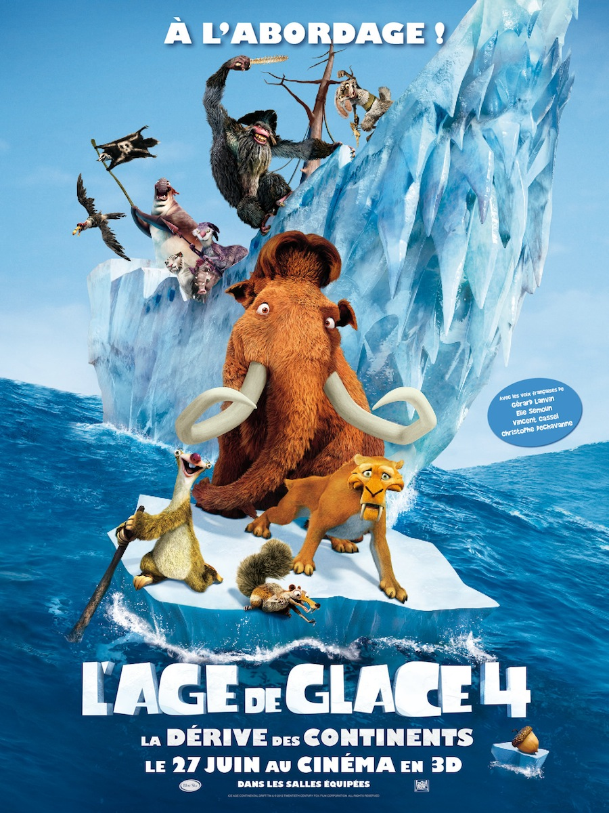
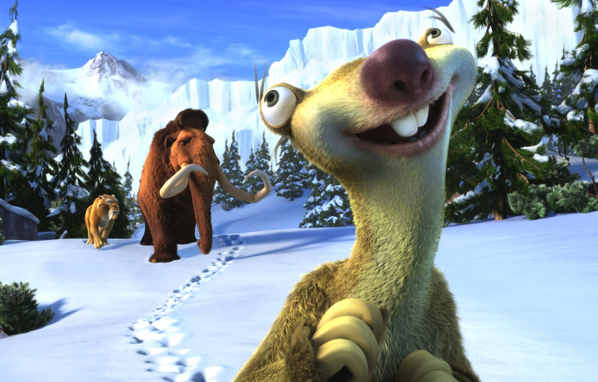
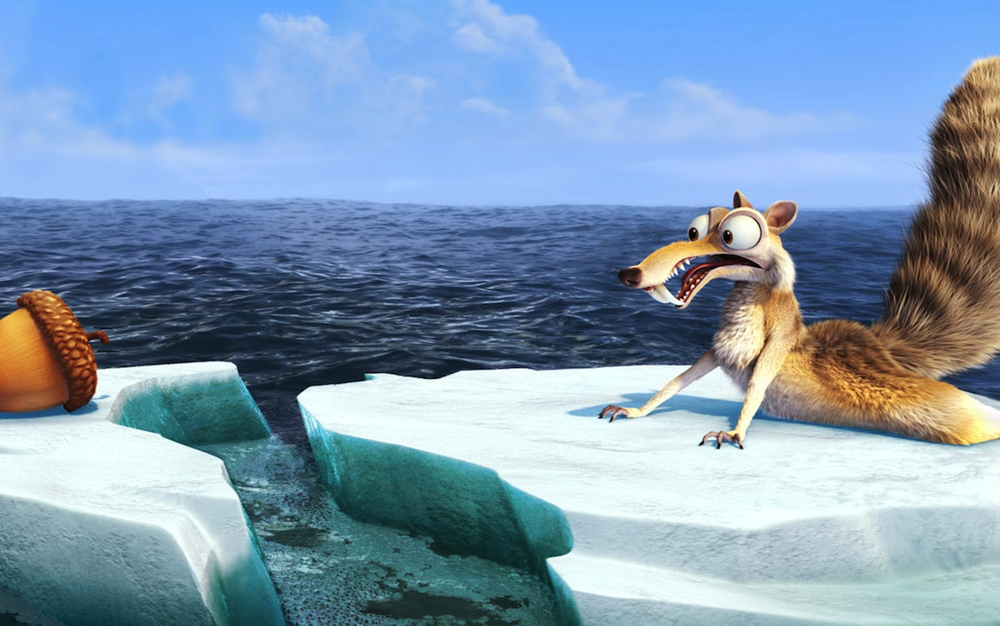

+++
type = "post"
titre = "<em>L&rsquo;Âge de glace 4 : La dérive des continents</em>, Steve Martino et Mike Thurmeier"
title = "L'Âge de glace 4 : La dérive des continents, Steve Martino et Mike Thurmeier"
url = "/age-glace-4-derive-continents-martino-thurmeier"
date = "2012-06-28T00:04:23"
Lastmod = "2015-04-05T20:14:22"
cover = "age-de-glace-4-thurmeier-martino.jpg"
categorie = [ "À voir" ]
tag = [ "Animation", "Animaux", "Famille", "Humour", "Pirates", "Vite oublié" ]
createur = [ "Mike Thurmeier", "Steve Martino" ]
annee = [ "2012" ]
weight = 2012
saga = [ "L'âge de glace" ]
pays = [ "États-Unis" ]
original = "Ice Age: Continental Drift"

+++

On ne change pas une équipe qui gagne : la saga <em>L&rsquo;Âge de glace</em> continue avec un nouvel épisode. Le tout premier avait surpris par un ton décalé qui était alors nouveau, le second tenait la comparaison et même si <a title="L’Âge de Glace 3 : le temps des dinosaures" href="/2009/07/04/age-de-glace-3-temps-dinosaures/"><em>L’Âge de Glace 3 : le temps des dinosaures</em></a> commençait à montrer des signes de faiblesse, il restait une comédie honorable et parvenait à renouveler l&rsquo;idée de départ. On n&rsquo;en dira malheureusement pas autant de <em>L&rsquo;Âge de glace 4 : La dérive des continents</em> qui commence bien, mais finit vite lui aussi à la dérive. Ce sera parfait pour occuper des enfants le temps de la séance, mais guère plus.

L&rsquo;opus précédent avait parodié Jules Vernes en plongeant les personnages de la saga dans un univers souterrain peuplé de dinosaures. Que pouvait-on dès lors inventer de plus ? <em>L&rsquo;Âge de glace 4 : La dérive des continents</em> commence avec une idée originale et amusante : Scrat, le fameux écureuil à qui la saga doit tant est toujours à la poursuite de sa noisette. En la posant, il crée un trou si profond qu&rsquo;il tombe jusqu&rsquo;au cœur de la Terre qui est, comme chacun sait, une boule noire. En courant après sa noisette, il fait tourner la planète si rapidement que l&rsquo;unique continent qui s&rsquo;y trouvait se disloque pour former les cinq continents tels qu&rsquo;on les connait encore aujourd&rsquo;hui. Cette introduction posée, l&rsquo;intrigue principale du film peut commencer. On retrouve les animaux habituels, ils sont désormais en famille et ils doivent à nouveau se déplacer alors que leur espace de vie se transforme en océan. Dans l&rsquo;affaire, l&rsquo;inséparable trio des débuts — Manny le mammouth, Diego le tigre et Sid le paresseux, se retrouve séparé du reste des troupes et notamment de la femme et de la fille du pachyderme. Manny va alors mettre tout en œuvre pour retrouver sa famille, même s&rsquo;il doit traverser les océans pour cela…

L&rsquo;ambiance spécifique à la saga n&rsquo;a pas été perdue avec ce quatrième épisode et <em>L&rsquo;Âge de glace 4 : La dérive des continents</em> s&rsquo;avère également très efficace. L&rsquo;humour qui faisait mouche jusque-là n&rsquo;a pas disparu et le film reste très plaisant à regarder. Steve Martino et Mike Thurmeier ont essayé d&rsquo;apporter un peu de nouveauté avec quelques personnages secondaires de plus : la fille de Manny a grandi, c&rsquo;est maintenant une adolescente un peu rebelle ; Sid retrouve aussi sa grand-mère, une vieille paresseuse édentée et têtue comme une mule. Le troisième opus était consacré aux dinosaures, on peut résumer celui-ci aux pirates : les animaux doivent en effet affronter un terrifiant singe et sa troupe composée de bestioles aussi répugnantes que dangereuses. Cette galerie de personnages renouvelle un peu les enjeux du film et ils permettent à <em>L&rsquo;Âge de glace 4 : La dérive des continents</em> de rester un petit peu plus adulte que les autres films d&rsquo;animations à base d&rsquo;animaux parlants. N&rsquo;exagérons rien, ce long-métrage reste parfaitement calibré pour les enfants, mais on sent que ses concepteurs ont cherché un peu de maturité. La présence la fille adolescente de Manny donne une idée assez précise du cœur de cible du film : plutôt que les enfants, ce sont les jeunes ados de 10 à 15 ans qui sont d&rsquo;abord visés.

L&rsquo;ensemble fonctionne donc et on passe un moment plaisant, mais <em>L&rsquo;Âge de glace 4 : La dérive des continents</em> est une suite aussi paresseuse que peut l&rsquo;être l&rsquo;un de ses personnages principaux, et cela se voit. Il est certes difficile de suivre trois films d&rsquo;une saga avec autant de fraicheur que la première fois, mais Steve Martino et Mike Thurmeier ne donnent pas le sentiment d&rsquo;avoir particulièrement cherché à faire mieux… Le scénario n&rsquo;est jamais très original dans ce type de films et ce n&rsquo;est pas gênant en soi, mais il est ici sur des rails et il est si prévisible qu&rsquo;il en devient lassant. Quand la famille de Manny est séparée après quelques minutes, on comprend immédiatement tout ce qui va suivre et <em>L&rsquo;Âge de glace 4 : La dérive des continents</em> n&rsquo;apporte désespérément aucune surprise. Même les petits ajouts par rapport aux films précédents, la touche de piraterie par exemple ou encore la grand-mère de Sid, même ces nouveautés ne sont pas correctement exploitées et finissent toutes à l&rsquo;eau. La preuve incontestable que la licence est à bout de souffle dans ce quatrième long-métrage ? Même le personnage de Scrat qui provoquait d&rsquo;habitude le plus de rires et qui fournissait incontestablement les meilleurs moments de <em>L&rsquo;Âge de glace</em> n&rsquo;est plus aussi drôle… Ce personnage n&rsquo;a pas été assez renouvelé et le clin d&rsquo;œil au film précédent ainsi que la fin bien vue mis à part, il ne fait plus rire et s&rsquo;avère trop prévisible. À l&rsquo;image de Scrat, <em>L&rsquo;Âge de glace 4 : La dérive des continents</em> fait sourire, mais les rires se font trop rares : tout a déjà été vu et revu…

La paresse du scénario retrouve celle de la réalisation. Steve Martino et Mike Thurmeier n&rsquo;ont pas fait un mauvais travail, la 3D gadget est bien utilisée et elle est assez efficace, mais on est loin, si loin du niveau de Pixar ou même des précédents films dans la saga. <em>L&rsquo;Âge de glace 4 : La dérive des continents</em> se contente de poser sa caméra virtuelle là où c&rsquo;est le plus simple, parfois là où la 3D fait le meilleur effet. L&rsquo;animation proprement dite est impeccable, mais c&rsquo;est bien le minimum en 2012 et ça n&rsquo;est plus suffisant depuis longtemps. La fin est à nouveau ouverte et peut laisser attendre une nouvelle suite. Si c&rsquo;est le cas, on ne peut que souhaiter aux scénaristes d&rsquo;être plus inspirés…

<em>L&rsquo;Âge de glace 4 : La dérive des continents</em> n&rsquo;est un mauvais film, le dernier épisode de la saga glacée reste un long-métrage d&rsquo;animation plaisant et parfait pour une séance en famille. Cela ne suffit plus néanmoins : le travail réalisé par Steve Martino et Mike Thurmeier est trop paresseux et on sourit désormais plus qu&rsquo;on ne rit. Même le personnage de Scrat n&rsquo;est plus aussi drôle qu&rsquo;avant, c&rsquo;est dire !

<h3>Vous voulez m&rsquo;aider ?</h3>
<ul>
<li><a href="http://www.amazon.fr/gp/product/B007WQG3IS/ref=as_li_ss_tl?ie=UTF8&tag=leblogdenic07-21&linkCode=as2&camp=1642&creative=19458&creativeASIN=B007WQG3IS">Acheter le film en Blu-Ray sur Amazon</a></li>
<li><a href="http://www.amazon.fr/gp/product/B002L70WOO/ref=as_li_ss_tl?ie=UTF8&tag=leblogdenic07-21&linkCode=as2&camp=1642&creative=19458&creativeASIN=B002L70WOO">Acheter le film en DVD sur Amazon</a></li>
<li><a href="https://itunes.apple.com/fr/movie/lage-glace-4-la-derive-des/id560707270">Acheter ou louer le film sur l&rsquo;iTunes Store</a></li>
</ul>
<ul>
<li><a href="http://www.amazon.fr/gp/product/B008YISN2M/ref=as_li_ss_tl?ie=UTF8&tag=leblogdenic07-21&linkCode=as2&camp=1642&creative=19458&creativeASIN=B008YISN2M">Acheter la saga complète en Blu-Ray sur Amazon</a></li>
<li><a href="http://www.amazon.fr/gp/product/B008YISMX2/ref=as_li_ss_tl?ie=UTF8&tag=leblogdenic07-21&linkCode=as2&camp=1642&creative=19458&creativeASIN=B008YISMX2">Acheter la saga complète en DVD sur Amazon</a></li>
</ul>

