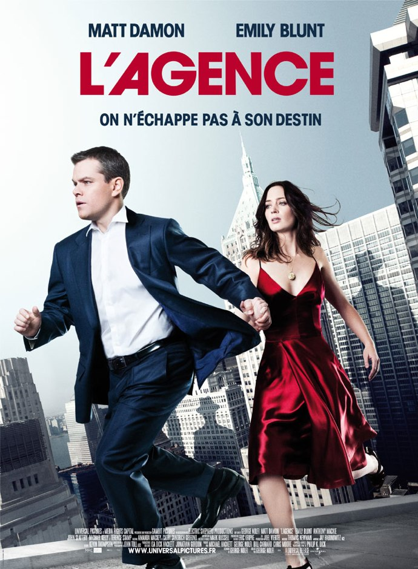
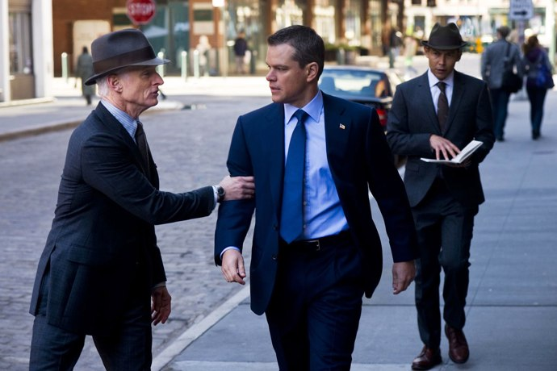
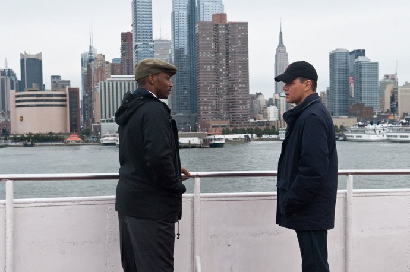

+++
type = "post"
titre = "L&rsquo;Agence, George Nolfi"
title = "L'Agence, George Nolfi"
url = "/agence-nolfi"
date = "2011-03-21T23:37:49"
Lastmod = "2011-03-21T23:42:31"
cover = "nolfi-agence-matt-damon-emily-blunt.jpg"
categorie = [ "À voir" ]
tag = [ "Amour", "Comédie romantique", "Humour", "Science-Fiction", "Vite oublié" ]
createur = [ "George Nolfi" ]
acteur = [ "Emily Blunt", "Matt Damon" ]
annee = [ "2011" ]
weight = 2011
pays = [ "États-Unis" ]

+++

Voilà un film sorti un peu de nulle part. Avec un titre aussi banal, un réalisateur au nom encore inconnu, il fallait au moins la présence d&rsquo;une star de la carrure de Matt Damon pour attirer l&rsquo;attention. <em>L&rsquo;Agence</em> n&rsquo;est pourtant pas né de nulle part : George Nofli, l&rsquo;homme derrière la caméra et le scénario, a déjà écrit le scénario de <em>La Vengeance dans la peau</em>, le troisième volet de la célèbre trilogie Jason Bourne, ou encore d&rsquo;<em>Ocean&rsquo;s Twelve</em>. <em>L&rsquo;agence</em> n&rsquo;est pourtant pas une redite, c&rsquo;est au contraire un film original et assez inclassable, une comédie romantique teintée de science-fiction ou plutôt de fantastique, le tout sur le ton assez léger de la comédie. Un film frais et plaisant.

<a href="http://www.allocine.fr/film/fichefilm_gen_cfilm=144404.html">

</a>

&nbsp;

&nbsp;

Difficile d&rsquo;évoquer l&rsquo;histoire de <em>L&rsquo;agence</em> sans trop en dévoiler et même si le scénario n&rsquo;est pas nécessairement des plus originaux, sa découverte fait partie du plaisir du film. Disons quand même que l&rsquo;agence dont il est question, le bureau des ajustements en VO, s&rsquo;occupe de veiller à la réalisation d&rsquo;un Plan qui dépasse les hommes et qui les dirige. L&rsquo;humanité a une tendance naturelle à dévier du Plan et à faire n&rsquo;importe quoi, si bien que l&rsquo;agence veille à la remettre sur les rails de temps à autre. Précisons d&rsquo;emblée que le film est adapté d&rsquo;une nouvelle de Philip K. Dick, célèbre auteur de science-fiction qui a inspiré un grand nombre de films ces dernières années, et que son principe de base est la concrétisation de l&rsquo;idée de Dieu. Nous pensons être gouvernés par des choix et notre libre arbitre, mais en fait nous suivons une voie écrite à l&rsquo;avance pour nous et que l&rsquo;on suivra nécessairement. Des hommes en noirs et en chapeau sont chargés de veiller au bon suivi des choses dans le monde et nous ne sommes jamais censés les rencontrer, ou même imaginer leur existence.

Malheureusement, le Plan finit toujours par se heurter sur un grain de sable. En l&rsquo;occurrence un homme, David Norris, en course pour les élections de député à New York quand commence le film. En l&rsquo;occurrence aussi une femme, Elise, qui va tout bousculer. Entre les deux, c&rsquo;est le coup de foudre immédiat et sans équivoque, mais le Plan n&rsquo;avait pas prévu qu&rsquo;il devait vivre ensemble. Commence alors une longue course-poursuite entre l&rsquo;Agence et David, le second tentant par amour de déjouer les plans du premier. Au passage, le spectateur aura l&rsquo;occasion d&rsquo;en apprendre plus sur cette organisation bureaucratique qui a la saveur du complot international et la patine du temps puisqu&rsquo;elle existe depuis la nuit des temps, tout de même. Cette représentation d&rsquo;une force immanente est plutôt amusante et participe au plaisir de <em>L&rsquo;Agence</em>. Ces hommes très sérieux dans leurs costumes sombres qui utilisent des carnets de papier où l&rsquo;encre bouge (comme dans <em><a href="/tag/harry-potter/">Harry Potter</a></em>), qui se déplacent de lieu en lieu en utilisant des portes (comme dans <em><a href="/2011/01/02/trilogie-matrix-wachowski/">Matrix</a></em>) et qui effacent la mémoire des témoins gênants (comme dans <em>Men In Black</em>) sont beaucoup trop sérieux pour ne pas être comiques. Mieux vaut, en tout cas, ne pas prendre <em>L&rsquo;Agence</em> trop au sérieux, tant les incohérences apparaîtront vite (ils sont omnipotents et omniscients quand ça les arrange…), mais le film est vraiment trop léger dans son ensemble pour être pris totalement au sérieux.

C&rsquo;est sans doute la force de George Nolfi, d&rsquo;avoir pris cette histoire assez surréaliste avec légèreté. On pourrait craindre le pire à la lecture du synopsis, mais le film s&rsquo;avère finalement assez drôle, alors qu&rsquo;il hésite entre plusieurs genres. S&rsquo;il commence comme un thriller, il passe ensuite par plusieurs stades, le fantastique notamment, pour finir clairement sur la comédie romantique. Cet aspect risque de déplaire, mais on peut aussi considérer que <em>L&rsquo;Agence</em> fait un choix assez osé en montrant d&rsquo;une part une agence omnisciente avec un sérieux beaucoup trop complet pour ne pas être suspect et d&rsquo;autre part une histoire d&rsquo;amour fou qui concentre tous les clichés de la comédie romantique, jusqu&rsquo;à passer par le toit d&rsquo;un building au-dessus de New York. Alors certes, l&rsquo;histoire contenait plus d&rsquo;enjeux qui ont été éliminés au passage, certes l&rsquo;aspect philosophique de <em>L&rsquo;Agence</em> a été évincé à sa plus simple expression (l&rsquo;amour plus fort que le destin ?), mais peu importe. George Nolfi ne veut pas d&rsquo;un film aussi ambitieux, il se contente de filmer son histoire avec légèreté et c&rsquo;est très efficace et souvent drôle.

Si <em>L&rsquo;Agence</em> est aussi plaisant, c&rsquo;est indéniablement grâce à son scénario et notamment ses dialogues entre le héros et l&rsquo;Agence. La réalisation n&rsquo;est pas en reste : même si elle ne fait pas d&rsquo;étincelles, elle parvient à maintenir une certaine excitation et le passage d&rsquo;un environnement à l&rsquo;autre par les portes est bien amené. Mais la réussite du film tient également dans son héros et son interprète. Matt Damon est  très bien (à défaut d&rsquo;être brillant) dans ce rôle d&rsquo;homme politique qui se rebelle contre le destin. On sent que l&rsquo;acteur s&rsquo;est amusé et il partage son plaisir. Emily Blunt n&rsquo;est pas en reste à ses côtés, mais les &laquo;&nbsp;méchants&nbsp;&raquo; sont comme souvent plus intéressants encore dans leur cynisme et leur vision du monde que ne renierait sans doute pas Woody Allen.

À l&rsquo;heure des bilans, difficile de dire pourquoi précisément ce film a pu plaire. <em>L&rsquo;Agence</em> est sans doute sauvé par sa manière d&rsquo;aborder un sujet en apparence très sérieux avec une désinvolture manifeste, prenant à la légère ce qui aurait pu être traité en profondeur. George Nolfi aurait pu faire un film très différent, pour sûr, mais il n&rsquo;est pas dit qu&rsquo;il aurait été meilleur. À la place, <em>L&rsquo;Agence</em> est un film efficace, frais et plaisant, un film qui ne fera peut-être pas date, mais qui est parfait pour une soirée agréable au cinéma.

