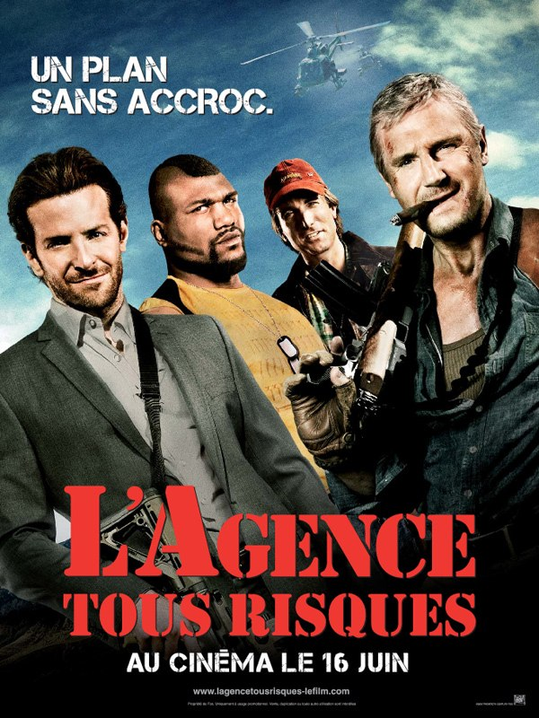
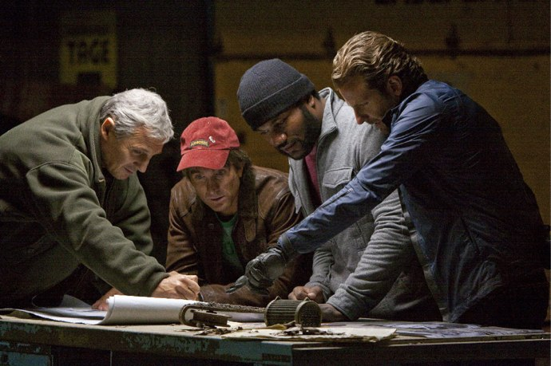
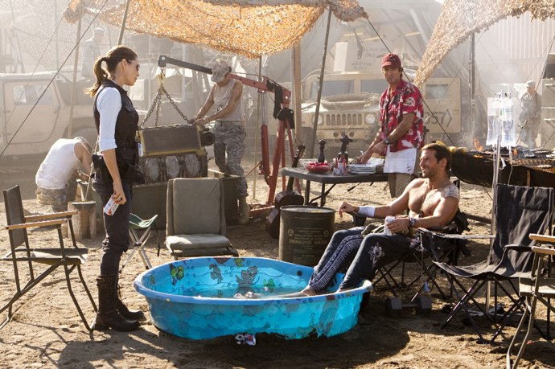

+++
type = "post"
titre = "L&rsquo;Agence tous risques,  Joe Carnahan"
title = "L'Agence tous risques,  Joe Carnahan"
url = "/agence-tous-risques-carnahan"
date = "2010-06-16T00:35:12"
Lastmod = "2013-02-17T10:01:38"
cover = "agence-tous-risques.jpg"
categorie = [ "À voir" ]
tag = [ "Action", "Blockbuster", "Humour", "Vite oublié" ]
createur = [ "Joe Carnahan" ]
acteur = [ "Bradley Cooper", "Liam Neeson" ]
annee = [ "2010" ]
weight = 2010
pays = [ "États-Unis" ]
original = "The A-Team"

+++

La saison des blockbusters estivaux approche ! Premier signe avant-coureur avec <em>L&rsquo;Agence tous risques</em>, film à grand spectacle teinté d&rsquo;un humour hérité de la <a href="http://fr.wikipedia.org/wiki/Agence_tous_risques">série américaine</a> qui a traversé les années 1980. Disons-le d&rsquo;emblée, j&rsquo;ignorais tout de la série, jusqu&rsquo;à son existence d&rsquo;ailleurs. Je ne m&rsquo;attendais donc à pas grand-chose en allant voir <em>L&rsquo;Agence tous risques</em> version moderne et grand écran.  J&rsquo;ai vu un grand spectacle, un blockbuster qui n&rsquo;a pour lui ni finesse psychologique, ni légèreté, mais le charme des séries à l&rsquo;ancienne et un humour simple, le tout sur un fond d&rsquo;action ultra efficace. Fun, et vite oublié.

La série originale mettait en scène quatre vétérans de la guerre du Vietnam injustement condamnés et devenus mercenaires hors-la-loi prêts à sauver la veuve et l&rsquo;orphelin quiconque serait dans le besoin. Les épisodes étaient manifestement <a href="http://fr.wikipedia.org/wiki/Agence_tous_risques#.C3.89pisode_type">très formatés</a>, avec un rituel bien établi et une mission résolue à chaque fois par la fameuse phrase du colonel Hannibal, &laquo;&nbsp;<em>I love it when a plan comes together</em>&nbsp;&raquo;<a href="#footnote_0_3448" id="identifier_0_3448" class="footnote-link footnote-identifier-link" title="&laquo;&nbsp;J&rsquo;adore qu&rsquo;un plan se d&eacute;roule sans accroc !&nbsp;&raquo; en VF">1</a>. Une structure courante dans les séries à l&rsquo;ancienne où l&rsquo;intérêt n&rsquo;était pas de développer une histoire complète, mais où l&rsquo;historie n&rsquo;était qu&rsquo;un prétexte à développer des épisodes. <em>L&rsquo;Agence tous risques</em> sur grand écran ne reprend bien évidemment pas cette structure qui aurait du mal à convenir à un film de quasiment deux heures. Mais l&rsquo;idée de la série a été conservée, de même que sa structure en un sens puisque le film peut se résumer à une succession de missions que doivent réaliser les quatre compères de l&rsquo;équipe.

La mode du moment, dans la grande famille des blockbusters, semble être la genèse. Après <em><a href="http://voiretmanger.fr/2010/05/14/robin-des-bois-scott/">Robin Hood</a></em>, <em>L&rsquo;Agence tous risques</em> fait le choix de commencer au commencement, c&rsquo;est-à-dire en l&rsquo;occurrence à la rencontre des quatre qui composent la &laquo;&nbsp;team A&nbsp;&raquo;. Le film s&rsquo;ouvre ainsi sur une scène de mise à mort du colonel Hannibal, tête pensante du groupe qui avait déjà tout prévu et réussit à s&rsquo;en sortir à temps. Il rencontre en chemin &laquo;&nbsp;Barracuda&nbsp;&raquo;, black massif et expert en mécanique et castagne. Tous les deux vont sauver &laquo;&nbsp;Futé&nbsp;&raquo;, séducteur devant l&rsquo;éternel qui a beaucoup de succès avec les femmes. Ils rencontrent enfin &laquo;&nbsp;Looping&nbsp;&raquo; qui se fait passer pour un médecin lors de leur rencontre, mais qui est en fait un pilote complètement déjanté et génial à la fois. Les quatre travaillent ensemble dans le cadre de l&rsquo;armée américaine, avant d&rsquo;en être expulsés pour un crime qu&rsquo;ils auraient commis, en fait un piège que le grand méchant leur avait tendu. On les retrouve alors en prison, s&rsquo;échappant les uns après les autres pour former l&rsquo;agence proprement dite. Le film met alors en scène leur fuite et leur désir de vengeance contre ce méchant, dans un schéma qui retrouve quelque peu les codes de la série. Ça n&rsquo;est pas pour rien que la phrase de Hannibal est répétée à plusieurs reprises, et que l&rsquo;on voit plusieurs fois les mêmes scènes types de préparation de l&rsquo;action.

Comme tout ce qui appartient à la culture populaire, la série originale était le reflet d&rsquo;une époque. Les années 1980, années d&rsquo;après-guerre pour les États-Unis qui ont connu l&rsquo;enfer du Vietnam. Le temps n&rsquo;est plus au bellicisme et les vétérans sont rejetés de la société américaine, à l&rsquo;image de <em>Rambo</em> qui sort en gros à la même époque. Ce contexte a été actualisé dans <em>L&rsquo;Agence tous risques</em>, le film se déroulant dans un contexte actuel. S&rsquo;il y a toujours une guerre, elle se déroule désormais en Irak. Ce qui est très intéressant, au-delà des actualisations géopolitiques ou technologiques, c&rsquo;est de constater à quel point le contact est finalement assez proche. Les vétérans de l&rsquo;Irak sont tout aussi difficilement accueillis aujourd&rsquo;hui que les vétérans du Vietnam dans les années 1980 et à l&rsquo;image de ces têtes brulées qui composent l&rsquo;agence, ils sont totalement inadaptés à la société civile et incapables de s&rsquo;y adapter à nouveau. L&rsquo;Agence tous risques ajoute un élément intéressant avec le phénomène des mercenaires payés par les États-Unis pour faire le boulot de militaires américains, plus librement que l&rsquo;armée américaine et surtout avec un coût politique bien moindre.

Il ne faudrait quand même pas faire de <em>L&rsquo;Agence tous risques</em> un film politique… C&rsquo;est d&rsquo;abord et avant tout un gros blockbuster qui tâche, un film d&rsquo;action lourd et marqué qui ne ménage pas ses effets et veille scrupuleusement à n&rsquo;oublier aucun cliché du genre. La musique martiale est à l&rsquo;honneur, avec de nombreuses variations autour du thème du générique (enfin, je suppose) de la série originale. Mais le film n&rsquo;oublie jamais de ne surtout pas se prendre au sérieux, et c&rsquo;est certainement ce qui le sauve du désastre. Tout ici est à prendre au moins au second degré, un second degré totalement assumé par le fil. Si les quatre héros ont bien de vrais noms, ils ont surtout des surnoms et sont en fait des types : on a le chef, le séducteur, le fou et le costaud. Chacun est composé d&rsquo;un ensemble de clichés, comme le cigare au bout des lèvres du chef, les grosses voitures du costaud ou encore les muscles et le bronzage artificiel du séducteur. <em>L&rsquo;Agence tous risques</em> est également plutôt drôle, d&rsquo;un comique de situation ou de geste le plus souvent : le fait que Barracuda soit aussi phobique de tout ce qui vole amène des situations assez cocasses, tandis que les plans tous plus fous les uns que les autres sont toujours l&rsquo;occasion de grand n&rsquo;importe quoi, dont une mémorable chute libre en tank, ou, clou du spectacle, l&rsquo;explosion d&rsquo;un porte-conteneur entier avec une seule roquette<a href="#footnote_1_3448" id="identifier_1_3448" class="footnote-link footnote-identifier-link" title="Si si, il suffit apparemment de lancer une roquette contre la coque d&rsquo;un porte-conteneur pour que l&rsquo;ensemble des conteneurs et du navire explose avec de magnifiques explosions bien orang&eacute;es. Les conteneurs forment alors sur les quais un formidable terrain de jeu, sans tuer les gentils ou les m&eacute;chants, c&rsquo;est vraiment pratique. Et tout b&ecirc;te, il fallait juste y penser, en somme&hellip;">2</a>. L&rsquo;ensemble est plutôt bon enfant et efficace si l&rsquo;on en croit les réactions de la salle qui est allée jusqu&rsquo;à applaudir durant le film (et à la fin).

Inutile de le nier, je me suis bien amusé devant <em>L&rsquo;Agence tous risques</em>. C&rsquo;est typiquement un film qui n&rsquo;a qu&rsquo;une seule fonction, vider la tête de ses spectateurs. Mais il le fait plutôt bien. J&rsquo;ai sans doute raté des dizaines de références à la série, mais ces héros qui excellent par des techniques toujours plus loufoques m&rsquo;ont paru fun, simplement. J&rsquo;ai retrouvé le plaisir un peu bête des James Bond (avant la période Daniel Craig, la série ayant alors emprunté un chemin beaucoup plus sombre) : d&rsquo;ailleurs, les quatre membres de l&rsquo;agence A sont finalement des versions américaines de James Bond, la classe britannique en moins, l&rsquo;efficacité américaine très légèrement surdimensionnée en plus. Nul doute qu&rsquo;il n&rsquo;en restera pas grand chose demain, mais ça n&rsquo;est pas ce que l&rsquo;on demande à un film pop-corn.

Peu d&rsquo;avis sur la toile, mais déjà un positif d&rsquo;<a href="http://www.excessif.com/cinema/critique-l-agence-tout-risques-5869199-760.html">Excessif</a>. <strong>MAJ du 16/06</strong> : étonnamment, <em><a href="http://www.critikat.com/L-Agence-tous-risques.html" target="_blank">Critikat</a></em> a bien aimé ! Le critique regrette tout de même le choix effectivement difficile à justifier d&rsquo;ajouter un contexte supposé intelligent à une série fondamentalement stupide. Mais enfin, ils n&rsquo;ont pas trouvé ça totalement mauvais, je suis étonné. Pour une opinion différente, quand même, je renvoie à la lecture de <a href="http://www.surlarouteducinema.com/archive/2010/06/16/l-agence-tous-risques-de-joe-carnahan.html" target="_blank">Pascale</a> qui n&rsquo;a vraiment pas aimé du tout, enfin sauf les muscles de Bradley Cooper (les fans trouveront d&rsquo;ailleurs une galerie de photos…).

<h3>Vous voulez m&rsquo;aider ?<a href="#footnote_2_3448" id="identifier_2_3448" class="footnote-link footnote-identifier-link" title="&Agrave; propos de la publicit&eacute;&hellip;">3</a></h3>
<ul>
<li><a href="http://www.amazon.fr/gp/product/B003QXLMDC/ref=as_li_ss_tl?ie=UTF8&tag=leblogdenic07-21&linkCode=as2&camp=1642&creative=19458&creativeASIN=B003QXLMDC">Acheter le film en Blu-Ray sur Amazon</a></li>
<li><a href="http://www.amazon.fr/gp/product/B003QXLMCS/ref=as_li_ss_tl?ie=UTF8&tag=leblogdenic07-21&linkCode=as2&camp=1642&creative=19458&creativeASIN=B003QXLMCS">Acheter le film en DVD sur Amazon</a></li>
<li><a href="https://itunes.apple.com/fr/movie/lagence-tous-risques-team/id384569544">Acheter ou louer le film sur l&rsquo;iTunes Store</a></li>
</ul>

<ol class="footnotes"><li id="footnote_0_3448" class="footnote">&laquo;&nbsp;J&rsquo;adore qu&rsquo;un plan se déroule sans accroc !&nbsp;&raquo; en VF [<a href="#identifier_0_3448" class="footnote-link footnote-back-link">&#8617;</a>]</li><li id="footnote_1_3448" class="footnote">Si si, il suffit apparemment de lancer une roquette contre la coque d&rsquo;un porte-conteneur pour que l&rsquo;ensemble des conteneurs et du navire explose avec de magnifiques explosions bien orangées. Les conteneurs forment alors sur les quais un formidable terrain de jeu, sans tuer les gentils ou les méchants, c&rsquo;est vraiment pratique. Et tout bête, il fallait juste y penser, en somme… [<a href="#identifier_1_3448" class="footnote-link footnote-back-link">&#8617;</a>]</li><li id="footnote_2_3448" class="footnote"><a href="http://voiretmanger.fr/soutien/">À propos de la publicité…</a> [<a href="#identifier_2_3448" class="footnote-link footnote-back-link">&#8617;</a>]</li></ol>
