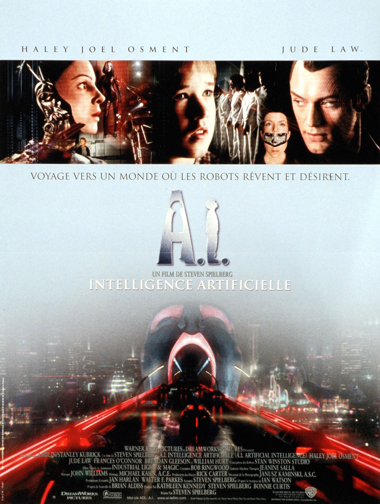
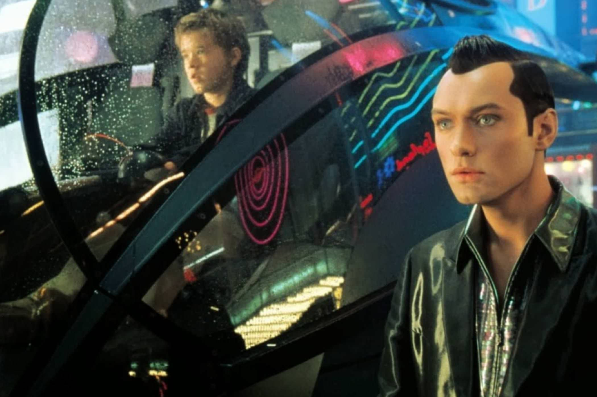

+++
titre = "<em>A.I. Intelligence artificielle</em>, Steven Spielberg"
title = "A.I. Intelligence artificielle, Steven Spielberg"
url = "/ai-intelligence-artificielle-spielberg"
date = "2014-12-06T16:45:52"
Lastmod = "2014-12-06T16:53:26"
cover = "ia-intelligence-artificielle-steven-spielberg.jpg"
categorie = [ "À voir" ]
tag = [ "Adaptation littéraire", "Amour", "Apocalypse", "Apprentissage", "Drame", "Famille", "Intelligence artificielle", "Robot", "Science-Fiction" ]
createur = [ "Steven Spielberg" ]
acteur = [ "Brendan Gleeson", "Frances O'Connor", "Haley Joel Osment", "Jude Law", "Sam Robards", "William Hurt" ]
annee = [ "2001" ]
weight = 2001
pays = [ "États-Unis" ]
original = "A.I. Artificial Intelligence"

+++

<em>A.I. Intelligence artificielle</em> aurait pu être signé Stanley Kubrick, mais par un étrange concours de circonstance, le projet initié par le réalisateur britannique a finalement été réalisé par Steven Spielberg. Sur le papier, tout oppose les deux cinéastes et leurs carrières pourraient difficilement être plus différentes. Pourtant, Steven Spielberg n&rsquo;a pas récupéré le long-métrage par opportunisme à la mort de Stanley Kubrick : alors que ce dernier commence à réfléchir à ce film dès les années 1970, il ne l&rsquo;a jamais réalisé et a confié très tôt le projet au jeune réalisateur qui est aussi son ami. Au départ, Steven Spielberg ne devait être qu&rsquo;un producteur, mais il reprend à son compte le projet après le décès de Stanley Kubrick. Au total, <em>A.I. Intelligence artificielle</em> est un film étrange, avec des échos de l&rsquo;œuvre des deux hommes, un scénario entièrement écrit par Steven Spielberg, mais sur la base d&rsquo;idées — voire de scènes — déjà bien en place. Le long-métrage est à l&rsquo;image de cette gestation complexe : une œuvre de science-fiction autour d&rsquo;une idée assez classique, mais une réalisation atypique, très lente et sans effets spectaculaires la majeure partie du temps. <em>A.I. Intelligence artificielle</em> est une œuvre sobre qui reste en mémoire longtemps après l&rsquo;avoir vue, à (re)découvrir…

Avec <em>A.I. Intelligence artificielle</em>, Steven Spielberg signe une œuvre assez atypique dans sa <a href="http://voiretmanger.fr/createur/steven-spielberg/">carrière marquée</a> par les blockbusters populaires et c&rsquo;est sensible dès la première scène. Le film se déroule dans un univers post-apocalyptique assez classique : le réchauffement climatique a conduit à une montée des eaux qui a détruit plusieurs grandes villes dans le monde. Pour contrer ces dérèglements climatiques, les pays les plus riches ont mis en place des lois contrôlant les naissances d&rsquo;une manière si sévère qu&rsquo;avoir un enfant est devenu exceptionnel. Et pour remplacer les humains, des robots intelligents ont été créés : tout amateur de science-fiction est ici en terrain extrêmement connu. Alors que l&rsquo;on pourrait s&rsquo;attendre à une histoire très classique, un blockbuster d&rsquo;action autour de la lutte pour survivre ou, pourquoi pas, la lutte contre les robots façon <em>Terminator</em>, le long-métrage commence avec un discours. Le patron de l&rsquo;une des entreprises qui produisent des robots dans le futur imaginé par le film explique à ses équipes qu&rsquo;il veut franchir une nouvelle étape. Jusque-là, les robots sont dotés d&rsquo;une intelligence artificielle qui leur permet de vivre et travailler au milieu des humains. Mais il leur manque une chose : la capacité à aimer. <em>A.I. Intelligence artificielle</em> se construit ainsi autour d&rsquo;un nouveau robot qui prend la forme d&rsquo;un enfant qui aime ses « parents » comme s&rsquo;il était vraiment leur enfant. Une belle idée sur le papier, mais le film pose d&rsquo;emblée une question essentielle : si un robot est capable d&rsquo;aimer sincèrement un humain, que se passe-t-il si l&rsquo;humain aimé se met à son tour à aimer ce robot ? Steven Spielberg n&rsquo;élude pas ces questions et surtout prend le temps de poser son film. Après ces discussions, on découvre sans surprise le robot quelques mois après. David, c&rsquo;est son nom, est confié à un couple qui a fait face à un drame ; leur enfant est dans le coma suite à un accident et les chances qu&rsquo;il s&rsquo;en sorte sont minimes. Prenant toujours son temps, le long-métrage nous montre les premiers pas de David au sein de la famille et l&rsquo;amour qui nait entre ce robot qui paraît si réel et la mère de famille.

Toute cette première partie est vraiment magnifique et mérite à elle seule de regarder <em>A.I. Intelligence artificielle</em>. Steven Spielberg est bien connu pour ses scènes d&rsquo;action efficaces, mais il prouve ici qu&rsquo;il peut aussi bien tourner des scènes tout en subtilité, avec intelligence et aussi beaucoup d&rsquo;émotion. La scène où la mère récite la séquence de mots pour que David l&rsquo;aime vraiment et la considère comme sa propre mère est un bon exemple : l&rsquo;émotion est palpable, et en même temps le réalisateur souligne bien l&rsquo;absurdité de cet amour qui naît uniquement d&rsquo;une procédure et de programmes informatiques. Le film évolue ensuite quand le fils de chair et d&rsquo;os fait son retour et que, après quelques péripéties, le robot est jeté hors du foyer. <em>A.I. Intelligence artificielle</em> devient alors un récit d&rsquo;apprentissage avec l&rsquo;excellente idée de Stanley Kubrick d&rsquo;en faire un <em>Pinocchio</em> modernisé. Le robot a entendu le conte, le prend au premier degré et souhaite ainsi retrouver la fée bleue qui pourra le rendre humain. Dans cette quête, il est accompagné d&rsquo;un autre robot, cette fois un prostitué conçu uniquement pour donner du plaisir aux femmes. Le film évolue alors et devient assez noir, surtout en son milieu, quand David doit affronter les hommes qui ne veulent pas des robots et qui s&rsquo;amusent à les détruire de mille manières lors de spectacles dignes des combats de gladiateur de Rome. Ce récit initiatique est moins original que la première partie et on y retrouve beaucoup plus la marque de fabrique de Steven Spielberg, on est plus dans le blockbuster dystopique traditionnel. Ce n&rsquo;est pas forcément un défaut, on retrouve l&rsquo;efficacité du cinéaste et on ne s&rsquo;ennuie ainsi pas du tout ; par ailleurs, c&rsquo;est aussi ce qui fait l&rsquo;originalité du projet et en partie son intérêt. La fin d&rsquo;<em>A.I. Intelligence artificielle</em> n&rsquo;a pas du tout été comprise à la sortie du film, mais elle est pourtant très intéressante. Plusieurs années se sont passées, les robots ont considérablement évolué et ils ont fini par remplacer les humains. C&rsquo;est une vision extrêmement noire, mais peut-être que, cette fois, Stanley Kubrick aurait été plus indiqué. Non pas que la fin telle qu&rsquo;on la connait soit vraiment mauvaise, mais elle ressemble presque à un happy-end, alors qu&rsquo;elle devrait être plus sombre et inquiétante.

Très critiqué à sa sortie, <em>A.I. Intelligence artificielle</em> résiste bien à l&rsquo;épreuve du temps et le film n&rsquo;avait probablement pas mérité toute la mauvaise presse de l&rsquo;époque. Certes, ce n&rsquo;est pas un film de Stanley Kubrick sans être tout à fait dans les habitudes de Steven Spielberg. Pour autant, ce dernier n&rsquo;a pas récusé le projet par hasard et ce n&rsquo;est pas pour rien que Stanley Kubrick lui avait proposé la réalisation de son vivant. Le résultat aurait été différent si le cinéaste anglais l&rsquo;avait réalisé, bien entendu, mais ce serait injuste de ne considérer le film que sous cet angle. <em>A.I. Intelligence artificielle</em> est une œuvre intéressante en soi, notamment parce qu&rsquo;elle a une origine aussi complexe. Et Steven Spielberg s&rsquo;en sort très bien avec ce film long et lent, mais passionnant jusqu&rsquo;au bout, malgré quelques défauts.

<h3>Vous voulez <a href="http://voiretmanger.fr/soutien/">m&rsquo;aider</a> ?</h3>
<ul>
<li><a href="http://www.amazon.fr/gp/product/B004CG26KA/ref=as_li_ss_tl?ie=UTF8&amp;tag=leblogdenic07-21&amp;linkCode=as2&amp;camp=1642&amp;creative=19458&amp;creativeASIN=B004CG26KA">Acheter le film en Blu-ray sur Amazon</a></li>
<li><a href="http://www.amazon.fr/gp/product/B0002RK9CU/ref=as_li_ss_tl?ie=UTF8&amp;tag=leblogdenic07-21&amp;linkCode=as2&amp;camp=1642&amp;creative=19458&amp;creativeASIN=B0002RK9CU">Acheter le film en DVD sur Amazon</a></li>
<li><a href="https://itunes.apple.com/fr/movie/intelligence-artificielle/id534987358">Acheter ou louer le film sur l&rsquo;iTunes Store</a></li>
</ul>

