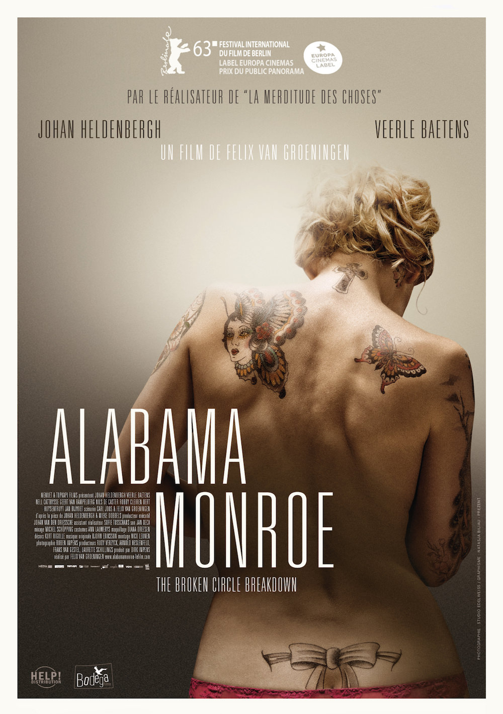

+++
type = "post"
titre = "<em>Alabama Monroe</em>, Felix van Groeningen"
title = "Alabama Monroe, Felix van Groeningen"
url = "/alabama-monroe-van-groeningen"
date = "2013-08-03T09:45:05"
Lastmod = "2014-02-19T21:07:30"
cover = "alabama-monroe-veerle-baetens-groeningen.jpg"
categorie = [ "À voir" ]
tag = [ "Adaptation théâtrale", "Amour", "Country", "Drame", "Famille", "Maladie", "Musique", "Sorties du mois" ]
createur = [ "Felix van Groeningen" ]
acteur = [ "Johan Heldenbergh", "Nell Cattrysse", "Veerle Baetens" ]
annee = [ "2013" ]
weight = 2013
pays = [ "Belgique" ]
festival = [ "Lama 2013" ]
original = "The Broken Circle Breakdown"

+++

Changement d’ambiance pour Felix van Groeningen : après une comédie qui tendait à la farce à base d’alcool et de vélo avec <a href="http://voiretmanger.fr/merditude-choses-groeningen/" title="La merditude des choses, Felix Van Groeningen - À voir et à manger"><em>La merditude des choses</em></a>, le cinéaste flamand s’attaque à une autre famille, mais aussi à un sujet beaucoup plus grave. L’irruption d’une maladie au sein d’une famille composée d’un couple parfait et d’une petite fille offre à <em>Alabama Monroe</em> son ossature. Drame poignant, ce nouveau long-métrage fait aussi la part belle à de splendides séquences à base de country et d’amour. Un mouvement qui offre au film tout son équilibre et qui permet à l’émotion de survenir avec encore plus de force. Une très belle réussite, à ne rater sous aucun prétexte.

Didier et Élise sont très différents, mais ils ne se sont plus quittés depuis le jour où ils se sont rencontrés. Grand barbu, lui est amateur de musique country et il chante et joue du banjo dans un groupe qui interprète les classiques du <a href="http://fr.wikipedia.org/wiki/Bluegrass">bluegrass</a>, ce genre popularisé récemment par le film <em>O’Brother</em> et qui vient du fin fond des États-Unis, de l’époque de la conquête vers l’or et des cow-boys des grandes plaines. Elle, petite et un peu fragile, est tatoueuse dans un salon et elle a recouvert son corps de multiples tatouages, dont certains très spectaculaires. Avec Didier, le personnage féminin d’<em>Alabama Monroe</em> découvre un univers musical dont elle ignorait tout, mais pas seulement. Les deux personnages mis en scène par Felix van Groeningen constituent un très beau couple, mais un couple original. Didier vit à l’écart de la ville, dans une sorte de ferme qu’il passe son temps à retaper. Élise garde une part de mystère jusqu’au bout et si elle paraît fragile à regarder, elle peut aussi faire preuve d’une force psychologique à toute épreuve. Ce qui les rassemble finalement, c’est la musique à nouveau qui est vraiment centrale dans le film. Si vous ne connaissez pas le genre, <em>Alabama Monroe</em> en offre une belle introduction avec plusieurs séquences tantôt enjouées, tantôt poignantes. On apprécie ce groupe aux voix puissantes, cette musique incarnée plutôt qu’interprétée et vous aurez sans aucun doute envie d’en réécouter après la séance : cela tombe bien, la <a href="http://www.amazon.fr/gp/product/B009WGSB9U/ref=as_li_ss_tl?ie=UTF8&tag=leblogdenic07-21&linkCode=as2&camp=1642&creative=19458&creativeASIN=B009WGSB9U">bande originale</a> rassemble quelques morceaux entendus dans le long-métrage. Avec ce couple charmant et vraiment amoureux, sans vrai problème au quotidien et avec cette musique parfois triste par ses paroles, il est vrai, mais assez joyeuse par ses compositions, Felix van Groeningen semble faire de son dernier long-métrage un <em>Feel Good Movie</em> de plus, qui serait malgré tout excellent, à défaut d’être original. Comme on le comprend vite, il n’en est rien.

Adapté d’une pièce de théâtre qui a connu un grand succès en Belgique, <em>Alabama Monroe</em> en a repris le sujet et la trame, mais pas l’ordre chronologique. Bien au contraire, le cinéaste a opté pour un montage en apparence désordonné, où l’on passe d’une époque à l’autre. Felix van Groeningen ne cherche pas à nous perdre en procédant ainsi et on suit d’ailleurs très bien ce qui se déroule, le puzzle scénaristique étant relativement simple à reconstituer et s’il peut arriver que l’on ne connaisse pas précisément la période d’une séquence en cours, c’est parce que ce n’est pas le plus important. L’idée du cinéaste est bien plus de ne pas dévoiler immédiatement toute son intrigue, et ce, pour une bonne raison. Comme on le comprend très vite, la maladie et même un drame vont secouer la famille qui semblait pourtant tout avoir pour elle et <em>Alabama Monroe</em> est aussi le récit du délitement de cette famille. Comme on a déjà pu le voir au cinéma — on pense un peu à <a href="http://voiretmanger.fr/guerre-declaree-donzelli/" title="La Guerre est déclarée, Valérie Donzelli - À voir et à manger"><em>La Guerre est déclarée</em></a> —, cette maladie détruit la cellule familiale de l’intérieur, l’air de rien. Alors que Didier et Élise devraient rester soudés pour leur fille, ils s’éloignent inexorablement et ni l’un, ni l’autre semble pouvoir y faire quelque chose. Lui, athée convaincu se lance de plus en plus dans des diatribes contre les religions et contre à peu près tout alors qu’elle, dans le même temps, se réfugie dans une forme de spiritualisme toujours plus envahissant. La confrontation était inévitable et Felix van Groeningen ne l’évite surtout pas, quitte à en faire un peu trop. C’est peut-être la seule limite que l’on peut porter : <em>Alabama Monroe</em> est un peu long sur la fin, alors que le long-métrage a maintenu pendant toute sa première partie un rythme parfait. Rien de grave toutefois et il faut bien convenir que le cinéaste frappe fort avec ce deuxième long-métrage qui gagne en maturité et en sérieux, mais aussi en force. On n’est plus dans l’outrance de la farce comme dans <em>La merditude des choses</em>, on est plus dans la nuance, même si le drame est bien souligné, surtout sur la fin. À l’écran, le résultat est souvent poignant et tous les parents devraient se retrouver, au moins en partie, dans la détresse de ces deux personnages. Sans tomber dans le pathos pour autant, Felix van Groeningen frappe exactement où il faut et son film est plein d’une émotion intense à laquelle il est difficile de résister. 

Difficile de ne pas être pris par ce film qui emporte deux heures durant dans un tourbillon d’émotions comme on en voit rarement. <em>Alabama Monroe</em> ne raconte pas une histoire très joyeuse, mais Felix van Groeningen ne plombe pas l’ambiance de son film pour autant et les nombreuses séquences musicales qui ponctuent son récit sont comme autant de pauses qui permettent de respirer. Parfait dans sa première partie, le film patine peut-être un peu pour trouver sa conclusion, mais l’ensemble reste parfaitement maîtrisé et la sincérité des acteurs est une réussite presque troublante. <em>Alabama Monroe</em> n’est pas un projet autobiographique pourtant, mais un récit de fonction extrêmement bien écrit. On ressort un peu soufflé après ce long-métrage intense, mais on ne regrette en aucun cas de l’avoir vu : à ne pas rater !

<h3>Vous voulez m&rsquo;aider ?<a href="#footnote_0_10022" id="identifier_0_10022" class="footnote-link footnote-identifier-link" title="&Agrave; propos de la publicit&eacute;&hellip;">1</a></h3>
<ul>
<li><a href="http://www.amazon.fr/gp/product/B00GS0X9YU/ref=as_li_ss_tl?ie=UTF8&tag=leblogdenic07-21&linkCode=as2&camp=1642&creative=19458&creativeASIN=B00GS0X9YU">Acheter le film en Blu-Ray sur Amazon</a></li>
<li><a href="http://www.amazon.fr/gp/product/B00GS0X9T0/ref=as_li_ss_tl?ie=UTF8&tag=leblogdenic07-21&linkCode=as2&camp=1642&creative=19458&creativeASIN=B00GS0X9T0">Acheter le film en DVD sur Amazon</a></li>
<li><a href="https://itunes.apple.com/fr/movie/alabama-monroe/id806834320">Acheter ou louer le film sur l&rsquo;iTunes Store</a></li>
</ul>

<ol class="footnotes"><li id="footnote_0_10022" class="footnote"><a href="http://voiretmanger.fr/soutien/">À propos de la publicité…</a> [<a href="#identifier_0_10022" class="footnote-link footnote-back-link">&#8617;</a>]</li></ol>
