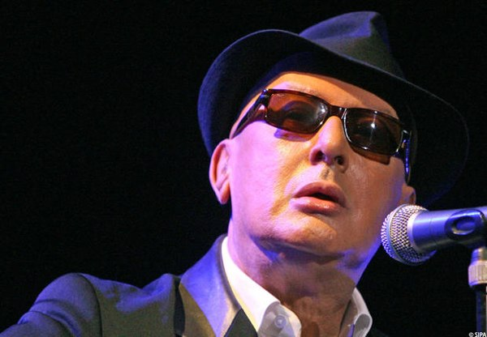

+++
titre = "Alain Bashung : adieu et merci"
title = "Alain Bashung : adieu et merci"
url = "/alain-bashung-adieu-merci"
date = "2009-03-14T20:54:31"
Lastmod = "2010-02-01T19:22:15"
cover = "alain-bashung.jpg"
categorie = [ "Musique" ]
tag = [ "Chanson", "Hommage", "Moâ" ]
createur = [ "Alain Bashung" ]
annee = [ "2009" ]
weight = 2009
pays = [ "France" ]

+++

Je viens d&rsquo;apprendre la mort d&rsquo;Alain Bashung. Je n&rsquo;aurai donc jamais eu l&rsquo;occasion de le voir en concert. Je m&rsquo;en veux.

C&rsquo;est étonnant, je ne le connais pas personnellement, mais j&rsquo;ai l&rsquo;impression d&rsquo;avoir perdu un proche, un ami même.

Le shuffle sur la discographie ne parvient que très médiocrement à remplacer ce qui m&rsquo;apparaît déjà comme un vide sans fin. Sa voix résonne dans la chambre, mais ne met que mieux en valeur l&rsquo;absence.

Finalement, les récompenses des Victoires de la musique étaient des récompenses posthumes. Étrange pensée&#8230;

À voir, sa dernière apparition en public, aux Victoires de la musique justement, pour interpréter un très émouvant &laquo;&nbsp;Résidents de la République&nbsp;&raquo;. &laquo;&nbsp;Souhaitons-nous une année resplendissante&nbsp;&raquo;, disait-il&#8230;

<object classid="clsid:d27cdb6e-ae6d-11cf-96b8-444553540000" width="420" height="339" codebase="http://download.macromedia.com/pub/shockwave/cabs/flash/swflash.cab#version=6,0,40,0"><param name="allowFullScreen" value="true" /><param name="allowScriptAccess" value="always" /><param name="src" value="http://www.dailymotion.com/swf/x8j25f" /><param name="allowfullscreen" value="true" /><embed type="application/x-shockwave-flash" width="420" height="339" src="http://www.dailymotion.com/swf/x8j25f" allowscriptaccess="always" allowfullscreen="true"></embed></object> 
<strong><a href="http://www.dailymotion.com/swf/x8j25f">Alain Bashung Victoire Musique 09</a></strong> 
<em>par <a href="http://www.dailymotion.com/Mikmm">Mikmm</a></em>

Merci Alain pour tous ces bonheurs à écouter ces merveilleux disques.

Mieux vaut, après cela, se taire et réécouter cette musique, magique, simplement.

