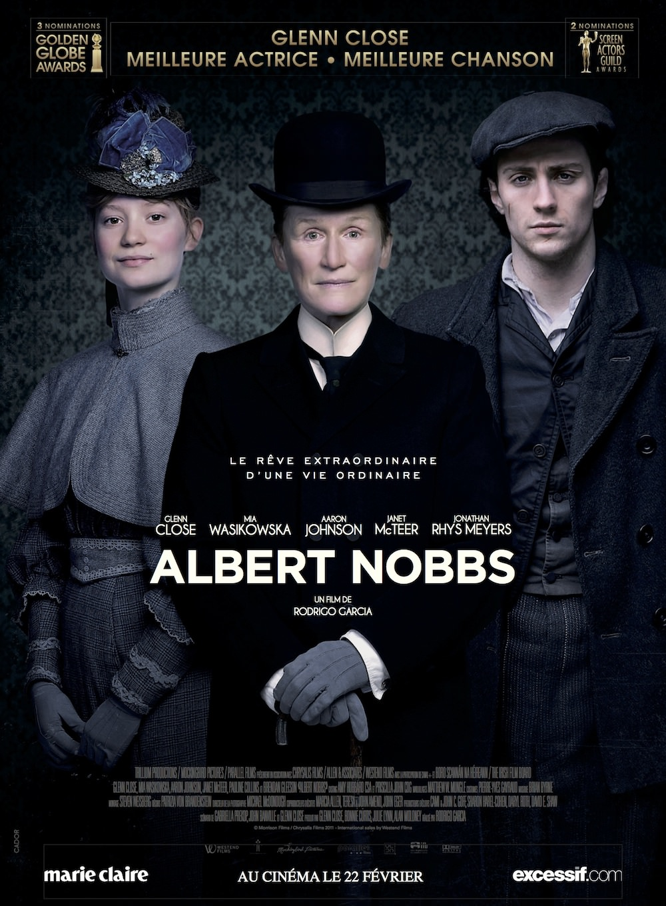
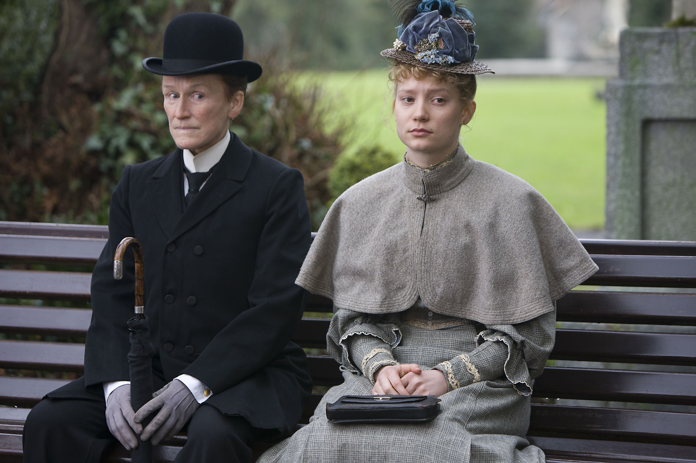

+++
titre = "<em>Albert Nobbs</em>, Rodrigo Garcia"
title = "Albert Nobbs, Rodrigo Garcia"
url = "/albert-nobbs-garcia"
date = "2013-10-06T21:48:14"
Lastmod = "2013-10-06T21:58:17"
cover = "albert-nobbs-glenn-close.jpg"
categorie = [ "À voir" ]
tag = [ "Adaptation théâtrale", "Film en costumes", "Histoire", "Société", "Transsexualité", "Vite oublié" ]
createur = [ "Rodrigo Garcia" ]
acteur = [ "Aaron Taylor-Johnson", "Brendan Gleeson", "Glenn Close", "Janet McTeer", "Mia Wasikowska" ]
annee = [ "2012" ]
weight = 2012

+++

« <em>Je dois absolument jouer ce personnage sur le grand écran avant de mourir.</em> » : c’est en ces mots que Glenn Close <a href="http://www.allocine.fr/film/fichefilm-178190/secrets-tournage/">aurait proposé</a> son projet aux producteurs. Dire que c’est le film de sa vie est peut-être exagéré, mais il est incontestable que l’actrice a mis de sa personne. <em>Albert Nobbs</em> est l’adaptation d’une pièce de théâtre dans laquelle elle jouait déjà, vingt ans avant la sortie du film. Glenn Close est aussi co-auteure du scénario et elle est aussi à la production : autant dire qu’elle s’est impliquée autant qu’elle pouvait dans ce long-métrage réalisé par Rodrigo Garcia. À l’écran, l’histoire plutôt intéressante d’une femme qui doit se travestir en homme pour réussir et une interprétation exceptionnelle. Malheureusement, ces deux éléments ne suffisent pas à faire d’<em>Albert Nobbs</em> un bon film…

On s’attendrait à une mention « <em>Tirée d’une histoire vraie</em> », mais elle n’arrive jamais. Et pour cause : <em>Albert Nobbs</em> est une pure fiction, même si formellement, le long-métrage ressemble à s’y méprendre à un biopic. Film en costumes, il se déroule dans le Dublin de la fin du XIXe siècle. L’Irlande n’est pas alors à son plus fort et tous ceux qui le peuvent partent en masse vers les États-Unis ou d’autres destinations. Ceux qui restent sont trop pauvres pour quitter le pays… ou trop riches. L’action se déroule dans un hôtel de luxe de la capitale irlandaise, où officie depuis plusieurs années Albert Nobbs, serviteur discret, mais efficace. Rodrigo Garcia commence par montrer la vie réglée de cet hôtel avec une scène d’ouverture dans la cantine de l’établissement. Suivant à la lettre son cérémonial, Albert allume toutes les bougies avant de se rendre au réfectoire où il accueille et accompagne chaque invité. <em>Albert Nobbs</em> continue notre visite touristique avec ce voyage dans le temps qui nous emmène dans les cuisines où déjeune le personnel, mais aussi dans la chambre du personnage principal. Albert Nobbs économise depuis des années tous les pourboires donnés par les clients : son rêve est d’acheter sa propre boutique pour y vendre du tabac. En ces temps de crise, c’est un rêve théoriquement impossible, mais quand le film commence, il a justement réuni la somme nécessaire.

Tout ceci serait bien banal, si ce n’est qu’Albert Nobbs n’est pas tout à fait celui qu’il prétend être. Le scénario essaie d’entretenir le suspense, mais c’est une coquetterie totalement superflue. On comprend vite que le héros d’<em>Albert Nobbs</em> est en fait une héroïne : Glenn Close est parfaite dans ce rôle au genre difficile à situer, mais il n’empêche que le personnage conserve quelques traits féminins qui troublent dès les premières scènes. Le plus surprenant, c’est sans doute que personne ne se doute de la réalité et il faut un concours de circonstances extraordinaires pour que l’information soit révélée à un autre personnage, et donc au spectateur. C’est la première faiblesse de ce long-métrage qui essaie de jouer la carte du réalisme historique avec plus ou moins de succès — ces pièces éclairées par trois bougies où la lumière est forte et homogène… —, mais sur le point du trouble sexuel, on ne croit jamais vraiment à la surprise des autres personnages. C’est d’autant plus gênant que Rodrigo Garcia filme non pas une femme cachée, mais deux et que ce deuxième cas se voit encore plus. Les deux actrices (Glenn Close et Janet McTeer) sont excellentes, mais leur féminité se voit. Sans parler de ce défaut, <em>Albert Nobbs</em> pèche peut-être par un scénario un peu vide. Le film ne raconte rien de bien spécial et se contente du rêve de son personnage principal en guise de moteur pour l’intrigue, alors qu’on aimerait un petit peu plus. Cette histoire pourrait être passionnante sur la société machiste de l’époque, certes, mais aussi sur la sexualité et l’homosexualité de ces femmes. En poussant un petit peu, le long-métrage aurait pu évoquer les origines de la transsexualité telle qu’on l’a connaît aujourd’hui, mais il n’en est rien. On ne s’ennuie pas avec ce film costumé, mais on ne peut pas dire qu’il restera dans les annales, alors qu’il avait à sa disposition un sujet vraiment passionnant.

Est-ce la faute de Rodrigo Garcia ou de l’origine théâtrale du projet ? Qu’importe, le constat est le même : <em>Albert Nobbs</em> n’est pas très bien filmé et les monologues de certains de ses personnages sont vraiment étranges. Son sujet pouvait être passionnant, mais le résultat n’est pas non plus à la hauteur. Cela fait beaucoup, mais tout n’est pas à jeter avec ce long-métrage. La performance de Glenn Close peut justifier à elle seule de le voir, sans pour autant sauver complètement le film.

<h3>Vous voulez m&rsquo;aider ?<a href="#footnote_0_10363" id="identifier_0_10363" class="footnote-link footnote-identifier-link" title="&Agrave; propos de la publicit&eacute;&hellip;">1</a></h3>
<ul>
<li><a href="http://www.amazon.fr/gp/product/B007NZMV5M/ref=as_li_ss_tl?ie=UTF8&#038;tag=leblogdenic07-21&#038;linkCode=as2&#038;camp=1642&#038;creative=19458&#038;creativeASIN=B007NZMV5M">Acheter le film en Blu-Ray sur Amazon</a></li>
<li><a href="http://www.amazon.fr/gp/product/B007NZMV6Q/ref=as_li_ss_tl?ie=UTF8&#038;tag=leblogdenic07-21&#038;linkCode=as2&#038;camp=1642&#038;creative=19458&#038;creativeASIN=B007NZMV6Q">Acheter le film en DVD sur Amazon</a></li>
<li><a href="https://itunes.apple.com/fr/movie/albert-nobbs/id539834723">Acheter ou louer le film sur l&rsquo;iTunes Store</a></li>
</ul>

<ol class="footnotes"><li id="footnote_0_10363" class="footnote"><a href="http://voiretmanger.fr/soutien/">À propos de la publicité…</a> [<a href="#identifier_0_10363" class="footnote-link footnote-back-link">&#8617;</a>]</li></ol>
