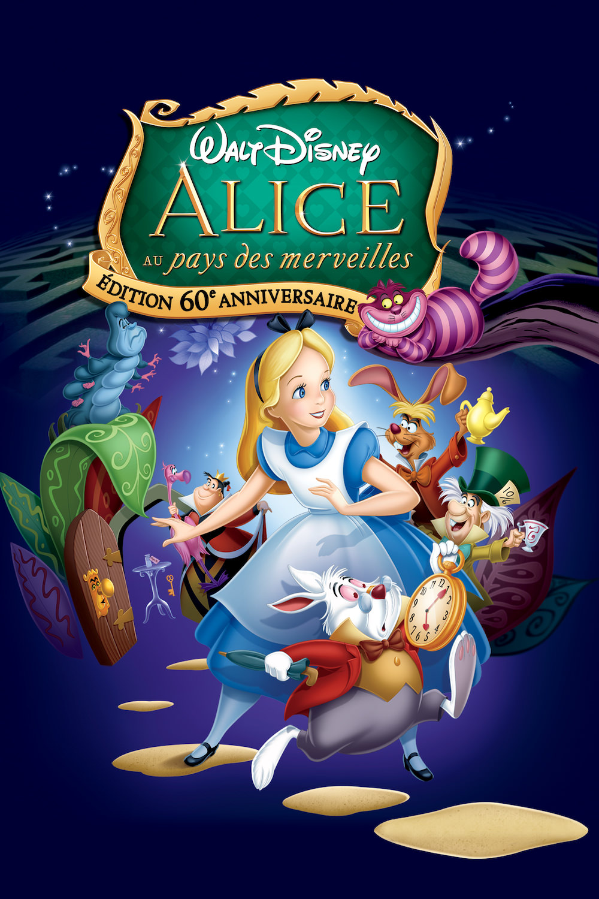
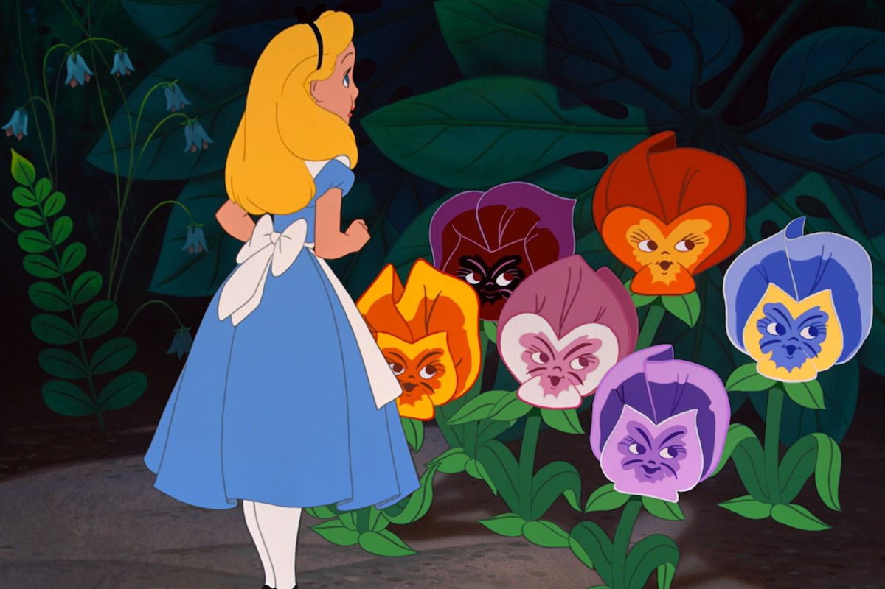
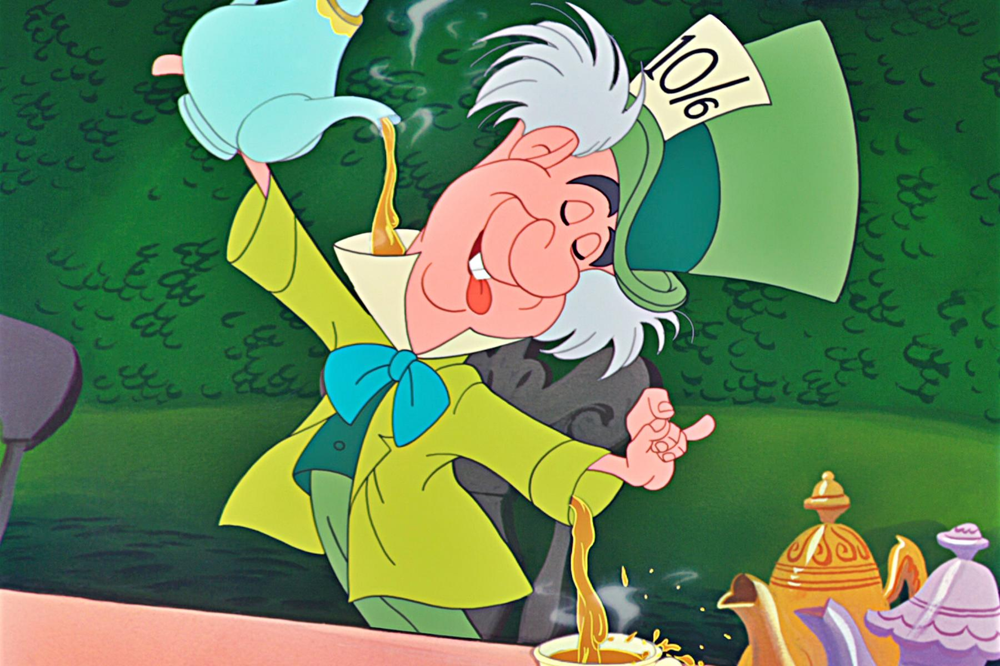

+++
type = "post"
titre = "<em>Alice au pays des merveilles</em>, Clyde Geronimi, Wilfred Jackson et Hamilton Luske"
title = "Alice au pays des merveilles, Clyde Geronimi, Wilfred Jackson et Hamilton Luske"
url = "/alice-pays-merveilles-geronimi-jackson-luske"
date = "2014-02-24T10:51:16"
Lastmod = "2014-02-24T08:38:36"
cover = "alice-au-pays-des-merveilles.jpg"
categorie = [ "À voir" ]
tag = [ "Animation", "Drogue", "Éducation", "Enfance", "Fantastique" ]
createur = [ "Clyde Geronimi", "Hamilton Luske", "Walt Disney", "Wilfred Jackson" ]
annee = [ "1951" ]
weight = 1951
saga = [ "Classiques d'animation Disney" ]
pays = [ "États-Unis" ]
original = "Alice in Wonderland"

+++

<em>Alice au pays des merveilles</em> fait partie de ces projets au long cours pour Walt Disney et ses studios. L’œuvre de Lewis Carroll a servi aux premières réalisations de l’histoire de studio avec, dans les années 1920, les <em>Alice Comedies</em>, une série de courts-métrages librement inspirés de cet univers. Après le succès de <a href="http://voiretmanger.fr/blanche-neige-sept-nains-hand/" title="Blanche-Neige et les sept nains, David Hand"><em>Blanche-Neige et les sept nains</em></a>, une adaptation en long format est lancée, mais le projet est interrompu par la Seconde Guerre mondiale qui force le studio à se concentrer sur des films aux ambitions beaucoup plus modestes. Après la guerre, les gros projets sont relancés et un an après la sortie de <a href="http://voiretmanger.fr/cendrillon-geronimi-jackson-luske/" title="Cendrillon, Clyde Geronimi, Wilfred Jackson et Hamilton Luske"><em>Cendrillon</em></a> qui signe le retour du studio aux longs-métrages, c’est <em>Alice au pays des merveilles</em> qui sort enfin sur les écrans. L’adaptation a été difficile et à sa sortie, le film est critiqué assez largement. Comme c’est souvent le cas, l’œuvre n’a obtenu son statut de <a href="http://voiretmanger.fr/saga/classiques-danimation-disney/">classique Disney</a> qu’avec le temps, mais ce film délirant conserve une place à part dans l’histoire du studio.

Contrairement aux adaptations des contes traditionnelles, celle des deux romans de Lewis Carroll a pris beaucoup de temps. Il faut dire que c’est une œuvre quasiment impossible à adapter et Walt Disney multiplie les scénarios pour essayer de trouver le ton juste. Le personnage d’Alice n’est pas une princesse au grand cœur, elle manque de caractère et d’intérêt. Autre problème, le récit n’est pas structuré et linéaire, il est au contraire éclaté en de nombreux ilots indépendants qui peuvent constituer un long-métrage totalement décousu. Quand <em>Alice au pays des merveilles</em> sort enfin sur les écrans après plusieurs années de travail, Walt Disney et plusieurs de ses collaborateurs n’en sont pas satisfaits. Le créateur des studios ira même jusqu’à <a href="http://fr.wikipedia.org/wiki/Alice_au_pays_des_merveilles_(film,_1951)#Un_film_d.C3.A9savou.C3.A9_par_Walt_Disney">désavouer publiquement</a> ce film qui ne bénéficie pas, dans les années qui suivent, des traditionnelles ressorties en salles des précédents longs-métrages du studio. Il faut dire que le résultat manque visiblement de cohérence et souffre de sa difficile gestation. Avec trois réalisateurs sur l’affiche et encore plus de responsables d’animation, <em>Alice au pays des merveilles</em> ressemble un peu aux compilations de courts-métrages des années 1940. De fait, après une introduction où l’on découvre Alice en train de réviser dans un parc avec sa mère, le film nous emmène dans le pays des merveilles, suivant le lapin en retard comme il se doit. À partir de là, le long-métrage devient une série de séquences plus ou moins brèves et sans vrais liens entre elles. On sent que les scénaristes ont essayé de lier les éléments, de leur donner une logique et d’offrir à l’ensemble une progression générale. Reste que le sentiment de voir une succession de séquences indépendantes est fort. On a ainsi l’histoire de la porte et des potions et biscuits qui changent la taille, puis les deux jumeaux et leur histoire des huitres, et puis la maison du lapin, puis le non-anniversaire, puis…

Au fond, <em>Alice au pays des merveilles</em> respecte assez bien l’esprit absurde des romans de Lewis Carroll. Le film est sans contexte le plus étrange dans toute la filmographie Disney, celui qui n’a pas vraiment de sens, qui ne raconte même pas vraiment d’histoire, puisque l’on sait bien que tout cela n’est qu’un rêve et qu’Alice finira par se réveiller. Cette absurdité très anglo-saxonne — en version originale, Alice a un accent anglais bien prononcé qui ancre le récit dans le pays qui a inventé le <em>nonsense</em> — a certainement déstabilisé le public traditionnel du studio, même si les enfants peuvent le voir sans problème et sans nécessairement tout comprendre. Le plus gros problème n’est peut-être pas cette bonne dose d’absurde et l’absence générale de sens, mais plutôt la volonté des studios de toucher malgré tout leur public de base. <em>Alice au pays des merveilles</em> est absurde, mais pas autant que l’œuvre originale et beaucoup de critiques ont reproché les écarts avec le travail de Lewis Carroll. De fait, les chansons qui émaillent le film et certaines libertés prises avec le texte original en font une version édulcorée, dans le même esprit d’ailleurs que l’<a href="http://voiretmanger.fr/alice-pays-merveilles-mcleod/">adaptation en prises de vue réelles</a> proposée en 1933 par Norman McLeod. Les deux sont d’ailleurs étonnamment proches, avec entre autres une séquence animée pour le récit du morse, du charpentier et des huitres qui est quasiment identique et qui a été une source d’inspiration évidente pour les équipes Disney. Malgré ces critiques, <em>Alice au pays des merveilles</em> a su trouver son public au fil des années et en particulier dans les années 1970, quand les mouvements hippies se l’approprient en y voyant une démonstration des effets de la drogue. Un succès que Walt Disney n’avait certainement pas prévu, mais qui a contribué à faire entrer le film dans la légende et à lui assurer sa place de classique.

Classique Disney le plus atypique sans doute, <em>Alice au pays des merveilles</em> est incontestablement un film d’animation très étrange. Loin des récits structurés que l’on connait habituellement, ce film surprend par une bonne dose d’absurde et notamment par un scénario assez peu cohérent. Des choix audacieux, même si Clyde Geronimi, Wilfred Jackson et Hamilton Luske n’ont pas pu s’empêcher d’ajouter quelques éléments traditionnels pour le studio, comme des chansons. Ces libertés mettent le film un peu en porte à faux, mais il faut aussi reconnaître que l’œuvre de Lewis Carroll était impossible à adapter en l’état. Quoi qu’il en soit, <em>Alice au pays des merveilles</em> est sans doute une bonne première approche des deux romans, ce qui n’est déjà pas si mal.

<h3>Vous voulez m’aider ?<a href="#footnote_0_11257" id="identifier_0_11257" class="footnote-link footnote-identifier-link" title="&Agrave; propos de la publicit&eacute;&hellip;">1</a></h3>
<ul>
<li><a href="http://www.amazon.fr/gp/product/B004IAD7C6/ref=as_li_ss_tl?ie=UTF8&tag=leblogdenic07-21&linkCode=as2&camp=1642&creative=19458&creativeASIN=B004IAD7C6">Acheter le film en Blu-Ray sur Amazon</a></li>
<li><a href="http://www.amazon.fr/gp/product/B004IPWY48/ref=as_li_ss_tl?ie=UTF8&tag=leblogdenic07-21&linkCode=as2&camp=1642&creative=19458&creativeASIN=B004IPWY48">Acheter le film en DVD sur Amazon</a></li>
<li><a href="https://itunes.apple.com/fr/movie/alice-au-pays-des-merveilles/id413989571">Acheter ou louer le film sur l’iTunes Store</a></li>
</ul>

<ol class="footnotes"><li id="footnote_0_11257" class="footnote"><a href="http://voiretmanger.fr/soutien/">À propos de la publicité…</a> [<a href="#identifier_0_11257" class="footnote-link footnote-back-link">&#8617;</a>]</li></ol>
