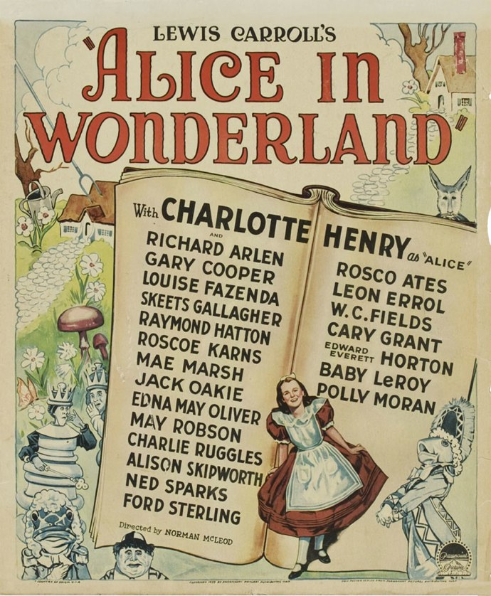
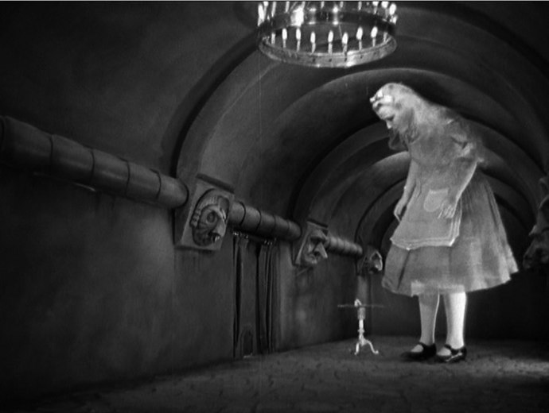
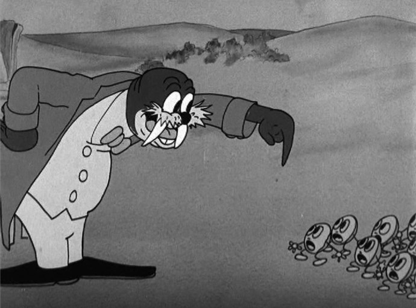

+++
type = "post"
titre = "Alice au Pays des Merveilles, Norman McLeod"
title = "Alice au Pays des Merveilles, Norman McLeod"
url = "/alice-pays-merveilles-mcleod"
date = "2010-08-22T00:32:17"
Lastmod = "2014-02-23T11:45:53"
cover = "alice-au-pays-merveilles-mc-leod.jpg"
categorie = [ "À voir" ]
tag = [ "Cinéma classique", "Fantastique", "Noir et blanc" ]
createur = [ "Norman McLeod" ]
acteur = [ "Charlotte Henry" ]
annee = [ "1933" ]
weight = 1933
pays = [ "États-Unis" ]
original = "Alice in Wonderland"

+++

<em>Alice au Pays des Merveilles</em>, un récit qui a inspiré tant d&rsquo;œuvres, notamment au cinéma. Si pour beaucoup l&rsquo;adaptation du texte de Lewis Carroll est d&rsquo;abord celle de Walt Disney, dans les années 1950, ce ne fut ni la première, ni la dernière comme en a malheureusement témoigné <a href="/2010/03/25/alice-au-pays-des-merveilles-burton/">la version de Tim Burton</a> sortie en début d&rsquo;année. Bien des années avant cette remise au goût du jour, Norman McLeod sortait sa vision : son <em>Alice au Pays des Merveilles</em> est sorti en 1933 et c&rsquo;était déjà à l&rsquo;époque une version très moderne, avec multiples effets spéciaux. Ces derniers ont aujourd&rsquo;hui un charme désuet, mais le film vaut surtout par l&rsquo;influence qu&rsquo;il a pu avoir sur l&rsquo;imaginaire collectif entourant Alice.

<em>Alice au Pays des Merveilles</em> version 1933 mêle en fait les deux récits de Lewis Carroll. Si la postérité retient surtout le premier opus et notamment son titre, le Britannique avait aussi écrit une suite nommée <em>De l&rsquo;autre côté du miroir</em>. McLeod choisit de commencer son film avec ce dernier : Alice, 12 ans et quatre mois, s&rsquo;ennuie ferme alors qu&rsquo;on l&rsquo;interdit de sortir sous la neige. Rester auprès du feu avec sa surveillante pour coudre ne l&rsquo;enchante guère et elle tourne en rond, littéralement. Profitant du départ de la surveillance adulte, elle monte sur la cheminée et pousse le miroir tout en imaginant la maison de l&rsquo;autre côté, une maison qui serait identique à la sienne, mais inversée. Là voilà qui passe de l&rsquo;autre côté du miroir et découvre un monde effectivement inversé, où les portes s&rsquo;ouvrent du bas vers le haut et où on peut regarder une photo de l&rsquo;arrière. C&rsquo;est aussi un monde étrange où les horloges parlent et disent n&rsquo;importe quoi et où les pièces d&rsquo;un échiquier sont vivantes. Alors que l&rsquo;histoire semblait donc clairement s&rsquo;orienter du côté du miroir, l&rsquo;histoire traditionnelle d&rsquo;Alice reprend vite ses droits. La jeune fille suit un lapin dans le jardin, tombe dans le trou et se retrouve dans la fameuse pièce avec la petite porte. Dès lors, tous les évènements bien connus sont exploités par le film, le chapelier fou et son thé permanent, la reine rouge qui veut décapiter tout le monde et joue au cricket avec des Flamands roses, la chenille qui fume un narguilé, le mystérieux chat fantôme, etc.

Il est assez fascinant de constater que l&rsquo;histoire d&rsquo;Alice se répète sans vrais ajouts d&rsquo;une adaptation à l&rsquo;autre. Certes, l&rsquo;histoire est toujours la même, celle de Carroll. Mais enfin, le récit fantastique était suffisamment riche pour permettre des adaptations différentes et on s&rsquo;aperçoit vite qu&rsquo;elles sont toutes très proches. Le cru 1933 de <em>Alice au Pays des Merveilles</em> donne un peu l&rsquo;impression de voir les fondements d&rsquo;un mythe qui sera ensuite décliné, mais jamais vraiment renouvelé<a href="#footnote_0_3850" id="identifier_0_3850" class="footnote-link footnote-identifier-link" title="Il existe toutefois un film de 1915 qui permettrait sans doute de remonter encore plus loin, mais je n&rsquo;ai pas eu l&rsquo;occasion de le voir.">1</a>. La scène de la chute dans le trou et de la petite pièce reprendre ainsi à s&rsquo;y méprendre à leurs équivalents chez Disney ou même chez Burton. À tel point que l&rsquo;on peut avoir le sentiment d&rsquo;assister à une énième redite un brin lassante, ce qui n&rsquo;est pas juste si l&rsquo;on pense à la chronologie. L&rsquo;inspiration est forte, au point qu&rsquo;une séquence entière a été simplement dupliquée dans le film d&rsquo;animation de Walt Disney : le film de McLeod contient une séquence animée pour raconter l&rsquo;histoire cruelle des huitres et la séquence est identique, la couleur exceptée, à ce que fera Walt Disney une vingtaine d&rsquo;années plus tard. Une manière de signaler l&rsquo;inspiration principale pour les studios d&rsquo;animation ?

Comme chez Walt Disney, le message de Lewis Carroll est édulcoré par le <em>Alice au Pays des Merveilles</em> de McLeod. Le texte original s&rsquo;adressait aux enfants pour proposer un message bien éloigné du puritanisme anglican, offrant à ceux qui savaient lire entre les lignes une célébration de la drogue en bonne et due forme. Rien de tel ici : les substances avalées par Alice sont toujours inoffensives (même quand il s&rsquo;agit d&rsquo;un champignon), tandis que la fumée de la chenille, par exemple, n&rsquo;a aucune utilité concrète. De manière générale, le film propose un traitement premier degré assez surprenant pour nos yeux modernes habitués aux films à plusieurs niveaux. Aucun second degré perceptible ici, on suit une petite fille modèle dans ce pays merveilleux et on le découvre avec ses yeux et ses yeux seulement. Alice s&rsquo;émerveille souvent, s&rsquo;étonne de temps en temps, a parfois peur… mais cela ne va jamais bien loin. Encore enfant, elle accepte largement ce qu&rsquo;elle voit et tout le côté roman initiatique a totalement disparu : quand le film se termine, Alice se réveille et c&rsquo;est comme s&rsquo;il ne s&rsquo;était rien passé. Ce premier degré est constant et donne lieu à quelques dialogues totalement absurdes et parfois involontairement comiques. On regarde l&rsquo;ensemble d&rsquo;un air amusé, incapables de prendre au sérieux cet univers, comme s&rsquo;il ne s&rsquo;agissait que d&rsquo;une parodie. Le film est cependant plus noir que le dessin animé qui a suivi par exemple, et met plus l&rsquo;accent sur l&rsquo;absurdité des situations : on a ainsi une séquence d&rsquo;anthologie avec une tortue à tête de vache qui n&rsquo;arrête pas de pleurer et qui est plutôt impressionnante. Beaucoup plus, d&rsquo;ailleurs, que la reine rouge habituellement grande méchante des adaptations d&rsquo;<em>Alice au Pays des Merveilles</em>, mais traitée ici sur le mode de la bouffonnerie et de la farce.

Sorti dans les années 1930, <em>Alice au Pays des Merveilles</em> est également techniquement amusant aujourd&rsquo;hui. Pourtant, le film n&rsquo;est pas totalement ridicule, loin de là. Le tournage a été fait sans doute entièrement en studio, avec de nombreux décors et toiles peintes créés pour le film, ainsi que de nombreux déguisements ou marionnettes. Tous les personnages fantastiques sont interprétés par de véritables acteurs, ce qui leur donne un côté théâtral assez plaisant. À comparer cette version à l&rsquo;ancienne et la très moderne et mauvaise version de Tim Burton sortie récemment et qui faisait étalage d&rsquo;une puissance technique sans borne et sans intérêt, on se dit que les effets spéciaux à outrance ne sont pas forcément une bénédiction pour le cinéma. Alors certes, le flou pour signifier les changements de taille d&rsquo;Alice, c&rsquo;est un peu léger, mais peu importe et cet <em>Alice au Pays des Merveilles</em> a clairement un charme. Cela dit, au jeu des comparaisons, on se dit aussi que la meilleure version reste peut-être, finalement, celle de Walt Disney. Peut-être est-ce le souvenir de l&rsquo;enfance qui ressort, mais je trouve qu&rsquo;une histoire comme celle d&rsquo;Alice bénéficie bien des libertés offertes par l&rsquo;animation. Tim Burton a cependant bien prouvé qu&rsquo;une liberté technique totale ne suffit pas à faire une bonne adaptation de <em>Alice au Pays des Merveilles</em>. À choisir, je préfère encore le charme désuet de la 1933 qui a en plus le bon goût de ne pas durer trop longtemps et qui ne souffle d&rsquo;aucune baisse de rythme, les différents éléments s&rsquo;enchaînant à toute allure.

L&rsquo;adaptation de <em>Alice au Pays des Merveilles</em> par Norman McLeod est un document intéressant par son statut de film fondateur. Sa vision du récit de Lewis Carroll est celle qui s&rsquo;est imposée depuis et que l&rsquo;on retrouve autant dans le dessin animé de Walt Disney des années 1950 que dans la version Tim Burton de 2010. Bénéficiant d&rsquo;une technique au charme désuet, le film se révèle très premier degré quant à sa vision de cet univers fantastique marqué entre les lignes par la drogue. Intéressant pour les amateurs d&rsquo;<em>Alice au Pays des Merveilles</em>…

<em>Le film sortira en DVD en septembre, dans une version restaurée, mais qui présente malgré tout de nombreux signes de son grand âge.</em>

<h3>Vous voulez m&rsquo;aider ?<a href="#footnote_1_3850" id="identifier_1_3850" class="footnote-link footnote-identifier-link" title="&Agrave; propos de la publicit&eacute;&hellip;">2</a></h3>
<ul>
<li><a href="http://www.amazon.fr/gp/product/B003TP3V90/ref=as_li_ss_tl?ie=UTF8&tag=leblogdenic07-21&linkCode=as2&camp=1642&creative=19458&creativeASIN=B003TP3V90">Acheter le film en DVD sur Amazon</a></li>
</ul>

<ol class="footnotes"><li id="footnote_0_3850" class="footnote">Il existe toutefois un film de 1915 qui permettrait sans doute de remonter encore plus loin, mais je n&rsquo;ai pas eu l&rsquo;occasion de le voir. [<a href="#identifier_0_3850" class="footnote-link footnote-back-link">&#8617;</a>]</li><li id="footnote_1_3850" class="footnote"><a href="/a-propos/publicite/">À propos de la publicité…</a> [<a href="#identifier_1_3850" class="footnote-link footnote-back-link">&#8617;</a>]</li></ol>
