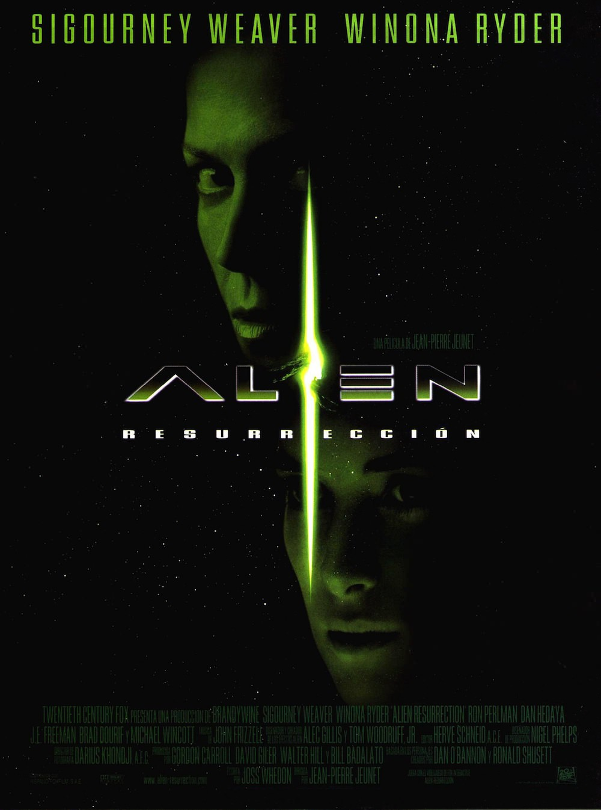
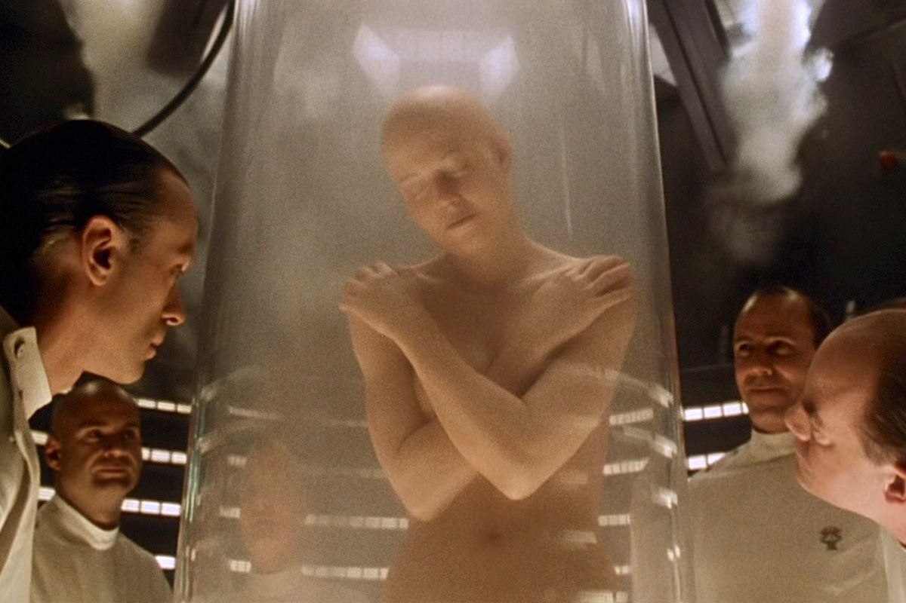

+++
type = "post"
titre = "<em>Alien, la résurrection</em>, Jean-Pierre Jeunet"
title = "Alien, la résurrection, Jean-Pierre Jeunet"
url = "/alien-la-resurrection-jeunet"
date = "2013-05-25T10:38:32"
Lastmod = "2013-05-29T22:32:14"
cover = "alien-resurrection-sigourney-weaver.jpg"
categorie = [ "À voir" ]
tag = [ "Action", "Blockbuster", "Extra-terrestre", "Horreur", "Science-Fiction", "Vite oublié" ]
createur = ["Jean-Pierre Jeunet"]
acteur = [ "Dominique Pinon", "Ron Perlman", "Sigourney Weaver", "Winona Ryder" ]
annee = [ "1997" ]
weight = 1997
saga = [ "Alien" ]
pays = [ "États-Unis" ]
original = "Alien : Resurrection"

+++

La saga <em>Alien</em> a ceci de très particulier qu’elle a fait appel à quatre réalisateurs extrêmement différents, et à quatre cinéastes plus ou moins novices. Après <a href="http://voiretmanger.fr/createur/ridley-scott/">Ridley Scott</a>, <a href="http://voiretmanger.fr/createur/james-cameron/">James Cameron</a> et après <a href="http://voiretmanger.fr/createur/david-fincher/">David Fincher</a>, c’est le Français Jean-Pierre Jeunet qui prend le relais et offre une conclusion à la saga, même si les extra-terrestres continueront leur carrière au cinéma par la suite. Comme l’indique bien son titre, <em>Alien, la résurrection</em> trouve un moyen pour faire revenir non seulement les Aliens, mais aussi le personnage principal de la série Ellen Ripley. Ce devait être l’occasion d’un nouveau départ pour la saga avec une suite qui devait se dérouler sur Terre, mais le manque de succès a eu raison d’<em>Alien</em>, ce qui n’est peut être pas plus mal. Après un perfectible <a href="http://voiretmanger.fr/alien-3-fincher/" title="Alien³, David Fincher"><em>Alien³</em></a>, ce quatrième volet tombe dans le burlesque et malgré quelques bonnes idées, Jean-Pierre Jeunet ne convainc pas. 

Deux cents ans se sont écoulés depuis <em>Alien³</em> qui se terminait sur le suicide de Ripley. Avec sa mort, les scientifiques venus récupérer l’extra-terrestre perdent aussi tout espoir d’étudier la créature pour en faire des armes, comme c’est leur intention depuis le départ. <em>Alien, la résurrection</em> ouvre sur le clonage réussi d’Ellen Ripley : la science ayant évolué après toutes ces années, les scientifiques sous l’égide de l’armée ont réussi à récupérer l’ADN du lieutenant pour la recréer, en prenant bien soin de conserver l’animal à l’intérieur. Cette idée sortie de l’esprit de Joss Whedon qui signe le scénario semble un peu facile au premier abord : le personnage principal est mort, qu’à cela ne tienne, ressuscitons-le ! Le long-métrage de Jean-Pierre Jeunet s’en sort malgré tout plutôt bien et l’explication tient la route : après tout, les militaires veulent tellement l’Alien qu’ils sont prêts à tout, même créer une nouvelle personne. L’extraction de la créature et la mise en place du plan diabolique de l’armée sont également bien menées et <em>Alien, la résurrection</em> commence sur des bases plutôt bien vues. Le film introduit rapidement ses vrais personnages avec l’arrivée d’un vaisseau cargo et de ses occupants aux caractères très marqués : il y a un mécanicien impertinent et paralysé des jambes — interprété par Dominique Pinon, un habitué du réalisateur —, il y a aussi le grand mec baraqué, violent et pas très fin — Ron Perlamn, impressionnant comme il faut — et Call, une jeune fille qui semble toute fragile et n’a pas grand-chose à faire dans cet environnement dangereux. Jean-Pierre Jeunet se concentre rapidement sur ces personnages qui vont affronter les extra-terrestres, tandis que les militaires fuient tous dès que leur plan initial est remis en cause. Un schéma très classique pour cet <em>Alien, la résurrection</em> qui tend rapidement au film d’horreur, tendance massacre. Le film pose aussi quelques idées intéressantes autour de la filiation, thème qui traverse toute la saga : cette femme créée par la science répète à de multiples reprises qu’elle est la mère des extra-terrestres. Malheureusement, le long-métrage ne fait rien de ces questions complexes qui ne sont finalement que des prétextes.

Alors que David Fincher tentait un retour aux sources avec son <em>Alien³</em> qui se rapprochait dans l’esprit d’<a href="http://voiretmanger.fr/alien-huitieme-passager-scott/" title="Alien, le huitième passager, Ridley Scott"><em>Alien, le huitième passager</em></a>, Jean-Pierre Jeunet se rapproche plutôt du travail de James Cameron. Même si <em>Alien, la résurrection</em> n’est pas aussi violent et militarisé qu’<a href="http://voiretmanger.fr/aliens-le-retour-cameron/" title="Aliens le retour, James Cameron"><em>Aliens le retour</em></a>, il en reprend les bases en faisant à nouveau intervenir l’armée et en multipliant les créatures extra-terrestres. Finie la sobriété, place au massacre… du moins en théorie. Comme on l’a déjà évoqué, le scénario évacue rapidement les dizaines de militaires en place pour mieux s’attacher aux occupants du cargo. Reste que la violence ne quitte pas le film aussi facilement et Jean-Pierre Jeunet filme quelques scènes assez violentes dont une, plutôt réussie, en partie sous-marine. Ses Aliens changent à nouveau légèrement, comme à chaque nouvel épisode et on retrouve leur caractère effrayant que l’on avait un peu perdu dans <em>Alien³</em>. Ils ne sont toutefois pas aussi réussis que dans les deux premiers épisodes de la saga, sans doute parce qu’on les voit trop : le progrès technique aidant, le cinéaste peut les filmer sous tous les angles et même les faire nager, une séquence réussie sur le plan de la tension dramatique, mais assez étrange sur le plan technique. Jean-Pierre Jeunet a manifestement ajouté sa touche à la saga et ce n’est pas que la teinte un peu jaune qui envahit le film qui permet de le dire. <em>Alien, la résurrection</em> est aussi marqué par une ambiance extrêmement glauque et bien plus forte que tout ce que l’on a pu voir jusqu’ici dans la saga. Les décors sont toujours sombres et sales, tandis que le cinéaste s’en est donné à cœur joie avec une séquence qui rassemble toutes les créatures difformes qui ont été nécessaires avant le clonage réussi du personnage principal. C’est gonflé de montrer cela dans un blockbuster et c’est plutôt réussi, mais on n’en dira pas autant de la créature qui termine le film. Par une série d’évolutions biologiques, la reine accouche d’une nouvelle créature, mi-humaine, mi-extra-terrestre. Cette idée assez originale donne pourtant un résultat vraiment hideux et complètement ridicule, comme si <em>Alien, la résurrection</em> tournait brutalement à la parodie et l’humour noir. La conclusion étant censée être sérieuse, cela ne fonctionne pas du tout et le long-métrage se termine sur une vraie déception. Pas étonnant, dans ces conditions, que les producteurs aient mis fin à la saga, même si leur idée de réunir les Aliens et les Predators en un même film n’a rien donné de bon…

<em>Alien, la résurrection</em> ne manque pas d’idées intéressantes, à commencer par cette résurrection de Ripley qui hérite d’attributs extra-terrestres — notons au passage que Sigourney Weaver est toujours aussi bonne actrice. Reste que la greffe Jean-Pierre Jeunet ne prend pas et la saga se termine sur une note assez médiocre. Ce n’est pas totalement indigne, non, mais ce blockbuster pèche peut-être pas trop d’excès et par un changement de direction artistique trop radicale. Il faut au moins reconnaître le choix gonflé des producteurs — tout changement de direction est intéressant, surtout quand elle est aussi radicale qu’ici —, mais ce choix n’a pas payé malheureusement. <em>Alien, la résurrection</em> est certainement le plus faible de la saga, un raté qui n’enlève rien aux qualités de ses prédécesseurs…

<h3>Vous voulez m’aider ?<a href="#footnote_0_9496" id="identifier_0_9496" class="footnote-link footnote-identifier-link" title="&Agrave; propos de la publicit&eacute;&hellip;">1</a></h3>
<ul>
<li><a href="http://www.amazon.fr/gp/product/B0058PEF0I/ref=as_li_ss_tl?ie=UTF8&tag=leblogdenic07-21&linkCode=as2&camp=1642&creative=19458&creativeASIN=B0058PEF0I">Acheter le film en Blu-Ray sur Amazon</a></li>
<li><a href="http://www.amazon.fr/gp/product/B0002VYM42/ref=as_li_ss_tl?ie=UTF8&tag=leblogdenic07-21&linkCode=as2&camp=1642&creative=19458&creativeASIN=B0002VYM42">Acheter le film en DVD sur Amazon</a></li>
<li><a href="https://itunes.apple.com/fr/movie/alien-la-resurrection/id364907269">Acheter ou louer le film sur l’iTunes Store</a></li>
</ul>

<ol class="footnotes"><li id="footnote_0_9496" class="footnote"><a href="http://voiretmanger.fr/soutien/">À propos de la publicité…</a> [<a href="#identifier_0_9496" class="footnote-link footnote-back-link">&#8617;</a>]</li></ol>
