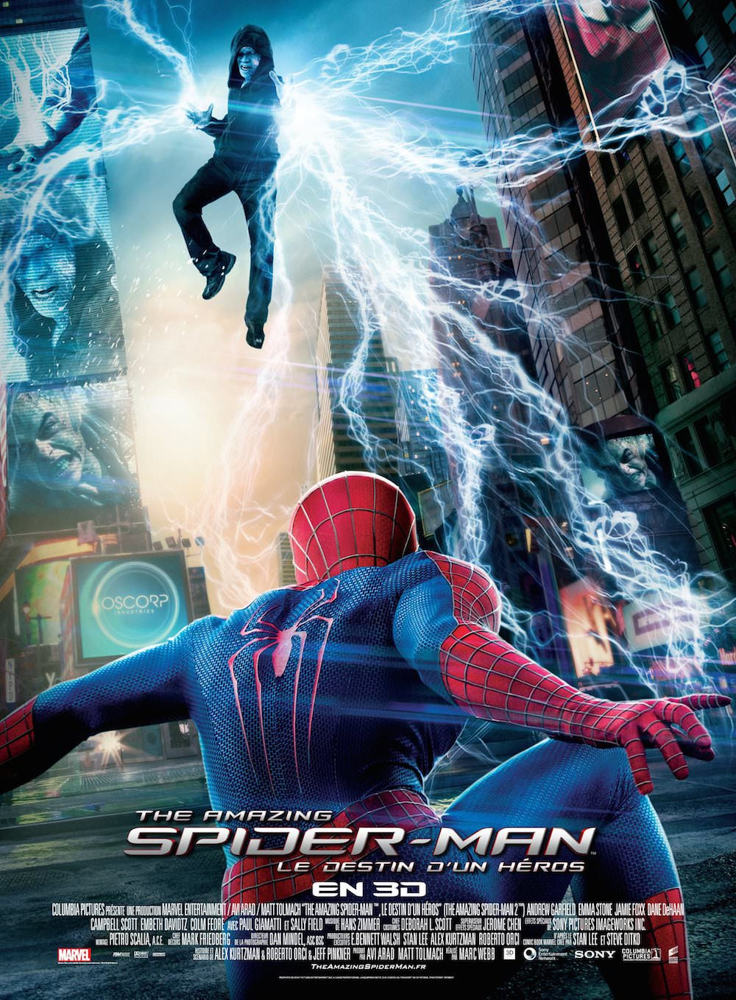

+++
type = "post"
titre = "<em>The Amazing Spider-Man : le Destin d&rsquo;un héros</em>, Marc Webb"
title = "The Amazing Spider-Man : le Destin d'un héros, Marc Webb"
url = "/amazing-spider-man-destin-heros-webb"
date = "2014-04-30T23:39:54"
Lastmod = "2014-05-01T10:15:04"
cover = "amazing-spider-man-2-webb.jpg"
categorie = [ "À voir" ]
tag = [ "Action", "Amour", "Blockbuster", "Comics", "Fantastique", "Maladie", "Mort", "Sorties du mois", "Superhéros" ]
createur = [ "Marc Webb" ]
acteur = [ "Andrew Garfield", "Dane DeHaan", "Emma Stone", "Jamie Foxx" ]
annee = [ "2014" ]
weight = 2014
saga = [ "The Amazing Spider-Man" ]
pays = [ "États-Unis" ]
original = "The Amazing Spider-Man 2"

+++

Le superhéros arachnéen de Marvel inspire toujours autant le cinéma. Après une première trilogie <a href="/trilogie-spider-man-raimi/">menée par Sam Raimi</a>, Marc Webb a repris le flambeau avec un reboot qui se transforme en nouvelle saga. En attendant les troisième et quatrième volets qui sont déjà prévus dans les années à venir, <em>The Amazing Spider-Man : le Destin d’un héros</em> <a href="#fn-11546-1" rel="footnote">1</a> poursuit le travail de relecture déjà mené dans <a href="/amazing-spider-man-webb/" title="The Amazing Spider-Man, Marc Webb"><em>The Amazing Spider-Man</em></a>. Loin de plagier son prédécesseur, le cinéaste choisit une autre voie, moins proche des blockbusters de superhéros tels qu’on a l’habitude de les voir. Les uns détesteront ce scénario qui privilégie une histoire d’amour aux thématiques habituelles des comics, mais on peut aussi accepter ces partis pris et découvrir un divertissement très efficace. Frappant encore plus fort que le premier épisode, cette suite propose de l’action à haute dose, mais parvient aussi à toucher grâce à ses personnages bien construits. Même si Marc Webb n’évite pas quelques pièges du genre, le spectacle est au rendez-vous et <em>The Amazing Spider-Man : le Destin d’un héros</em> est un film très plaisant.

Petit rappel de l’épisode précédent : dans <em>The Amazing Spider-Man</em>, Marc Webb remontait aux origines en montrant comment Peter Parker est passé de l’étudiant banal et invisible à l’homme-araignée adulé par une ville entière. Ceci étant posé, la suite peut se dérouler et <em>The Amazing Spider-Man : le Destin d’un héros</em> reprend très rapidement après son prédécesseur. Après un bref flashback où l’on assiste à la mort des parents du héros, l’action commence directement avec une attaque de fourgon contrecarrée par le superhéros. Superhéros qui est attendu au même moment pour la remise des diplômes de son université : dès les premières minutes, le scénario pose ainsi les bases du changement et on sait que les personnages vont être contraints d’évoluer et de passer à autre chose. L&rsquo;une des nouveautés immédiatement visible, c&rsquo;est l&rsquo;humour qui a envahi le film par petites touches, un peu dans le même esprit d&rsquo;un [<em>Avengers</em>](/avengers-whedon/ title=&nbsp;&raquo;Avengers, Joss Whedon&nbsp;&raquo;) ou de la <a href="/saga/iron-man/">saga <em>Iron Man</em></a>. Comme dans le premier volet, la relation amoureuse entre Peter Parker et Gwen Stacy, petite amie officielle du premier et ex-fille du patron de la police new-yorkaise, occupe le cœur du scénario. Fidèle au genre, le long-métrage introduit en effet une période de doute de la part du héros qui ne sait pas s’il doit continuer à faire ce qu’il fait. Mais contrairement à Sam Raimi qui avait aussi suivi cette voie, le doute n’est ici lié qu’à la copine. Le personnage principal de <em>The Amazing Spider-Man : le Destin d’un héros</em> a en effet assisté à la mort du père de Gwen à la fin de l’épisode précédent, et il a promis à ce dernier de protéger sa fille en restant éloigné. L’histoire commence ainsi autour d’un dilemme : doit-il arrêter d’être Spider-Man, ou bien doit-il abandonner celle qu’il aime, par amour ? On n’en dira pas plus, mais disons tout de même que Marc Webb parvient à construire deux personnages qui sont tout sauf des faire-valoir et qu’il fait naître une bonne d’émotion dans ce film par ailleurs explosif. Contrairement à ce que l’on avait vu dans les trois premiers <em>Spider-Man</em>, Peter Parker aime vraiment sa copine qui n’est pas là comme un faire-valoir, mais qui intervient vraiment dans le cours de l’action. Contre toute attente, le scénario rend cet amour crédible, une belle performance que le long-métrage doit d’abord au duo d’acteurs principaux.

De fait, la présence d’Andrew Garfield et d’Emma Stone participe à la réussite de ce film qui aurait sans doute été bien mauvais sans eux. Il ne s’agit pas de dire que <em>The Amazing Spider-Man : le Destin d’un héros</em> ne tient que grâce à eux, mais il faut reconnaître qu’ils ajoutent de l’épaisseur à une histoire par ailleurs assez banale. Car, qui dit superhéros, dit super vilain et le dernier long-métrage de Marc Webb n’en manque pas. C’est même tout l’inverse : alors même que le scénario introduit un bon méchant, cela ne lui suffit pas et il donne dans la surenchère avec un, voire même deux autres méchants. Les choses commencent pourtant plutôt bien avec le personnage de Max Dillon, un technicien qui travaille à Oscorp Industries. Un homme totalement invisible, et pourtant un génie qui a imaginé un système capable de créer toute l’énergie nécessaire pour alimenter New York, mais son idée est volée par ses dirigeants qui se l’approprient et font tout pour qu’il reste anonyme. La grande force de ce personnage, c’est d’en faire un double de Peter Parker dans <em>The Amazing Spider-Man</em>. Dans les deux cas, on a un personnage ignoré dans un premier temps qui veut attirer à lui toute l’attention. Les trajectoires diffèrent naturellement, mais on est frappé dans toute la première partie de <em>The Amazing Spider-Man : le Destin d’un héros</em> des points communs que l’on voit se tisser entre les deux films. Quand la transformation — accidentelle comme il se doit — se fait et que le méchant est devenu vraiment méchant, le film de Marc Webb retrouve les rails habituels, ce qui est un peu dommage. C’est d’ailleurs le principal défaut du film : même s’il ne manque pas de bonnes idées, à l’image du premier combat entre Electro et Spider-Man, au milieu d’une foule qui est présentée comme les spectateurs d’une arène à huer un gladiateur ou féliciter à l’autre. Cette vision ludique d’un combat par ailleurs très impressionnant — on ne pourra pas reprocher au cinéaste de ne pas faire dans le spectaculaire, et quelques séquences sont vraiment époustouflantes, notamment en 3D — est très intéressante et elle mérite d’être soulignée. Dommage, dès lors, de retomber dans les travers du blockbuster, à coup de séquences si prévisibles qu’on a l’impression de les avoir déjà vues quand on les voit à l’écran. <em>The Amazing Spider-Man : le Destin d’un héros</em> contient aussi quelques erreurs ou approximations grossières — vous saviez que la soie d’une araignée conduit l’électricité ? — qui ne suffisent pas à gâcher le spectacle, mais qui font tout de même un peu tache.

Malgré ses défauts, <em>The Amazing Spider-Man : le Destin d’un héros</em> n’a pas à rougir face à la trilogie de Sam Raimi. Certes, l’ambiance a changé et Marc Webb offre une vraie relecture, et non pas simplement un clone des premiers volets, ce qui devrait réjouir et non attirer les critiques. On peut ne pas apprécier cette ambiance de <em>Teen Movie</em> qui, si elle est bien moins présente dans cette suite, reste malgré tout sous-jacente. Reste que le cinéaste sait bien la mener, et qu’il n’en oublie pas pour autant le spectacle. À bien des égards d’ailleurs, <em>The Amazing Spider-Man : le Destin d’un héros</em> est l’épisode le plus impressionnant des deux sagas et les amateurs d’images spectaculaires ne devraient pas passer à côté. À défaut d’être un grand film, voici un divertissement réussi que l’on aurait tort de bouder pour un moment de détente.

<ol>
<li id="fn-11546-1">
Non, mais qui a choisi un titre aussi mauvais ? On peut comprendre l’idée de garder un titre en anglais — après tout c’était aussi le nom des comics originaux —, mais fallait-il vraiment ajouter un sous-titre en français ? Et devait-on avoir un sous-titre aussi médiocre, aussi vide de sens ?&#160;<a href="#fnref-11546-1" rev="footnote">&#8617;</a>
</li>
</ol>

