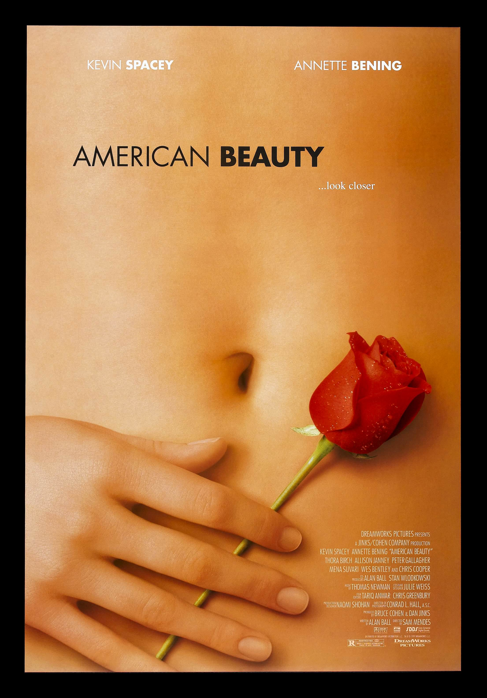
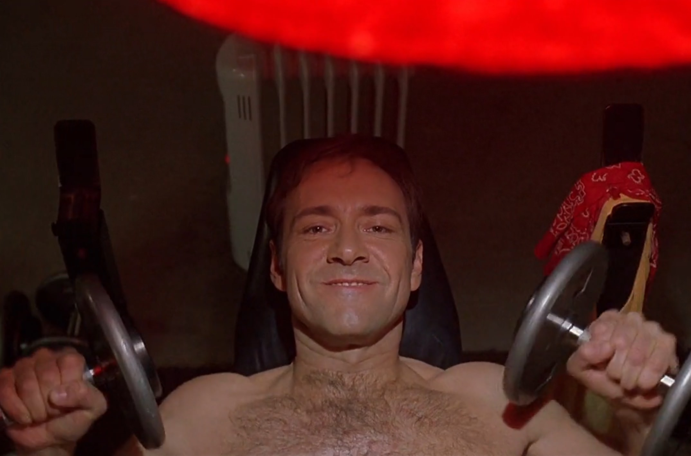
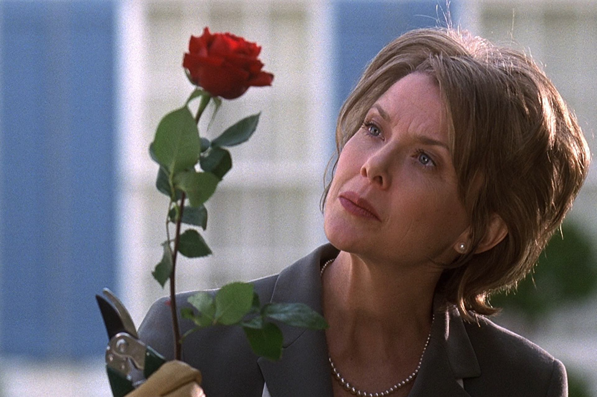

+++
type = "post"
titre = "<em>American Beauty</em>, Sam Mendes"
title = "American Beauty, Sam Mendes"
url = "/american-beauty-mendes"
date = "2015-05-10T21:03:22"
Lastmod = "2015-05-10T21:10:46"
cover = "american-beauty-sam-mendes.jpg"
categorie = [ "À voir" ]
tag = [ "Amour", "Banlieue", "Comédie dramatique", "Dépression", "Famille", "Mariage", "Sexe" ]
createur = [ "Sam Mendes" ]
acteur = [ "Annette Bening", "Chris Cooper", "Kevin Spacey", "Mena Suvari", "Thora Birch", "Wes Bentley" ]
annee = [ "1999" ]
weight = 1999
pays = [ "États-Unis" ]

+++

Sam Mendes n&rsquo;avait jamais tourné un long-métrage quand il signe avec DreamWorks pour réaliser <em>American Beauty</em>. Ce jeune metteur en scène qui s&rsquo;était fait connaître pour plusieurs pièces de théâtre à succès n&rsquo;était même pas le premier choix du studio, qui avait proposé le projet à une vingtaine de réalisateurs avant lui. En voyant le résultat, on a du mal à croire que l&rsquo;on a affaire à un réalisateur avec aussi peu d&rsquo;expérience, mais on a aussi du mal à croire que quelqu&rsquo;un d&rsquo;autre aurait pu prendre sa place. La maîtrise technique d&rsquo;<em>American Beauty</em> est époustouflante et elle est mise au service d&rsquo;une histoire fascinante et glaçante à la fois. Alan Ball, qui a créé quelques années plus tard l&rsquo;une des meilleures séries avec <a href="/six-feet-under-ball-hbo/" title="Six Feet Under, Alan Ball (HBO)"><em>Six Feet Under</em></a>, a écrit le scénario original du film et il reste impliqué dans le projet jusqu&rsquo;au bout. Est-ce pour cette raison que le long-métrage est si intense tout en offrant une vision comique de l&rsquo;Amérique moderne ? Toujours est-il que Sam Mendes ne pouvait guère rêver de meilleur tremplin pour sa carrière et des années après sa sortie, <em>American Beauty</em> reste un classique incontournable !

<em>American Beauty</em> commence de la manière la plus étrange qui soit, avec une vidéo où l&rsquo;on voit une fille demander à son copain qui la filme la mort de son père. Cet extrait, détaché de l&rsquo;intrigue principale du film, est la seule concession à un scénario par ailleurs linéaire, mais il annonce en quelque sorte la couleur dominante du film. Sam Mendes embraye avec un plan large sur une banlieue américaine tout ce qu&rsquo;il y a de plus banale et son personnage principal, Lester Burnham, raconte d&rsquo;entrée de jeu qu&rsquo;il va bientôt mourir. De manière assez astucieuse, le cinéaste annonce ainsi la fin de son histoire, tout en laissant planer un doute : puisque ce personnage est aussi le narrateur, vient-il vraiment d&rsquo;annoncer sa propre mort, ou bien s&rsquo;agit-il d&rsquo;une métaphore ? La première vision d&rsquo;<em>American Beauty</em> renforce cette incertitude : en multipliant les images, le scénario laisse une place au doute et même si le spectateur a été prévenu de sa mort, un doute subsiste. En attendant, Sam Mendes met en place son histoire autour d&rsquo;une famille typiquement américaine : Lester est marié à Carolyn depuis de nombreuses années, ils ont une fille nommée Jane et ils vivent une vie rangée d&rsquo;Américains moyens et <em>a priori</em> heureux. On s&rsquo;en doute vite, ce n&rsquo;est qu&rsquo;une façade et tous les personnages sont en fait malheureux. Jane est une adolescente complexée qui ne trouve pas sa place dans la vie, sa mère est une agence immobilière frustrée par ses échecs et son mariage et Lester est un employé qui vit à plein sa « <em>mid-life crisis</em> » quand il découvre Angela, une amie de sa fille qui réveille brutalement sa libido endormie depuis quelques années. Cette petite famille tranquille est sur le point d&rsquo;exploser et c&rsquo;est le point de départ d&rsquo;<em>American Beauty</em>, même si ce film ne peut pas être réduit à une seule thématique.

De fait, c&rsquo;est bien la richesse qui surprend dans ce long-métrage assez inclassable. Le ton général est assez dramatique, avec une tension permanente qui émane de la famille Burnham et on sent bien que quelque chose va exploser. L&rsquo;explosion viendra-t-il de la fille qui semble toujours plus agacée de ses parents ? De la mère qui craque après une journée de visites infructueuse ? C&rsquo;est bien entendu le narrateur qui concentre les attentions d&rsquo;<em>American Beauty</em> et le film tourne au registre comique quand il présente cet employé modèle depuis une quinzaine d&rsquo;années qui est toujours dans une position impossible. Toutes les scènes dans son entreprise grise et sans intérêt sont assez amusantes, tout en étant dramatiques sur le fond, tandis que l&rsquo;attrait du personnage pour la très jeune Angela sont filmées sur le mode du fantasme qui peut être également drôle. Mais ces touches légères — on pourrait encore citer le ridicule couple gay de la résidence qui essaie de s&rsquo;intégrer — ne dominent jamais et elles sont constamment combattues par un arrière-plan beaucoup plus sombre. Il y a ce jeune voisin, martyrisé par un père militaire bien trop sévère, et qui passe son temps à filmer. Il y a la noirceur de la fille de la famille, et puis celle de Carolyn qui semble bien prête à tuer son mari quand ce dernier reprend du poil de la bête. Car <em>American Beauty</em> est aussi un film sur un homme emprisonné dans un modèle et des habitudes qui l&rsquo;ont éloigné de ce qu&rsquo;il était et qui décide, un beau jour, de tout casser. Il démissionne de son travail, prend un petit boulot dans un fast-food local, se remet à faire de la musculation et fume des joints vendus par son jeune voisin. Il semble avoir perdu à nouveau vingt ans et il s&rsquo;affirme vis-à-vis de sa femme qu&rsquo;il a laissé faire. Ce personnage assez complexe est brillamment incarné par un Kevin Spacey en grande forme, qui trouve peut-être là le plus grand rôle de sa carrière — on comprend pourquoi Sam Mendes tenait absolument à lui donner ce rôle.

Impossible de réduire <em>American Beauty</em> à une seule idée, voire à un seul genre. On pourrait aussi longuement s&rsquo;attarder sur la beauté formelle du film : Sam Mendes n&rsquo;avait peut-être jamais réalisé de long-métrage, mais on sent que le jeune réalisateur avait déjà des idées bien arrêtées en matière de mise en scène. Privilégiant des plans très stables et fluides, le film avance avec une sérénité qui tranche avec l&rsquo;agitation qui secoue ses personnages. Et puis toutes ces séquences avec des roses sont vraiment magnifiques et restent des modèles du genre. <em>American Beauty</em> est une réussite pour toutes ces raisons, et grâce à toutes ses composantes. Il fallait la plume d&rsquo;Alan Ball, la réalisation de Sam Mendes, l&rsquo;excellente musique de Thomas Newman accompagnée d&rsquo;une sélection de titres pleine de sens, mais aussi de grands acteurs comme pouvaient l&rsquo;être Kevin Spacey et Annette Bening, pour incarner correctement ces personnages complexes et donner vie à une histoire aussi riche. À l&rsquo;arrivée, c&rsquo;est une réussite totale et le long-métrage se regarde toujours avec autant de plaisir : un classique, incontestablement.

<h3>Vous voulez <a href="/soutien/">m&rsquo;aider</a> ?</h3>
<ul>
<li><a href="http://www.amazon.fr/gp/product/B007EYQ2AM/ref=as_li_ss_tl?ie=UTF8&amp;tag=leblogdenic07-21&amp;linkCode=as2&amp;camp=1642&amp;creative=19458&amp;creativeASIN=B007EYQ2AM">Acheter le film en Blu-ray sur Amazon</a></li>
<li><a href="http://www.amazon.fr/gp/product/B000FUM0T4/ref=as_li_ss_tl?ie=UTF8&amp;tag=leblogdenic07-21&amp;linkCode=as2&amp;camp=1642&amp;creative=19458&amp;creativeASIN=B000FUM0T4">Acheter le film en DVD sur Amazon</a></li>
<li><a href="https://itunes.apple.com/fr/movie/american-beauty/id417361716">Acheter ou louer le film sur l&rsquo;iTunes Store</a></li>
<li><a href="http://www.netflix.com/WiMovie/60000407?trkid=50276800">Regarder le film sur Netflix</a></li>
</ul>

