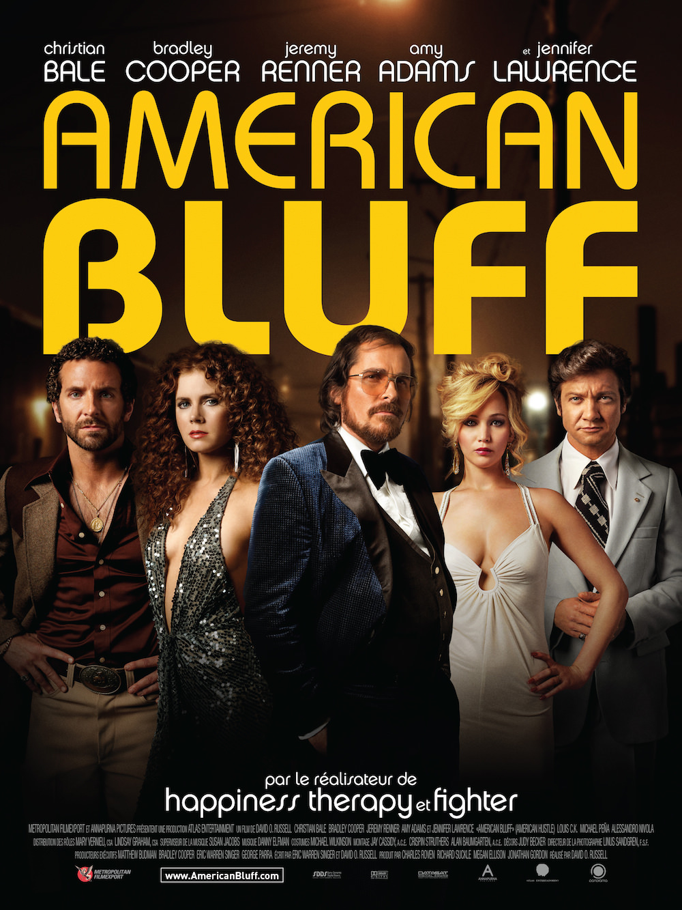
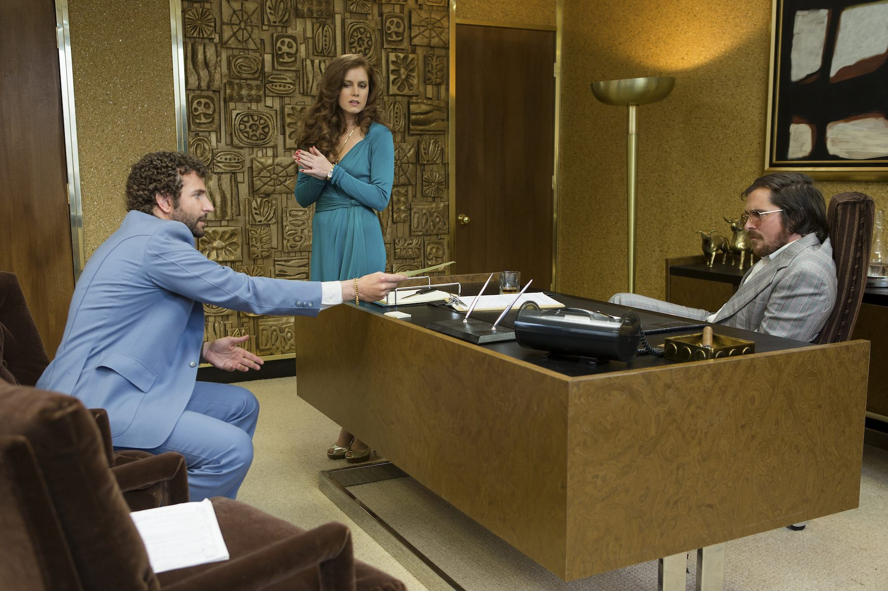
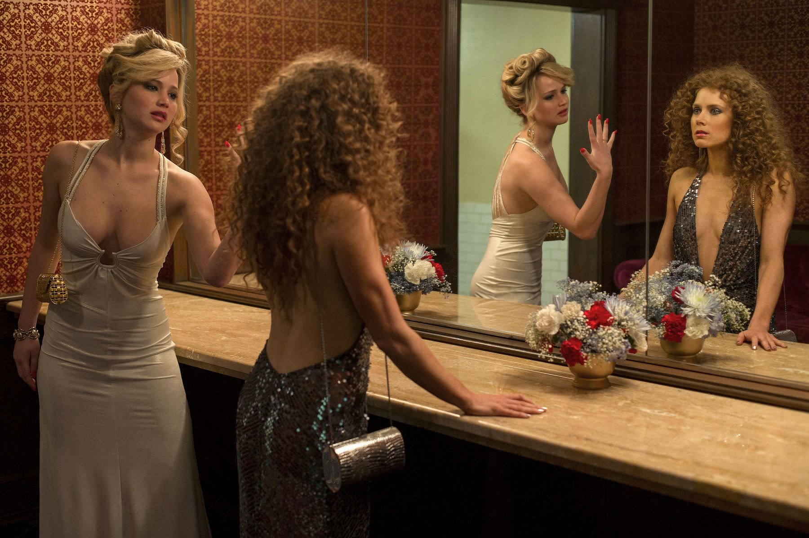

+++
type = "post"
titre = "<em>American Bluff</em>, David O. Russell"
title = "American Bluff, David O. Russell"
url = "/american-bluff-russell"
date = "2014-02-10T08:26:31"
Lastmod = "2014-03-27T15:44:22"
cover = "christian-bale-bradley-cooper-american-bluff.jpg"
categorie = [ "À voir" ]
tag = [ "Amour", "Argent", "Comédie dramatique", "Histoire vraie", "Mafia", "Police", "Politique", "Sorties du mois", "Thriller" ]
createur = [ "David O. Russell" ]
acteur = [ "Amy Adams", "Bradley Cooper", "Christian Bale", "Jennifer Lawrence", "Jeremy Renner", "Robert De Niro" ]
annee = [ "2014" ]
weight = 2014
pays = [ "États-Unis" ]
original = "American Hustle"

+++

Un an après <a href="http://voiretmanger.fr/happiness-therapy-russell/" title="Happiness Therapy, David O. Russell"><em>Happiness Therapy</em></a> qui avait déjà raflé plusieurs nominations, <em>American Bluff</em> est bien parti pour se faire remarquer aux Oscars. Il faut dire que le défilé de stars est une nouvelle fois impressionnant et David O. Russell a réuni sa troupe d’acteurs fétiches, pour un film qui semble calibré pour le prix américain. À l’écran, <em>American Bluff</em> est pourtant bien plus qu’un simple film à oscariser : inspirée de faits réels, cette histoire d’arnaque au cœur des États-Unis des années 1970 est une plongée réjouissante dans un univers et avec des personnages hauts en couleur. Sans être parfait, le huitième long-métrage du cinéaste américain est un divertissement très plaisant.

<em>American Bluff</em> commence avec une scène qui perd très rapidement tous les spectateurs. Sans aucune forme d’explication, on découvre en quelques minutes cinq ou six personnages et on ne comprend pas grand-chose de cette scène surréaliste où une mallette d’argent doit être absolument récupérée par un homme, mais on sent immédiatement qu’il y a anguille sous roche. De fait, David O. Russell remonte ensuite le temps et reprend l’histoire au commencement : on suit ainsi les pas d’Irving Rosenfeld, propriétaire d’une chaîne de pressings qui gagne en fait sa vie avec plusieurs affaires louches. Il achète et vend des tableaux pas toujours vrais et surtout il arnaque tous ceux qui ont absolument besoin d’argent rapidement, mais sans pouvoir passer par la banque. Ces petites arnaques finissent par être remarquées par le FBI et il se fait avoir avec Sydney, sa complice et par ailleurs femme qu’il aime. À partir de là, <em>American Bluff</em> imagine un scénario qui repose, comme son titre français l’indique bien, sur une immense partie de poker où tout le monde bluffe tout le monde. Richie, l’agent du FBI qui a arrêté les arnaqueurs, est extrêmement ambitieux et il veut profiter des talents d’Irving et de Sydney pour faire tomber des politiciens dans le piège de la corruption. Tous les personnages sont des menteurs doublés de manipulateurs, ce qui complique nécessairement le récit, mais le cinéaste a pris un grand soin pour nous raconter l’histoire sans nous perdre. C’est une qualité, mais aussi le principal défaut de ce long-métrage qui se perd un peu dans la lourdeur des explications. Le scénario fait le choix très littéraire de raconter, par les personnages qui deviennent narrateurs, ce qui se passe. Si au départ, c’est plutôt malin et bien trouvé pour poser le contexte, le procédé est un peu systématique et il alourdit l’ensemble, alors que bon nombre d’explications n’étaient pas nécessaires.

Difficile de parler d’<em>American Bluff</em> sans en dire trop, mais en même temps, l’histoire dans les grandes lignes est très simple à comprendre et elle n’a pas tant d’importance que cela dans les détails. On sent d’emblée que l’arnaque va se diffuser dans tout le film et que l’on aura du mal à savoir précisément qui arnaque qui avant la toute fin. David O. Russell met très bien en place une construction complexe où tout le monde peut arnaquer tout le monde et son film n’est pas, à cet égard, très original. L’intérêt vient surtout des personnages et en particulier des relations amoureuses : deux triangles amoureux se mettent en fait en place, entre Irving, sa femme Rosalyn et son amante et complice Sydney d’une part et entre Sydney, son complice Irving et l’agent du FBI Richie. Les tensions et les jalousies entre ces personnages sont très bien rendues et <em>American Bluff</em> signe ses plus grandes scènes dans ces moments-là, surtout entre Rosalyn et Sydney. Les deux actrices, respectivement Jennifer Lawrence et Amy Adams, s’en donnent à cœur joie et elles sont vraiment excellentes, la première en blonde un peu folle et extravagante, la deuxième en manipulatrice confirmée. Les deux actrices sont épatantes, mais on retiendra surtout la prestation de Jennifer Lawrence dans ce rôle qui lui va comme un gant. À leurs côtés, les acteurs ne sont pas en reste : bedonnant et à moitié chauve, Christian Bale est méconnaissable, tandis que Bradley Cooper est lui aussi excellent dans le rôle de l’agent un peu trop ambitieux et volontaire. Certes, David O. Russell leur offre une occasion en or de gagner un Oscar supplémentaire, mais le long-métrage dépasse ce simple statut et il offre aussi un divertissement de qualité, porté par une <a href="https://itunes.apple.com/fr/album/american-hustle-original-motion/id766990274">bande originale</a> très convaincante.

Même s’il aurait mérité un petit peu plus de finesse dans l’écriture, même si le procédé de narration est un peu lourd, <em>American Bluff</em> reste un très bon film porté par des acteurs vraiment excellents. On s’amuse beaucoup dans ces années 1970 parfaitement reconstituées et on suit avec beaucoup de plaisir les arnaques qui s’ajoutent aux arnaques pour former un montage de mensonges complexe et assez réjouissant. Le dernier long-métrage de David O. Russell n’est pas inoubliable, mais il est parfait pour une séance ciné sympa…

