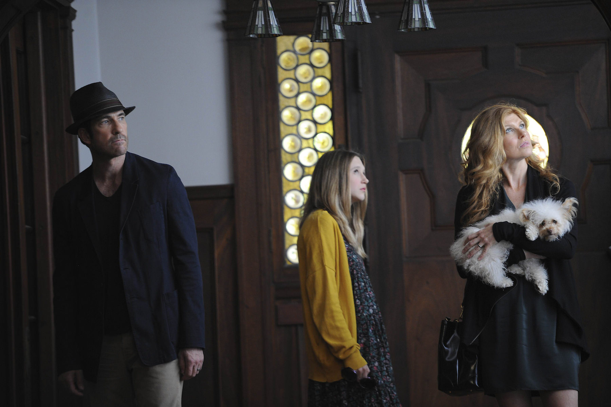
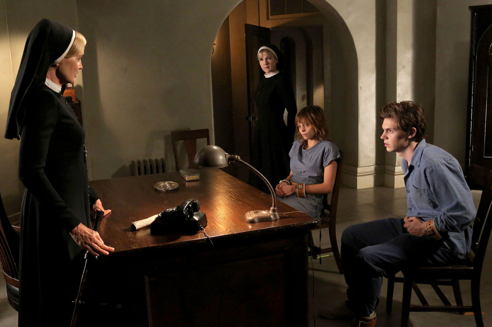
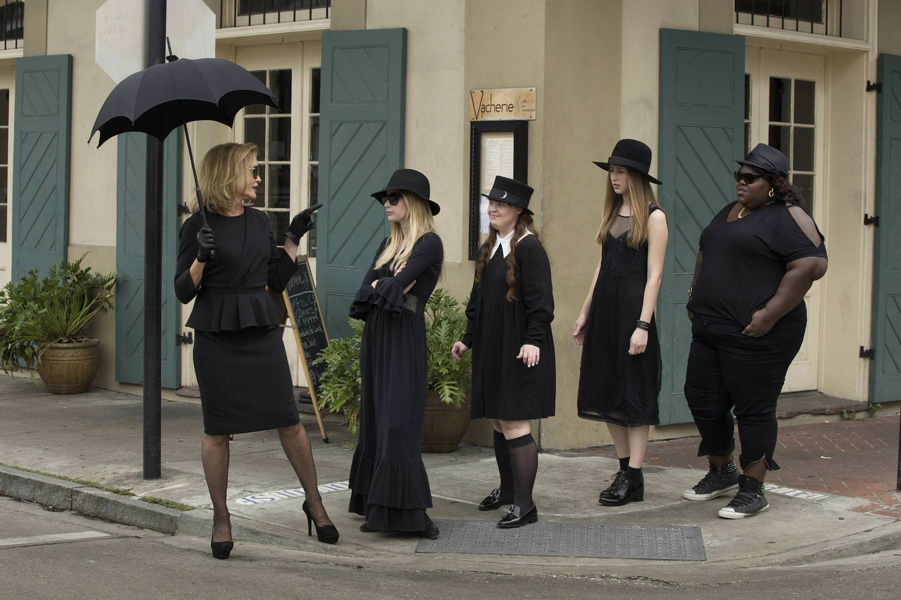
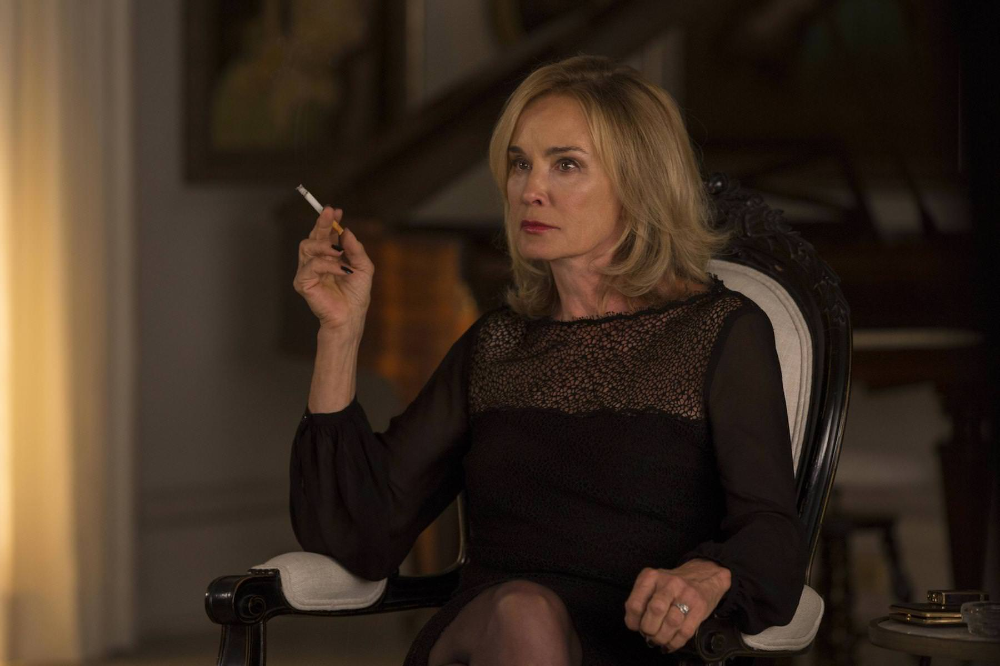

+++
type = "post"
titre = "<em>American Horror Story</em>, Ryan Murphy et Brad Falchuk (FX)"
title = "American Horror Story, Ryan Murphy et Brad Falchuk (FX)"
url = "/american-horror-story-murphy-falchuck"
date = "2014-02-08T12:56:30"
Lastmod = "2014-02-08T13:01:23"
cover = "american-horror-story.jpg"
categorie = [ "À voir" ]
tag = [ "Fantastique", "Folie", "Horreur", "Maison hantée", "Série", "Sorcellerie" ]
createur = [ "Brad Falchuk", "Ryan Murphy" ]
acteur = [ "Denis O'Hare", "Evan Peters", "Frances Conroy", "Jessica Lange", "Lily Rabe", "Sarah Paulson", "Taissa Farmiga", "Zachary Quinto" ]
annee = [ "2011" ]
weight = 2011
pays = [ "États-Unis" ]

+++

Ryan Murphy et Brad Falchuk ont eu besoin de changer après <em>Glee</em>. Leur nouvelle série pourrait difficilement être plus différente, puisque après la comédie musicale et les romances, c&rsquo;est l&rsquo;horreur sous toutes ses formes qui a motivé <em>American Horror Story</em>. Sorcières et vaudous, maison hantée et fantômes, asile et monstres… au fil des saisons, la série fait le point sur l&rsquo;horreur et propose à chaque fois une vision différente sur le genre. Chaque saison est totalement indépendante et on ne retrouve que les acteurs d&rsquo;une année à l&rsquo;autre. Une conception originale, pour une série riche et prenante qui parvient à maintenir l&rsquo;intérêt en se renouvelant à chaque fois. En attendant de savoir si ses concepteurs parviendront à trouver suffisamment d&rsquo;idées nouvelles pour les saisons suivantes, les trois premières d&rsquo;<em>American Horror Story</em> méritent d&rsquo;être vues si l&rsquo;on aime le genre.

Pour lancer leur nouvelle série, Ryan Murphy et Brad Falchuk ont choisi un classique de l&rsquo;horreur : la maison hantée. La première saison d&rsquo;<em>American Horror Story</em> suit les aventures malheureuses de la famille Harmon qui emménage dans une vieille maison de Los Angeles pour oublier les malheurs de leur vie à Boston. Ben a trompé Vivien, sa femme qui sort tout juste d&rsquo;une fausse couche. Entre les deux, Violet, leur fille, n&rsquo;a d&rsquo;autres choix que de suivre ses parents, mais elle le fait de mauvaise grâce. La maison qu&rsquo;ils achètent est très bon marché, c&rsquo;est même, et de loin, la moins chère des environs. Ne se doutant de rien, la famille s&rsquo;y installe, mais ils découvrent ensuite que des choses étranges s&rsquo;y déroulent. La série développe toutes les pistes traditionnelles du genre, des portes qui claquent aux apparitions dans les miroirs, mais <em>American Horror Story</em> ne se contente pas de reprendre une recette ancienne sans la retoucher. Cette maison hantée est remise au goût du jour avec quelques bonnes idées et notamment des fantômes modernisés, qui apparaissent sous une forme parfaitement normale. Difficile de parler de la saison sans trop en dire au risque de casser le suspense, mais on peut dire que les scénaristes ont su créer une ambiance particulière à partir d&rsquo;une situation banale. L&rsquo;horreur n&rsquo;arrive pas brutalement, elle est instillée progressivement et la série tend vers une folie toujours plus grande.

Jouant sur les clichés du genre, Ryan Murphy et Brad Falchuk signe une première saison plus amusante que vraiment horrifiante. Après cette saison qui se suffit à elle-même, <em>American Horror Story</em> change totalement dans la deuxième saison. Finie la maison hantée, place à un asile de fous dans les années 1960 et à ses expérimentations sordides menées par un ancien nazi. Changement de décor, changement d&rsquo;ambiance et changement de personnages : la série propose à chaque fois des histoires complètement différentes, une idée originale et plutôt réussie dans ce cas. Même si les séries traditionnelles profitent en temps normal de la longueur pour développer au maximum leurs personnages, on apprécie ici de partir sur tout autre chose et ainsi de voir le concept à l&rsquo;origine de la série développé au maximum. Si les personnages changent d&rsquo;une saison à l&rsquo;autre, les acteurs restent et <em>American Horror Story</em> s&rsquo;amuse aussi à changer leurs rôles du tout au tout. Dans le lot, on retient surtout la prestation toujours impressionnante de Jessica Lange qui interprétait une voisine inquiétante dans la première saison et incarne sœur Judith, la patronne de l&rsquo;asile dans la deuxième. Elle participe beaucoup de la réussite de cette saison assez spéciale : comme dans <em>Nip/Tuck</em>, leur première création, Ryan Murphy et Brad Falchuk s&rsquo;en donnent à cœur joie et imaginent une histoire toujours plus folle. Si la première saison ne faisait pas vraiment peur, celle-ci est plus forte et plus barrée en même temps. Beaucoup moins linéaire, plus originale, elle conviendra à tous ceux qui aiment être un peu perdus par une intrigue.

À cet égard, la troisième saison est beaucoup plus conventionnelle. <em>American Horror Story</em> change à nouveau de style et d&rsquo;ambiance, mais aussi de mythe avec cette fois celui de la sorcellerie. Ryan Murphy et Brad Falchuk ne changent pas d&rsquo;époque toutefois et cette saison est contemporaine. On suit cette fois le parcours de plusieurs jeunes sorcières dans un « <em>Coven</em> », une sorte de maison qui rassemble, protège et forme les sorcières. Jessica Lange interprète à nouveau le premier rôle en incarnant la Suprême, la sorcière la plus puissante de toute. Située en Nouvelle-Orléans, cette saison frappe à nouveau par son ambiance particulière et aussi par ses personnages haut en couleur. Même si on peut compter sur quelques flashbacks qui conceptualisent ou apportent quelques éléments d&rsquo;explication, le récit retrouve une normalité et une linéarité. Cette saison est très réussie pour son ambiance et aussi par sa capacité à se réaproprier le mythe des sorcières en gardant une bonne dose de traditions, mais en insufflant aussi quelques idées nouvelles. La star hollywoodienne qui se découvre sorcière est bien vue et l&rsquo;opposition avec les sorcières noires vaudous est peut-être facile, mais réussie. Même si le scénario prend quelques facilités à tuer et ressusciter les personnages selon les besoins, cette saison fait d&rsquo;<em>American Horror Story</em> une belle trilogie, avec quelques personnages vraiment excellents. S&rsquo;il ne fallait en retenir qu&rsquo;un, ce serait celui de Myrtle, interprété par une Frances Conroy déjantée en très grande forme.

<em>American Horror Story</em> est une série originale par sa conception en saisons totalement distinctes. C&rsquo;est une idée rare qui permet à Ryan Murphy et Brad Falchuk de couvrir différents thèmes : maison hantée, sorcières et asile de fous, il y a de l&rsquo;horreur ou du fantastique pour tous les goûts. Même si les personnages n&rsquo;ont pas le temps d&rsquo;être développé au-delà d&rsquo;une saison, les scénaristes ont réussi à leur offrir suffisamment d&rsquo;épaisseur et le plus étonnant est peut-être que l&rsquo;on retrouve une certaine unité dans chaque saison. Il y a bien sûr la réalisation et notamment une photographie toujours assez  sombre, mais aussi une bande originale qui opte pour un morceau répété comme un leitmotiv pendant une saison. <em>American Horror Story</em> n&rsquo;est peut-être pas la série la plus parfaite, mais elle offre un divertissement de qualité, même si l&rsquo;horreur n&rsquo;est pas votre genre de prédilection.

<h3>Vous voulez m&rsquo;aider ?<a href="#footnote_0_11117" id="identifier_0_11117" class="footnote-link footnote-identifier-link" title="&Agrave; propos de la publicit&eacute;&hellip;">1</a></h3>
<ul>
<li><a href="http://www.amazon.fr/gp/product/B00801WA36/ref=as_li_ss_tl?ie=UTF8&#038;tag=leblogdenic07-21&#038;linkCode=as2&#038;camp=1642&#038;creative=19458&#038;creativeASIN=B00801WA36">Acheter la saison 1 en Blu-Ray sur Amazon</a></li>
<li><a href="http://www.amazon.fr/gp/product/B00801W9XC/ref=as_li_ss_tl?ie=UTF8&#038;tag=leblogdenic07-21&#038;linkCode=as2&#038;camp=1642&#038;creative=19458&#038;creativeASIN=B00801W9XC">Acheter la saison 1 en DVD sur Amazon</a></li>
<li><a href="https://itunes.apple.com/fr/tv-season/american-horror-story-saison/id624738798">Acheter ou louer la saison 1 sur l&rsquo;iTunes Store</a></li>
</ul>
<ul>
<li><a href="http://www.amazon.fr/gp/product/B00DNCXUOU/ref=as_li_ss_tl?ie=UTF8&#038;tag=leblogdenic07-21&#038;linkCode=as2&#038;camp=1642&#038;creative=19458&#038;creativeASIN=B00DNCXUOU">Acheter la saison 2 en Blu-Ray sur Amazon</a></li>
<li><a href="http://www.amazon.fr/gp/product/B00DNCXSYC/ref=as_li_ss_tl?ie=UTF8&#038;tag=leblogdenic07-21&#038;linkCode=as2&#038;camp=1642&#038;creative=19458&#038;creativeASIN=B00DNCXSYC">Acheter la saison 2 en DVD sur Amazon</a></li>
<li><a href="https://itunes.apple.com/fr/tv-season/american-horror-story-asylum/id631428742">Acheter ou louer la saison 2 sur l&rsquo;iTunes Store</a></li>
</ul>
<ul>
<li><a href="http://www.amazon.fr/gp/product/B00H2IMSOO/ref=as_li_ss_tl?ie=UTF8&#038;tag=leblogdenic07-21&#038;linkCode=as2&#038;camp=1642&#038;creative=19458&#038;creativeASIN=B00H2IMSOO">Acheter la saison 3 en Blu-Ray sur Amazon</a></li>
<li><a href="http://www.amazon.fr/gp/product/B00H2IMS1W/ref=as_li_ss_tl?ie=UTF8&#038;tag=leblogdenic07-21&#038;linkCode=as2&#038;camp=1642&#038;creative=19458&#038;creativeASIN=B00H2IMS1W">Acheter la saison 3 en DVD sur Amazon</a></li>
</ul>

<ol class="footnotes"><li id="footnote_0_11117" class="footnote"><a href="http://voiretmanger.fr/soutien/">À propos de la publicité…</a> [<a href="#identifier_0_11117" class="footnote-link footnote-back-link">&#8617;</a>]</li></ol>
