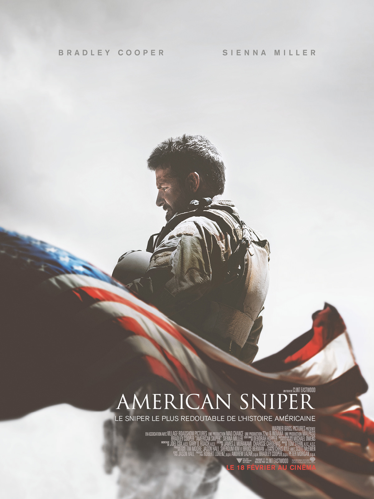
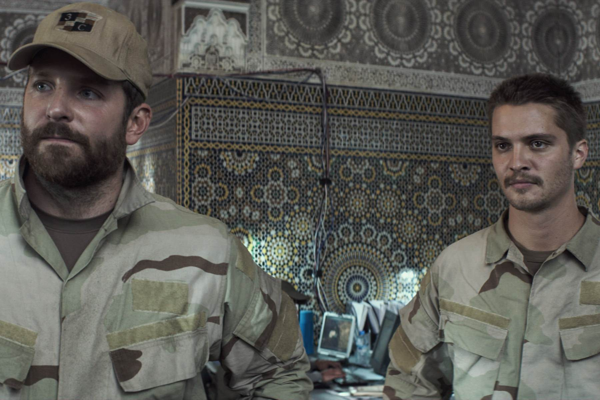
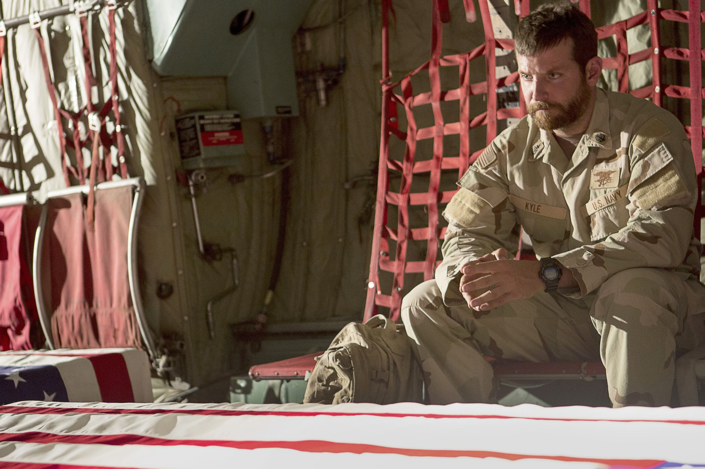

+++
type = "post"
titre = "<em>American Sniper</em>, Clint Eastwood"
title = "American Sniper, Clint Eastwood"
url = "/american-sniper-eastwood"
date = "2015-03-03T23:42:58"
Lastmod = "2015-03-03T23:48:28"
cover = "american-sniper-bradley-cooper.jpg"
categorie = [ "À voir" ]
tag = [ "Adaptation littéraire", "Blockbuster", "Famille", "Guerre", "Histoire vraie", "Idéologie", "Sorties du mois", "Terrorisme" ]
createur = [ "Clint Eastwood" ]
acteur = [ "Bradley Cooper", "Jake McDorman", "Luke Grimes", "Sienna Miller" ]
annee = [ "2015" ]
weight = 2015
pays = [ "États-Unis" ]

+++

Chris Kyle n&rsquo;est pas très connu en Europe, mais de l&rsquo;autre côté de l&rsquo;Atlantique, il est un véritable héros. Ce tireur d&rsquo;élite appartenait au corps d&rsquo;élite des <a href="https://fr.wikipedia.org/wiki/SEAL">SEAL</a> et il est connu pour avoir tué plusieurs centaines de personnes pendant la guerre en Irak. Clint Eastwood raconte son parcours dans son dernier long-métrage en se basant sur la biographie publié par le militaire avant sa mort, en 2013. <em>American Sniper</em> célèbre « <em>le sniper le plus redoutable de l&rsquo;histoire américaine</em> » et on pouvait craindre un déferlement idéologique en faveur des États-Unis et de la guerre contre le terrorisme. À l&rsquo;arrivée, le cinéaste offre une vision plus complexe, avec un traitement très aride de ce personnage qui était censé être héroïque. S&rsquo;il n&rsquo;était gâché par une fin brutalement idéologisante, ce film serait une excellente, quoique fort peu originale, plongée dans la guerre en Irak.

<em>American Sniper</em> ouvre avec la toute première fois que Chris Kyle est déployé en Irak. Le tireur d&rsquo;élite est posté sur un toit dans un environnement urbain et il doit surveiller, à travers sa lunette, les alentours et surtout protéger les <em>marines</em> qui avancent dans la rue, en contrebas. Il remarque d&rsquo;abord un homme qui passe un appel, puis une femme qui sort avec son enfant. Quand cette femme sort une grenade et la donne à son fils qui courre alors vers les soldats, Chris Kyle doit décider de tirer et de tuer deux personnes qui devraient être loin de la guerre. Quand le coup de feu retentit, Clint Eastwood coupe brutalement la séquence et nous ramène des années auparavant, quand le jeune Chris apprenait à chasser avec son père. Le traitement est un petit peu lourd, mais il est efficace : le film lie ainsi ce tireur d&rsquo;élite à sa plus tendre enfance. Et semble nous dire d&rsquo;emblée qu&rsquo;il était prédestiné à tuer plus de 200 personnes depuis les toits irakiens en près de trois ans de service sur place. Passée l&rsquo;introduction d&rsquo;une lourdeur infinie sur l&rsquo;enfance du personnage, le cinéaste nous présente rapidement l&rsquo;entraînement du héros de guerre — incarné par un Bradley Cooper vraiment excellent —, sa rencontre avec Taya Renae (Sienna Miller, méconnaissable) qui deviendra sa femme, mais l&rsquo;essentiel d&rsquo;<em>American Sniper</em> se déroule sur le champ de bataille, en Irak. Et on est alors surpris par la sécheresse du propos : Clint Eastwood aurait pu jouer sur la corde patriotique du début à la fin et il y avait matière à écrire un film très idéologique, contre le terrorisme et en faveur de la démocratie qui se bat pour conserver ses libertés. Pourtant, le long-métrage s&rsquo;avère plus complexe que cela…

Certes, <em>American Sniper</em> ne présente jamais le point de vue de l&rsquo;ennemi, qui reste globalement qualifié d&rsquo;ordures et même de tortionnaires avec ce membre d&rsquo;al-Qaïda qui torture sans vergogne ses victimes, irakiennes ou américaines. Clint Eastwood ne prend jamais la peine d&rsquo;essayer de comprendre l&rsquo;autre camp et il se concentre sur les États-Unis, mais est-ce pour autant par pure idéologie ? On pourrait arguer que le cinéaste, connu pour son engagement politique en faveur des Républicains, nous manipule en faisant passer le message de la droite américaine, mais ce serait oublier que ce que l&rsquo;on voit à l&rsquo;écran n&rsquo;est pas aussi tranché. Si l&rsquo;on reste du côté américain, c&rsquo;est tout simplement parce que la mise en scène adopte strictement le point de vue de Chris Kyle. On est dans sa tête, on suit la guerre à travers ses yeux et lui, effectivement, ne voit l&rsquo;ensemble qu&rsquo;en noir et en blanc. Il doit sauver son pays contre le terrorisme et tuer le maximum de méchants pour cela : c&rsquo;est son objectif et le personnage le rappelle constamment, à lui-même comme à son entourage. Pourtant, <em>American Sniper</em> montre bien que ce message angélique ne tient pas face à la réalité. Quand un autre militaire fait part de ses doutes sur le bien-fondé de leurs missions militaires ou quand la femme de Chris Kyle lui rétorque qu&rsquo;il ne repart pas en Irak pour les sauver, on voit bien les failles de l&rsquo;argumentation. Par petites pointes, Clint Eastwood détruit en fait le message idéologique, jusqu&rsquo;à la mise en scène qui mine systématiquement les actes héroïques du personnage. Un exemple, très représentatif de ce mouvement : quand le tireur d&rsquo;élite tire sur un <em>sniper</em> ennemi après des semaines de traque, ce devrait être un moment héroïque et glorieux, mais ce n&rsquo;est pas le cas. D&rsquo;une part, parce qu&rsquo;éliminer cette cible est présenté comme un objectif plus personnel que nécessaire ; d&rsquo;autre part parce que cette séquence est immédiatement suivie d&rsquo;une catastrophe militaire causée par l&rsquo;entêtement du personnage.

Ainsi, loin de glorifier son personnage, Clint Eastwood passe son temps, pendant près de deux heures, à le présenter sous un angle beaucoup plus sombre. Loin du héros sauveur de la nation, Chris Kyle est un soldat redoutablement efficace, mais qui ne sait rien faire d&rsquo;autre que tuer et qui ne parvient jamais à oublier la guerre. C&rsquo;est en tout cas le point de vue d&rsquo;<em>American Sniper</em> jusqu&rsquo;à la fin qui vient tout gâcher. Brutalement, alors que l&rsquo;idéologie avait été contrôlée pendant tout son film, le réalisateur la ressort avec force dans une ultime séquence qui reprend les images de l&rsquo;enterrement du tireur d&rsquo;élite. Tout devient alors propagande, les drapeaux au ralenti, la musique… et on ne comprend plus rien. On venait de regarder un film assez critique sur un personnage qui est brusquement présenté comme un héros. A-t-on été trompé par Clint Eastwood ? Ou alors la fin d&rsquo;<em>American Sniper</em> n&rsquo;est-elle que très maladroite ? Impossible de le savoir et on reste ainsi sur cette position très inconfortable qui mine complètement le film : quel gâchis.

