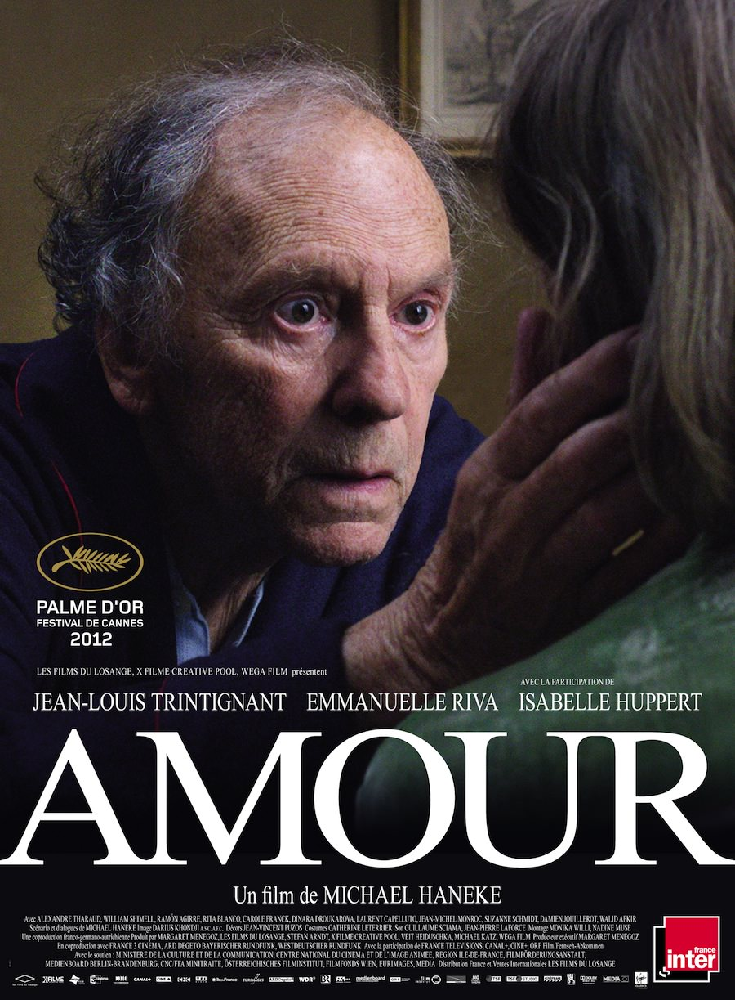
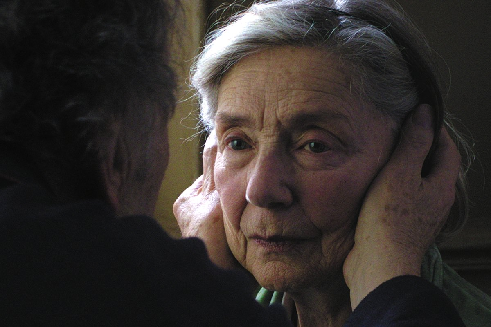

+++
type = "post"
titre = "<em>Amour</em>, Michael Haneke (Palme d&rsquo;or 2012)"
title = "Amour, Michael Haneke (Palme d'or 2012)"
url = "/amour-haneke-palme-or-2012"
date = "2012-10-25T00:00:37"
Lastmod = "2013-10-12T10:50:14"
cover = "amour-haneke-trintignant.jpg"
categorie = [ "À voir" ]
tag = [ "Amour", "Famille", "Huis clos", "Maladie", "Mort" ]
acteur = [ "Emmanuelle Riva", "Isabelle Huppert", "Jean--Louis Trintignant" ]
annee = [ "2012" ]
weight = 2012
saga = [ "Palmes d'or" ]
pays = [ "France" ]

+++

Michael Haneke est entré cette année dans le club très fermé des réalisateurs qui ont obtenu au moins deux fois la Palme d&rsquo;or, récompense suprême au cinéma. Trois ans seulement après <a title="Le Ruban blanc, Michael Haneke (Palme d’or 2009)" href="http://voiretmanger.fr/2009/10/23/le-ruban-blanc-haneke/"><em>Le Ruban blanc</em></a>, il a obtenu à nouveau cette réponse pour un film énigmatique dès son titre. <em>Amour</em>, où l&rsquo;histoire d&rsquo;un couple frappé par la maladie… Le sujet n&rsquo;est guère réjouissant, mais il ne faut pas s&rsquo;y arrêter. Avec ce onzième long-métrage, le cinéaste autrichien trouve enfin un sujet à la hauteur de l&rsquo;amour, et donc de la mort. Un très beau film, à ne pas rater en salles à condition d&rsquo;accepter de sortir du cinéma plombé par l&rsquo;ambiance d&rsquo;<em>Amour</em>.

Georges et Anne vivent dans un grand appartement parisien. Ce couple octogénaire y vit certainement depuis très longtemps, à en juger à la décoration vieillie et à l&rsquo;absence totale d&rsquo;équipements modernes ou même d&rsquo;écran. Professeurs de musique, ils mènent une vie paisible et sont follement amoureux, comme au premier jour. Ils vivent dans leur confortable appartement depuis tant d&rsquo;années que rien ne semble être capable de remettre en cause leur équilibre. Un matin pourtant, Anne a une absence : pendant quelques minutes, elle reste impassible, le regard dans le vide, absente. La vieille femme a une attaque cérébrale, une première alerte qui reste bénigne, mais qui doit être soignée. Malheureusement, l&rsquo;opération garantie sans danger se passe mal et Georges ramène sa femme à moitié paralysée. C&rsquo;est le début d&rsquo;une longue maladie qui va emporter peu à peu Anne, une longue maladie qui pourrait ébranler leur amour pourtant si intense…

Michael Haneke n&rsquo;est pas cinéaste à mettre des gants pour protéger la sensibilité de ses spectateurs. <em>Amour</em> ouvre ainsi avec une mort, ou plutôt avec la découverte d&rsquo;une morte : des pompiers entrent dans un appartement en forçant la porte et ils retrouvent dans la chambre à coucher une femme d&rsquo;un certain âge, visiblement morte depuis quelques jours déjà. Quand le récit principal prend le relais, on retrouve bien évidemment le même appartement et on comprend immédiatement que l&rsquo;histoire d&rsquo;Anne et Georges ne peut se terminer autrement que par la mort. Ce thème plane sur tous les films du cinéaste, il est ici aussi présent dès les premières images et pendant les deux heures que compte le long-métrage. Avant la mort, c&rsquo;est la maladie qui a droit au premier rôle dans <em>Amour</em>. Le corps d&rsquo;Anne se décompose peu à peu, elle perd d&rsquo;abord l&rsquo;usage du bras et de la jambe gauche, puis la paralysie gagne du terrain à la faveur d&rsquo;une attaque et cette femme si énergique en début de film s&rsquo;approche rapidement du légume. Le personnage n&rsquo;atteint toutefois jamais ce stade, Michael Haneke prend grand soin de nous faire comprendre qu&rsquo;Anne reste toujours parfaitement consciente. Parmi les plus belles séquences d&rsquo;<em>Amour</em>, on compte justement la bataille perdue d&rsquo;avance de la malade pour retrouver l&rsquo;usage de son corps, alors qu&rsquo;elle sent parfaitement qu&rsquo;elle est en train de le perdre inexorablement. C&rsquo;est à la fois très beau et triste, rageant même tant l&rsquo;impuissance du personnage est sensible.

La mort et l&rsquo;amour ne sont jamais loin, dans la pensée freudienne comme dans <em>Amour</em>. Aux côtés d&rsquo;une Anne terrassée par la maladie, Michael Haneke filme un époux toujours aussi follement amoureux qui refuse de baisser les bras et qui se bat coûte que coûte pour sauver sa femme. Il suffit de quelques images pour que tout l&rsquo;amour des deux personnages principaux soit transmis : certains couples s&rsquo;éloignent avec les années, pas celui-ci qui reste toujours aussi frais et puissant qu&rsquo;au premier jour. Quand la maladie saisit sa femme, George est évidemment terrassé, mais il se ressaisit vite et consacre à partir de ce moment-là sa vie entière à aider sa femme. Malgré les conseils de sa fille et de ses proches, George tient la promesse faite à sa femme de ne pas l&rsquo;envoyer à l&rsquo;hôpital ou dans une maison de retraite et il préfère se tuer à la tâche pour aider Anne. <em>Amour</em> ne fait pas dans l&rsquo;angélisme, on ne nous épargne rien et surtout pas les détails peu ragoûtants sur l&rsquo;entretien d&rsquo;une malade, mais l&rsquo;amour qui étreint les deux personnages rend ces séquences supportables et même émouvantes. C&rsquo;est particulièrement le cas à la fin, quand la maladie devient si forte que les infirmières s&rsquo;enchaînent au chevet de la malade : George accompagne Anne qui essaie de chanter et cette chorale timide composée surtout d&rsquo;onomatopées est tout simplement magnifique.

Si certaines séquences sont émouvantes et même belles, elles ne mettent que mieux en valeur l&rsquo;aridité générale d&rsquo;<em>Amour</em>. Fidèle à lui-même, Michael Haneke compose un long-métrage froid, presque clinique, composé quasiment exclusivement de longs plans fixes sans musique. Nonobstant une séquence, <em>Amour</em> est par ailleurs un huis clos qui se déroule intégralement dans l&rsquo;appartement du couple, et encore surtout dans trois pièces de cet appartement. Autant dire que l&rsquo;on finira par bien connaître ces décors, avec à la clé le sentiment étrange parfois que l&rsquo;on y est personnellement passé. Il faut dire que le cinéaste a choisi un traitement naturel très proche du documentaire : on suit les deux personnages dans leur quotidien, on assiste à toutes leurs activités et même aux plus ingrates, comme si les deux acteurs étaient non professionnels et jouaient en fait leur rôle. Il convient à ce propos de saluer les performances époustouflantes de Jean-Louis Trintignant et d&rsquo;Emmanuelle Riva. Ces deux stars du cinéma français qui ont eu des carrières impressionnantes sont ici troublants, tant ils parviennent à rendre leurs deux personnages crédibles. Ce ne sont pas des rôles faciles, pour l&rsquo;un comme pour l&rsquo;autre, mais ils font vraiment des merveilles sous la direction du cinéaste. Car, même si <em>Amour</em> peut parfois sembler si nature que l&rsquo;on pense à un documentaire, il s&rsquo;agit bien de cinéma, avec une mise en scène et un montage toujours particulièrement travaillés. Les cadres sont très soignés par Michael Haneke qui a aussi un sens du rythme et de l&rsquo;ellipse qui est remarquable.

<iframe src="http://player.vimeo.com/video/50064905?title=0&amp;byline=0&amp;portrait=0&amp;badge=0" frameborder="0" width="100%" height="375"></iframe>

Atteindre l&rsquo;universel par le particulier. <em>Amour</em> réussit brillamment cet exercice si difficile et force est de reconnaître que Michael Haneke a signé un grand film cette année. Encore une fois, il n&rsquo;est pas inutile de prévenir qu&rsquo;il s&rsquo;agit d&rsquo;un long-métrage difficile, marqué de bout en bout par l&rsquo;amour, certes, mais aussi par la maladie et par la mort. On ne sort pas heureux et léger d&rsquo;une telle séance, mais <em>Amour</em> offre beaucoup plus, une histoire d&rsquo;amour aussi belle qu&rsquo;universelle. À ne pas rater.

<h3>Vous voulez m&rsquo;aider ?<a href="#footnote_0_7599" id="identifier_0_7599" class="footnote-link footnote-identifier-link" title="&Agrave; propos de la publicit&eacute;&hellip;">1</a></h3>
<ul>
<li><a href="http://www.amazon.fr/gp/product/B00A266Z8S/ref=as_li_ss_tl?ie=UTF8&tag=leblogdenic07-21&linkCode=as2&camp=1642&creative=19458&creativeASIN=B00A266Z8S">Acheter le film en Blu-Ray sur Amazon</a></li>
<li><a href="http://www.amazon.fr/gp/product/B00A266YVG/ref=as_li_ss_tl?ie=UTF8&tag=leblogdenic07-21&linkCode=as2&camp=1642&creative=19458&creativeASIN=B00A266YVG">Acheter le film en DVD sur Amazon</a></li>
</ul>

<ol class="footnotes"><li id="footnote_0_7599" class="footnote"><a href="http://voiretmanger.fr/soutien/">À propos de la publicité…</a> [<a href="#identifier_0_7599" class="footnote-link footnote-back-link">&#8617;</a>]</li></ol>
