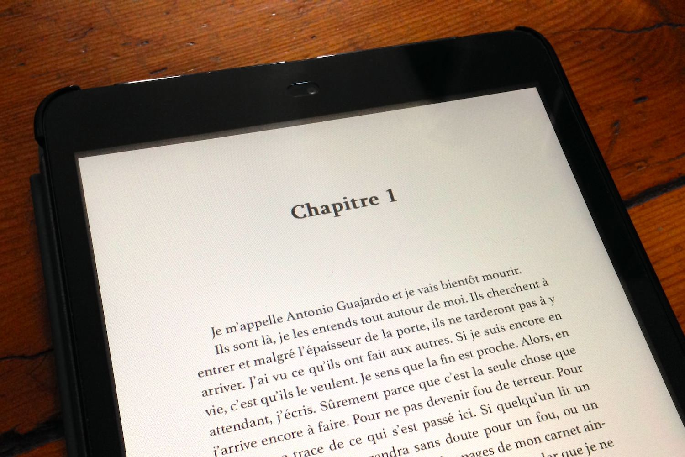

+++
type = "post"
titre = "<em>Anatomie du cauchemar</em>, House Made of Dawn"
title = "Anatomie du cauchemar, House Made of Dawn"
url = "/anatomie-du-cauchemar"
date = "2013-09-15T17:20:32"
Lastmod = "2013-11-17T15:35:11"
cover = "anatomie-du-cauchemar.jpg"
categorie = [ "À lire" ]
tag = [ "Fantastique", "Horreur", "Nouvelles", "Recueil" ]
createur = [ "Colin Manierka", "House Made of Dawn", "Renaud Ehrengardt" ]
annee = [ "2013" ]
weight = 2013
pays = [ "France" ]

+++

<a href="http://housemadeofdawn.com/anatomie-du-cauchemar/"><em>Anatomie du cauchemar</em></a> regroupe treize nouvelles qui, comme son titre et surtout son illustration l’indiquent bien, appartiennent toutes au genre de l’horreur. Rassemblées par House Made of Dawn, un petit éditeur apparu récemment et qui publie exclusivement sur son site, ces nouvelles font une sorte d’état des lieux du genre. Même si elles sont réunies par un genre, il y a en effet de la diversité tout au long de ces pages. Les treize récits abordent des aspects différents de l’horreur, avec des variantes autour de thèmes bien connus comme la maison hantée ou les loups-garous, mais aussi des hommages à de grands auteurs, du fantastique à la Edgard Allan Poe jusqu’à Lovecraft, en passant par Stephen King. Toutes les nouvelles ne sont pas du même niveau dans ce recueil, sans surprise, mais il constitue un bel ensemble qui devrait séduire tout amateur du genre. Proposé à un petit prix <em>Anatomie du cauchemar</em> est un livre qui mérite d’être lu si on aime l’horreur…

<blockquote class="pull-quote">
 &#8211; Il y avait écrit : DEERFIELD, son église, son lac, son pont couvert, son tueur. Prochaine à droite, deux miles.

&#8211; Son tueur ?

&#8211; Ouais, son tueur, s’enthousiasma Richard, c’est pas dingue, ça ?<cite class="author"> — David Miserque, Anatomie du cauchemar, « Un joli petit coin »</cite>

</blockquote>

Y a t-il un genre plus adapté à la nouvelle que l’horreur ? Au XIXe siècle, la nouvelle fantastique a connu un franc succès avec des auteurs aussi importants qu’Edgar Allan Poe ou Théophile Gautier. Parmi ses treize nouvelles, <em>Anatomie du cauchemar</em> en contient même une qui s’inspire délibérément et explicitement de Poe, par son ambiance, par son style et par son idée de base. « <em>L’amour écorché</em> » de Cindy Paillet n’est pas l’écrit le plus original du recueil, mais il est loin d’être représentatif de l’ensemble. Si vous n’aimez pas tellement le fantastique, vous apprécierez peut-être plus cette histoire de puits au sous-sol d’une maison isolée de la nouvelle intitulée « <em>Le puits a faim</em> » et écrite par Renaud Ehrengardt ? À moins que vous soyez plus porté sur les zombies, auquel cas vous pourrez vous laisser séduire par « <em>Zombies &#038; mescaline</em> » de Damien Buty. Sauf, bien sûr, si vous vénérez Lovecraft et que « <em>L’abomination dans l’assiette</em> » de Henri Bé vous séduise plus… En lisant <em>Anatomie du cauchemar</em>, c’est bien cette diversité qui surprend : on pourrait s’attendre à treize variations autour d’une ambiance ou d’un schéma unique, il n’en est rien. House Made of Dawn a su rassembler des auteurs très différents, pour un ensemble qui se lit ainsi sans lassitude. 

Vous n’aimerez sans doute pas tout, mais c’est tout à fait normal et ce n’est pas très grave : il en faut bien pour tous les goûts. Tout se lit assez facilement en tout cas, à une exception près : « <em>Petites pensées métaphysiques</em> » de David Coulin est la plus pénible à lire des treize nouvelles. Derrière son titre qui ne dit rien, il s’agit d’un récit extrêmement dur, parce qu’il est assez gore, mais surtout parce qu’il est d’une violence psychologique extrême. Mieux vaut le savoir et on aurait aimé être prévenu par l’éditeur…<a href="#footnote_0_10283" id="identifier_0_10283" class="footnote-link footnote-identifier-link" title="L&rsquo;&eacute;diteur qui a justement promptement r&eacute;agi en ajoutant une notice : on ne peut que saluer leur r&eacute;activit&eacute; !">1</a> C’est le seul faux pas dans cette sélection par ailleurs de bonne tenue : <em>Anatomie du cauchemar</em> est d’un bon niveau, même si certaines nouvelles sont un petit peu en dessous sur le plan stylistique. À l’inverse, on apprécie l’ambition d’autres, comme « <em>Nous chanterons sous le soleil</em> » de Colin Manierka, une sorte de western revisité plutôt intéressant. Dans un tout autre genre, « <em>Les voleurs de vie</em> » de Christophe Semont est une nouvelle très réussie également, peut-être parce qu’elle prend le temps d’installer son histoire de fond de jungle. Les nouvelles les plus courtes jouent souvent sur l’effet de surprise : c’est le cas notamment de celle qui ouvre le recueil, « <em>Arctique</em> » de David Coulon, un récit qui revendique son refus du fantastique et qui ménage la surprise jusqu’à sa fin sanglante. 

<blockquote class="pull-quote">
 Bien sûr, je n’ai jamais raconté les faits tels que je les ai vécus. Non seulement personne ne m’aurait cru, mais je me serais peut être retrouvé à la maison de santé d’Arkham. Moi-même, j’en viens quelquefois à douter de la véracité de cette histoire.<cite class="author"> — Henri Bé, Anatomie du cauchemar, « L’abomination dans l’assiette »</cite>

</blockquote>

L’horreur n’est pas le genre le plus visible sur les étals des libraires, mais House of Dawn ambitionne de lui redonner un peu de place. Il le prouve avec <em>Anatomie du cauchemar</em>, un recueil de treize nouvelles qui se rapportent toutes, de près ou de loin, au genre. Un ensemble qui convainc, malgré quelques inévitables différences de style. Il y en a pour tous les goûts, il y a des récits très courts et d’autres plus ambitieux, du fantastique, du gore ou de l’horreur traditionnelle… Le format des nouvelles est parfait pour lire entre deux rendez-vous ou dans les transports en commun et <em>Anatomie du cauchemar</em> est vendu à un tout petit prix : les amateurs du genre n’ont aucune excuse pour ne pas le découvrir !

<h3>Vous voulez m&rsquo;aider ?<a href="#footnote_1_10283" id="identifier_1_10283" class="footnote-link footnote-identifier-link" title="&Agrave; propos de la publicit&eacute;&hellip;">2</a></h3>
<ul>
<li><a href="http://www.amazon.fr/gp/product/B00FPDYD5A/ref=as_li_ss_tl?ie=UTF8&#038;tag=leblogdenic07-21&#038;linkCode=as2&#038;camp=1642&#038;creative=19458&#038;creativeASIN=B00FPDYD5A">Acheter le livre sur Amazon</a></li>
</ul>

<ol class="footnotes"><li id="footnote_0_10283" class="footnote">L&rsquo;éditeur qui a justement promptement réagi en ajoutant une notice : on ne peut que saluer leur réactivité ! [<a href="#identifier_0_10283" class="footnote-link footnote-back-link">&#8617;</a>]</li><li id="footnote_1_10283" class="footnote"><a href="http://voiretmanger.fr/soutien/">À propos de la publicité…</a> [<a href="#identifier_1_10283" class="footnote-link footnote-back-link">&#8617;</a>]</li></ol>
