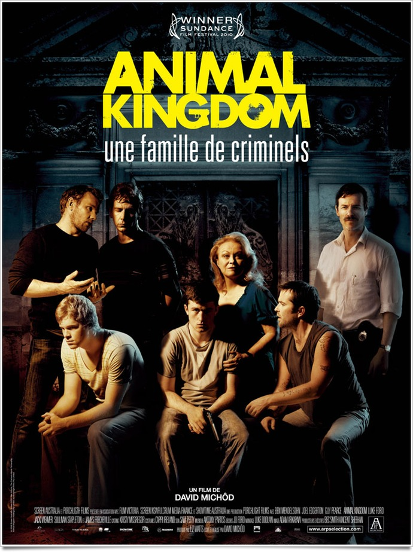
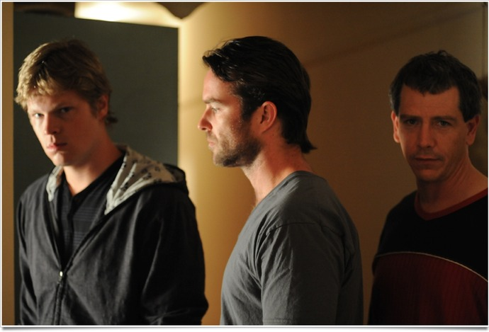
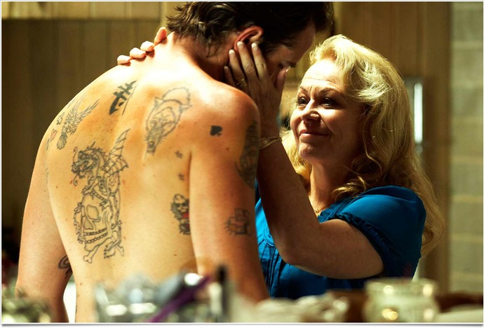

+++
type = "post"
titre = "<em>Animal Kingdom</em>, David Michôd"
title = "Animal Kingdom, David Michôd"
url = "/animal-kingdom-michod"
date = "2011-05-10T22:57:43"
Lastmod = "2014-06-08T15:43:45"
cover = "animal-kingdom-michod.jpg"
categorie = [ "À voir" ]
tag = [ "Adolescence", "Drame", "Famille", "Société", "Violence" ]
createur = [ "David Michôd" ]
acteur = [ "Ben Mendelsohn", "Guy Pearce", "Jacki Weaver", "James Frecheville" ]
annee = [ "2011" ]
weight = 2011
pays = [ "Australie" ]

+++

Le cinéma australien peine à arriver jusqu&rsquo;à nos toiles de cinéma, comme peut encore en témoigner <em>Animal Kingdom</em>, film qui a fait sensation dans plusieurs festivals, mais qui n&rsquo;a droit en France qu&rsquo;à une sortie anonyme. C&rsquo;est bien dommage tant on aurait tort de passer à côté du premier film de David Michôd. Un film violent, surtout sur le plan psychologique, un film en forme de coup de poing parfaitement maîtrisé, un film à ne pas rater.

La télévision diffuse un jeu stupide comme il en existe tant. Dans le canapé, un adolescent, l&rsquo;air hagard, et une femme plus âgée, sa mère sans doute, endormie à ses côtés. Du moins c&rsquo;est ce que l&rsquo;on croit, jusqu&rsquo;à l&rsquo;arrivée des secours. On comprend vite que la femme est morte d&rsquo;une overdose et que le jeune homme à ses côtés est orphelin. Cette brève introduction donne le ton : <em>Animal Kingdom</em> n&rsquo;est pas un film léger, mais un film sur la famille plutôt impitoyable où la mort n&rsquo;est qu&rsquo;un phénomène normal. Après la mort de sa mère, livré à lui-même, Josh fait la plus grosse bêtise de sa vie en appelant la seule famille qu&rsquo;il connaisse, sa grand-mère dont il a toujours été tenu éloigné. Celle-ci ne semble manifester aucune émotion à la mort de sa seule fille, mais elle recueille Josh chez elle, comme son propre fils. Des fils, elle n&rsquo;en manque pourtant pas : elle règne en tyran sur ses quatre fils qui sont tous, sans exception, malfrats. La fratrie vit de vols, de braquages et survit tant bien que mal face à une police qui a décidé de tirer avant de poser la moindre question. Cet univers malsain reflète nécessairement sur Josh qui connaît rapidement une descente en enfer…

Inutile de dire qu&rsquo;<em>Animal Kingdom</em> n&rsquo;est pas une comédie légère. Pour son premier film, David Michôd n&rsquo;a pas choisi un sujet gai avec l&rsquo;histoire de cette famille détraquée qui semble incapable de vivre dans la légalité. Quand un personnage évoque la possibilité de se retirer de l&rsquo;illégalité et de vivre de la bourse, il est impitoyablement descendu par le scénario peu après. Comme son titre l&rsquo;indique, <em>Animal Kingdom</em> présente un milieu social où la seule loi qui vaille est celle du plus fort, un milieu animal d&rsquo;où on ne peut sortir. Le film ne fait pas preuve d&rsquo;un optimisme forcené et, sans dévoiler la fin, on se doute bien qu&rsquo;elle ne sera pas très positive, même si le film ne s&rsquo;avère pas aussi prévisible qu&rsquo;escompté. Reste qu&rsquo;il décrit d&rsquo;abord l&rsquo;échec d&rsquo;un environnement, d&rsquo;une famille, mais également de Josh qui ne parvient pas à éviter cet environnement nocif. Par bien des aspects, <em>Animal Kingdom</em> évoque <em><a href="/2010/01/13/merditude-choses-groeningen/">La merditude des choses</a></em>, mais version australienne, à ce détail près que le film de Felix Van Groeningen penchait du côté de la comédie, alors que celui de David Michôd en reste bien éloigné. Les lions, ou plutôt la meute de loups, qu&rsquo;il met en scène sont des bêtes apeurées et qui s&rsquo;adonnent donc à la violence. L&rsquo;un est clairement un psychopathe, mais personne ne semble capable de l&rsquo;arrêter. Dès lors, la réaction policière peut paraître exagérée, elle semble aussi inévitable : comment répondre à la force brute, sinon par la force ?

Un tel tableau pourrait susciter le dégoût du spectateur, mais il n&rsquo;en est rien. David Michôd est malin, il réussit à transmettre la bestialité de ses personnages, certes, mais aussi leur humanité. Les quatre frères ne sont pas des monstres sanguinaires, ce sont aussi des êtres humains manifestement nés au mauvais endroit, incapables de mener une vie normale et qui font ce qu&rsquo;ils peuvent pour avancer. <em>Animal Kingdom</em> met en scène un autre personnage fascinant, la mère des frères qui est aussi la grand-mère de Josh. Cette femme aux cheveux encore parfaitement blonds a le sourire du carnassier. Son expression ne change pas qu&rsquo;elle parle de sa joie vis-à-vis de ses enfants, ou qu&rsquo;elle essaie de convaincre un policier de tuer celui qui a trahi la famille. Elle est sans doute le personnage le plus terrible, malgré des apparences tout à fait sympathiques. Cette mère envahissante qui embrasse ses enfants sur la bouche et qui a coupé les ponts avec sa fille pour une histoire de règles de jeux de cartes est absolument terrifiante et si elle n&rsquo;excuse pas le comportement de ses films, elle permet au moins de les relativiser. Le film se fait discret sur ce point, mais il semble entendu que c&rsquo;est la mère qui incite ses fils à agir comme ils agissent ; leurs actions ne la dérangent pas, à tout le moins, et elle n&rsquo;hésiterait pas à tuer de ses propres mains pour ses fils. Outre la mère, l&rsquo;autre personnage fascinant d&rsquo;<em>Animal Kingdom</em> est sans aucun doute son personnage principal, Josh. Le jeune homme a 18 ans dans l&rsquo;histoire, mais il a le comportement d&rsquo;un adolescent de 16 ans. Pendant quasiment tout le film, il reste interdit, l&rsquo;air hébété, comme s&rsquo;il n&rsquo;était qu&rsquo;un simple spectateur d&rsquo;une vie qu&rsquo;il ne maîtrise pas. On le sent attiré par la vie de famille normale de sa petite copine, mais il est incapable de faire ce qu&rsquo;il faut pour se séparer de sa propre famille. Tout au long du récit, on éprouve des sentiments contrastés pour ce personnage, tantôt l&rsquo;envie de le prendre par les bras et de le secouer un bon coup, tantôt au contraire de la compassion, tant il semble perdu dans un univers bien trop violent pour lui.

Dans ce premier film, David Michôd surprend. Il avait de quoi un film extrêmement violent, mais il se garde bien de le faire. La violence ici est surtout psychologique, on la voit rarement, et quasiment jamais de front : quand un personnage étrangle un autre, la caméra se pose sur le regard affolé d&rsquo;un témoin qui ne sait pas comment réagir. Le cinéaste déjoue également nos attentes sur le plan esthétique : commençant sur un ton très neutre, comme un documentaire ou un film social, <em>Animal Kingdom</em> s&rsquo;avère finalement très esthétique, mais par touches discrètes. David Michôd compose ses plans avec soin, les déplacements de la caméra sont réfléchis et l&rsquo;ensemble est vraiment élégant et bien réalisé. Pour un premier film, c&rsquo;est sans aucun doute un film bien maîtrisé, qui sait mesurer ses effets et n&rsquo;en fait pas des tonnes, avec un vrai regard de cinéaste. La musique notamment joue un rôle central ici : elle constitue un personnage à part entière, ajoute à l&rsquo;ambiance ou encore, comme chez Kubrick, caractérise les pensées des personnages.

<em>Animal Kingdom</em> est un film coup-de-poing qui va sans doute laisser des traces bien après l&rsquo;avoir vu. Non pas que le film soit visuellement violent, bien au contraire. Il est par contre à l&rsquo;image de ses personnages, fascinant. David Michôt réalise là un premier film assez impressionnant de maîtrise, prenant et très réussi. À ne pas manquer, donc…

<h3>Vous voulez <a href="/soutien/">m&rsquo;aider</a> ?</h3>
<ul>
<li><a href="http://www.amazon.fr/gp/product/B005ZRBRLO/ref=as_li_ss_tl?ie=UTF8&amp;tag=leblogdenic07-21&amp;linkCode=as2&amp;camp=1642&amp;creative=19458&amp;creativeASIN=B005ZRBRLO">Acheter le film en Blu-ray sur Amazon</a></li>
<li><a href="http://www.amazon.fr/gp/product/B005ZRBRDC/ref=as_li_ss_tl?ie=UTF8&amp;tag=leblogdenic07-21&amp;linkCode=as2&amp;camp=1642&amp;creative=19458&amp;creativeASIN=B005ZRBRDC">Acheter le film en DVD sur Amazon</a></li>
<li><a href="https://itunes.apple.com/fr/movie/animal-kingdom/id869710136">Acheter ou louer le film sur l&rsquo;iTunes Store</a></li>
</ul>

