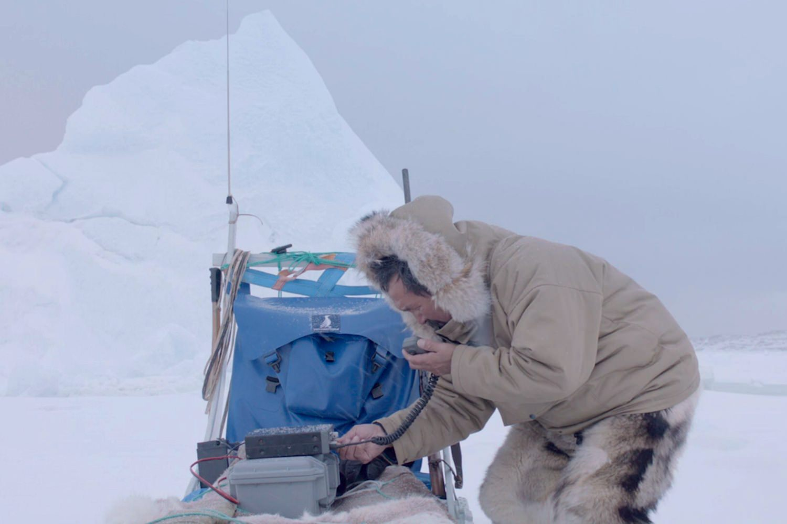
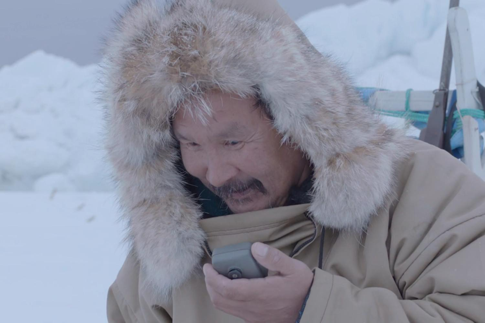

+++
type = "post"
titre = "<em>Aningaaq</em>, Jason Cuarón"
title = "Aningaaq, Jason Cuarón"
url = "/aningaaq-cuaron"
date = "2013-11-22T07:26:59"
Lastmod = "2013-12-17T13:40:51"
cover = "aningaaq-jason-cuaron.jpg"
categorie = [ "À voir" ]
tag = [ "Court-métrage", "Famille", "Mort" ]
createur = [ "Jason Cuarón" ]
acteur = [ "Orto Ignatiussen", "Sandra Bullock" ]
annee = [ "2013" ]
weight = 2013
pays = [ "États-Unis" ]

+++

Après le père, je demande le fils. Alors que <a href="http://voiretmanger.fr/gravity-Cuarón/" title="Gravity, Alfonso Cuarón"><em>Gravity</em></a> est sorti depuis un mois environ et connaît un vrai succès au cinéma, on découvre que le fils d’Alfonso Cuarón fait du cinéma comme son père, mais a aussi <a href="http://www.hollywoodreporter.com/news/gravity-spinoff-watch-side-sandra-657919">tourné un court-métrage</a> en rapport avec le film de science-fiction. Non content d’être co-scénariste de <em>Gravity</em>, Jonas Cuarón a écrit et réalisé le pendant terrestre de l’une des scènes les plus émouvantes du long-métrage. Plus complément que réponse ou suite, <em>Aningaaq</em> ne dure que quelques minutes, mais l’exercice n’en est pas moins intéressant et montre que Jonas a peut être son mot a dire aussi au cinéma. Prenez garde, si vous n’avez pas vu le film original, ne regardez pas cette vidéo et ne lisez pas non plus la suite…

Souvenez-vous de cette très belle scène de <em>Gravity</em>. Le docteur Ryan Stone interprétée par Sandra Bullock est seule dans une capsule et elle commence à perdre espoir. Elle tente une dernière fois de communiquer avec la terre, ce qui n’est plus possible depuis l’accident qui ouvre le film et qui isole les deux astronautes dans l’espace. À force d’essayer, elle entend une réponse : un certain Aningaaq qui lui répond dans une langue incompréhensible et qui ne peut manifestement rien faire pour elle. Qu’importe, ce contact humain lui manquait terriblement et d’entendre une voix, des chiens qui aboient au loin, et puis un bébé, tout cela lui redonne, pour un temps au moins, espoir. Dans si film conçu comme un huis clos, Alfonso Cuarón ne donnait aucune information sur l’identité de cet homme, il n’y avait même pas de traduction, juste une incompréhension mutuelle malgré l’utilisation d’onomatopées universelles. C’était très bien ainsi : une scène sur Terre, à ce moment précis, aurait sûrement alourdi le film et nui à sa force évocatrice. 

Malin, Jason Cuarón qui a participé à l’écriture du scénario avec son père y a vu une opportunité pour se faire une petite place. Dans <em>Aningaaq</em>, il met en scène l’autre côté de la discussion, sur la planète. On y découvre l’homme que l’on entendait seulement dans <em>Gravity</em> et on n’entend que la voix de Sandra Bullock. Ce petit film en forme de miroir est très simple et sans surprise — la marge de manœuvre était de toute manière limitée —, mais ces quelques minutes s’intègrent parfaitement au long-métrage ; on sent que les deux films ont été pensés ensemble. Au passage, c’est l’occasion de découvrir un cinéaste qui aura du mal à se faire une place à l’ombre de son père, mais qui ne manquera au moins pas d’arguments. Ce petit film (six minutes environ, sans compter le générique) ne manque pas d’émotion, tandis que son message sur la solitude de l’homme est très bien rendu. C’est un court-métrage d’ambiance filmé au Groenland n’a pas tellement d’intérêt indépendamment de <em>Gravity</em>, mais <em>Aningaaq</em> est très bien réalisé, touchant et porté par la musique de Steven Price, le même qui a réalisé la <a href="https://itunes.apple.com/fr/album/gravity-original-motion-picture/id716118201">bande originale</a> du film d’Alfonso Cuarón. Quoi qu’il en soit, ne manquez pas ce bref court-métrage, disponible en entier et en streaming…

<iframe class="aligncenter" src="//www.youtube.com/embed/0zcYkuIzzy8" frameborder="0" allowfullscreen></iframe>

<small><em>Article 800 du blog !</em></small>

