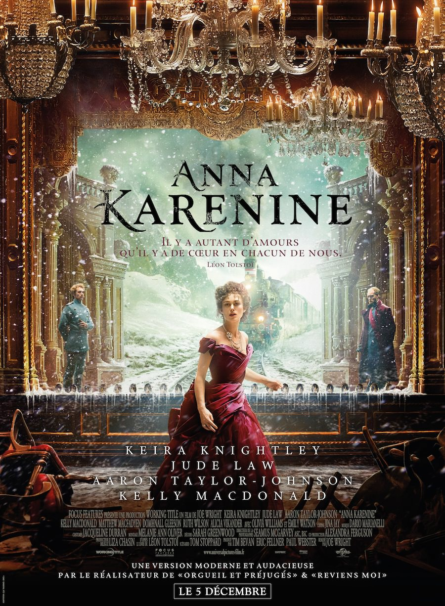
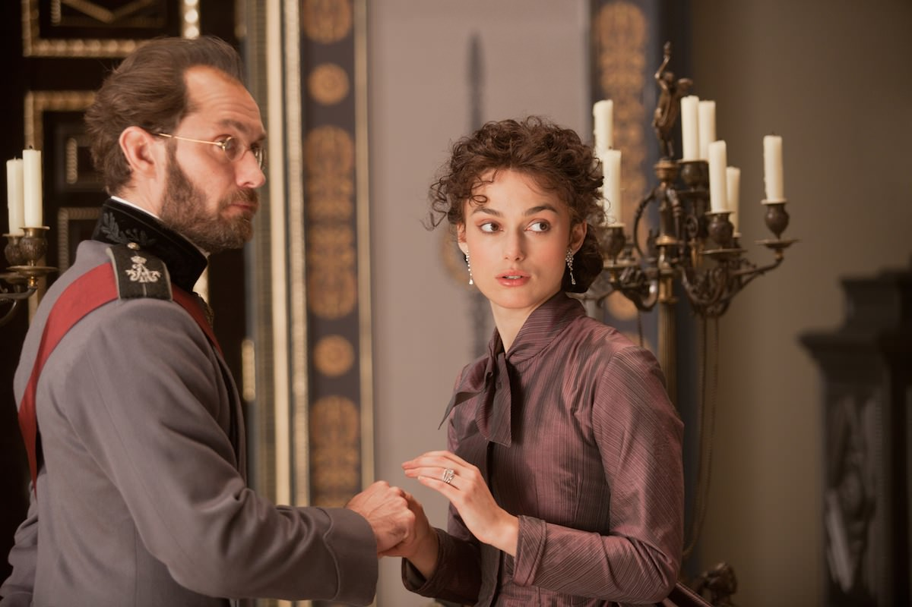
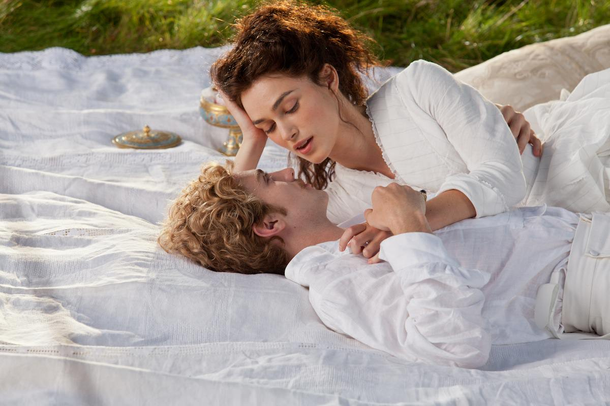

+++
titre = "Anna Karenine, Joe Wright"
title = "Anna Karenine, Joe Wright"
url = "/anna-karenine-wright"
date = "2012-12-08T23:08:43"
Lastmod = "2013-04-22T18:13:19"
cover = "anna-karenine-joe-wright-keira-knightley.jpg"
categorie = [ "À voir" ]
tag = [ "Amour", "Drame", "Expérience", "Famille", "Kitsch", "Société", "Théâtre" ]
createur = [ "Joe Wright" ]
acteur = [ "Aaron Taylor-Johnson", "Jude Law", "Keira Knightley" ]
annee = [ "2012" ]
weight = 2012

+++

S&rsquo;attaquer à une nouvelle adaptation d&rsquo;<em>Anna Karenine</em> n&rsquo;est pas une mince affaire, tant l&rsquo;énorme roman de Leon Tolstoï a déjà fait l&rsquo;objet de dizaines de versions. C&rsquo;est cette fois Joe Wright qui se penche sur cette double histoire d&rsquo;amour mythique. Plutôt que de se lancer dans une reconstitution historique minutieuse, le cinéaste britannique a choisi une autre voie, plus ambitieuse, mais aussi beaucoup plus dangereuse. Au réalisme de la reconstitution, il préfère un dispositif théâtral audacieux. À condition d&rsquo;en accepter l&rsquo;outrance et le kitsch, <em>Anna Karenine</em> est une expérience de cinéma fascinante et un film passionné et passionnant. 

Joe Wright adapte assez fidèlement l&rsquo;histoire d&rsquo;amour imaginée par Tolstoï. Ou plutôt la double histoire d&rsquo;amour : le romancier russe raconte ainsi l&rsquo;histoire de deux couples totalement différents. On suit d&rsquo;abord Anna Karenine, jeune femme de la haute société de Saint-Pétersbourg à la fin du XIXe siècle qui mène une vie de famille parfaitement normale avec son mari, haut fonctionnaire, et son fils unique jusqu&rsquo;au jour où elle rencontre Vronski. Ils ne se sont rencontrés que subrepticement dans une gare, mais c&rsquo;est le coup de foudre et ils ne peuvent plus rien faire d&rsquo;autre que de vivre ensemble, même si cela signifie la déchéance sociale pour Anna. On suit en parallèle l&rsquo;histoire de Levine qui est éperdument amoureux de Kitty et qui, après un premier rejet, finit par obtenir ce qu&rsquo;il veut et emmène sa belle dans son domaine campagnard, loin de la ville et de sa noblesse. Deux histoires différentes, deux trajectoires opposées aussi, même si on ne révèlera pas la fin d&rsquo;<em>Anna Karenine</em> pour épargner tous ceux qui la découvriront avec le film.

<em>Anna Karenine</em> commence… dans un théâtre. Dans un premier temps, on pourrait croire que ce sera simplement le temps d&rsquo;un résumé du contexte historique et social, mais ce dispositif ne quitte jamais le long-métrage. Joe Wright a en effet choisi, de manière assez audacieuse, d&rsquo;opter pour une mise en scène concentrée quasiment exclusivement dans un vieux théâtre. Ce décor naturel est transformé selon les besoins et sert tour à tour d&rsquo;opéra, d&rsquo;appartement des Karenine, de conseil des ministres ou encore de salle de bal. Le cinéaste va même jusqu&rsquo;à passer, à plusieurs reprises d&rsquo;ailleurs, ses caméras dans l&rsquo;arrière du décor, pour filmer les coulisses et les poulies qui servent justement à varier les décors entre deux scènes sur un théâtre. <em>Anna Karenine</em> se transforme ainsi quasiment en métafilm, comme si le cinéaste voulait en permanence expliquer sa façon de faire et rappeler en permanence que son film n&rsquo;était que du cinéma. Un dispositif audacieux, d&rsquo;autant que le montage est extrêmement vif et se permet toutes les audaces, lui aussi, avec des transitions virevoltantes. L&rsquo;effet n&rsquo;est jamais neutre et Joe Wright compose un film au contraire ampoulé, en permanence excessif. Si cet excès peut lasser parfois, si le kitsch surtout peut déplaire, le résultat est aussi assez envoutant et permet aux deux bonnes heures d&rsquo;<em>Anna Karenine</em> de passer très rapidement. Il faut dire que le cinéaste ne s&rsquo;enferme pas non plus dans son dispositif et sait en sortir quand il faut : il ne s&rsquo;agit pas d&rsquo;un huis clos et le film s&rsquo;affiche aussi dans les grands paysages de Russie, le théâtre n&rsquo;est qu&rsquo;un fil rouge utilisé à bon escient. 

La raison ou la passion : c&rsquo;est cet éternel débat que Tolstoï a choisi pour son roman. <em>Anna Karenine</em> raconte l&rsquo;histoire d&rsquo;un amour totalement fou, car impossible, mais aussi irrésistible. Joe Wright ne pouvait rater la scène de la rencontre, ce fameux coup de foudre qui est souvent l&rsquo;occasion de scènes ratées au cinéma. Dans un film aussi emporté que peut l&rsquo;être celui-ci, cette scène est au contraire assez sobre, ce qui explique certainement qu&rsquo;elle fonctionne plutôt bien. L&rsquo;amour se consolide par la suite à travers plusieurs scènes où les regards, intenses, se croisent et s&rsquo;évitent. <em>Anna Karenine</em> convainc souvent et parvient à transmettre la passion amoureuse du couple, sincère et entière. La scène du bal où Anna et Vronski dansent pour la première fois est, à cet égard, assez magnifique, un très beau ballet qui affiche en outre l&rsquo;immensité de leur amour. Pour qu&rsquo;il puisse espérer devenir crédible, cet amour avait besoin de l&rsquo;intensité permise par la mise en scène de Joe Wright, certes, mais aussi d&rsquo;acteurs capables de la faire ressentir. Il est très bien tombé avec Keira Knightley, impeccable en Anna incapable de ne pas choisir son amour fou, même si la société tout entière lui dit de ne pas le faire. Face à elle, Aaron Taylor-Johnson qui a bien changé depuis <a href="http://voiretmanger.fr/2010/03/29/kick-ass-vaughn/" title="Kick-Ass, Matthew Vaughn - À voir et à manger"><em>Kick-Ass</em></a>, est surtout là pour sa belle gueule, mais il est convaincant dans son rôle de fol amoureux. 

Cet amour si fort doit toutefois affronter mille obstacles, le premier d&rsquo;entre eux étant le poids de cette haute société fermée qui ne vit que pour regarder et critiquer ses propres membres. Joe Wright montre plutôt bien son extraordinaire force dans une scène assez terrible à l&rsquo;opéra. Alors qu&rsquo;Anna a décidé de quitter son mari et son fils pour vivre avec Vronski, elle veut n&rsquo;avoir que faire du qu’en-dira-t-on et profite d&rsquo;un passage à Saint-Pétersbourg pour aller à l&rsquo;opéra. <em>Anna Karenine</em> met alors admirablement en image les regards noirs lancés contre la jeune femme jusqu&rsquo;à la faire défaillir. Parce qu&rsquo;elle a décidé de quitter son mari légitime, cette femme est devenue une moins que rien, une putain que l&rsquo;on ne peut même aborder, encore moins fréquenter. Plus personne ne veut la voir, son salon reste désespérément vide et Anna vit très mal cette mise à l&rsquo;écart. La jeune femme devient paranoïaque et jalouse son amant, qu&rsquo;elle soupçonne de chercher un bon parti pour se marier et revenir dans le rang. Joe Wright sait rester suffisamment discret sur ce point et en rester aux soupçons, même si cette fin peut-être un peu longue aurait pu être évitée. <em>Anna Karenine</em> n&rsquo;oublie pas le deuxième couple imaginé par Léon Tolstoï, certes, mais le film le considère vraiment comme un couple secondaire, qui ne mérite pas une exposition très importante. Joe Wright préfère manifestement Anna et Vronski, on comprend aisément pourquoi… 

Curieux film que cet <em>Anna Karenine</em>… Sur le papier, il devrait s&rsquo;agir d&rsquo;un blockbuster assez classique, avec une belle tête d&rsquo;affiche — Keira Knightley que l&rsquo;on a déjà évoqué, mais aussi Jude Law —, mais les choix de Joe Wright sont sans doute trop radicaux pour plaire au plus grand nombre. Son idée de tout faire, ou presque, dans un théâtre est assez gonflée, mais elle fonctionne plutôt bien et offre au long-métrage un ton radicalement différent qui séduit. Certains éléments sont un peu kitsch, certes, mais cette relecture est bien plus réussie que celle de Baz Lurhmann dans son <a href="http://voiretmanger.fr/2012/08/13/romeo-juliette-luhrmann/" title="Romeo + Juliette, Baz Lurhmann - À voir et à manger"><em>Romeo + Juliette</em></a>. Sans être un grand film, <em>Anna Karenine</em> est une œuvre envoutante que vous auriez tort de rater… 

<h3>Vous voulez m&rsquo;aider ?<a href="#footnote_0_7949" id="identifier_0_7949" class="footnote-link footnote-identifier-link" title="&Agrave; propos de la publicit&eacute;&hellip;">1</a></h3>
<ul>
<li><a href="http://www.amazon.fr/gp/product/B00AMYTZLO/ref=as_li_ss_tl?ie=UTF8&#038;tag=leblogdenic07-21&#038;linkCode=as2&#038;camp=1642&#038;creative=19458&#038;creativeASIN=B00AMYTZLO">Acheter le film en Blu-Ray sur Amazon</a></li>
<li><a href="http://www.amazon.fr/gp/product/B00AMYTZ1E/ref=as_li_ss_tl?ie=UTF8&#038;tag=leblogdenic07-21&#038;linkCode=as2&#038;camp=1642&#038;creative=19458&#038;creativeASIN=B00AMYTZ1E">Acheter le film en DVD sur Amazon</a></li>
<li><a href="https://itunes.apple.com/fr/movie/anna-karenine-2012/id581023602">Acheter ou louer le film sur l&rsquo;iTunes Store</a></li>
</ul>

<ol class="footnotes"><li id="footnote_0_7949" class="footnote"><a href="http://voiretmanger.fr/soutien/">À propos de la publicité…</a> [<a href="#identifier_0_7949" class="footnote-link footnote-back-link">&#8617;</a>]</li></ol>
