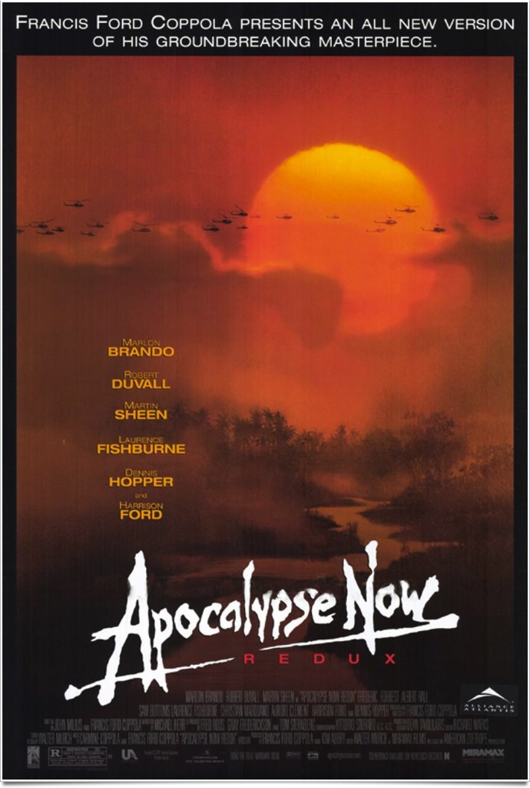
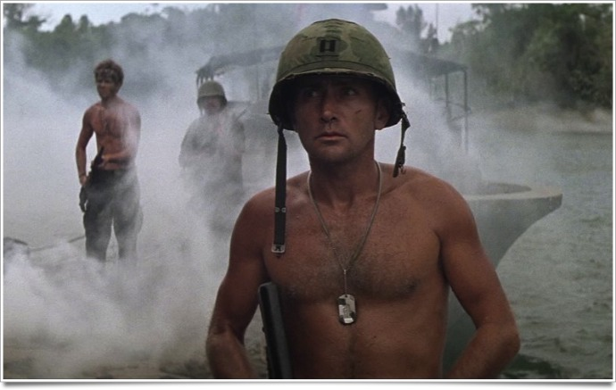
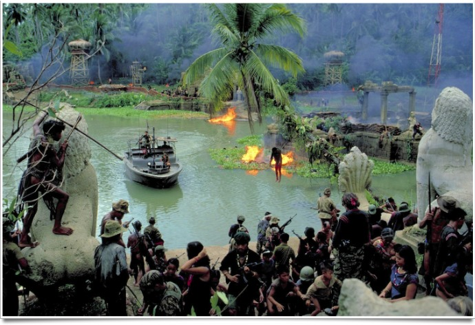

+++
type = "post"
titre = "<em>Apocalypse Now Redux</em>, Francis Ford Coppola (Palme d&rsquo;or 1979)"
title = "Apocalypse Now Redux, Francis Ford Coppola (Palme d'or 1979)"
url = "/apocalypse-now-redux-coppola"
date = "2012-01-22T19:25:19"
Lastmod = "2014-06-01T15:52:14"
cover = "apocalypse-now-francis-ford-coppola.jpg"
categorie = [ "À voir" ]
tag = [ "Drame", "Folie", "Guerre", "Histoire", "Palme d'or", "Violence" ]
createur = [ "Francis Ford Coppola" ]
acteur = [ "Laurence Fishburne", "Marlon Brando", "Martin Sheen" ]
annee = [ "1979", "2001" ]
weight = 1979
saga = [ "Palmes d'or" ]
pays = [ "États-Unis" ]

+++

Sorti en 1979, <em>Apocalypse Now</em> est souvent considéré comme l&rsquo;un des plus grands films de guerre. Inspiré très librement de la nouvelle <em>Au Cœur des Ténèbres</em> de Joseph Conrad, le film de Francis Ford Coppola offre une plongée en enfer d&rsquo;une intensité rare au cinéma. En 2001, le cinéaste propose une version restaurée et surtout rallongée : avec sa quarantaine de minutes en plus, <em>Apocalypse Now Redux</em> approche des 3h30. Une lente et intense plongée au cœur du Vietnam qui marque pour toujours le cinéma.

Le capitaine Willard traine dans une chambre d&rsquo;hôtel de Saïgon, en attendant désespérément de pouvoir agir. La guerre du Vietnam bat alors son plein et le capitaine a été envoyé au Vietnam pour la deuxième fois, mais il devient fou, enfermé dans cette chambre. L&rsquo;armée lui propose alors une mission secrète : remonter un fleuve qui s&rsquo;enfonce dans la forêt jusqu&rsquo;au Cambordge pour trouver et éliminer le colonel Kurtz. Cet officier brillant de l&rsquo;armée américaine a coupé tous contacts avec ses supérieurs, il s&rsquo;est enfoncé profondément dans la jungle et il s&rsquo;est fait passer pour un dieu auprès de la population locale. Ses méthodes dérangent et l&rsquo;État-Major veut l&rsquo;éliminer discrètement. Willard accepte et il part en quête de Kurtz sur une petite embarcation. Plus il remonte le fleuve, plus il s&rsquo;enfonce dans les profondeurs d&rsquo;un pays mal contrôlé par la première puissance mondiale, plus il prend conscience de la difficulté de sa tâche. Peu à peu, il comprend les motivations de sa cible alors que tout le monde semble sombrer dans la folie, lui le premier.

<em>Apocalypse Now Redux</em> n&rsquo;est pas un film tendre avec l&rsquo;armée américaine. Tourné quelques années après la fin de la guerre du Vietnam et l&rsquo;échec cuisant des États-Unis, il est encore une fois le signe de la formidable capacité du cinéma américain à faire preuve d&rsquo;autocritique. Dans ce film, la guerre est présentée comme inutile et destructrice, tant pour les Vietnamiens que pour les soldats envoyés depuis l&rsquo;autre bout du monde. Les motivations de la guerre ne sont jamais évoquées, même si une discussion avec des Français restés au Cambodge donne quelques clés pour la comprendre. Les soldats américains sont là, mais ils ne savent pas pourquoi, au juste. Le résultat est alors sans surprise : ils sombrent tous dans une folie meurtrière. La scène d&rsquo;attaque en hélicoptères, rendue célèbre pour toujours par son utilisation de la musique wagnérienne, est tout à fait significative de cette folie. Le commandant accepte de lancer l&rsquo;attaque parce qu&rsquo;on lui dit que les vagues sont propices au surf. C&rsquo;est la seule raison qui le motive et il considère alors les ennemis comme des épines qu&rsquo;il faut éliminer avant de pouvoir surfer tranquillement. <em>Apocalypse Now Redux</em> se mue vite en une sorte de road movie infernal : plus loin, dans la jungle, l&rsquo;absurdité de la guerre et ses méfaits sur les hommes ressort avec encore plus de force. La scène où des filles du magazine <em>Playboy</em> sont amenées pour amuser les soldats avant de devoir être évacuées en urgence est impressionnante, mais le pire reste encore à venir. Camps délabrés où plus personne ne commande vraiment, survivants qui s&rsquo;accrochent à leurs possessions menacées… le capitaine Willard et ses hommes vont de mal en pis.

Francis Ford Coppola ne compose pas de pamphlet toutefois et il ne situe pas son film dans une réalité historique précise. On sait qu&rsquo;il s&rsquo;agit du Vietnam, mais c&rsquo;est à peu près tout et <em>Apocalypse Now Redux</em> utilise la guerre comme un cadre à l&rsquo;adaptation de la nouvelle de Joseph Conrad. Plus que la guerre, le sujet ici est ainsi la folie humaine. Le colonel Kurtz est pointé du doigt dès le départ comme un homme ayant sombré dans la folie. C&rsquo;est ainsi que les hauts gradés présentent à Willard sa cible : un fou furieux qui a construit un culte de sa personnalité et opère sa propre justice. Même si le capitaine se demande ce qu&rsquo;il pourra faire face à son supérieur devenu ennemi à abattre, il ne fait dans un premier temps aucun doute pour lui que Kurtz est devenu fou. Pourtant, au fur et à mesure qu&rsquo;il découvre la jungle, son avis évolue. Willard a le temps de lire la documentation qu&rsquo;on lui a donné sur le colonel et il commence à le comprendre. Assistant à la folie de son pays et de son armée, à la folie de cette guerre tout simplement, il se demande peu à peu si le plus fou est vraiment celui que l&rsquo;on croit. Par sa durée et son rythme très lent, <em>Apocalypse Now Redux</em> permet au spectateur d&rsquo;accompagner le capitaine Willard dans ce changement d&rsquo;opinion. Quand Kurtz apparaît enfin, il reste alors moins d&rsquo;une heure de film, on ne condamne pas l&rsquo;homme, pas totalement du moins. Ses horreurs ne sont pas masquées, mais Francis Ford Coppola a réussi à nous faire hésiter. Qui est le plus fou dans l&rsquo;histoire ? Est-ce vraiment Kurtz ou l&rsquo;armée ? Est-ce la jungle qui fait ainsi perdre la tête de tous les hommes, ou est-elle au contraire le déclencheur qui révèle à tout homme ce qu&rsquo;il est vraiment ? <em>Apocalypse Now Redux</em> se termine avec un ton mystérieux, presque métaphysique, qui termine de séduire le spectateur.

Le tournage d&rsquo;<em>Apocalypse Now</em> est aussi mythique que le film lui-même. Le cinéaste a tourné son film non pas dans le confort des studios hollywoodiens, mais dans une vraie jungle, dans les Philippines. Le tournage a été très dur sur le plan technique, il a duré 238 jours et le film a couté le double de ce qui était prévu au départ avec notamment la destruction complète de plusieurs décors à cause d&rsquo;une tornade. C&rsquo;est peut-être ce tournage éprouvant qui donne au film sa force : les acteurs en particulier ont tous été malmenés au point que Martin Sheen, l&rsquo;acteur principal, a même souffert d&rsquo;une attaque cardiaque pendant le tournage. Francis Ford Coppola fait preuve ici d&rsquo;une maîtrise assurée de son art et compose un film extrêmement impressionnant. L&rsquo;attaque en hélicoptère au début du film reste dans les annales du cinéma notamment par l&rsquo;utilisation, très mal comprise d&rsquo;ailleurs, de la &laquo;&nbsp;Chevauchée des Walkyries&nbsp;&raquo; de Richard Wagner, mais ce n&rsquo;est pas la seule scène impressionnante. Tout le film est assez splendide avec un goût marqué pour la fumée et les jeux de lumière, jusqu&rsquo;à un final infernal très réussi. La bande originale, composée essentiellement par le cinéaste et sa mère, Carmine Coppola, n&rsquo;a pas très bien vieilli, mais l&rsquo;ouverture sur la musique des Doors (<em>The End</em>) reste une des plus belles ouvertures vues au cinéma.

Quand Francis Ford Coppola présente son film à Cannes en 1979, il joue un peu un quitte ou double. <em>Apocalyse Now</em> l&rsquo;a ruiné personnellement et c&rsquo;est sa carrière qu&rsquo;il met sur le tapis. La récompense ultime de Cannes avec la Palme d&rsquo;or et le succès critique et public ont réhabilité un film qui semblait maudit. <em>Apocalypse Now Redux</em> est un grand film sur la guerre, mais aussi, et surtout sur la folie humaine, à voir et à revoir.

<h3>Vous voulez m&rsquo;aider ?<a href="#footnote_0_5536" id="identifier_0_5536" class="footnote-link footnote-identifier-link" title="&Agrave; propos de la publicit&eacute;&hellip;">1</a></h3>
<ul>
<li><a href="http://www.amazon.fr/gp/product/B004KNO2TS/ref=as_li_ss_tl?ie=UTF8&tag=leblogdenic07-21&linkCode=as2&camp=1642&creative=19458&creativeASIN=B004KNO2TS">Acheter le film en coffret Blu-Ray édition limitée sur Amazon</a> (<a href="http://www.amazon.fr/gp/product/B00604XG1A/ref=as_li_ss_tl?ie=UTF8&tag=leblogdenic07-21&linkCode=as2&camp=1642&creative=19458&creativeASIN=B00604XG1A" target="_blank">version simple</a>)</li>
<li><a href="http://www.amazon.fr/gp/product/B004KNO2Z2/ref=as_li_ss_tl?ie=UTF8&tag=leblogdenic07-21&linkCode=as2&camp=1642&creative=19458&creativeASIN=B004KNO2Z2">Acheter le film en coffret DVD édition limitée sur Amazon</a> (<a href="http://www.amazon.fr/gp/product/B00006CFIL/ref=as_li_ss_tl?ie=UTF8&tag=leblogdenic07-21&linkCode=as2&camp=1642&creative=19458&creativeASIN=B00006CFIL" target="_blank">version simple</a>)</li>
<li><a href="http://www.amazon.fr/gp/product/B0000263H9/ref=as_li_ss_tl?ie=UTF8&tag=leblogdenic07-21&linkCode=as2&camp=1642&creative=19458&creativeASIN=B0000263H9">Acheter la bande originale du film sur Amazon</a></li>
<li><a href="http://itunes.apple.com/fr/movie/apocalypse-now-redux-vost/id429403691">Acheter ou louer le film sur l&rsquo;iTunes Store</a></li>
</ul>

<ol class="footnotes"><li id="footnote_0_5536" class="footnote"><a href="http://voiretmanger.fr/a-propos/publicite/">À propos de la publicité…</a> [<a href="#identifier_0_5536" class="footnote-link footnote-back-link">&#8617;</a>]</li></ol>
