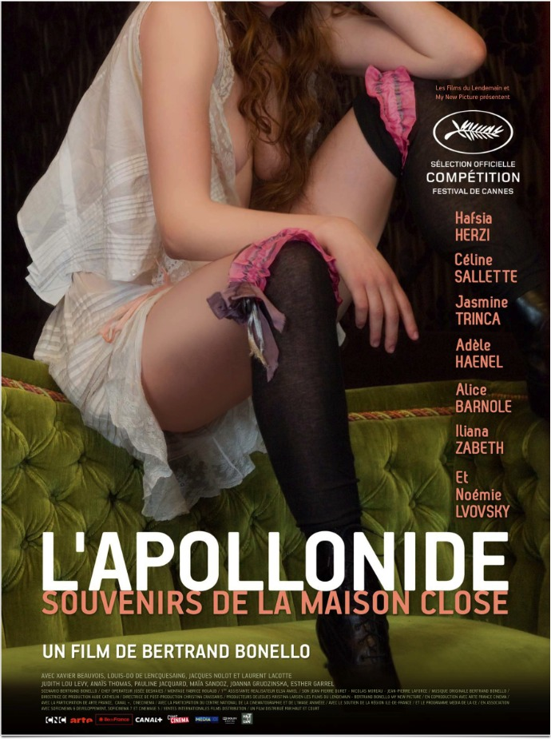
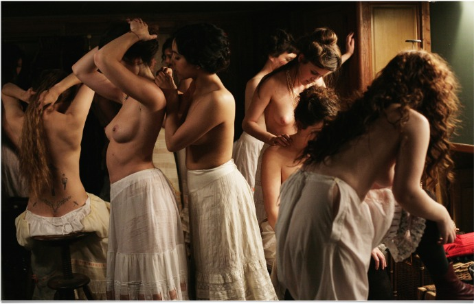
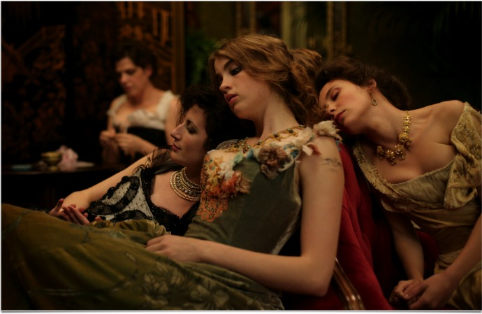

+++
titre = "<em>L&rsquo;Apollonide, souvenirs de la maison close</em>, Bertrand Bonello"
title = "L'Apollonide, souvenirs de la maison close, Bertrand Bonello"
url = "/apollonide-souvenirs-maison-close-bonello"
date = "2011-10-02T18:51:34"
Lastmod = "2014-09-27T22:26:35"
cover = "l_apollonide_souvenirs_de_la_maison_close.jpg"
categorie = [ "À voir" ]
tag = [ "Amour", "Histoire", "Huis clos", "Sexe", "Société" ]
createur = [ "Bertrand Bonello" ]
acteur = [ "Adèle Haenel", "Céline Sallette", "Hafsia Herzi", "Jasmine Trinca", "Noémie Lvovsky" ]
annee = [ "2011" ]
weight = 2011
pays = [ "France" ]

+++

Avec <em>L&rsquo;Apollonide, souvenirs de la maison close</em>, Bertrand Bonello recompose une maison close au tournant du XXe siècle. Au cœur de la IIIe République, en pleine Belle-Époque, les maisons closes connaissent un véritable succès, mais la chute suit l&rsquo;apogée. Les femmes commencent déjà à sortir des maisons closes pour aller sur les trottoirs, les clients se font de plus en plus rares et ce film raconte la fin d&rsquo;une époque. Un film magnifique et terrible à la fois, à voir.

Un couloir sombre, une femme peu vêtue s&rsquo;avance, vers son prochain client. <em>L&rsquo;Apollonide, souvenirs de la maison close</em> plonge d&rsquo;emblée son spectateur dans l&rsquo;univers sombre et chaleureux d&rsquo;une maison close parisienne, à la fin du XIXe siècle. Le film ne quitte quasiment jamais cet univers clos, comme son nom l&rsquo;indique bien. Bertrand Bonello ne raconte pas vraiment d&rsquo;histoire, il pose ses caméras et laisse les femmes constituer leur film par leur présence, par leurs récits aussi. Il n&rsquo;y a pas vraiment d&rsquo;héroïne parmi toutes les putains, mais <em>L&rsquo;Apollonide, souvenirs de la maison close</em> s&rsquo;attarde sur certaines d&rsquo;entre elles : la juive, défigurée par un client sadique qui lui a taillé un sourire au couteau ; la petite, une nouvelle qui débarque dans cet univers censé la rendre libre ; l&rsquo;italienne qui rêve d&rsquo;épouser un client régulier, mais qui attrape la syphilis… Le ballet de corps féminins et masculins qui reprend chaque nuit forme le quotidien de ces filles qui ne sortent quasiment jamais, en tout cas jamais seules.

<em>L&rsquo;Apollonide, souvenirs de la maison close</em> plonge le spectateur dans une époque qu&rsquo;il n&rsquo;a pas connue. Bertrand Bonello s&rsquo;attache à restituer le quotidien de ces femmes qui vendaient leur corps en toute légalité, au tournant du XXe siècle. On les voit se préparer en fin de journée pour le soir, on les voit ensuite discuter avec les clients, leur servir quelques coupes avant, éventuellement, de monter dans une chambre finir la nuit. <em>L&rsquo;Apollonide, souvenirs de la maison close</em> offre un regard très positif sur les maisons closes et leurs occupantes. Loin des clichés que l&rsquo;on peut avoir en tête aujourd&rsquo;hui, ces filles sont bien traitées par les clients qui viennent ici pour discuter, jouer aux cartes et boire quelques verres. Certains repartent sans même coucher avec une fille, simplement pour le plaisir de partager un moment avec elle. Entre clients et filles, une relation de confiance s&rsquo;instaure, d&rsquo;amitié souvent, d&rsquo;amour même parfois. La plupart des clients sont des hommes mariés et les convenances les empêchent de quitter femmes et enfants, mais leur amour est réel et assez touchant. Les filles du bordel rêvent toutes qu&rsquo;un client rachète leurs dettes et les emmènent avec elles… L&rsquo;Apollonide est une maison luxueuse, fréquentée exclusivement par le gratin de la noblesse ou de la bourgeoisie qui a réussi dans la France industrielle. Un lieu hors du monde et hors du temps, qui reste très nettement ancré dans le siècle qui se conclut, alors qu&rsquo;une nouvelle ère s&rsquo;ouvre. Si les marques d&rsquo;actualité restent limitées, on entend tout de même parler de l&rsquo;affaire Dreyfus, mais aussi de la première ligne de métro de Paris, critiquée d&rsquo;ailleurs par l&rsquo;un des clients.

Bertrand Bonello choisit de clore son film sur une image d&rsquo;actualité qui donne un sens tout particulier aux deux heures qui précédaient. <em>L&rsquo;Apollonide, souvenirs de la maison close</em> quitte le début du XXe siècle pour le XXIe. Les maisons closes ont totalement disparu du paysage, mais la prostitution, souvent qualifiée de premier métier au monde, n&rsquo;a en aucun cas disparu, elle est sortie dans la rue et a changé de forme. Les filles attendent désormais leurs clients en plein jour, au bord des villes : l&rsquo;ambiance est incomparable, bien plus glauque que celle que l&rsquo;on vient de voir. Le parti-pris est évident, même si Bertrand Bonello a l&rsquo;excellente idée de ne pas faire un film didactique : à chacun son opinion. Néanmoins, la démonstration est implacable. Certes, les prostituées de la maison close n&rsquo;ont pas la vie facile tous les jours. Si elles ne dépendent pas d&rsquo;un mari, elles ne sont pas libres pour autant et l&rsquo;Apollonide est une prison pour elle. &laquo;&nbsp;Madame&nbsp;&raquo;, la gérante, rachète leur dette, motivation principale pour se prostituer, et elle les tient par ce moyen technique. Elles doivent en théorie racheter leurs dettes avec les clients, mais le système ne le permet pas, concrètement. Les frais pour rester belles et désirables sont trop élevés pour leur permettre de racheter leurs dettes et ces femmes restent de fait en majorité dans la maison close pendant des années. La liberté espérée par la plus jeune qui vient d&rsquo;arriver est une illusion, même si cette fille parvient à en sortir rapidement. Pour la plupart des prostituées, la sortie se fera les pieds devant : la maladie est une menace de tous les instants à une époque où elle tuait volontiers. La vie n&rsquo;est pas toujours rose dans l&rsquo;Apollonide, mais elle est infiniment meilleure que celle des prostitués d&rsquo;aujourd&rsquo;hui, <em>L&rsquo;Apollonide, souvenirs de la maison close</em> le monde très bien. L&rsquo;univers fermé et confortable de la maison close paraît bien plus agréable pour tout le monde.

<em>L&rsquo;Apollonide, souvenirs de la maison close</em> reconstitue une époque passée avec une précision maintenue de bout en bout. Le cinéaste s&rsquo;est manifestement bien renseigné avant de travailler sur son film et la reconstitution est remarquable. Le spectateur est plongé plus d&rsquo;un siècle en arrière et la crédibilité de cet univers que l&rsquo;on n&rsquo;a jamais connu n&rsquo;est jamais remise en cause. Bertrand Bonello compose à partir de ce décor quasiment unique, le film ne sortant de l&rsquo;Apolonnide qu&rsquo;à deux brèves reprises, des plans à la beauté picturale rare. Les quelques images du film proposées ici en témoignent bien, <em>L&rsquo;Apollonide, souvenirs de la maison close</em> est vraiment un très beau film qui rappelle les tableaux de la même époque. La photographie ajoute ainsi une touche picturale et certains plans sont magnifiques. Reproduction visuelle parfaite, Bertrand Bonello ose plus sur le plan musical avec plusieurs morceaux récents qui tranchent avec l&rsquo;image. L&rsquo;anachronisme passe tout à fait et souligne bien la liberté du film sur le plan technique. <em>L&rsquo;Apollonide, souvenirs de la maison close</em> ose un peu tout : l&rsquo;action n&rsquo;est pas toujours linéaire, le split-screen est utilisé à plusieurs reprises… Cette liberté tranche avec l&rsquo;emprisonnement subi ou voulu des filles. Les actrices qui incarnent ces dernières sont pour beaucoup dans le succès du film. Elles sont toutes très justes, avec une mention spéciale à &laquo;&nbsp;Madame&nbsp;&raquo;, leur maîtresse qui se trouve aussi être mère de famille.

<em>L&rsquo;Apollonide, souvenirs de la maison close</em> plonge le spectateur dans l&rsquo;univers d&rsquo;une maison close, et c&rsquo;est une plongée des plus agréables, même si les corps féminins nus ne sont pas votre tasse de thé (sinon, vous serez servis). Cet univers qui rappelle un peu les tableaux de la même époque est vraiment séduisant et souvent magnifique, le ballet de corps féminins et masculins réjouissant. Bertrand Bonello ne fait pas un film politique doté d&rsquo;un message, mais sa conclusion remet en perspective tout ce qui précède. Même si l&rsquo;Apollonide est une maison close de luxe qui n&rsquo;est pas forcément représentative de toutes les maisons de l&rsquo;époque, elle montre bien toutefois que leur fermeture n&rsquo;était pas nécessairement la meilleure solution. Un beau film, sensuel et intelligent, à ne pas rater.

<em>Article 400 du blog !</em>

<h3>Vous voulez <a href="http://voiretmanger.fr/soutien/">m&rsquo;aider</a> ?</h3>
<ul>
<li><a href="http://www.amazon.fr/gp/product/B0065JBFNQ/ref=as_li_ss_tl?ie=UTF8&amp;tag=leblogdenic07-21&amp;linkCode=as2&amp;camp=1642&amp;creative=19458&amp;creativeASIN=B0065JBFNQ">Acheter le film en DVD sur Amazon</a></li>
<li><a href="http://itunes.apple.com/fr/movie/lapollonide-souvenirs-la-maison/id491611379">Acheter ou louer le film sur l&rsquo;iTunes Store</a></li>
</ul>

