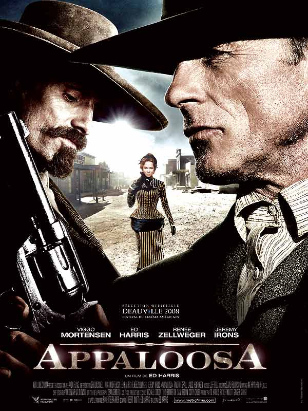

+++
type = "post"
titre = "<em>Appaloosa</em>, Ed Harris"
title = "Appaloosa, Ed Harris"
url = "/appaloosa-harris"
date = "2008-10-04T00:10:58"
Lastmod = "2015-04-12T17:36:59"
cover = "Appaloosa-ed-harris-e1265026070859.jpg"
categorie = [ "À voir" ]
tag = [ "Western" ]
createur = [ "Ed Harris" ]
acteur = [ "Ed Harris", "Jeremy Irons", "Renée Zellweger", "Viggo Mortensen" ]
annee = [ "2008" ]
weight = 2008
pays = [ "États-Unis" ]

+++

Après une pause dans le temps hier soir, me voici revenu dans l&rsquo;actualité cinématographique avec <em>Appaloosa</em>, dernier film de l&rsquo;acteur et réalisateur Ed Harris. Pourtant, le retour à l&rsquo;actualité est tout relatif face à ce film : <em>Appaloosa</em> est en effet un western, et un western des plus classiques, au moins en apparence…

L&rsquo;histoire est assez classique. Soit deux justiciers, Virgil Cole (Ed Harris, excellent) et Everett Hitch (Viggo Mortensen, génial) qui, à l&rsquo;image de Lucky Luke, vont de villes en villes dans le grand Ouest américain. Leur job est simple : ils sont justiciers intérimaires et viennent débarrasser les villes qui le leur demandent d&rsquo;un problème. En l&rsquo;occurrence, ce problème est un certain Randall Bragg (Jeremy Irons, excellent aussi) qui n&rsquo;en fait qu&rsquo;à sa tête, ne respecte pas les lois et dérange la gentille communauté d&rsquo;Appaloosa, dans le Nouveau-Mexique. Nos deux héros sont alors appelés et ils viennent faire le ménage. Cette intrigue simple est cependant rendue un peu plus complexe par l&rsquo;ajout d&rsquo;une femme (eh oui, il faut toujours chercher la femme, même dans les westerns…), Allison French (Renée Zellweger, très bien même si un peu écrasée par les deux rôles principaux) qui va réussir à troubler Virgil Cole, un homme dont la vie même est basée sur l&rsquo;absence de sentiment (il explique à un moment du film que seul un homme sans sentiment peut rester vivant). Mais cette femme va le troubler au point qu&rsquo;il envisage de se sédentariser et de ne plus repartir dans le soleil couchant, tel Lucky Luke à la fin des BD…

Le film n&rsquo;évite pas tous les codes du genre : loin d&rsquo;être une suite de clichés toutefois, il sait les réinventer et se contenter de clins d&rsquo;œil. Ainsi, par exemple, une scène de duel est traitée en quelques secondes, comme un éclair, alors que le western classique aurait plutôt fait durer cette scène. Un des deux personnages commentent d&rsquo;ailleurs cela en notant que tout s&rsquo;est passé très vite. À ce titre, ce film est bien un film post-moderne, mais ici, contrairement au cinéma de Tarantino notamment, la référence ne fait pas le film. On sent que le réalisateur a souhaité faire un vrai western, sans chercher à le conceptualiser outre-mesure, ni à l&rsquo;esthétiser (contrairement au merveilleux <a href="http://voiretmanger.fr/assassinat-jesse-james-lache-robert-ford-dominik/" title="L’Assassinat de Jesse James par le lâche Robert Ford, Andrew Dominik"><em>Assassinat de Jesse James par le Lâche Robert Ford</em></a>) mais en faisant, avec application, un vrai Western à l&rsquo;ancienne.

L&rsquo;image comme le son rappellent ces Westerns classiques. Le décor s&rsquo;y prête de toute façon, et les deux villes visitées dans le film font vraiment &laquo;&nbsp;villes de Western&nbsp;&raquo;. Les duels sont classiquement mais bien filmés, avec une mise en scène basée sur la plongée et la contre-plongée, un des deux camps étant toujours plus haut que l&rsquo;autre. Côté son, une bande-son assez peu originale mais efficace.

Cependant, en 2008, il est impossible de ne pas se poser la question : pourquoi diable un western ? Le genre est bel et bien mort et enterré, ou en tout cas il a été contraint à l&rsquo;évolution : soit il s&rsquo;est modernisé (<a href="http://voiretmanger.fr/2012/02/26/no-country-for-old-men-coen/" title="No Country for Old Men, Joel et Ethan Coen"><em>No Country For Old Men</em></a>,<em> Le Secret de Brokeback Mountain</em> ou encore <em>Trois enterrements</em>), soit il s&rsquo;est transformé vers autre chose (<em><a href="http://voiretmanger.fr/2012/06/30/assassinat-jesse-james-lache-robert-ford-dominik/" title="L’Assassinat de Jesse James par le lâche Robert Ford, Andrew Dominik">L&rsquo;Assassinat de Jesse James par le Lâche Robert Ford</a></em>) même si certains (<em>3h10 pour Yuma</em>) ont tenté de ne rien changer. Si <em>Appaloosa</em> est, à de nombreux égards, proche du western classique (et d&rsquo;abord par le cadre bien entendu), il n&rsquo;en n&rsquo;est pas moins différent et marqué par son époque. En effet, ce film est original par sa complexité, sous des dehors de simplicité. Complexité psychologique des personnages d&rsquo;abord : aucun personnage ne reste dans un stéréotype (si ce n&rsquo;est, peut-être, les ridicules notables de la ville qui restent aussi notables que ridicules) mais dévoile une complexité parfois inattendue. Ainsi, Virgil Cole envisage de s&rsquo;arrêter ; ainsi la femme est une citadine qui se révèle plutôt en avance sur son temps en matière de vie sexuelle ; ainsi le méchant sait utiliser à son escient la loi, etc. Complexité aussi de l&rsquo;intrigue : au départ simple, elle se complique tout au long du film si bien que la fin est inattendue (en tout cas, je ne m&rsquo;y attendais pas) — je n&rsquo;en dis pas plus mais ce film est en effet plus complexe qu&rsquo;il en avait l&rsquo;air au début. Complexité encore du discours : le scénario, et le réalisateur, s&rsquo;amusent à lancer des fausses pistes aux spectateurs. On pouvait s&rsquo;attendre à un discours sur la violence, à la manière de <em>A history of violence</em>, mais rien de tel ici : si la violence est bien présente dans le film, c&rsquo;est par touche très rapide mais intense. Quelques coups de feu claquent, et c&rsquo;est fini. Dans ce film, on se bat d&rsquo;abord par la parole, par les mots que Virgil Cole peine à maîtriser (ce qui donne lieu à quelques scènes plutôt drôles) plus que par les armes, même si les armes deviennent à un moment indispensable. Mais, par exemple, à un moment Cole est seul contre une dizaine d&rsquo;hommes armés et il parvient à les disperser par le discours. Ce film traite aussi de la nature humaine et offre une vision peu glorifiante de celle-ci : les notables d&rsquo;Appaloosa changent ainsi de chemise selon le sens du vent, et sont vraiment très méprisables (et drôles). Le principal rôle féminin n&rsquo;est pas non plus très sympathique, puisque, en gros, Allison French couche avec celui qui domine à un moment donné.

Complexité enfin, et surtout, parce que le vrai sujet du film, à l&rsquo;image de <em>Brokeback Mountain</em> finalement, ce sont les deux cow-boys et leur relations. Le film envisage un temps leur opposition autour de la femme, mais cette hypothèse est vite annulée. Les deux hommes se complètent (Cole agrandit son vocabulaire grâce à son acolyte par exemple) et de connaissent si bien que les mots ne sont pas toujours nécessaires. Leur complicité est grande et si l&rsquo;on sent des tensions entre les deux, elle n&rsquo;aboutira jamais à de la violence.

Un mot pour finir sur Viggo Mortensen. Découvert (pour ma part) dans le <em>Seigneur des Anneaux</em>, il ne cesse de m&rsquo;étonner depuis. À chaque film, il progresse, apparemment sans jamais s&rsquo;arrêter, vers l&rsquo;excellence. Ses films avec Cronenberg étaient vraiment sublimes grâce à lui. Ici, il compose un personnage impressionnant sans en faire des tonnes, par petites touches discrètes. Et il s&rsquo;impose littéralement à l&rsquo;écran aux côtés d&rsquo;Ed Harris qui, en tant que réalisateur, l&rsquo;utilise parfaitement. Je ne sais pas ce que la suite lui réservera, mais en l&rsquo;espace de quelques années, cet acteur est devenu, à mes yeux, un incontournable du cinéma américain un peu intelligent. Quand je vois ce que d&rsquo;autres révélés par le même film (Orlando Bloom pour ne pas le citer) font aujourd&rsquo;hui, je prends alors pleinement conscience de ses capacités cinématographiques…

<em>Appaloosa</em> est un film étonnant et passionnant. Apparemment western classique, ce film se révèle en fait être beaucoup plus complexe, une complexité liée surtout à des personnages plutôt réalistes sur le plan psychologique, mais aussi à un film qui offre plusieurs fausses pistes successives à ses spectateurs. Film sur la parole, mais aussi et d&rsquo;abord film sur l&rsquo;être humain, <em>Appaloosa</em> est un film riche, bien dans son temps, et qui vaut clairement la peine d&rsquo;être vu. Et Ed Harris un réalisateur à surveiller de près !

<h3 id="742_a-lire_1">À lire&#8230;</h3>
<ul>
<li>La <a href="http://www.telerama.fr/cinema/films/appaloosa,354920,critique.php">critique de Télérama</a></li>
<li><a href="http://www.lesinrocks.com/index.php?id=58&amp;tx_critic[notule]=209405&amp;tx_critic[backPid]=2&amp;cHash=0d1833454f">Celle des Inrockuptibles</a>, qui ont vraiment adoré</li>
<li>Enfin <a href="http://www.critikat.com/Appaloosa.html">celle de Critikat</a>, un peu plus mesurée&#8230;</li>
</ul>

<h3>Vous voulez m&rsquo;aider ?</h3>
<ul>
<li><a href="http://www.amazon.fr/gp/product/B001PLNE24/ref=as_li_ss_tl?ie=UTF8&tag=leblogdenic07-21&linkCode=as2&camp=1642&creative=19458&creativeASIN=B001PLNE24">Acheter le film en Blu-Ray sur Amazon</a></li>
<li><a href="http://www.amazon.fr/gp/product/B001PLNE1A/ref=as_li_ss_tl?ie=UTF8&tag=leblogdenic07-21&linkCode=as2&camp=1642&creative=19458&creativeASIN=B001PLNE1A">Acheter le film en DVD sur Amazon</a></li>
</ul>

