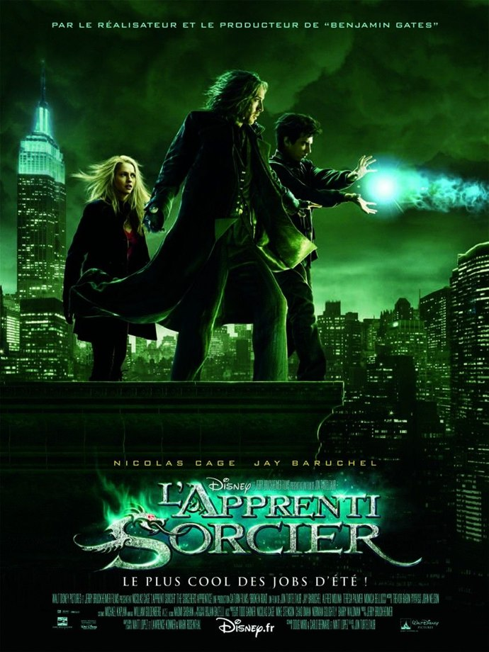
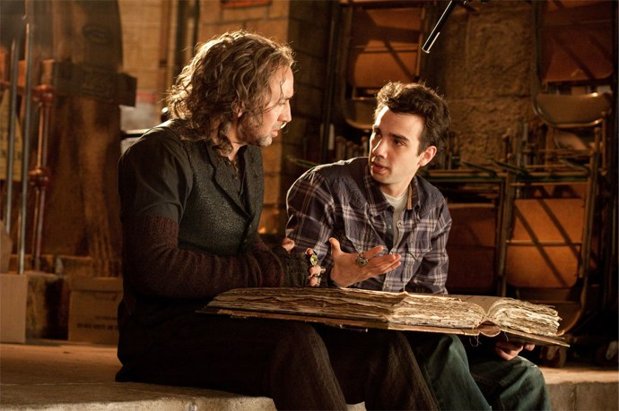
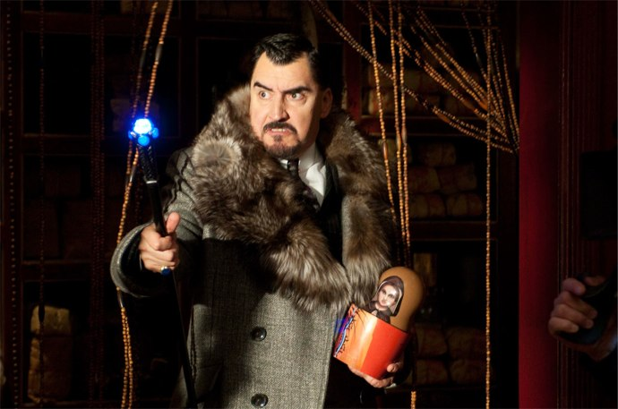

+++
titre = "<em>L&rsquo;Apprenti Sorcier</em>, John Turteltaub"
title = "L'Apprenti Sorcier, John Turteltaub"
url = "/apprenti-sorcier-turteltaub"
date = "2010-08-09T23:50:50"
Lastmod = "2014-01-11T23:28:36"
cover = "cage-baruchel-sorcerer-apprentice.jpg"
categorie = [ "À voir" ]
tag = [ "Blockbuster", "Fantastique", "Teen Movie", "Vite oublié" ]
createur = [ "John Turteltaub" ]
acteur = [ "Jay Baruchel", "Nicolas Cage", "Teresa Palmer", "Toby Kebbell" ]
annee = [ "2010" ]
weight = 2010
pays = [ "États-Unis" ]
original = "The Sorcerer's Apprentice"

+++

Quelques mois après <em><a href="http://voiretmanger.fr/2010/05/19/prince-persia-sable-temps-newell/">Prince of Persia</a></em>, le producteur génial quand il s&rsquo;agit de réaliser de grosses productions rentables Jerry Bruckheimer revient pour un blockbuster estival. <em>L&rsquo;Apprenti Sorcier</em> réunit tous les ingrédients du bon divertissement familial tout en surfant sur la vague <a href="http://voiretmanger.fr/tag/harry-potter/">Harry Potter</a> en introduisant à nouveau la magie dans le monde contemporain et familier. Le pari est globalement réussi et le film devrait autant impressionner votre jeune progéniture qu&rsquo;amuser les parents à coups de références. Classique, mais efficace.

Dave Stutler est un petit garçon de 10 ans normal, du moins le pensait-il jusqu&rsquo;au jour où une série de mésaventures le conduisent directement dans une sombre et poussiéreuse échoppe. Trouvant le magasin plutôt sympa, il regarde un peu et évidemment, casse quelque chose quand le propriétaire débarque. Ce dernier, Balthazar, est en fait un sorcier très puissant qui cherche depuis la mort de son maître Merlin (autour du VIIIe siècle) le premier sorcier digne de Merlin. Cet élu est le seul à pouvoir détruire une sorcière très méchante, la vile Morgana qui, faute de faire dans l&rsquo;original, a choisi le spectaculaire en détruisant le monde, en toute simplicité. Évidemment, les forces du bien veulent détruire ces forces du mal et Balthazar est un chic sorcier qui ne cherche que le bien de l&rsquo;humanité. Malheureusement, Dave trouve le moyen de libérer Horvath, un ancien gentil sorcier devenu méchant (ah oui, il faut suivre) et suite à de nouvelles péripéties variées, voilà les deux sorciers enfermés dans une urne alors que tout le monde prend ce pauvre Dave pour un fou. Dix ans passent alors et on retrouve un Dave devenu jeune homme et geek asocial, mais physicien génial. Il croise par hasard la route de Becky, son amour d&rsquo;enfance, alors que, coïncidence bienvenue pour les besoins du film, les deux sorciers sortent enfin de leur urne, prêts à en découdre. Balthazar doit convaincre Dave de devenir son apprenti et sauver le monde, ce qui n&rsquo;est jamais décision facile quand on a 20 ans et que l&rsquo;on a l&rsquo;amour de sa vie entre soi et la sauvegarde de l&rsquo;univers. Va-t-il réussir à combattre le mal et sauver le monde, ou va-t-il au contraire lamentablement échouer et laisser des milliers de morts détruire le monde des vivants ? Le suspense est, on s&rsquo;en doute, insoutenable<a href="#footnote_0_3798" id="identifier_0_3798" class="footnote-link footnote-identifier-link" title="Allez, vos figures p&eacute;trifi&eacute;es par l&rsquo;effroi de ne pas savoir si le monde sera sauv&eacute; ou non &agrave; la fin de L&rsquo;Apprenti sorcier me font de la peine. Oui, les m&eacute;chants sont terrass&eacute;s, le monde est sauv&eacute;, les humains n&rsquo;y ont vu que du feu (enfin, m&ecirc;me pas) et le h&eacute;ros conclut. Voil&agrave;, c&rsquo;est dit.">1</a>…

Comme souvent dans ce genre de film, la vraisemblance n&rsquo;est vraiment qu&rsquo;un futile détail qui peut, de temps en temps, pimenter un peu le déroulement de l&rsquo;histoire, mais qui s&rsquo;oublie bien vite si besoin est. <em>L&rsquo;Apprenti Sorcier</em> élabore ainsi une mythologie assez convenue autour du mythe de <a href="http://fr.wikipedia.org/wiki/Merlin_(magicien)">Merlin</a>, personnage qui parcourt les mythes anglo-saxons et qui fait immédiatement sens bien au-delà du monde anglo-saxon, notamment grâce à Walt Disney. De cette mythologie initiale résumée au triple galop en début de film, les scénaristes se sont amusés à créer un univers de magie en partie modernisé, c&rsquo;est là son originalité. Là où Harry Potter assume complètement son côté fantastique, le film de Turteltaub tente tant bien que mal de justifier la magie par la physique. Le tout serait ainsi de faire secouer plus rapidement que d&rsquo;habitudes des molécules pour transformer un objet solide et stable en matière instable et potentiellement explosive. L&rsquo;idée n&rsquo;est pas mauvaise, d&rsquo;autant que le héros est un génie des physiques et sait maîtriser l&rsquo;électricité comme personne, mais c&rsquo;est vraiment juste une idée lancée en l&rsquo;air. Dès que le scénario le requiert, le fantastique pur reprend ses droits, offrant la possibilité à des prises murales à cracher l&rsquo;eau qui viendrait créer un court-jus, ou en faisant varier les effets d&rsquo;un même sort selon la personne visée. On reste ainsi dans le divertissement pur, celui qui nécessite de multiplier à l&rsquo;absurde les occasions de justifier le budget alloué aux effets spéciaux. <em>L&rsquo;Apprenti Sorcier</em>, bien rythmé et sans temps mort, est ainsi efficace et plaisant à regarder. Ça pète dans tous les sens, on en prend plein les yeux et c&rsquo;est bien fichu.

Mais au-delà des explosions et du fantastique, <em>L&rsquo;Apprenti Sorcier</em> est aussi un <em>teen-movie</em> dans la plus grande tradition du genre. Rejoignant là une tendance que semble suivre la saga Harry Potter si l&rsquo;on en croit le <a href="http://voiretmanger.fr/2009/07/24/harry-potter-prince-sang-mele-yates/">dernier opus sorti</a> à ce jour au cinéma, le dernier Disney n&rsquo;oublie pas de ménager des thématiques et questions censées plaire aux adolescents. L&rsquo;histoire d&rsquo;amour entre le jeune sorcier et la belle (et blonde) Becky prend ainsi une importance un peu démesurée au regard de son rôle dans l&rsquo;histoire. Certes, c&rsquo;est elle qui réussit à offrir aux gentils un peu de temps lors de l&rsquo;affrontement final et c&rsquo;est donc elle qui contribue, quelque part, à permettre au film de se terminer ainsi. Mais enfin, cela ne justifiait pas forcément un développement aussi important : pour Dave, cette fille est toute sa vie et les 10 ans passés loin d&rsquo;elle sont ressentis comme l&rsquo;enfer sur terre. Cette vision totalement égocentrée du monde est indéniablement la marque de l&rsquo;adolescence et devient ici un enjeu central. Les scénaristes facétieux ont décidé de ne pas en rester là en doublant cet amour adolescent d&rsquo;une histoire d&rsquo;amour entre Balthazar et une sorcière gentille qui s&rsquo;était sacrifiée pour lui à la mort de Merlin. Ces deux êtres qui ne vieillissent jamais peuvent aussi symboliser l&rsquo;amour fou, indéfini et indépassable : le film prend alors une dimension presque romantique<a href="#footnote_1_3798" id="identifier_1_3798" class="footnote-link footnote-identifier-link" title="&Agrave; propos de cette Veronica enferm&eacute;e dans une poup&eacute;e russe pendant des si&egrave;cles, un m&eacute;chant la fait &agrave; un moment r&eacute;appara&icirc;tre devant le pauvre Balthazar qui n&rsquo;en croit pas ses yeux. Cela ne vous rappelle rien ?">2</a>.

Comme tout bon blockbuster estival <em>et</em> familial qui se respecte, <em>L&rsquo;Apprenti Sorcier</em> donne aussi aux parents contraints et forcés d&rsquo;accompagner leurs petits voir le film de quoi s&rsquo;occuper. Si l&rsquo;histoire reste avant tout très simple et expliquée de manière très pédagogique, le film cache à de multiples reprises des références plus ou moins explicites. Ainsi, c&rsquo;est <em>Star Wars</em> qui débarque brusquement quand un sorcier hypnotise quelqu&rsquo;un, tandis que le héros s&rsquo;amuse de l&rsquo;accoutrement disons singulier d&rsquo;un autre sorcier en lui demandant s&rsquo;il appartient à Depeche Mode. La grosse référence de ce film financé, ne l&rsquo;oublions pas, par Walt Disney, est <em>Fantasia</em> dont la scène du ménage est reprise au mouvement de balais et à la musique près pendant le film. <em>L&rsquo;Apprenti Sorcier</em> ne réinvente pas la roue, c&rsquo;est incontestable tant la mode des références et clins d&rsquo;œil est devenue centrale dans tous les films à gros budgets familiaux. Mais c&rsquo;est une méthode assez plaisante pour satisfaire tout le monde, petits ou grands. Ce n&rsquo;est jamais trop pesant et ces références empêchent le film de se prendre trop au sérieux, ce qui n&rsquo;était pas gagné d&rsquo;avance finalement. Après <em><a href="http://voiretmanger.fr/2010/03/29/kick-ass-vaughn/">Kick-Ass</a></em>, Nicolas Cage semble s&rsquo;être trouvé une voie dans la veine du blockbuster second degré (à des échelles certes très différentes) et il n&rsquo;est pas mauvais dans ce type de rôle. Le héros est interprété par un Jay Baruchel habitué aux blockbusters familiaux et qui n&rsquo;entrera pas dans l&rsquo;histoire du cinéma par ce rôle.

<em>L&rsquo;Apprenti Sorcier</em> se révèle ainsi une plutôt bonne surprise. On pouvait craindre le pire, mais c&rsquo;est, je dirais, un bon Bruckheimer. Ne cherchez pas l&rsquo;originalité ou la surprise, ce serait vain. Le film de John Turtelaub remplit son contrat de divertir petits et grands. Film à grand spectacle efficace, mais qui a la bonne idée de ne jamais se prendre trop au sérieux, c&rsquo;est aussi un <em>teen-movie</em> assez classique. À voir, en famille.

<h3>Vous voulez m&rsquo;aider ?<a href="#footnote_2_3798" id="identifier_2_3798" class="footnote-link footnote-identifier-link" title="&Agrave; propos de la publicit&eacute;&hellip;">3</a></h3>
<ul>
<li><a href="http://www.amazon.fr/gp/product/B003YUBZ8Y/ref=as_li_ss_tl?ie=UTF8&#038;tag=leblogdenic07-21&#038;linkCode=as2&#038;camp=1642&#038;creative=19458&#038;creativeASIN=B003YUBZ8Y">Acheter le film en Blu-Ray sur Amazon</a></li>
<li><a href="http://www.amazon.fr/gp/product/B003YUBZ8O/ref=as_li_ss_tl?ie=UTF8&#038;tag=leblogdenic07-21&#038;linkCode=as2&#038;camp=1642&#038;creative=19458&#038;creativeASIN=B003YUBZ8O">Acheter le film en DVD sur Amazon</a></li>
<li><a href="http://itunes.apple.com/fr/movie/lapprenti-sorcier/id403486641">Acheter le film sur l&rsquo;iTunes Store</a></li>
</ul>

<ol class="footnotes"><li id="footnote_0_3798" class="footnote">Allez, vos figures pétrifiées par l&rsquo;effroi de ne pas savoir si le monde sera sauvé ou non à la fin de <em>L&rsquo;Apprenti sorcier</em> me font de la peine. Oui, les méchants sont terrassés, le monde est sauvé, les humains n&rsquo;y ont vu que du feu (enfin, même pas) et le héros conclut. Voilà, c&rsquo;est dit. [<a href="#identifier_0_3798" class="footnote-link footnote-back-link">&#8617;</a>]</li><li id="footnote_1_3798" class="footnote">À propos de cette Veronica enfermée dans une poupée russe pendant des siècles, un méchant la fait à un moment réapparaître devant le pauvre Balthazar qui n&rsquo;en croit pas ses yeux. Cela ne vous <a href="http://voiretmanger.fr/2010/07/17/inception-nolan/">rappelle rien</a> ? [<a href="#identifier_1_3798" class="footnote-link footnote-back-link">&#8617;</a>]</li><li id="footnote_2_3798" class="footnote"><a href="http://voiretmanger.fr/soutien/">À propos de la publicité…</a> [<a href="#identifier_2_3798" class="footnote-link footnote-back-link">&#8617;</a>]</li></ol>
