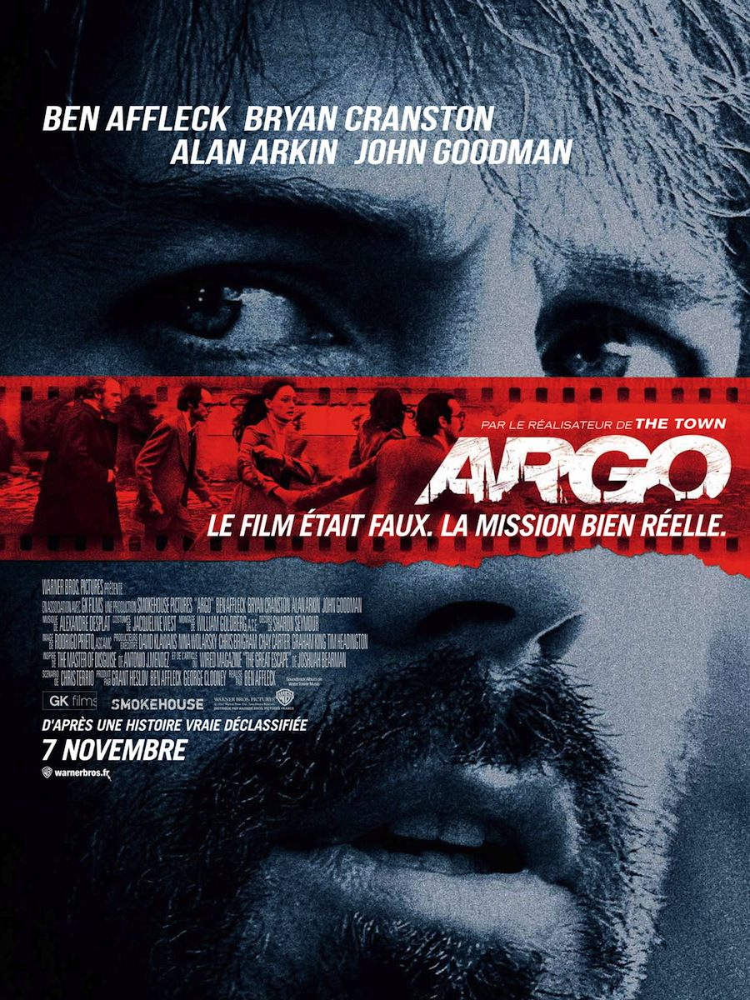
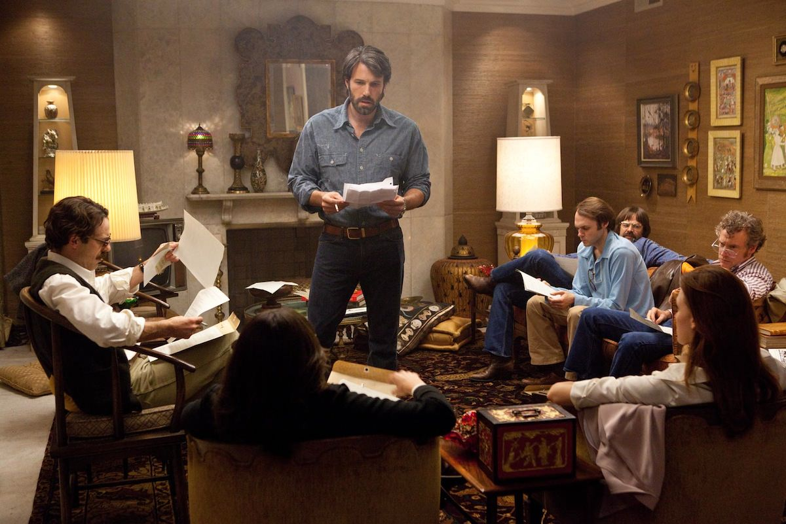
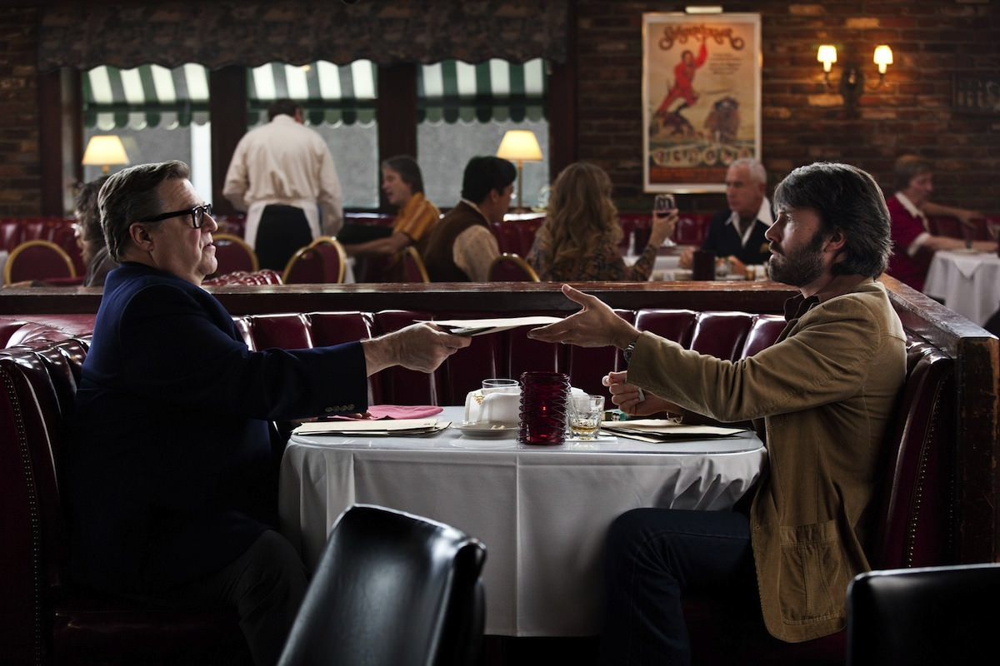

+++
type = "post"
titre = "Argo, Ben Affleck"
title = "Argo, Ben Affleck"
url = "/argo-affleck"
date = "2012-11-11T00:38:55"
Lastmod = "2013-03-13T14:01:34"
cover = "ben-affleck-argo.jpg"
categorie = [ "À voir" ]
tag = [ "Espionnage", "Guerre", "Histoire", "Histoire vraie", "Société", "Suspense", "Violence" ]
createur = [ "Ben Affleck" ]
acteur = [ "Ben Affleck", "Bryan Cranston", "John Goodman" ]
annee = [ "2012" ]
weight = 2012
pays = [ "États-Unis" ]

+++

Ben Affleck avait impressionné en 2010 avec <a href="http://voiretmanger.fr/2010/09/18/town-affleck/" title="The Town, Ben Affleck - À voir et à manger"><em>The Town</em></a>, le deuxième film de cet ex-acteur fade qui s&rsquo;est révélé bien meilleur derrière la caméra. Autant dire que son prochain film était attendu et après un thriller assez classique, il s&rsquo;attaque à la reconstitution historique avec <em>Argo</em>. L&rsquo;affiche ne laisse pas planer le doute : il s&rsquo;agit d&rsquo;une histoire vraie. Même s&rsquo;il n&rsquo;en évite pas tous les pièges, Ben Affleck ne tombe pas dans le piège de la docu-fiction et propose un long-métrage très bien mené, extrêmement efficace et même stressant, surtout si vous ne connaissez pas la fin avant de le voir. 

<em>Argo</em> commence au cœur de la <a href="http://fr.wikipedia.org/wiki/Révolution_iranienne">révolution iranienne</a> qui a vu le retour dans le pays de l&rsquo;Ayatollah Khomeini et la mise en place d&rsquo;un régime islamiste extrémiste. Quelques cartons rappellent les épisodes précédents, de la mise en place dans les années 1950 d&rsquo;un régime démocratique hostile aux intérêts américains au retour du Shah d&rsquo;Iran sous l&rsquo;impulsion des États-Unis. Ce dernier vit luxueusement et maintien son peuple dans la misère et l&rsquo;oppression, créant ainsi le terreau idéal au développement du mécontentement et des contestations, canalisés par les religieux musulmans. En 1979, c&rsquo;est au nom de l&rsquo;Islam et contre les États-Unis que le peuple, excédé, renverse le gouvernement et prend le pouvoir. L&rsquo;ambassade américaine est prise d&rsquo;assaut et tous ses occupants sont pris en otage. Six membres de l&rsquo;ambassade réussissent toutefois à s&rsquo;enduire avant et ils se réfugient chez l&rsquo;ambassadeur canadien. Les États-Unis qui refusent d&rsquo;affronter directement l&rsquo;Iran par peur de déclencher une nouvelle guerre du Vietnam décident toutefois de sauver ces six hommes et femmes. Tony Mendez, spécialiste de l&rsquo;exfiltration à la CIA, est chargé de cette mission difficile et il met au point une couverture qui ne serait pas crédible si elle n&rsquo;était pas véridique… 

Inspiré d&rsquo;une histoire vraie, le scénario d&rsquo;<em>Argo</em> ne peut prétendre faire dans l&rsquo;originalité. Si vous connaissez l&rsquo;histoire originale, vous connaissez celle du film, jusqu&rsquo;à sa fin bien sûr, ce qui peut nuire à la tension pourtant entretenue d&rsquo;un bout à l&rsquo;autre par Ben Affleck. En revanche, en ne connaissant pas la fin, vous serez emporté par un suspense très bien entretenu. Il faut dire que ce plan de sauvetage paraît totalement impossible, loufoque même, à tel point que l&rsquo;on aurait sans doute critiqué le manque de réalisme du scénario s&rsquo;il ne s&rsquo;était pas agi d&rsquo;une histoire réelle. Cette idée d&rsquo;une équipe de cinéma qui vient faire du repérage pour tourner en Iran alors qu&rsquo;un régime qui rejette l&rsquo;Occident et son mode de vie vient de prendre le pouvoir est absolument absurde et le spectateur ne peut que craindre en permanence pour la vie des Américains sur place et de Tony. Pourtant tout se déroule comme prévu, le pouvoir qui se met en place en Iran accepte l&rsquo;idée du tournage et donne à Tony son visa d&rsquo;entrée. Reste ensuite à apprendre aux six Américains leurs nouveaux rôles et à jouer le jeu en se rendant au cœur de Téhéran pour faire du repérage. Jusqu&rsquo;au bout, <em>Argo</em> joue la carte du suspense, notamment par d&rsquo;astucieux montages alternés et il y a fort à parier que vous serez pris par l&rsquo;attente et l&rsquo;inquiétude, même en connaissant la fin. 

Au-delà de l&rsquo;opération pour extraire quelques ressortissants américains des griffes du pouvoir mis en place en Iran, <em>Argo</em> est aussi l&rsquo;occasion pour Ben Affleck de parler de la Révolution iranienne et de dénoncer au passage le rôle des États-Unis. Les explications qu&rsquo;il place au début du film sont sans appel et dénoncent très directement l&rsquo;action de son pays qui préférait, en pleine Guerre froide, un tyran pro-américain à la tête de l&rsquo;Iran à une démocratie. Après une telle introduction, on s&rsquo;attend à une dénonciation en règle, mais le film rentre vite dans les rangs en fustigeant le régime de Khomeini. C&rsquo;est évidemment assez logique, cette révolution ayant été l&rsquo;occasion de bon nombre d&rsquo;actions tout à fait condamnables, mais <em>Argo</em> donne peut-être un peu trop dans l&rsquo;opposition binaire qui a toutefois l&rsquo;avantage de permettre au scénario de rester parfaitement compréhensible. On regrette toutefois une fin malheureusement trop conventionnelle, violons et drapeau américain dans le vent y compris. Le dernier film de Ben Affleck est en revanche plus intéressant sur Hollywood et sa critique. Pour mettre en place sa couverture, Tony a besoin de créer un faux film réaliste : il va ainsi voir un spécialiste des maquillages de cinéma qui a déjà travaillé avec la CIA. Ensemble, ils créent une vraie-fausse boîte de production, achètent les droits sur un vrai mauvais scénario de SF, recrutent un vrai producteur et choisissent même quelques vrais acteurs. Avec quelques chèques et un peu de volonté, ils parviennent à créer un faux film, une manière pour <em>Argo</em> de critiquer une industrie du cinéma capable du pire comme du meilleur. L&rsquo;un des plans du film montre le célèbre panneau Hollywood en piteux état et à moitié détruit, une métaphore bien entendu de la situation de l&rsquo;industrie du cinéma à l&rsquo;époque. Cette incursion de l&rsquo;industrie cinématographique au cœur d&rsquo;un tel film est assez inattendue et bienvenue, d&rsquo;autant qu&rsquo;elle est bien menée par Ben Affleck. 

Cinéaste assez classique, Ben Affleck assume encore une fois son traitement très académique pour <em>Argo</em>. C&rsquo;est peut-être de la modestie par rapport à ses pairs, mais peut-être aussi le choix d&rsquo;effacer la mise en scène derrière un sujet qui se suffit à lui-même. Le long-métrage ne fait peut-être pas d&rsquo;étincelles, mais il faut saluer le remarquable travail de montage qui évite toute baisse de régime pendant près de deux heures. Les montages alternés entre Iran et États-Unis fonctionnent à merveille et Ben Affleck semble les multiplier dans <em>Argo</em>, jusqu&rsquo;au montage final à couper vraiment le souffle. Classique, certes, mais aussi très efficace, le résultat justifie totalement le travail du réalisateur qui prouve une nouvelle fois qu&rsquo;il mérite d&rsquo;être suivi, bien plus que pendant sa période d&rsquo;acteur simple. La réalisation lui donne même de la valeur en tant qu&rsquo;acteur, puisque Ben Affleck se débrouille plutôt bien dans ce rôle d&rsquo;agent de la CIA. Autour de lui, on retrouve avec plaisir Bryan Cranston, l&rsquo;excellent héros de la série <a href="http://voiretmanger.fr/2012/06/24/breaking-bad-gilligan/" title="Breaking Bad, Vince Gilligan (AMC) - À voir et à manger"><em>Breaking Bad</em></a> et le trop rare John Goodman, vu récemment dans <a href="http://voiretmanger.fr/2011/10/16/artist-hazanavicius/" title="The Artist, Michel Hazanavicius - À voir et à manger"><em>The Artist</em></a>. Le travail des décorateurs mérite aussi d&rsquo;être salué, tant la reconstitution de l&rsquo;époque impressionne par sa justesse : <em>Argo</em> n&rsquo;évite pas la sempiternelle comparaison d&rsquo;images d&rsquo;époques et du film, mais il faut bien avouer qu&rsquo;elle est ici méritée.

Une nouvelle fois, Ben Affleck parvient à proposer un film classique et très réussi. <em>Argo</em> prend le spectateur dans un suspense qui ne faiblit jamais pendant près de deux heures. Même si on connait déjà l&rsquo;issue de cette histoire vraie, le long-métrage impressionne par son suspense efficace, tandis qu&rsquo;il permet de vivre la Révolution iranienne de l&rsquo;intérieur<a href="#footnote_0_7712" id="identifier_0_7712" class="footnote-link footnote-identifier-link" title="Un point de vue que l&rsquo;on pourra compl&eacute;ter avec l&rsquo;excellent Persepolis, passionnante autobiographie anim&eacute;e qui offre le regard d&rsquo;une jeune fille qui peine &agrave; comprendre le virage religieux.">1</a>. Un spectacle très agréable, à ne pas rater en ce moment en salles.

<h3>Vous voulez m&rsquo;aider ?<a href="#footnote_1_7712" id="identifier_1_7712" class="footnote-link footnote-identifier-link" title="&Agrave; propos de la publicit&eacute;&hellip;">2</a></h3>
<ul>
<li><a href="http://www.amazon.fr/gp/product/B00AJO6CL8/ref=as_li_ss_tl?ie=UTF8&tag=leblogdenic07-21&linkCode=as2&camp=1642&creative=19458&creativeASIN=B00AJO6CL8">Acheter le film en Blu-Ray et DVD sur Amazon</a></li>
<li><a href="http://www.amazon.fr/gp/product/B00A6REU12/ref=as_li_ss_tl?ie=UTF8&tag=leblogdenic07-21&linkCode=as2&camp=1642&creative=19458&creativeASIN=B00A6REU12">Acheter le film en DVD sur Amazon</a></li>
<li><a href="https://itunes.apple.com/fr/movie/argo/id592829879">Acheter ou louer le film sur l&rsquo;iTunes Store</a></li>
</ul>

<ol class="footnotes"><li id="footnote_0_7712" class="footnote">Un point de vue que l&rsquo;on pourra compléter avec l&rsquo;excellent <a href="http://voiretmanger.fr/2011/10/17/persepolis-satrapi-paronnaud/" title="Persepolis, Marjane Satrapi et Vincent Paronnaud - À voir et à manger"><em>Persepolis</em></a>, passionnante autobiographie animée qui offre le regard d&rsquo;une jeune fille qui peine à comprendre le virage religieux. [<a href="#identifier_0_7712" class="footnote-link footnote-back-link">&#8617;</a>]</li><li id="footnote_1_7712" class="footnote"><a href="http://voiretmanger.fr/soutien/">À propos de la publicité…</a> [<a href="#identifier_1_7712" class="footnote-link footnote-back-link">&#8617;</a>]</li></ol>
