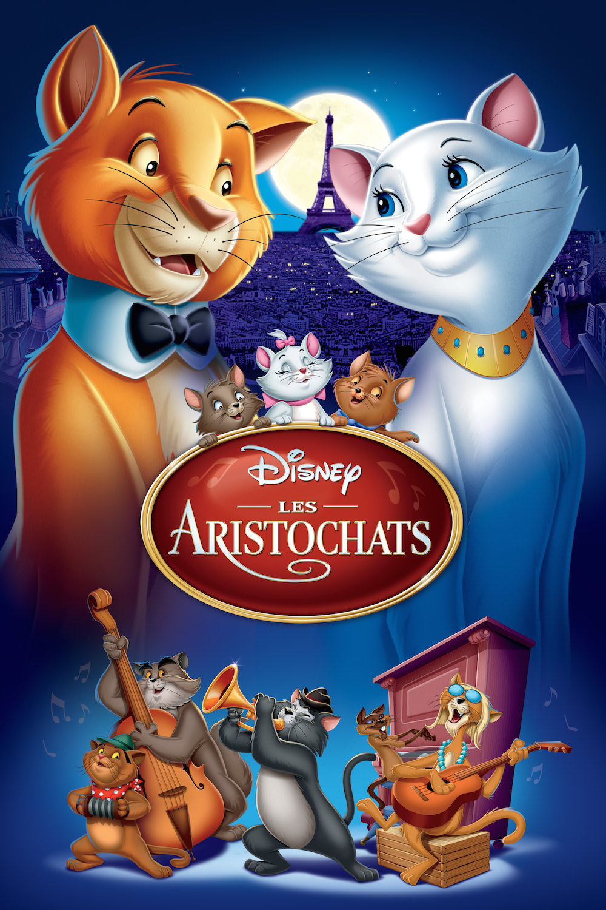
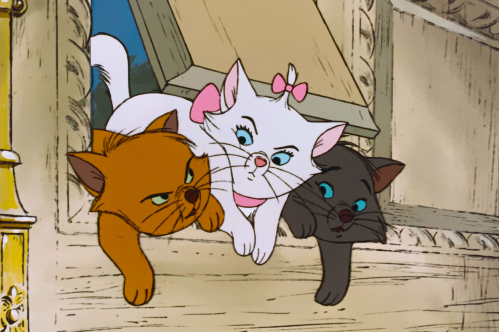
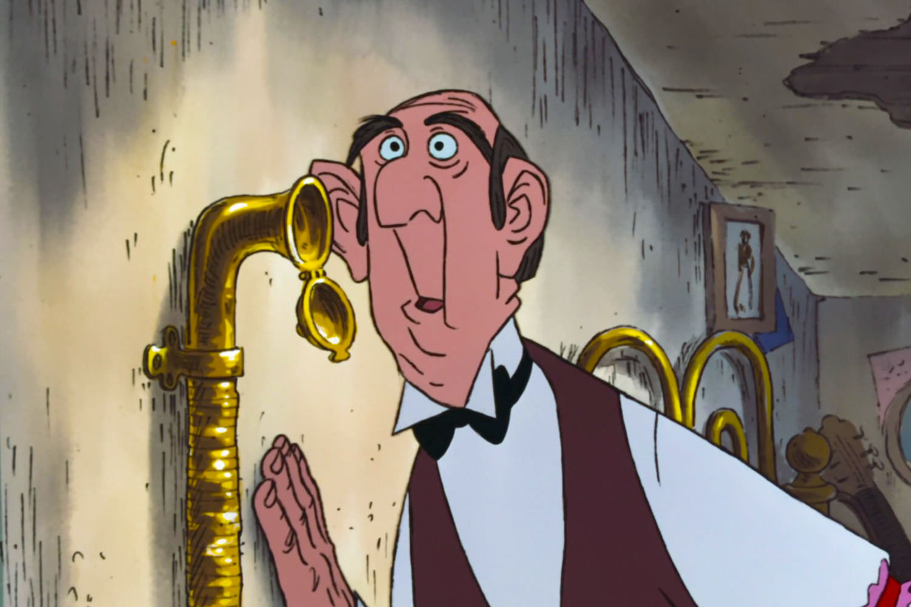

+++
type = "post"
titre = "<em>Les Aristochats</em>, Wolfgang Reitherman"
title = "Les Aristochats, Wolfgang Reitherman"
url = "/aristochats-reitherman"
date = "2014-04-15T23:14:08"
Lastmod = "2014-04-15T23:16:57"
cover = "les-aristochats-wolfgang-reitherman.jpg"
categorie = [ "À voir" ]
tag = [ "Amour", "Animation", "Animaux", "Argent", "Famille" ]
createur = [ "Walt Disney", "Wolfgang Reitherman" ]
annee = [ "1970" ]
weight = 1970
saga = [ "Classiques d'animation Disney" ]
pays = [ "États-Unis" ]
original = "The Aristocats"

+++

<em>Les Aristochats</em> est le dernier classique Disney à porter la marque de Walt Disney, le fondateur du studio, même si cette marque est déjà légère. Le projet pour ce nouveau long-métrage a été lancé de son vivant, mais quelques jours seulement avant sa mort, si bien qu’on peut le qualifier de premier classique de l’après-Walt Disney. Dans tous les cas, c’est le sentiment de répétition qui prédomine quand on regarde ce film d’animation. Malgré quelques séquences devenues cultes, et tout particulièrement la scène de jazz avec la fameuse chanson « <a href="https://itunes.apple.com/fr/album/tout-le-monde-veut-devenir/id724257727?i=724258053"><em>Tout le monde veut devenir un cat</em></a> », <em>Les Aristochats</em> semble assez paresseux en mettant à nouveau en scène des animaux et en renouant avec l’idée d’un déclassement social ou d’une disparition. L’ensemble reste malgré tout divertissant et efficace, à défaut d’être original.

Même si l’effet est moins appuyé, <em>Les Aristochats</em> commence comme <a href="/101-dalmatiens-geronimi-luske-reitherman/" title="Les 101 Dalmatiens, Clyde Geronimi, Hamilton Luske et Wolfgang Reitherman"><em>Les 101 Dalmatiens</em></a>. On découvre un univers humain — en l’occurrence un Paris fantasmé entre Belle Époque et entre deux guerres —, puis un objet humain (une calèche) et même deux humains : ici une vieille bourgeoise et son majordome. Tout porterait à croire que l’histoire sera celle des humains, mais le cadre ne s’arrête pas sur eux pour mieux s’attacher à des animaux, et cette fois, il s’agit de chats. Les personnages principaux de Wolfgang Reitherman sont Duchesse, une chatte, et ses trois chatons, Hector, Berlioz et Toulouse. Cela n’a rien de bien nouveau, et pour cause : dès les premiers plans, le film ressemble fort à un mix entre <em>Les 101 Dalmatiens</em>, comme on l’évoquait plus tôt, et <a href="/belle-clochard-geronimi-jackson-luske/" title="La Belle et le Clochard, Clyde Geronimi, Wilfred Jackson et Hamilton Luske"><em>La Belle et le Clochard</em></a> pour le milieu social et les jeux sur les animaux et leurs origines. La suite ne relève pas le niveau en matière d’originalité : sorti juste après <a href="/livre-jungle-reitherman/" title="Le Livre de la Jungle, Wolfgang Reitherman"><em>Le Livre de la Jungle</em></a>, <em>Les Aristochats</em> présentent à nouveau des animaux et le studio a eu la mauvaise idée de choisir les mêmes stars pour incarner des personnages dans chaque film. La voix de Baloo se retrouve ici, en version originale, pour le chat Thomas O’Malley. La proximité est troublante, elle l’était encore plus pour les contemporains qui ont vu les productions Disney dans leur ordre de réalisation, elle l’est toujours quand on regarde les classiques dans l’ordre.

<em>Les Aristochats</em> ne brille pas par son originalité, on l’aura bien compris, mais ce n’est pas, pour autant, un mauvais classique Disney. À défaut de se renouveler, le studio y met ce qu’il sait faire de mieux à l’époque, et le résultat est sans conteste assez bon, avec un divertissement réussi pour toute la famille. Plus que le trio de chatons et leur mère, tous aussi insupportables les uns que les autres, plus aussi que le très prévisible Thomas O’Malley, héros sans vraie saveur de l’histoire, on retiendra surtout quelques seconds rôles savoureux qui transforment cette histoire par ailleurs assez banale. Wolfgang Reitherman a pu compter sur le majordome Edgard qui est censé être le grand méchant de l’histoire, mais qui est surtout assez ridicule. S’il n’hésite pas à faire du mal à des chats sans défense pour gagner de l’argent plus rapidement, il est incapable de faire face à deux chiens qui sont également particulièrement stupides. Ce duo comique est réussi, même s’il a lui aussi des airs de déjà vu — on pense à un duo similaire dans <em>Les 101 Dalmatiens</em>, entre autres —, mais c’est surtout le duo d’oies que l’on retiendra. Par moment, <em>Les Aristochats</em> sait ainsi toucher exactement ce qu’il faut pour susciter l’hilarité de son public et le résultat est au rendez-vous. Les chansons sont entraînantes, surtout celle avec les « <em>cats</em> » bien entendu, bref c’est un classique Disney qui fait le travail. À cet égard, on pourrait même dire que ce vingtième classique fait office de bilan avant de mieux rebondir, mais les productions suivantes du studio vont montrer que le rebond se fait quelque peu attendre…

Passé après <em>Les 101 Dalmatiens</em> qui reste, quand ce film sort en 1970, un des meilleurs Disney, <em>Les Aristochats</em> souffre de la trop grande proximité avec son prédécesseur et des comparaisons inévitables. Un peu répétitif, dénudé de grand méchant digne de ce nom et assez léger, ce long-métrage est moins réussi, c’est un fait. N’enterrons pas trop vite le travail de Wolgang Reitherman toutefois : à défaut d’être original, le vingtième classique Disney est un divertissement familial qui reste, aujourd’hui encore, assez efficace.

<h3>Vous voulez <a href="/soutien/">m’aider</a> ?</h3>
<ul>
<li><a href="http://www.amazon.fr/gp/product/B008B8EA9U/ref=as_li_ss_tl?ie=UTF8&amp;tag=leblogdenic07-21&amp;linkCode=as2&amp;camp=1642&amp;creative=19458&amp;creativeASIN=B008B8EA9U">Acheter le film en Blu-ray sur Amazon</a></li>
<li><a href="http://www.amazon.fr/gp/product/B008B8EAAY/ref=as_li_ss_tl?ie=UTF8&amp;tag=leblogdenic07-21&amp;linkCode=as2&amp;camp=1642&amp;creative=19458&amp;creativeASIN=B008B8EAAY">Acheter le film en DVD sur Amazon</a></li>
<li><a href="https://itunes.apple.com/fr/movie/les-aristochats/id369130451">Acheter ou louer le film sur l’iTunes Store</a></li>
</ul>

