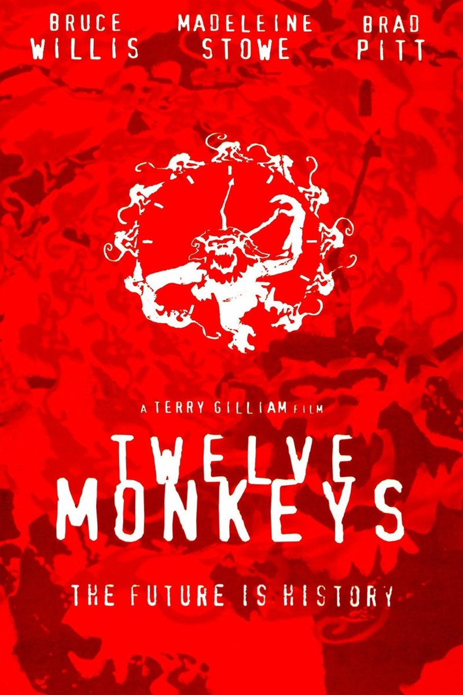
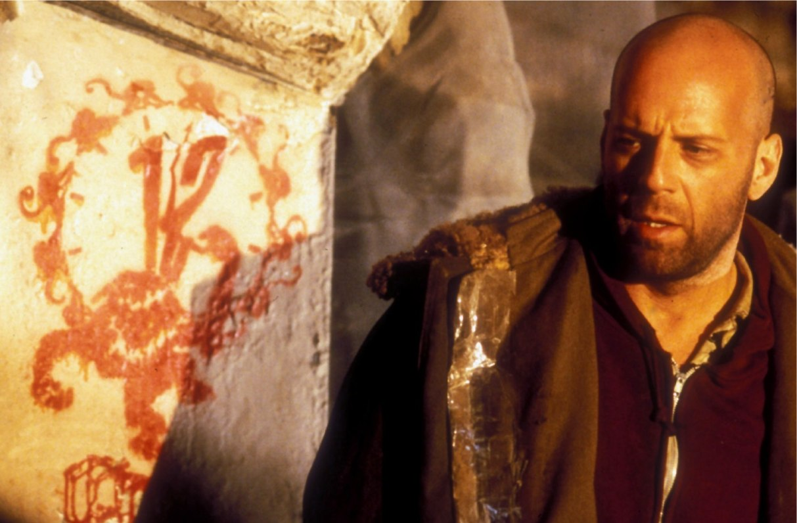
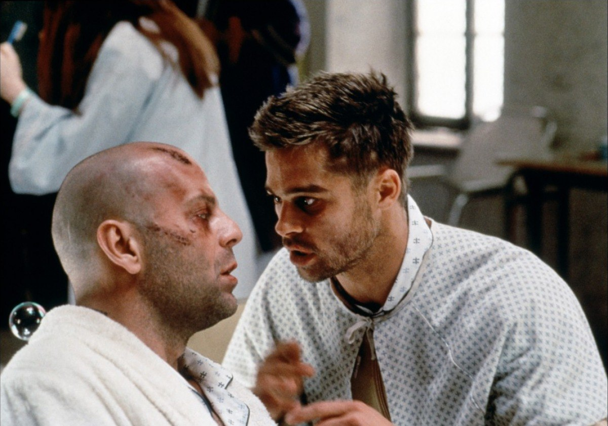

+++
type = "post"
titre = "<em>L&rsquo;Armée des 12 Singes</em>, Terry Gilliam"
title = "L'Armée des 12 Singes, Terry Gilliam"
url = "/armee-12-singes-gilliam"
date = "2012-04-30T14:30:07"
Lastmod = "2015-03-28T19:29:27"
cover = "armee-12-singes-bruce-willis.jpg"
categorie = [ "À voir" ]
tag = [ "Apocalypse", "Dystopie", "Folie", "Science-Fiction", "Société", "Technologies", "Voyage temporel" ]
acteur = [ "Brad Pitt", "Bruce Willis" ]
annee = [ "1996" ]
weight = 1996
pays = [ "États-Unis" ]

+++

Pour son septième film, Terry Gilliam s&rsquo;intéresse à nouveau à un univers de science-fiction. Dix ans après <em>Brazil</em>, l&rsquo;ancien membre des Monty Python propose à nouveau son ambiance complètement barrée si typique dans <em>L&rsquo;Armée des 12 Singes. </em>Un univers post-apocalyptique, une histoire de voyage dans le temps sur fond de folie et de critique de la société : Terry Gilliam plonge ses spectateurs dans un univers complexe, baroque et un peu foutraque, mais toujours passionnant.

Résumer <em>L&rsquo;Armée des 12 Singes </em>n&rsquo;est pas une mince affaire. Comme toute histoire qui se base sur le voyage dans le temps, elle repose sur de nombreux paradoxes qui la rendent particulièrement complexe. Le présent du film est situé dans un futur assez proche. Les hommes ont quitté la surface terrestre après l&rsquo;émergence d&rsquo;un terrible virus qui a anéanti la majeure partie des humains. Ce qui reste de l&rsquo;humanité après cinq milliards de morts se terre dans les sous-sols de la planète. Des scientifiques ont pris le pouvoir et ils ont organisé la société de manière logique et froide. Les avancées technologiques leur permettent d&rsquo;envisager un moyen pour trouver un remède au terrible virus : ils envoient des prisonniers dans le passé pour tenter de comprendre l&rsquo;origine du mal et essayer d&rsquo;y trouver une solution. James Cole est l&rsquo;un de ces voyageurs dans le temps : on l&rsquo;envoie dans le passé pour enquêter et il est justement sur une piste. Un groupuscule écologique radical connu sous le nom d&rsquo;armée des 12 singes chercherait à tuer toute l&rsquo;humanité pour rendre la Terre aux animaux…

Le film se présente dans un premier temps comme une dystopie assez classique : l&rsquo;univers construit par <em>L&rsquo;Armée des 12 Singes </em>reprend l&rsquo;idée d&rsquo;un événement apocalyptique qui a tué une bonne partie de l&rsquo;humanité et rendu la planète terrestre complètement invivable. Il ne s&rsquo;agit pas ici d&rsquo;une catastrophe nucléaire, mais d&rsquo;un virus qui a emporté très rapidement la population terrestre à partir de plusieurs points autour du globe. Quelques années ont suffi à tuer cinq milliards de personnes et à terrer les survivants dans des sous-sols délabrés, sales et mal éclairés où une caste supérieure de scientifiques règne en maître. Terry Gilliam montre assez peu d&rsquo;éléments de cet univers puisqu&rsquo;il ne s&rsquo;agit pas vraiment du cœur de son film, mais on en voit assez pour comprendre qu&rsquo;il ne s&rsquo;agit pas d&rsquo;une belle utopie. James Cole est emprisonné dans des conditions déplorables et il est traité avec bien peu d&rsquo;égard par les scientifiques qui n&rsquo;hésitent pas à expérimenter sur lui. Dans cet univers de science-fiction, on sait voyager dans le temps et James est ainsi envoyé en 1990, puis en 1996, l&rsquo;année d&rsquo;apparition du fameux virus. L&rsquo;essentiel du film se déroule à cette époque qui est antérieure au présent de <em>L&rsquo;Armée des 12 Singes</em>. La première fois que James est envoyé dans le passé, il atterrit dans un hôpital psychiatrique où l&rsquo;on prend cet individu qui dit venir du futur pour un fou. C&rsquo;est la force du film de Terry Gilliam : s&rsquo;il est d&rsquo;abord présenté comme de la science-fiction, il instille vite un doute dans l&rsquo;esprit du spectateur. Et si James était effectivement fou, comme ce que disent les psychiatres qui le traitent ? Et si tout cela n&rsquo;était qu&rsquo;un fruit de son imagination débordante ? La thèse est tout à fait crédible et sans révéler trop d&rsquo;éléments sur la fin, on peut simplement indiquer qu&rsquo;elle renforce cette théorie de la folie du personnage principal et qu&rsquo;elle amène à reconsidérer ce qui précède. Le scénario à toutefois l&rsquo;excellente idée de ne pas confirmer une hypothèse et d&rsquo;invalider l&rsquo;autre : <em>L&rsquo;Armée des 12 Singes</em> reste assez ouvert aux interprétations différentes.

Quelle que soit l&rsquo;hypothèse retenue, <em>L&rsquo;Armée des 12 Singes</em> ne fait aucun doute sur un point : sa critique de la science au sens large. Terry Gilliam construit la dystopie futuriste sur la base de scientifiques qui ont pris le pouvoir. Le moins que l&rsquo;on puisse dire, c&rsquo;est que la société qu&rsquo;ils ont forgée est loin de l&rsquo;idéal. Elle est peut-être rationnelle et logique, mais elle n&rsquo;en est pas moins parfaitement inhumaine et cruelle. James est manipulé, on imagine qu&rsquo;il est drogué et il n&rsquo;a absolument aucune volonté propre, même s&rsquo;il est censé être libéré suite à son travail dans le passé. Le film n&rsquo;en reste pas moins critique à l&rsquo;égard de la technologie, représentée ici par cette bulle entourée de dizaines d&rsquo;écrans. C&rsquo;est elle qui est pointée du doigt, comme si elle était la cause de tous les maux. Dans les années 1990, c&rsquo;est la psychiatrie qui est critiquée avec cet hôpital qui tient plus de la prison que de l&rsquo;établissement de santé. Les médecins sont vus comme des êtres imbus d&rsquo;eux-mêmes, incapables de se remettre en question et aux méthodes douteuses. L&rsquo;erreur est humaine, elle est aussi scientifique, et ce dans les deux époques. Dans le futur, les scientifiques sont censés envoyer le personnage principal en 1996, mais ils doivent s&rsquo;y reprendre à trois fois avant d&rsquo;atteindre la bonne date. Au-delà de cette représentation trouble de la folie et de son traitement, Terry Gilliam fait de la recherche scientifique le coupable de l&rsquo;épidémie qui a causé la perte de l&rsquo;humanité. Le virus n&rsquo;est pas naturel, il a été en effet conçu par un laboratoire et le film donne quelques éléments que l&rsquo;on ne révélera pas, mais qui accablent encore plus le corps scientifique.

Terry Gilliam n&rsquo;est pas un réalisateur ordinaire. Il suffit de jeter un œil à sa carrière de cinéaste pour en prendre conscience : il ne fait rien comme les autres et connaît un taux d&rsquo;échecs assez impressionnant, à tel point qu&rsquo;il est reconnu comme le réalisateur le plus malchanceux. <em>L&rsquo;Armée des 12 Singes</em> est à ce jour son plus grand succès commercial, mais ce n&rsquo;est pourtant pas le plus accessible. Si deux stars se partagent l&rsquo;affiche, ce film reprend toutes les thématiques chères au cinéaste et surtout cette forme si particulière. Terry Gilliam a commencé comme animateur pour le <em>Monty Python&rsquo;s Flying Circus</em> et il a toujours gardé un goût prononcé pour les univers visuels baroques.<em>L&rsquo;Armée des 12 Singes</em> n&rsquo;y fait pas exception, bien au contraire et ses décors futuristes sont particulièrement chargés et ressemblent plus à un bric-à-brac tout droit sorti d&rsquo;un marché aux puces que d&rsquo;un décor de science-fiction traditionnelle. Sa réalisation est à l&rsquo;image de ces décors : la caméra est rarement droite, elle semble toujours placée au mauvais endroit et Terry Gilliam utilise à l&rsquo;excès une lentille qui donne un effet fish-eye. L&rsquo;ensemble est saisissant, parfois un peu kitsch, mais le résultat est une ambiance poisseuse particulièrement réussie, qui rappelle parfois, accentuée, celle de <a href="http://voiretmanger.fr/2010/11/28/monty-pythons-sacre-graal/"><em>Monty Python : Sacré Graal !</em></a> Le succès de <em>L&rsquo;Armée des 12 Singes</em> tient aussi dans l&rsquo;interprétation de ses deux personnages principaux. Bruce Willis en impose dans ce rôle de voyageur dans le temps un peu dément, mais c&rsquo;est surtout un Brad Pitt encore jeune qui impressionne. Celui qui allait devenir une star hollywoodienne parfois un peu lisse interprète ici brillamment un fou furieux avec une justesse étonnante.

<em>L&rsquo;Armée des 12 Singes</em> est un film à la fois réjouissant par ses paradoxes temporels et inquiétants par son discours sur la folie. Terry Gilliam dévoile une dystopie terrifiante et en même temps assez réaliste, tandis qu&rsquo;il joue de nos attentes pour mieux brouiller les cartes. S&rsquo;agit-il simplement d&rsquo;un film d&rsquo;anticipation, ou d&rsquo;une plongée dans la folie humaine ? <em>L&rsquo;Armée des 12 Singes</em> ne répond pas vraiment, à vous de faire votre propre opinion…

<h3>Vous voulez m&rsquo;aider ?</h3>
<ul>
<li><a href="http://www.amazon.fr/gp/product/B002IWF1JI/ref=as_li_ss_tl?ie=UTF8&tag=leblogdenic07-21&linkCode=as2&camp=1642&creative=19458&creativeASIN=B002IWF1JI">Acheter le film en Blu-Ray sur Amazon</a></li>
<li><a href="http://www.amazon.fr/gp/product/B000068UT9/ref=as_li_ss_tl?ie=UTF8&tag=leblogdenic07-21&linkCode=as2&camp=1642&creative=19458&creativeASIN=B000068UT9">Acheter le film en DVD sur Amazon</a></li>
</ul>

