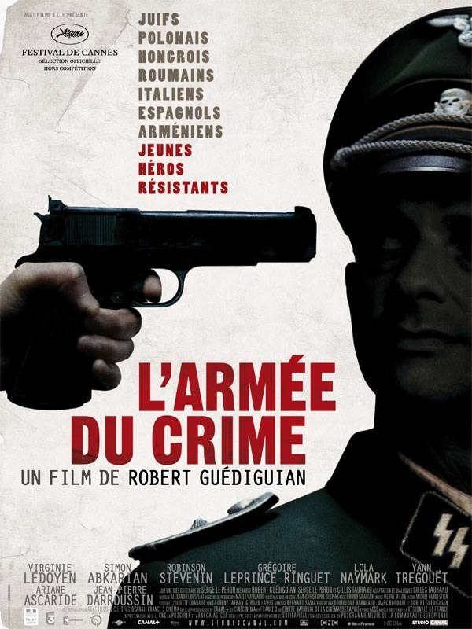
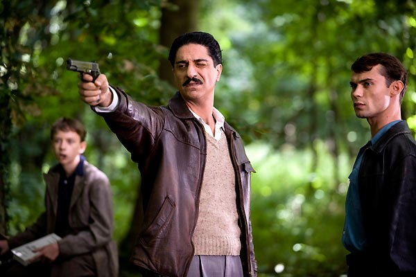
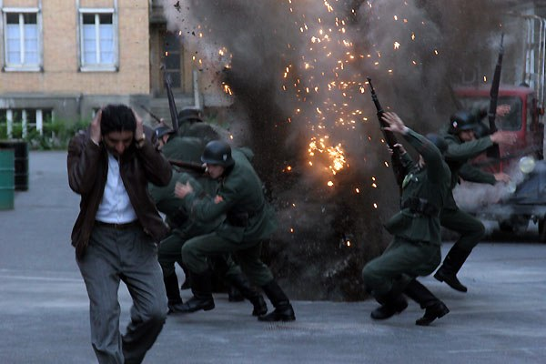
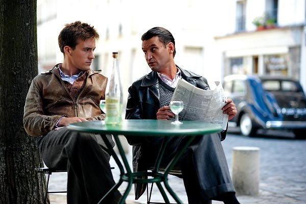

+++
type = "post"
titre = "L&rsquo;armée du crime, Robert Guédiguian"
title = "L'armée du crime, Robert Guédiguian"
url = "/armee-du-crime-guediguian"
date = "2009-09-27T23:46:55"
Lastmod = "2012-04-07T09:21:49"
cover = ""
categorie = [ "À voir" ]
tag = [ "Histoire", "Résistance", "Seconde guerre mondiale", "Vite oublié" ]
annee = [ "2009" ]
weight = 2009
pays = [ "France" ]

+++

Depuis l&rsquo;excellentissime <em>Promeneur du Champ de Mars</em>, Robert Guédiguian fait partie des quelques réalisateurs que je suis un peu à l&rsquo;aveugle, par principe. Avec <em>L&rsquo;armée du crime</em>, il revient à l&rsquo;histoire et quelle histoire, puisqu&rsquo;il s&rsquo;agit de celle d&rsquo;un groupe de résistants mené par un arménien ! Mais ce film à thèse ne m&rsquo;a pas vraiment passionné&#8230;

<em>L&rsquo;armée du crime</em> relate l&rsquo;histoire d&rsquo;un groupe de résistants français pendant l&rsquo;occupation allemande à Paris. Ce groupe se construit autour du poète arménien Manouchian et se compose de Juifs ou de communistes (ou des deux), souvent d&rsquo;origine étrangère. Ce sont tous des ennemis aux yeux des Allemands, mais aussi de la police française qui mène une traque sans merci contre ceux que l&rsquo;on va rapidement regrouper en une &laquo;&nbsp;armée du crime&nbsp;&raquo;. Leur principe est en effet de tuer autant d&rsquo;Allemands que possible soit d&rsquo;un coup de feu rapide dans une rue déserte, soit d&rsquo;une grenade bien placée dans la rue ou dans les maisons closes que fréquentent les nazis&#8230;

Le film ne laisse aucun doute sur le sort des membres du groupe puisqu&rsquo;il ouvre sur leur transfert vers, on le suppose en tout cas, le lieu de leur exécution. De toute façon, le film s&rsquo;inspire d&rsquo;une histoire vraie qui laisse peu de place au doute. Il est étonnant que le réalisateur se soit senti obligé de préciser à la fin de son film qu&rsquo;il a été contraint d&rsquo;introduire un peu de romanesque parmi les faits historiques, comme si c&rsquo;était un problème au cinéma.

D&rsquo;ailleurs, cet aveu est à mon sens un aveu de faiblesse du film. L&rsquo;affiche, là encore, ne laissait aucun doute en écrivant, après la longue liste des nationalités, &laquo;&nbsp;Jeunes Héros Résistants&nbsp;&raquo;. Guédiguian explicite à la fin qu&rsquo;il a souhaité faire entrer cette histoire vraie dans la légende, en héroïsant donc un peu ses personnages. Oui, mais voilà : depuis quand une légende devrait se construire à coups de messages blancs sur fond noir ? C&rsquo;est, je trouve, faire preuve d&rsquo;un manque étonnant de confiance pour ses spectateurs. On a le sentiment que Robert Guédiguian a voulu appuyer l&rsquo;héroïsme pour bien montrer qu&rsquo;il s&rsquo;agissait, justement, de héros, comme si ça n&rsquo;était pas si évident que ça dans les faits. D&rsquo;un point de vue intellectuel, ce message final ruine un peu tout ce qui précède je trouve : le spectateur ignorant de l&rsquo;époque serait légitimement en droit de douter de ce qu&rsquo;il a vu&#8230;

<em>L&rsquo;armée du crime</em> est un film à thèse, cela ne fait aucun doute. Robert Guédiguian admire tous les résistants du groupe Manouchian, et il entend bien nous le montrer, nous le démontrer même. Que l&rsquo;on se comprenne bien, je ne dis pas que c&rsquo;est honteux d&rsquo;être admiratif devant ces résistants, je le suis aussi d&rsquo;autant que je suis bien en peine pour savoir ce que j&rsquo;aurais fait à leur place. Résister à l&rsquo;occupant était, sans nul doute, héroïque, mais quand on essaie de m&rsquo;en convaincre à coups de violons et de plans bien appuyés, je me lasse vite.

Était-il ainsi nécessaire que tous les résistants soient merveilleusement gentils, sauf quand il faut être méchants, qu&rsquo;ils soient tous des héros stoïques façon tragédie grecque quand le jugement dernier vient à sonner ? Et était-il nécessaire au contraire de faire de tous les Allemands et tous les Français collabos des salauds impitoyables, prêts à écraser leur prochain par tous les moyens si jamais il était étranger, Juif ou pire, communiste ? Fallait-il vraiment nous montrer avec force effets pour bien insister sur la solennité de la scène, les rafles juives, l&rsquo;envoi dans les wagons à bestiaux, ou dans un autre registre la torture ? À propos de torture, j&rsquo;ai cru pendant un moment revoir l&rsquo;horrible &laquo;&nbsp;film&nbsp;&raquo; de Mel Gibson sur les derniers jours du Christ : c&rsquo;est vraiment, encore une fois, le héros grec impassible et impuissant face au monde extérieur plus mauvais que jamais.

C&rsquo;est quand même dingue, quand on y pense, que <a href="http://voiretmanger.fr/?p=1718">le dernier Tarantino</a>, pourtant un film déconnant au possible, soit plus réaliste sur les Allemands pendant l&rsquo;occupation que <em>L&rsquo;armée du crime</em>. Non, tous les soldats allemands n&rsquo;étaient pas des salauds sans foi ni loi sanguinaires qui écrasaient de leurs bottes couvertes de fer tous les nourrissons qui se trouvaient sur leur chemin. Certains étaient de vrais salauds heureux de massacrer du Juif au kilomètre, d&rsquo;autres des gars fort sympathiques, mécontents d&rsquo;être envoyés dans un pays inconnu, loin de chez eux, et qui n&rsquo;ont rien demandé. Quand on me montre un film supposé réaliste où l&rsquo;ennemi est un bloc de méchanceté sans faille, je n&rsquo;y crois pas plus que quand on me montre des héros sans faille.

<em>L&rsquo;armée du crime</em> n&rsquo;est pas un film désagréable pour autant. Nonobstant quelques passages dégoulinants de violons, la réalisation est énergique et efficace, même si assez conventionnelle. La reconstitution du Paris des années 1940 est réaliste, rien à dire. En outre, les acteurs sont tous bons, mention spéciale au passage à Simon Abkarian, très bon Manouchian (et Jean-Pierre Darroussin, jouissif en policier aussi bon pour trouver des résistants qu&rsquo;impitoyable). D&rsquo;aucuns ont néanmoins évoqué une reconstitution scolaire, je trouve ça assez juste&#8230;

Le film dit aussi des choses intéressantes sur la résistance, comme le difficile abandon de valeurs que l&rsquo;on pensait indépassables, comme le pacifisme, au profit d&rsquo;une cause plus grande. On aurait aimé en savoir plus sur le côté politique de la résistance, sur le rôle du parti communiste par exemple, mais le film préfère s&rsquo;attarder sur les vies humaines. Ce parti-pris n&rsquo;est pas stupide d&rsquo;ailleurs, si ce n&rsquo;est, je l&rsquo;ai dit, qu&rsquo;il étouffe totalement toute piste déviant de l&rsquo;héroïsme inconditionnel. On ne dit rien, aussi, de l&rsquo;étrange fait que tous les membres du groupe ne sont pas d&rsquo;origine française&#8230;

<em>In fine</em>, je suis déçu par <em>L&rsquo;armée du crime</em>. En lieu et place d&rsquo;un film passionnant sur la résistance, on a droit à un livre d&rsquo;histoire où les images bougent, ni plus ni moins. Certes, l&rsquo;intention est louable, et enseigner cette sombre période de l&rsquo;histoire aux jeunes générations est un devoir pour tout le monde. Mais une bonne intention n&rsquo;a jamais fait un bon film, et Guédiguian n&rsquo;a pas su ajouter les failles qui auraient permis de passer d&rsquo;un film manichéen et lisse à un film passionnant. Pour tout dire, L&rsquo;armée du crime est un film très vite oublié, ce qui est bien le signe à mon sens qu&rsquo;il passe à côté de son sujet. Au lieu d&rsquo;en faire des légendes, il risque bien d&rsquo;enfoncer le groupe Manouchian dans l&rsquo;oubli&#8230;

La critique est partagée sur ce film, à l&rsquo;image de <em>Télérama</em> qui <a href="http://www.telerama.fr/cinema/films/l-armee-du-crime,374382,critique.php">publie une double critique</a>. Miracle, je suis pour une fois d&rsquo;accord avec Pierre Murat, même s&rsquo;il est encore plus sévère que moi. Les <em><a href="http://www.lesinrocks.com/cine/cinema-article/t/1252682940/article/larmee-du-crime/">Inrockuptibles</a></em>, tout comme <em><a href="http://www.critikat.com/L-Armee-du-crime.html">Critikat</a></em>, sont de mon avis (ou vice-versa).

<h3>Vous voulez m&rsquo;aider ?<a href="#footnote_0_1868" id="identifier_0_1868" class="footnote-link footnote-identifier-link" title="&Agrave; propos de la publicit&eacute;&hellip;">1</a></h3>
<ul>
<li><a href="http://www.amazon.fr/gp/product/B002R0DR24/ref=as_li_ss_tl?ie=UTF8&#038;tag=leblogdenic07-21&#038;linkCode=as2&#038;camp=1642&#038;creative=19458&#038;creativeASIN=B002R0DR24">Acheter le film en Blu-Ray sur Amazon</a></li>
<li><a href="http://www.amazon.fr/gp/product/B002R0DR1U/ref=as_li_ss_tl?ie=UTF8&#038;tag=leblogdenic07-21&#038;linkCode=as2&#038;camp=1642&#038;creative=19458&#038;creativeASIN=B002R0DR1U">Acheter le film en DVD sur Amazon</a></li>
</ul>

<ol class="footnotes"><li id="footnote_0_1868" class="footnote"><a href="http://voiretmanger.fr/a-propos/publicite/">À propos de la publicité…</a> [<a href="#identifier_0_1868" class="footnote-link footnote-back-link">&#8617;</a>]</li></ol>
