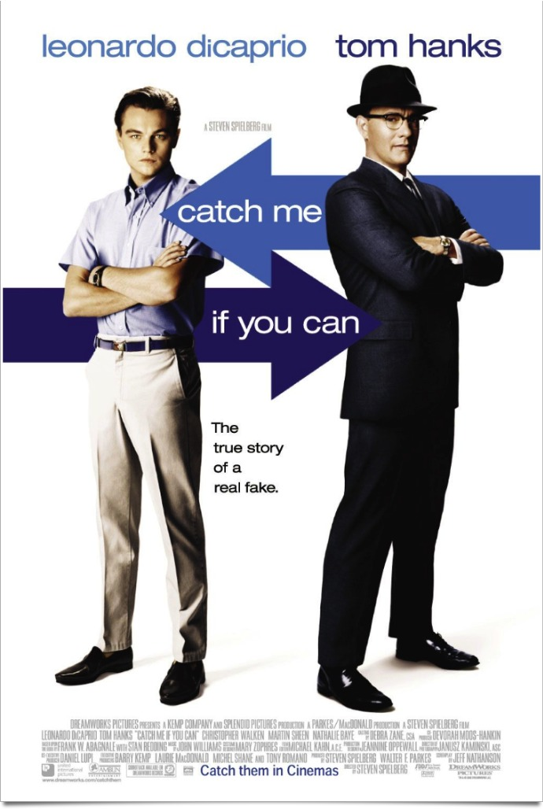

+++
type = "post"
titre = "<em>Arrête-moi si tu peux</em>, Steven Spielberg"
title = "Arrête-moi si tu peux, Steven Spielberg"
url = "/arrete-moi-si-tu-peux-spielberg"
date = "2011-12-10T00:14:04"
Lastmod = "2013-12-09T16:00:31"
cover = "leonardo-di-caprio-arrete-moi-si-tu-peux.jpg"
categorie = [ "À voir" ]
tag = [ "Biopic", "Blockbuster", "Comédie", "Drame", "Thriller" ]
createur = [ "Steven Spielberg" ]
acteur = [ "Christopher Walken", "Leonardo Di Caprio", "Martin Sheen", "Nathalie Baye", "Tom Hanks" ]
annee = [ "2003" ]
weight = 2003
pays = [ "États-Unis" ]
original = "Catch Me if You Can"

+++

Pour son vingt-quatrième film, Steven Spielberg réalise une sorte de biopic en évoquant l&rsquo;histoire vraie de Franck Abagnale Jr. Cet américain n&rsquo;avait que 16 ans quand il a commencé à arnaquer des banques avec de faux chèques et à se faire passer pour un autre dans les années 1960. <em>Arrête-moi si tu peux</em> est le récit de la traque incessante entre ce faussaire brillant et un agent du FBI. Un matériau fascinant pour film léger et très réussi.

L&rsquo;histoire de Franck commence en 1963. Il vit avec ses deux parents dans une confortable maison de l&rsquo;État de New York jusqu&rsquo;au jour où des difficultés financières contraignent la famille à quitter la maison pour un petit appartement. Le couple formé par ses parents ne va pas s&rsquo;en remettre et le jeune adolescent fuit la maison familiale quand on lui demande de choisir entre habiter chez son père ou chez sa mère. Pour vivre, il met à profit son aisance naturelle à mentir et à interpréter des personnages. À l&rsquo;école déjà, il avait remplacé un professeur pendant une semaine, sans que ses élèves ne s&rsquo;en rendent compte. Une fois livré à lui-même, il se fait d&rsquo;abord passer pour un pilote et parvient sans peine à tromper la compagnie, avant de devenir un docteur, puis un avocat. En tout, sa fuite dure jusqu&rsquo;en 1967, elle le mène dans plusieurs pays et lui permet de voler des millions de dollars aux banques américaines et européennes. Une performance qui force le respect, même si l&rsquo;étau du FBI se referme doucement sur le fugitif…

<em>Arrête-moi si tu peux</em> est d&rsquo;abord un récit fascinant et si improbable que l&rsquo;on peine à croire qu&rsquo;il est inspiré par une histoire vraie. C&rsquo;est bien simple, sans cette caution &laquo;&nbsp;histoire vraie&nbsp;&raquo;, le scénario aurait paru bien trop invraisemblable. Frank a quand même réussi à tromper toutes les banques américaines pendant des années. Il a même trompé de vrais pilotes en se faisant passer pour un copilote ou de vrais docteurs en se faisant passer pour un médecin à l&rsquo;hôpital. Il était manifestement doué pour apprendre par cœur tout ce qui compte, pour repérer les détails et surtout se fondre dans un moule. Frank est un excellent acteur et il faut le voir parler avec assurance de choses qu&rsquo;il ne connaît pas, observer attentivement ceux qui l&rsquo;entourent pour ensuite mieux les berner. Son aisance est telle qu&rsquo;il parvient même à duper à l&rsquo;agent du FBI qui le poursuit lors de leur première rencontre…

Steven Spielberg choisit un traitement assez léger, voire même humoristique, pour raconter l&rsquo;histoire de Franck Abagnale Jr. <em>Arrête-moi si tu peux</em> n&rsquo;est pas un thriller plein de suspense puisque la fin est connue d&rsquo;avance : Franck va être démasqué et le FBI va l&rsquo;emporter. Le film s&rsquo;intéresse donc plutôt à ce qui se passe avant l&rsquo;arrestation et aux arnaques réalisées par le jeune adolescent. Le film prend ainsi un plaisir certain à filmer les différents personnages interprétés par Franck, mais aussi ses techniques de faussaire. Le spectateur reste bluffé par tant de dextérité, mais il s&rsquo;amuse aussi de la facilité qu&rsquo;a Franck de s&rsquo;en sortir en toute situation. En cela, le film est assez proche de <em><a href="http://voiretmanger.fr/2010/02/11/i-love-you-phillip-morris-ficarra-requa/">I Love You Philip Morris</a></em> sur un sujet similaire, mais <em>Arrête-moi si tu peux</em> n&rsquo;est pas qu&rsquo;une comédie légère et un biopic tiré d&rsquo;une histoire vraie. Steven Spielberg reste fidèle à ses habitudes avec ce film qui paraît assez impersonnel et il raconte d&rsquo;abord et avant tout l&rsquo;histoire d&rsquo;un fils qui cherche à plaire à son père qui l&rsquo;abandonne en quelque sorte en laissant partir sa mère. Il est frappant de constater à quel point la mère devient quasiment absente après le divorce alors que la figure paternelle reste présente, même si elle finit elle aussi par disparaître. C&rsquo;est alors l&rsquo;agent du FBI qui prend le relai comme figure paternelle pour un héros qui reste avant tout un adolescent fragile, malgré son apparente maturité. À cet égard, <em>Arrête-moi si tu peux</em> est un film très personnel pour Steven Spielberg et un long-métrage plutôt mélancolique.

Dans sa filmographie, <em>Arrête-moi si tu peux</em> fait figure de pause enjouée entre une série de films beaucoup plus sombres. Quelques années après <em><a href="http://voiretmanger.fr/2011/11/26/il-faut-sauver-le-soldat-ryan-spielberg/">Il faut sauver le soldat Ryan</a></em> ou <em>A.I. Intelligence Artificielle</em> et avant <em>Le Terminal</em> et <em>La Guerre des mondes </em>, Steven Spielberg tourne une comédie légère, même si elle revêt aussi des teintes mélancoliques. Cela se voit aussi : les couleurs sont souvent lumineuses dans cette reconstitution des années 1960 et la lumière est souvent vive. Le cinéaste américain n&rsquo;a pas son pareil pour filmer de grosses productions et il le prouve ici encore avec un film assez long (près de 2h20), mais qui ne lasse jamais le spectateur. Le scénario n&rsquo;est pas toujours simple, mais on n&rsquo;est jamais perdu et <em>Arrête-moi si tu peux</em> est vraiment plaisant à regarder. Le succès du film doit aussi beaucoup à son interprète principal : Leonardo DiCaprio excelle en jeune faussaire brillant, même si on a un peu de mal à croire à son âge supposé. Tom Hanks compose quant à lui un rôle assez classique, mais toujours aussi efficace. John Williams compose une bande originale jazz et réussie qui participe au plaisir du film.

Le sujet est fascinant et Steven Spielberg n&rsquo;a pas échoué à le transposer sur grand écran. <em>Arrête-moi si tu peux</em> fascine d&rsquo;abord par ce qu&rsquo;il raconte : l&rsquo;histoire de ce jeune faussaire qui résiste au FBI pendant de nombreuses années et vole quelques millions aux banques tout en se faisant passer pour un pilote ou un médecin est assez hallucinante. On s&rsquo;amuse avec le cinéaste de cet adolescent effronté, mais Steven Spielberg raconte finalement toujours la même histoire, celle d&rsquo;un fils qui cherche un père. Un film extrêmement plaisant.

<h3>Vous voulez m&rsquo;aider ?<a href="#footnote_0_5385" id="identifier_0_5385" class="footnote-link footnote-identifier-link" title="&Agrave; propos de la publicit&eacute;&hellip;">1</a></h3>
<ul>
<li><a href="http://www.amazon.fr/gp/product/B00ABIPJ3Y/ref=as_li_ss_tl?ie=UTF8&tag=leblogdenic07-21&linkCode=as2&camp=1642&creative=19458&creativeASIN=B00ABIPJ3Y">Acheter le film en Blu-Ray sur Amazon</a></li>
<li><a href="http://www.amazon.fr/gp/product/B000FUM0U8/ref=as_li_ss_tl?ie=UTF8&tag=leblogdenic07-21&linkCode=as2&camp=1642&creative=19458&creativeASIN=B000FUM0U8">Acheter le film en DVD sur Amazon</a></li>
<li><a href="https://itunes.apple.com/fr/movie/arrete-moi-si-tu-peux/id369595929">Acheter ou louer le film sur l&rsquo;iTunes Store</a></li>
</ul>

<ol class="footnotes"><li id="footnote_0_5385" class="footnote"><a href="http://voiretmanger.fr/a-propos/publicite/">À propos de la publicité…</a> [<a href="#identifier_0_5385" class="footnote-link footnote-back-link">&#8617;</a>]</li></ol>
