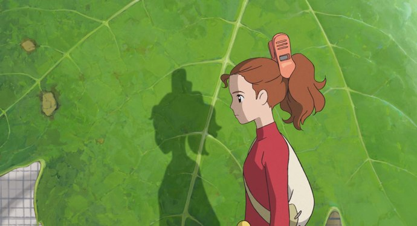
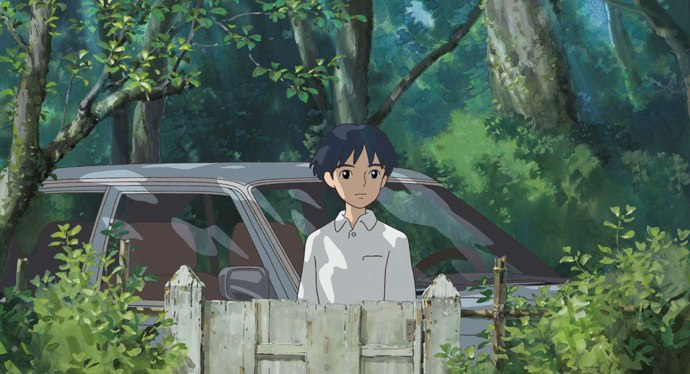

+++
type = "post"
titre = "Arrietty le petit monde des chapardeurs, Hiromasa Yonebayashi"
title = "Arrietty le petit monde des chapardeurs, Hiromasa Yonebayashi"
url = "/arrietty-petit-monde-chapardeurs-yonebayashi"
date = "2011-01-23T16:14:48"
Lastmod = "2011-01-23T16:18:03"
cover = "arrietty-ghibli.jpg"
categorie = [ "À voir" ]
tag = [ "Animation", "Famille", "Nature", "Studio Ghibli" ]
acteur = [ "Hiromasa Yonebayashi" ]
annee = [ "2011" ]
weight = 2011

+++

Deux ans après <em><a href="http://voiretmanger.fr/2009/04/12/ponyo-sur-la-falaise-miyazaki/">Ponyo sur la falaise</a></em>, les studios Ghibli reviennent au cinéma avec un long-métrage non plus réalisé par le maître Hayao Miyazaki, mais par Hiromasa Yonebayashi. Un changement de génération qui ne change pas pour autant le cinéma Ghibli : on reste ainsi en terrain connu avec cette histoire de petits êtres qui chapardent aux humains pour vivre. Comme à chaque film, le studio étonne par sa capacité à mettre en image des histoires niaises sur le papier… sans tomber dans le niais à l&rsquo;écran. Encore une très belle surprise…

<a href="http://www.allocine.fr/film/fichefilm_gen_cfilm=176684.html">

</a>

Arrietty est une chapardeuse. Haute de quelques centimètres, elle vit avec ses deux parents sous une maison de la banlieue de Tokyo. Ces petits êtres vivent grâce aux éléments qu&rsquo;ils volent aux humains : un morceau de sucre, un mouchoir de papier, une épingle… Trop peu pour que les humains s&rsquo;en aperçoivent, mais largement suffisant pour qu&rsquo;ils puissent en vivre. Les chapardeurs étant petits, ils sont loin d&rsquo;être en tête de la chaîne alimentaire et ils doivent se méfier autant des rats que des chats, mais surtout des humains : leur règle n°1 est ainsi de ne jamais se faire voir des humains qu&rsquo;ils chapardent. Une règle que connaît d&rsquo;autant mieux Arrietty que, comme ses parents ne manquent pas de lui rappeler régulièrement, ils sont une espèce en voie de disparition et ils doivent survivre à tout prix. Mais quand Sho arrive dans la maison, Arrietty ne peut s&rsquo;empêcher de l&rsquo;observer attentivement, quitte à se faire voir. Le garçon est malade et la chapardeuse sent immédiatement qu&rsquo;il est différent des autres humains : nulle envie de nuire, mais au contraire une curiosité pour ces petits êtres qu&rsquo;il n&rsquo;avait encore jamais vus. Entre les deux va naître une amitié improbable et éphémère, la famille d&rsquo;Arrietty doit quitter la maison, tandis que le garçon doit subir une lourde opération. Dans l&rsquo;intervalle, les deux êtres vont devoir combattre ensemble Haru, femme à tout faire de la maison qui joue le rôle traditionnel de la sorcière puisqu&rsquo;elle s&rsquo;est décidée à déloger les chapardeurs coûte que coûte.

<em>Arrietty le petit monde des chapardeurs</em> suit un scénario assez classique, histoire d&rsquo;amitié impossible entre deux êtres que tout oppose, de la taille à la culture, et qui pourtant vont finir par s&rsquo;apprécier, se comprendre et s&rsquo;aider. Thème classique, variation de <em>Roméo et Juliette</em> l&rsquo;amour en moins par exemple, qui fonctionne ici plutôt bien. La peur de l&rsquo;autre, de l&rsquo;inconnu crée comme toujours des distances entre les chapardeurs et les hommes, tandis que la taille constitue bien sûr un défi pour les chapardeurs. Une des plus belles séquences du film est ainsi celle du premier chapardage d&rsquo;Arrietty dans la maison : avec son père, elle passe dans des interstices aménagés à l&rsquo;aide de clous en guise de marches, avant de naviguer entre les très hauts meubles de la maison en glissant le long de cordes, ou en montant avec du double scotch. Le contraste entre les deux mondes est très bien rendu par le film qui montre en fait deux maisons, celle des humains et celle des chapardeurs. Ces derniers étant en tout point semblable aux humains, une fois à l&rsquo;intérieur de leur maison, on en oublierait presque leur taille lilliputienne, à quelques détails près judicieusement évoqués par le film. Les dessinateurs du studio Ghibli ont ainsi pris le soin de montrer que les théières ne contiennent au mieux que quelques gouttes, rappel de leur taille minuscule. La différence de taille est un effet connu, mais qui prouve ici encore son efficacité et qui permet à Hiromasa Yonebayashi de mettre en images la découverte de l&rsquo;autre et de son univers.

Autre thématique présente dans tous les films du studio Ghibli, la nature. Ce thème n&rsquo;est plus aussi central qu&rsquo;il n&rsquo;a pu l&rsquo;être dans d&rsquo;autres films, mais il reste présent, comme un arrière-plan permanent. La nature, ce sont d&rsquo;abord les décors qui font, comme toujours, la part belle aux plantes. Les chapardeurs puisent leurs ressources autant dans la maison qui les héberge que dans le jardin de cette maison. <em>Arrietty le petit monde des chapardeurs</em> offre ainsi quelque belles scènes de végétation, en gros plan bien sûr étant donnée la taille des chapardeurs. La nature s&rsquo;oppose ici aussi à la culture et le symbole en est la maison : elle est entourée de végétaux, mais elle n&rsquo;en contient aucun. Le lierre pousse sur les murs et même sur le toit, comme une tentative d&rsquo;annexion de la nature, mais il reste malgré tout en dehors. À l&rsquo;inverse, la maison des chapardeurs est en union avec la nature, omniprésente dans les décors et dans l&rsquo;habitat. Sho, le garçon, est un être entre les deux univers : humain par la taille et l&rsquo;habitat, il aime aussi se poser dans l&rsquo;herbe pour lire, ou discuter avec Arrietty. C&rsquo;est en cela qu&rsquo;il est différent des autres humains. Le film tente à un moment une explicitation du rôle de la nature et du mal que lui font les hommes, mais on doit avouer que cette discussion entre Arrietty et Sho tombe un peu comme un cheveu sur la soupe. Heureusement, le film s&rsquo;en tient là et préfère valoriser la relation entre l’héroïne et le garçon.

Hayao Miyazaki n&rsquo;est plus en tête d&rsquo;affiche, c&rsquo;est Hiromasa Yonebayashi qui lui succède à la réalisation. Ce jeune réalisateur (38 ans, c&rsquo;est le plus jeune réalisateur du studio) a déjà participé à plusieurs projets des studios Ghibli, souvent à des postes clés de l&rsquo;animation. Autant dire que le maître a eu l&rsquo;occasion d&rsquo;expliquer ses habitudes à son jeune disciple et il est vrai que l&rsquo;on reconnaît immédiatement la marque de fabrique Ghibli. Le scénario étant toujours de Miyazaki, l&rsquo;histoire ne s&rsquo;éloigne pas des standards du studio, même s&rsquo;il s&rsquo;agit cette fois de l&rsquo;adaptation d&rsquo;une série de livres de Fantasy pour enfants, <em>Les Chapardeurs</em> de Mary Norton. Cette origine anglo-saxonne se retrouve dans <em>Arrietty le petit monde des chapardeurs</em> qui n&rsquo;est pas vraiment centré sur la culture japonaise, même si le cadre tokyoïte est bien présent. Reste que les personnages sont plus typés européens et que l&rsquo;histoire aurait pu se passer à peu près n&rsquo;importe où. L&rsquo;animation de ce dernier Ghibli respecte la tradition du studio, même le style a légèrement évolué. Les personnages sont toujours simplement dessinés et l&rsquo;animation reste assez simple, mais les décors ont gagné en complexité, le dessin est plus fin, plus recherché. L&rsquo;évolution est légère, mais sensible, alors que Miyazaki semblait tendre vers plus de dépouillement comme en témoigne son travail sur <em>Ponyo sur la falaise</em>.

Encore une fois, le studio Ghibli prouve avec <em>Arrietty le petit monde des chapardeurs</em> qu&rsquo;il est capable d&rsquo;émerveiller petits et grands avec une histoire en apparence naïve, voire simpliste. Mais cette naïveté passe très bien, bien mieux que chez Disney étonnamment. Difficile d&rsquo;expliquer cette différence, mais force est de constater que le studio réussit encore et toujours à me faire rêver avec ses histoires en apparence enfantine. Le retrait progressif du maître Miyazaki se passe en tout cas plutôt bien si l&rsquo;on en juge par ce film de Yonebayashi…

