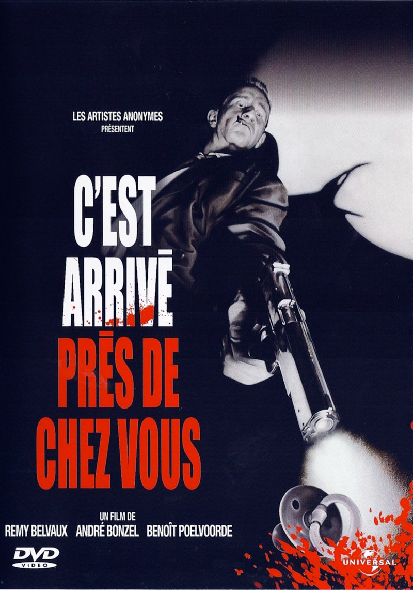
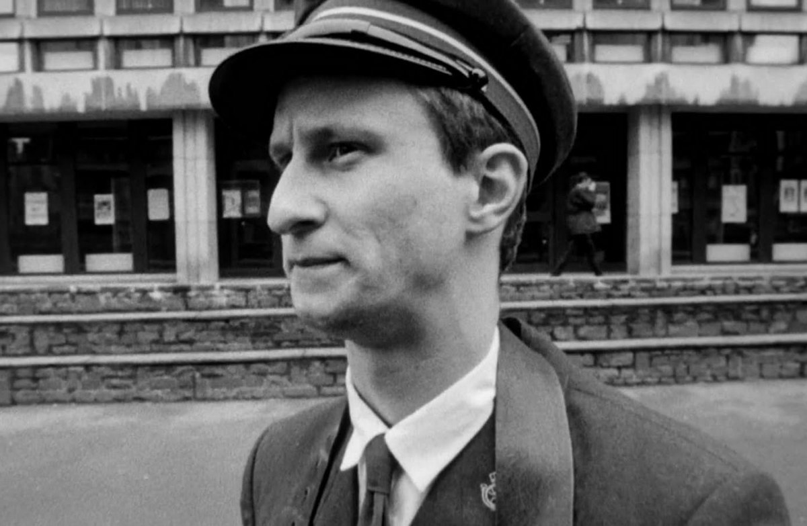

+++
titre = "<em>C&rsquo;est arrivé près de chez vous</em>, Rémy Belvaux, André Bonzel et Benoît Poelvoorde"
title = "C'est arrivé près de chez vous, Rémy Belvaux, André Bonzel et Benoît Poelvoorde"
url = "/arrive-pres-chez-vous-belvaux-bonzel-poelvoorde"
date = "2012-05-13T09:38:20"
Lastmod = "2013-06-28T11:49:31"
cover = "cest-arrive-pres-de-chez-vous-poelvoorde.jpg"
categorie = [ "À voir" ]
tag = [ "Documentaire", "Expérience", "Humour", "Noir et blanc", "Parodie", "Société", "Violence" ]
createur = [ "André Bonzel", "Benoît Poelvoorde", "Rémy Belvaux" ]
acteur = [ "Benoît Poelvoorde" ]
annee = [ "1992" ]
weight = 1992

+++

<em>C&rsquo;est arrivé près de chez vous</em> est difficile à classer dans une case. Conçu à l&rsquo;origine comme la parodie d&rsquo;une émission belge qui proposait des documentaires où le journaliste s&rsquo;efface pour laisser son objet à nu devant la caméra, ce film co-réalisé par Rémy Belvaux, André Bonzel et Benoît Poelvoorde est un faux documentaire sur un homme qui gagne sa vie par le meurtre. Le résultat est une expérience de cinéma étonnante, un film marqué par un humour très noir, sans aucune retenue ni sens du politiquement correct. <em>C&rsquo;est arrivé près de chez vous</em> met ses spectateurs mal à l&rsquo;aise, mais c&rsquo;est justement le signe de sa réussite.

Le film s&rsquo;ouvre sur un petit point technique. Un homme accroche des pierres à un drap blanc en expliquant qu&rsquo;un corps doit avoir trois fois plus de pierres que son poids pour couler. Une entrée en matière qui plonge d&rsquo;emblée les spectateurs dans le vif du sujet : <em>C&rsquo;est arrivé près de chez vous</em> évoque le quotidien d&rsquo;un homme qui tue pour vivre. Si certains vont travailler à l&rsquo;usine ou dans des bureaux, Ben a choisi de voler de l&rsquo;argent, souvent prélevé sur le lieu d&rsquo;habitation de ses victimes. Il choisit de préférence des petites gens, des personnes âgées issues des classes populaires qui seront plus enclines à cacher le peu d&rsquo;argent qu&rsquo;elles possèdent sous leur matelas. Ce quotidien devenu tout à fait normal pour Ben est transmis par les caméras et le micro d&rsquo;une équipe de la télévision venue tourner un documentaire sur Ben. Les journalistes ne s&rsquo;offusquent guère du mode de vie de leur sujet, ils restent à distance et finissent même par y adhérer. Bientôt, le journaliste devient aussi complice…

Surréaliste. C&rsquo;est certainement le sentiment qui vient le plus vite à l&rsquo;esprit quand on découvre <em>C&rsquo;est arrivé près de chez vous</em>. L&rsquo;idée de départ est extrêmement originale : filmer un serial-killer au quotidien, découvrir ses méthodes et ses motivations, sans jugement, pour en faire un documentaire. Il fallait y penser, surtout au début des années 1990, avant l&rsquo;invasion de la télé-réalité et la multiplication des émissions d&rsquo;enquêtes toujours plus extrêmes. Très vite, le spectateur est frappé par la normalité d&rsquo;images pourtant extrêmement violentes. Ben n&rsquo;est pas vraiment un serial-killer, il ne tue jamais par plaisir et n&rsquo;éprouve d&rsquo;ailleurs aucune satisfaction à l&rsquo;idée de tuer. Le meurtre est pour lui une évidence, le coup part très vite, c&rsquo;est la plupart du temps très propre. À un moment, il va même jusqu&rsquo;à provoquer la crise cardiaque chez une vieille au cœur fragile, plutôt que de la tuer d&rsquo;une balle. Ben tue, il prend l&rsquo;argent, il s&rsquo;en va : c&rsquo;est donc son métier, au quotidien. <em>C&rsquo;est arrivé près de chez vous</em> est un film parfois drôle, mais d&rsquo;un humour toujours extrêmement noir, on le comprend. Ce côté quotidien, cette normalité même est l&rsquo;occasion de quelques scènes cocasses, d&rsquo;autant que le personnage principal n&rsquo;éprouve aucune compassion pour ses victimes qui ne sont pour lui que des déchets qu&rsquo;il doit évacuer. Par certains aspects, le film de Rémy Belvaux, André Bonzel et Benoît Poelvoorde rappelle la série <em>Dexter</em>, la classe américaine en moins.

C&rsquo;est précisément parce que <em>C&rsquo;est arrivé près de chez vous</em> est filmé comme un documentaire extrêmement sérieux, que le long-métrage suscite le rire. On ne peut que rire devant ce personnage qui fait de longs monologues sur sa condition ou sur la société, avec des analyses dignes des meilleurs comptoirs. Ben devient même hilarant quand il se met à déclamer une <a href="http://fr.wikipedia.org/wiki/C'est_arrivé_près_de_chez_vous#Film">poésie sur les pigeons</a>, mais <em>C&rsquo;est arrivé près de chez vous</em> n&rsquo;est pas une comédie légère pour autant. Bien au contraire, le film dérange et met mal à l&rsquo;aise à plusieurs reprises. Les journalistes qui filment le criminel sont censés être en retrait. Les voir assister sans intervenir aux crimes de leur sujet est déjà assez étrange, mais ils s&rsquo;impliquent de plus en plus dans ces actions criminelles. Au fur et à mesure que l&rsquo;histoire avance, les journalistes passent de spectateurs passifs au statut de complices actifs. Ils vont même jusqu&rsquo;à nettoyer le massacre de leur sujet à la fin du film, tandis que plusieurs membres de l&rsquo;équipe de tournage meurent pendant la captation, sans que cela ne les gêne outre mesure. Cette question de l&rsquo;implication de journalistes censés traiter leur sujet de manière objective est très intéressante : les trois réalisateurs montrent bien que le point de vue de la caméra n&rsquo;est jamais objectif. <em>C&rsquo;est arrivé près de chez vous</em> va bien sûr très loin puisque les journalistes finissent par participer à une scène de viol qui est d&rsquo;ailleurs montrée en grande partie dans une scène particulièrement gênante.

Film tourné sans moyen, <em>C&rsquo;est arrivé près de chez vous</em> offre pourtant une prestation très honorable sur le plan technique. Le manque de moyen est visible dès le choix du noir et blanc, moins coûteux à produire que la couleur, mais cette contrainte technique est astucieusement utilisée par les cinéastes qui peuvent ainsi se permettre de montrer des plans qui auraient été beaucoup plus forts en couleur. Pas d&rsquo;argent, mais une liberté totale : Rémy Belvaux, André Bonzel et Benoît Poelvoorde se sont tout permis et le résultat témoigne bien de cette liberté. <em>C&rsquo;est arrivé près de chez vous</em> est un film foisonnant, parfois aussi brouillon, tantôt drôle, tantôt grave. Face à la caméra la majeure partie du temps, Benoît Poelvoorde assure le spectacle et impressionne déjà, dans son tout premier rôle. Loin des clichés qui le caractériseront dans la suite de sa carrière, l&rsquo;acteur est ici excellent dans un rôle de psychopathe et dans un humour noir qui lui va à merveille. Il est en fait à toutes les étapes de la construction du film, autant à la réalisation qu&rsquo;au scénario et aux dialogues et sa vraie mère et grand-mère jouent leurs propres rôles. <em>C&rsquo;est arrivé près de chez vous</em> a ainsi tout du film amateur et le résultat surprend justement par son professionnalisme. L&rsquo;image n&rsquo;est pas toujours très nette, ni très stable, mais ces hésitations participent à renforcer le réalisme du film.

<iframe src="http://www.dailymotion.com/embed/video/xasqxz?logo=0" frameborder="0" width="100%" height="450px"></iframe>

<em>C&rsquo;est arrivé près de chez vous</em> est sans conteste un film étonnant. Rémy Belvaux, André Bonzel et Benoît Poelvoorde signent un premier long-métrage quasiment amateur, un faux documentaire sur la vie d&rsquo;un meurtrier qui finit par mettre ses spectateurs mal à l&rsquo;aise. Une belle preuve de réussite pour cette comédie noire, très noire, où rien n&rsquo;est tabou, ni la mort ni même le viol. <em>C&rsquo;est arrivé près de chez vous</em> est aussi l&rsquo;occasion de découvrir un grand acteur puisque Benoît Poelvoorde y fait ses premiers pas devant la caméra. Pour toutes ces raisons, le film mérite d&rsquo;être découvert, mais soyez prévenus, vous ne serez pas ménagé…

<h3>Vous voulez m&rsquo;aider ?<a href="#footnote_0_6436" id="identifier_0_6436" class="footnote-link footnote-identifier-link" title="&Agrave; propos de la publicit&eacute;&hellip;">1</a></h3>
<ul>
<li><a href="http://www.amazon.fr/gp/product/B001FY2MY2/ref=as_li_ss_tl?ie=UTF8&amp;tag=leblogdenic07-21&amp;linkCode=as2&amp;camp=1642&amp;creative=19458&amp;creativeASIN=B001FY2MY2">Acheter le film en Blu-Ray sur Amazon</a></li>
<li><a href="http://www.amazon.fr/gp/product/B00290FWJS/ref=as_li_ss_tl?ie=UTF8&amp;tag=leblogdenic07-21&amp;linkCode=as2&amp;camp=1642&amp;creative=19458&amp;creativeASIN=B00290FWJS">Acheter le film en DVD sur Amazon</a></li>
</ul>

<ol class="footnotes"><li id="footnote_0_6436" class="footnote"><a href="http://voiretmanger.fr/soutien/">À propos de la publicité…</a> [<a href="#identifier_0_6436" class="footnote-link footnote-back-link">&#8617;</a>]</li></ol>
