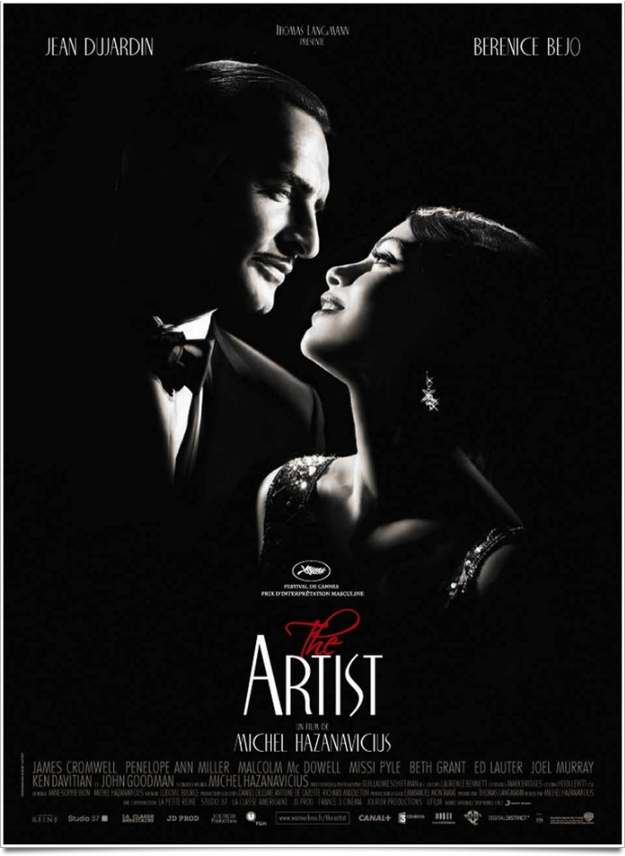
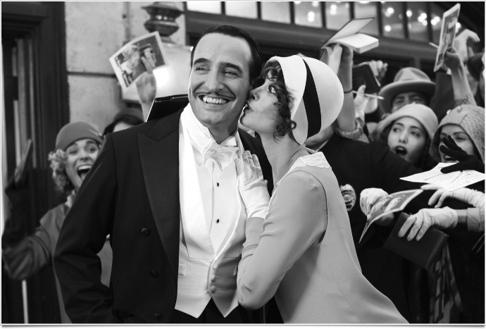

+++
type = "post"
titre = "<em>The Artist</em>, Michel Hazanavicius"
title = "The Artist, Michel Hazanavicius"
url = "/artist-hazanavicius"
date = "2011-10-16T07:42:51"
Lastmod = "2013-10-28T10:40:45"
cover = "artist-dujardin-bejo.jpg"
categorie = [ "À voir" ]
tag = [ "Amour", "Cinéma classique", "Drame", "Histoire", "Noir et blanc" ]
createur = [ "Michel Hazanavicius" ]
acteur = [ "Bérénice Béjo", "Jean Dujardin", "John Goodman" ]
annee = [ "2011" ]
weight = 2011
pays = [ "France" ]

+++

Michel Hazanavicius s&rsquo;est lancé dans un pari fou : <em>The Artist</em> plonge ses spectateurs à la fin des années 1920, pas seulement par l&rsquo;histoire, mais aussi par la technique. Le film est en noir et blanc, il est même muet et tourné comme à l&rsquo;époque, format carré et images accélérées y compris. Un pari audacieux tenu parfaitement par le cinéaste, pour un résultat plaisant et convaincant. Un bon film, à défaut d&rsquo;être le grand film que certains ont vu.

1927, âge d&rsquo;or du cinéma muet à Hollywood. Le film s&rsquo;ouvre d&rsquo;ailleurs avec un film dans le film, le dernier long-métrage avec l&rsquo;acteur du moment, George Valentin. Véritable star, il enflamme la vaste salle de cinéma qui montre l&rsquo;avant-première et il enchaîne succès après succès, sans interruption. Une gloire qu&rsquo;il croit éternelle, mais c&rsquo;était sans compter sur la dernière révolution technologique qui se prépare. Le cinéma passe au parlant et George Valentin refuse cette nouveauté qu&rsquo;il juge comme une mode passagère et pas sérieuse. Ce refus lui est fatal et il connaît une longue chute en enfer, alors que Peppy Miller, une jeune actrice qu&rsquo;il a contribué à faire découvrir, connaît une fulgurante association dans ce cinéma désormais parlant. Deux trajectoires inversées, alors qu&rsquo;une histoire d&rsquo;amour se lie entre les deux êtres.

Michel Hazanavicius n&rsquo;a pas choisi un sujet très original pour son film rétro. Le passage du cinéma muet au parlant avait déjà fait l&rsquo;objet de nombreux films et les carrières brisées à cause d&rsquo;une mauvaise voix sont nombreuses. Ce choix assez classique permet de fait à <em>The Artist</em> de se concentrer sur autre chose : l&rsquo;histoire d&rsquo;amour entre les deux acteurs occupe de fait la première place. Si la forme est ancienne, le traitement est beaucoup plus moderne : après la rencontre initiale, l&rsquo;amour se cristallise au cours d&rsquo;une scène de tournage. George Valentin doit danser un moment avec Peppy Miller qui n&rsquo;est ici qu&rsquo;une figurante, avant de poursuivre son chemin vers le méchant du film. La première prise est assez réussie, mais très vite, les deux acteurs peinent à tourner convenablement la scène, ils sont manifestement troublés par la présence de l&rsquo;autre, au point de ne plus réussir à tourner la scène. <em>The Artist</em>. Un équilibre bien trouvé entre la modernité du cinéma actuel et le classicisme d&rsquo;un film des années 1920 que l&rsquo;on retrouve aussi vers la fin. Commencé sur un ton enjoué et sur un rythme rapide, <em>The Artist</em> tourne à la fin au drame sur fond de crise économique et le ton change, se modernise un petit peu. Le film passe près de la tragédie, avant d&rsquo;en revenir au drame avec une fin que l&rsquo;on ne détaillera pas…

Cet équilibre aurait gagné à être encore plus exploité. Le film de Michel Hazanavicius est un exercice de style et le pastiche est réussi, mais il ne dépasse pas vraiment ce statut de pastiche. C&rsquo;est déjà pas mal, certes, mais <em>The Artist</em> aurait sans doute gagné à aller un peu plus loin et se muer plus franchement en métafilm. La réflexion sur le cinéma est ici totalement absente, le passage du muet au parlant ne servant qu&rsquo;à justifier l&rsquo;intrigue et la progression inversée des deux personnages principaux. Le cinéaste n&rsquo;a pas choisi pourtant une formule radicale : <em>The Artist</em> n&rsquo;est pas un film totalement muet, au moins deux séquences ont droit à des dialogues ou des bruitages. Cette inclusion soudaine de la technologie qui détruit la carrière de George aurait pu être plus exploité : on s&rsquo;attend d&rsquo;ailleurs presque à ceux que le film devienne parlant quand l&rsquo;invention apparaît dans l&rsquo;histoire. Las, Michel Hazanavicius a préféré tenir sa ligne du pastiche jusqu&rsquo;au bout. Encore une fois, le résultat n&rsquo;est pas mauvais, loin de là, mais <em>The Artist</em> en reste du stade de pastiche, un petit film sympathique et non une œuvre originale qui aurait pu être passionnante. Que reste-t-il des pastiches de Proust en comparaison avec <em>À la recherche du Temps perdu</em> ?

Le voyage dans le temps procuré par <em>The Artist</em> est indéniablement réussi. Dès l&rsquo;ouverture et son générique à l&rsquo;ancienne, grosses lettres blanches sur rideau gris, le spectateur est plongé dans ce cinéma classique de l&rsquo;entre-deux guerre. La musique est à l&rsquo;avenant et les images défilent à bon rythme et l&rsquo;illusion n&rsquo;est pas perdue quand les premiers personnages entrent à l&rsquo;écran. Ce film a été tourné avec les moyens les plus modernes, mais tout est fait pour nous permettre de l&rsquo;oublier : le rythme bien particulier des caméras de l&rsquo;époque a été reproduit et Michel Hazanavicius a baissé légèrement la qualité de l&rsquo;image, notamment en ajoutant de la vignette dans les coins. Le résultat est réussi et certaines séquences sont vraiment troublantes tant on pourrait croire qu&rsquo;elles ont été effectivement tournées à la fin des années 1920. Ce succès, <em>The Artist</em> le doit en grande partie à son acteur principal : Jean Dujardin n&rsquo;a pas démérité sa récompense cannoise, il est vraiment impressionnant à interpréter cet acteur du cinéma muet. Ses mimiques sont tordantes ou émouvantes, il réussit à en dire énormément sans un mot et il tient parfaitement son rôle. Bérénice Béjo à ses côtés n&rsquo;est pas en reste non plus, le reste du casting est essentiellement américain et efficace.

L&rsquo;art du pastiche est bien difficile, il faut rendre hommage sans caricaturer tout en trouvant le ton juste. Sur ce point, la réussite de <em>The Artist</em> est totale : le film de Michel Hazanavicius parvient vraiment à tromper ses spectateurs en leur faisant croire qu&rsquo;ils sont retournés à la fin des années 1920. Pastiche réussi, certes, mais pastiche seulement : on aurait aimé que <em>The Artist</em> aille un peu plus loin et oublie le pastiche pour s&rsquo;intéresser de plus près au cinéma et à ses changements. Le film est indéniablement agréable, on le regarde avec plaisir, mais cela ne va pas au-delà. Cela étant, ce n&rsquo;est déjà pas si mal…

<h3>Vous voulez m&rsquo;aider ?<a href="#footnote_0_5221" id="identifier_0_5221" class="footnote-link footnote-identifier-link" title="&Agrave; propos de la publicit&eacute;&hellip;">1</a></h3>
<ul>
<li><a href="http://www.amazon.fr/gp/product/B00695E1BY/ref=as_li_ss_tl?ie=UTF8&tag=leblogdenic07-21&linkCode=as2&camp=1642&creative=19458&creativeASIN=B00695E1BY">Acheter le film en Blu-Ray et DVD sur Amazon</a>. Cette version contient la bande-originale du film.</li>
<li><a href="http://www.amazon.fr/gp/product/B005UCHU0G/ref=as_li_ss_tl?ie=UTF8&tag=leblogdenic07-21&linkCode=as2&camp=1642&creative=19458&creativeASIN=B005UCHU0G">Acheter le film en DVD sur Amazon</a></li>
<li><a href="http://www.amazon.fr/gp/product/B005LL4U54/ref=as_li_ss_tl?ie=UTF8&tag=leblogdenic07-21&linkCode=as2&camp=1642&creative=19458&creativeASIN=B005LL4U54">Acheter la bande-originale du film sur Amazon</a> (<a href="http://www.amazon.fr/gp/product/B005Q8L1FE/ref=as_li_ss_tl?ie=UTF8&tag=leblogdenic07-21&linkCode=as2&camp=1642&creative=19458&creativeASIN=B005Q8L1FE">téléchargement MP3</a>)</li>
</ul>

<ol class="footnotes"><li id="footnote_0_5221" class="footnote"><a href="http://voiretmanger.fr/a-propos/publicite/">À propos de la publicité…</a> [<a href="#identifier_0_5221" class="footnote-link footnote-back-link">&#8617;</a>]</li></ol>
