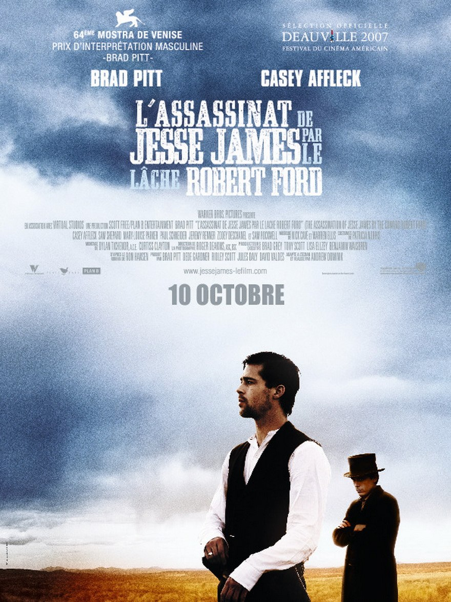
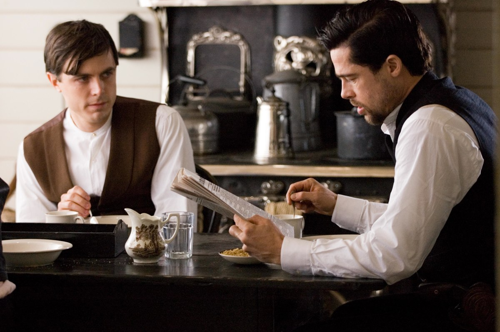
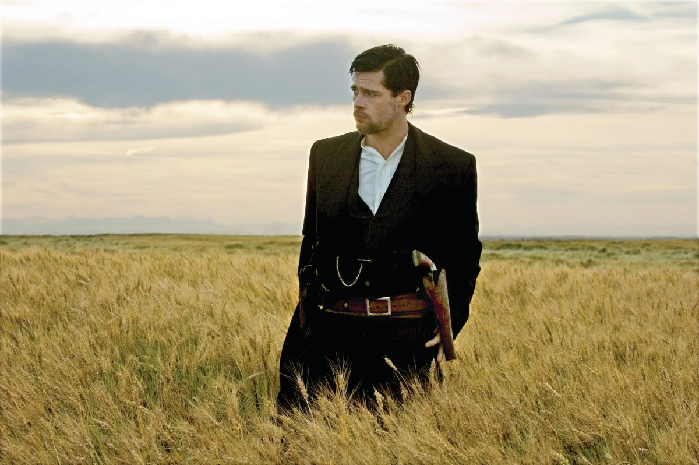

+++
type = "post"
titre = "<em>L&rsquo;Assassinat de Jesse James par le lâche Robert Ford</em>, Andrew Dominik"
title = "L'Assassinat de Jesse James par le lâche Robert Ford, Andrew Dominik"
url = "/assassinat-jesse-james-lache-robert-ford-dominik"
date = "2012-06-30T09:45:45"
Lastmod = "2015-01-25T18:31:03"
cover = "assassinat-jesse-james-lache-robert-ford-casey-affleck.jpg"
categorie = [ "À voir" ]
tag = [ "Drame", "Histoire", "Mort", "Psychologie", "Société", "Violence", "Western" ]
createur = [ "Andrew Dominik" ]
acteur = [ "Brad Pitt", "Casey Affleck", "Jeremy Renner", "Paul Schneider", "Sam Rockwell" ]
annee = [ "2007" ]
weight = 2007
pays = [ "États-Unis" ]

+++

S&rsquo;il est des titres qui savent rester mystérieux, celui-ci explicite le sujet sans plus de cérémonie. <em>L&rsquo;Assassinat de Jesse James par le lâche Robert Ford</em> dévoile son sujet et donne même une indication sur le message avec la précision « lâche ». Pour son deuxième film, le cinéaste australien Andrew Dominik propose une sorte de western revisité, un voyage hallucinant et poétique dans le Far West. Un grand film qui sait prendre son temps et qui nécessite de se laisser emporter par ce que l&rsquo;on voit et entend. Un assassinat de toute beauté à (re)découvrir…

3 avril 1982, Saint-Joseph dans le Mississippi. Robert Ford tue le célèbre bandit Jesse James d&rsquo;une balle dans la tête alors que ce dernier lui tourne le dos et nettoie un tableau accroché au mur. Ainsi s&rsquo;achève la tumultueuse vie de l&rsquo;un des bandits les plus célèbres de l&rsquo;histoire américaine, après des dizaines et des dizaines de braquages et de vols, quelques meurtres aussi. Son nom est resté dans les mémoires et dans l&rsquo;histoire, mais qui se souvient de celui de son assassin. Son épitaphe est extrêmement <a href="http://fr.wikipedia.org/wiki/Jesse_James">claire</a> : « <em>Assassiné par un lâche dont le nom n&rsquo;est pas digne de figurer ici.</em> » Au début, Robert Ford était un grand admirateur de Jesse James, son plus grand fan peut-être. Le jeune homme, même pas 20 ans, veut entrer dans la bande des frères James. Il arrive toutefois beaucoup trop tard et assiste, inutile, au dernier coup de Jesse et de son frère : une attaque de train qui ne rapporte pas grand-chose. L&rsquo;heure de la retraite est venue et le bandit accepte que son jeune fan l&rsquo;accompagne. Robert ne demandait pas mieux, mais il n&rsquo;aime pas être pris à la légère et Jesse James se moque souvent de lui. Vexé, il décide de se venger et signe un accord avec les autorités. Peu après, il tue comme prévu le bandit, mais la reconnaissance populaire ne vient pas, bien au contraire…

<em>L&rsquo;Assassinat de Jesse James par le lâche Robert Ford</em> a tous les attributs d&rsquo;un western conventionnel. Les grandes plaines de l&rsquo;Ouest américain fournissent le même cadre général, tandis que l&rsquo;on retrouve les mêmes personnages types, à l&rsquo;exception notable des Indiens : les bandits sont bien représentés, mais il y a aussi les forces de l&rsquo;ordre qui commencent justement à s&rsquo;organiser en cette fin de XIXe siècle. Andrew Dominik a toutes les cartes en main pour filmer un western, mais son film est pourtant bien différent sur l&rsquo;écran. Il y a bien des bandits, il y a même un hold-up dans un train, on entend quelques coups de feu, on voit quelques morts et les personnages se déplacent le plus souvent à cheval. Tout est là, mais rien n&rsquo;est comme il devrait : <em>L&rsquo;Assassinat de Jesse James par le lâche Robert Ford</em> impose un rythme très lent, ses plans sur les paysages sont magnifiques et il n&rsquo;y a surtout pas vraiment de suspense, même pas totalement d&rsquo;intrigue. La fin est connue dès le titre et le long-métrage n&rsquo;apporte pas de réponses en plus, mais plutôt quelques questions supplémentaires. Non, Andrew Dominik ne signe pas vraiment un western, même si l&rsquo;époque et le cadre sont là, ou alors il s&rsquo;agirait d&rsquo;un western d&rsquo;un nouveau genre, un western romantique peut-être, psychologique indéniablement.

Psychologique, <em>L&rsquo;Assassinat de Jesse James par le lâche Robert Ford</em> l&rsquo;est dans sa présentation des deux personnages principaux. Là encore, Andrew Dominik efface toute possibilité de suspense en indiquant qui est qui dès son titre et le spectateur sait ainsi quand ils apparaissent dans les premières minutes du film que Robert va finalement tuer Jesse. Ce fait n&rsquo;est pas étonnant, qui connaît par ailleurs l&rsquo;histoire du bandit peut aussi le savoir sans l&rsquo;assistance du titre. Plus surprenant déjà, le film porte à croire que Jesse sait très tôt que Robert va le tuer ; peut-être même le sait-il dès la première rencontre dans les bois, en attendant le train. Qu&rsquo;importe le moment précis, le doute n&rsquo;est plus permis quand l&rsquo;acte intervient : il sait qu&rsquo;il va mourir et que Robert Ford va le tuer et il ne fait rien pour l&rsquo;en empêcher. Pis, il va jusqu&rsquo;à l&rsquo;aider en offrant au jeune homme une meilleure arme peu avant son assassinat. Andrew Dominik multiplie les signes pour renforcer cette thèse assez surprenante : avant de monter sur la chaise pour dépoussiérer le tableau, Jesse James dépose ses armes sur le fauteuil, ce qu&rsquo;il ne fait d&rsquo;habitude jamais. Il monte et prend un temps infini pour enlever une poussière qui n&rsquo;est manifestement pas vraiment présente. À ce moment-là, <em>L&rsquo;Assassinat de Jesse James par le lâche Robert Ford</em> montre bien que le bandit attend le coup, presque avec impatience d&rsquo;ailleurs. La relation de cet homme et de son meurtrier est essentielle dans le film qui ne s&rsquo;interrompt d&rsquo;ailleurs par avec la mort, mais qui continue pour montrer la déception du meurtrier. Robert s&rsquo;attendait à être célébré comme un héros, il est en fait rejeté comme le lâche qui a tué le vrai héros.

Les quelques images rassemblées ici ne rendent pas justice au travail d&rsquo;Andrew Dominik. <em>L&rsquo;Assassinat de Jesse James par le lâche Robert Ford</em> est extrêmement travaillé sur le plan formel, avec une photographie sublime qui met en valeur les vastes paysages américains. Le cinéaste baigne son histoire d&rsquo;une lumière douce, souvent naturelle et il multiplie les plans où un ou deux individus avancent dans l&rsquo;immensité. Son travail évoque parfois celui de Terrence Malick, avec un rapport à la nature assez proche, même si les deux réalisateurs sont très différents par ailleurs. On l&rsquo;a déjà évoqué, le rythme de l&rsquo;œuvre est très lent et mieux vaut n&rsquo;être pas trop fatigué pour tenir pendant plus de 2h30. Ce n&rsquo;est pas une épreuve pénible toutefois, l&rsquo;intrigue avance bien et le spectateur n&rsquo;est jamais perdu dans des expérimentations complexes. Andrew Dominik prend le temps qu&rsquo;il faut pour installer ses personnages et faire avancer son intrigue. <em>L&rsquo;Assassinat de Jesse James par le lâche Robert Ford</em> est baigné d&rsquo;une ambiance mélancolique qui semble indiquer que son histoire est à l&rsquo;image des tragédies grecques, inexorable.

Cette ambiance doit beaucoup à la musique composée par Nick Cave et Warren Ellis pour accompagner les images d&rsquo;Andrew Dominik. Le duo a composé plusieurs musiques de film, mais il n&rsquo;avait jamais été aussi poignant et efficace que pour celui-ci. Minimaliste — un piano et un violon rehaussés d&rsquo;une basse —, la <a href="http://www.amazon.fr/gp/product/B000WI51JA/ref=as_li_ss_tl?ie=UTF8&amp;tag=leblogdenic07-21&amp;linkCode=as2&amp;camp=1642&amp;creative=19458&amp;creativeASIN=B000WI51JA">bande originale</a> fait partie des <a title="S’il ne fallait garder que 10 bandes-originales de films" href="/2010/06/22/top-10-bof/">meilleures que je connaisse</a> et elle est bien plus que l&rsquo;un des personnages de <em>L&rsquo;Assassinat de Jesse James par le lâche Robert Ford</em>, elle influe l&rsquo;histoire même en lui offrant son ambiance de tragédie. Le film avait aussi besoin de personnages et on peut dire qu&rsquo;Andrew Dominik a fait un excellent choix avec Brad Pitt qui interprète brillamment ce bandit qui tombe dans la folie et la paranoïa à la fin de sa vie. L&rsquo;excellent Casey Affleck compose un Robert Ford crédible et nous fait bien ressentir son mal-être et ses doutes.

S&rsquo;il est des films qui demandent un peu de temps avant d&rsquo;être reconnus à leur juste valeur, <em>L&rsquo;Assassinat de Jesse James par le lâche Robert Ford</em> s&rsquo;impose dès la première vision comme un grand film. Andrew Dominik raconte la rencontre entre un bandit et son tueur dans un western mélancolique sublimé par de splendides paysages. <em>L&rsquo;Assassinat de Jesse James par le lâche Robert Ford</em> est envoutant et tragique et en attendant le retour de son réalisateur dans les salles à l&rsquo;automne, vous pouvez (re)voir sans crainte son deuxième long-métrage…

<h3>Vous voulez m&rsquo;aider ?</h3>
<ul>
<li><a href="http://www.amazon.fr/gp/product/B00138Z9W2/ref=as_li_ss_tl?ie=UTF8&amp;tag=leblogdenic07-21&amp;linkCode=as2&amp;camp=1642&amp;creative=19458&amp;creativeASIN=B00138Z9W2">Acheter le film en Blu-Ray sur Amazon</a></li>
<li><a href="http://www.amazon.fr/gp/product/B00138Z9YU/ref=as_li_ss_tl?ie=UTF8&amp;tag=leblogdenic07-21&amp;linkCode=as2&amp;camp=1642&amp;creative=19458&amp;creativeASIN=B00138Z9YU">Acheter le film en DVD sur Amazon</a></li>
<li><a href="http://itunes.apple.com/fr/movie/lassassinat-jesse-james-par/id379790911">Acheter ou louer le film sur l&rsquo;iTunes Store</a></li>
</ul>
<ul>
<li><a href="http://www.amazon.fr/gp/product/B000WI51JA/ref=as_li_ss_tl?ie=UTF8&amp;tag=leblogdenic07-21&amp;linkCode=as2&amp;camp=1642&amp;creative=19458&amp;creativeASIN=B000WI51JA">Acheter la bande originale du film sur Amazon</a> (<a href="http://www.amazon.fr/gp/product/B0023FUPM8/ref=as_li_ss_tl?ie=UTF8&amp;tag=leblogdenic07-21&amp;linkCode=as2&amp;camp=1642&amp;creative=19458&amp;creativeASIN=B0023FUPM8">téléchargement MP3</a>)</li>
<li><a href="http://itunes.apple.com/fr/album/assassination-jesse-james/id265698544">Acheter la bande originale du film sur l&rsquo;iTunes Store</a></li>
</ul>

