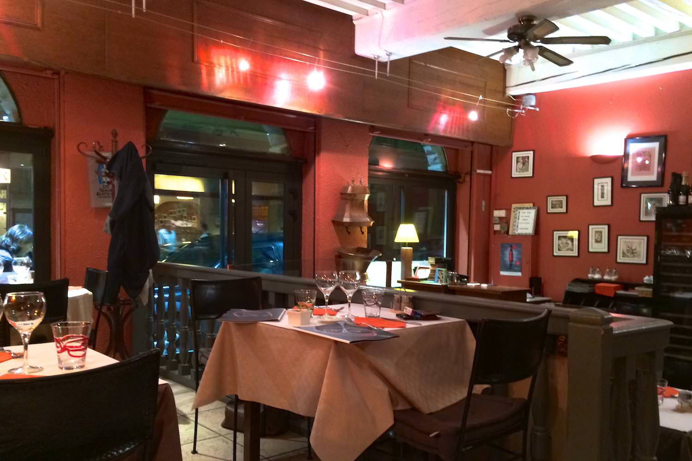
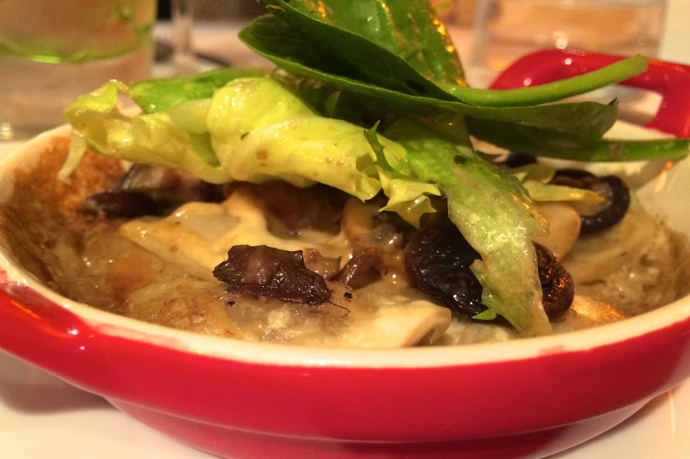
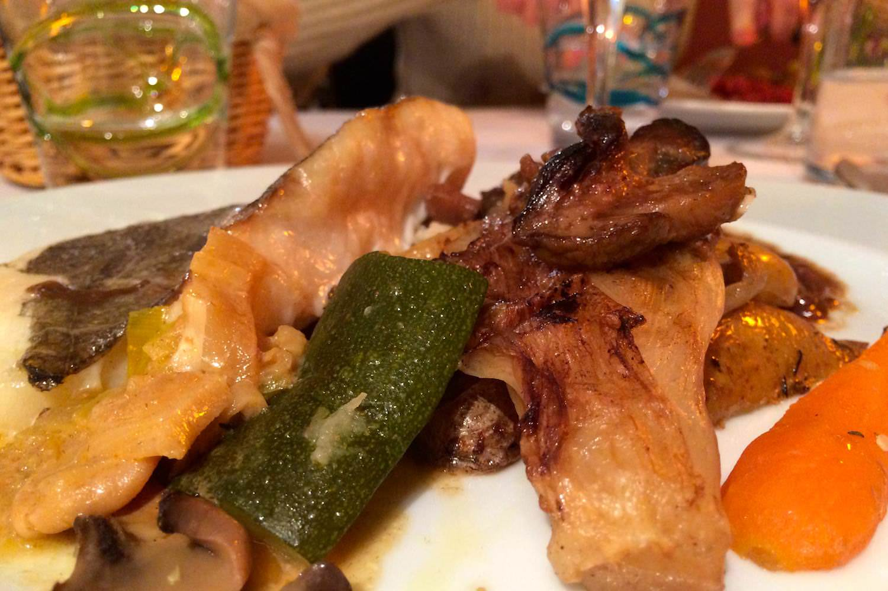
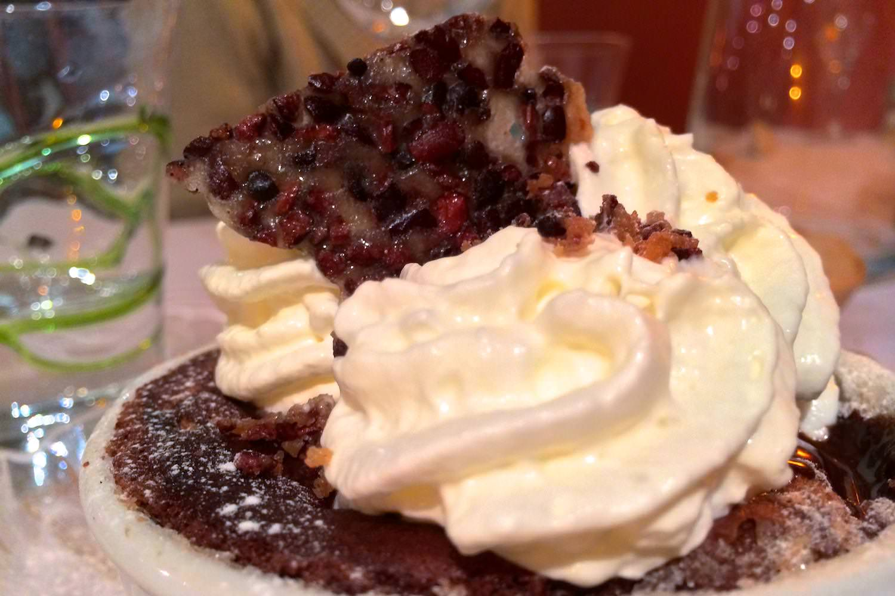

+++
type = "post"
titre = "L&rsquo;Assiette du Vin à Lyon"
title = "L'Assiette du Vin à Lyon"
url = "/assiette-du-vin-lyon"
date = "2014-01-24T08:45:09"
Lastmod = "2014-01-24T09:21:13"
cover = "assiette-du-vin-lyon.jpg"
categorie = [ "À manger" ]
tag = [ "69004", "Croix-Rousse", "Cuisine française" ]

+++

À deux pas de la mairie du quatrième arrondissement lyonnais, non loin de la place et du métro de la Croix-Rousse, <a href="http://www.lyonresto.com/restaurant-Lyon/restaurant-L-Assiette-du-Vin-Lyon/restaurant-L-Assiette-du-Vin-Lyon-1173.html"><strong>L’Assiette du Vin</strong></a> est un restaurant de bonne taille qui propose une cuisine traditionnelle sans chichi. Tenue par un couple de cuisiniers, l’adresse propose une carte bon marché et des assiettes pas forcément marquées par la gastronomie lyonnaise, mais inspirées par la cuisine du sud. Sans faire d’étincelles, l’endroit est agréable pour un repas réussi.

Au pied d’un immeuble croix-roussien typique, <strong>L’Assiette du Vin</strong> dispose d’une salle d’une bonne taille qui rappelle plus les brasseries que les petits bouchons lyonnais. On craint un peu l’effet cantine, mais en ce soir de semaine, la salle est plutôt vide et tranquille : parfait pour manger en petit comité. Quand toutes les tables sont occupées, le niveau sonore doit certainement moins convenir à un repas en tête à tête. L’été, une petite terrasse vient s’ajouter dans la rue calme devant la devanture, sans grand intérêt, même si on remarque les panneaux colorés sur les fenêtres. Dans l’ensemble, le restaurant est chaleureux et invite à entrer, un bon point.   

<a href="/wp-content/2014/01/l-assiette-du-vin-menu.pdf">À la carte</a>, une vaste sélection de plats assez variés qui ne rassure pas quant à la fraicheur des produits. Même si la dégustation prouve que l’on a tort de s’en inquiéter, on préfère les restaurants qui affichent moins de choix et des cartes qui varient plus souvent. <strong>L’Assiette du Vin</strong> donne le sentiment de ne pas se renouveler suffisamment, c’est un peu dommage. Quoi qu’il en soit, l’inspiration méridionale annoncée est discrète, mais on la retrouve dans le choix de certains produits ou encore par la présence notable de thym dans plusieurs assiettes. Il y en aura pour tous les goûts, du traditionnel tartare de bœuf à l’andouillette, en passant par des plats plus originaux, comme cette côte de biche grillée ou une souris de porcelet braisée. Rien de très original donc, les propriétaires préfèrent manifestement rester dans la tradition, ce qui n’est absolument pas un problème si c’est bien fait. D’emblée, on apprécie les tarifs serrés : tous les menus intègrent entrée, plat et dessert et le prix varie d’une vingtaine à un petit moins de trente euros selon le plat choisi. Pour le quartier, c’est très raisonnable.

Dans l’assiette, <strong>L’Assiette du Vin</strong> confirme ses intentions avec des plats très simples, mais globalement bien maîtrisés. La cassolette de champignons et raviolis souffrait un peu d’un réchauffage de dernière minute qui l’a un peu asséchée, mais les saveurs étaient au rendez-vous. La salade de magret de canard accompagnée de légumes confits au vinaigre de coing était plus originale, mais pas totalement convaincante, la faute sans doute aux légumes assez peu intéressants. Côté plats, le tartare n’appelle aucun commentaire, il est bien réalisé, même si on aurait aimé avoir le choix des condiments pour l’assaisonner. La souris de porcelet était très tendre et sa sauce au thym très savoureuse, tandis que le filet de Saint-Pierre paraissait frais, mais malheureusement un peu trop cuit. Les accompagnements — des pommes de terre sautées et quelques légumes — manquent peut-être de raffinement, mais les sauces puissantes relèvent bien ces assiettes sans folie pour autant. Les desserts sont faits maison, une excellente surprise étant donnés les tarifs. La feuillantine de chocolat est un gâteau convaincant, tandis que le moelleux de chocolat ne respectait pas la tradition, mais n’était pas mauvais pour autant. Au lieu d’avoir un mi cuit chaud et coulant, on a un gâteau au fond et une couche de chocolat fondu au-dessus, le tout étant généreusement recouvert de chantilly. Un dessert plutôt gourmand qui relève le niveau et offre une belle conclusion au repas.

<strong>L’Assiette du Vin</strong> ne fait pas partie de ces adresses qui expérimentent en inventant de nouvelles recettes chaque jour. Si vous cherchez une cuisine traditionnelle à petit prix, c’est une option à envisager pour manger à Croix-Rousse.

